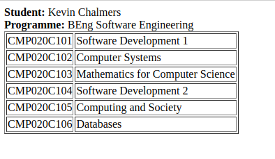
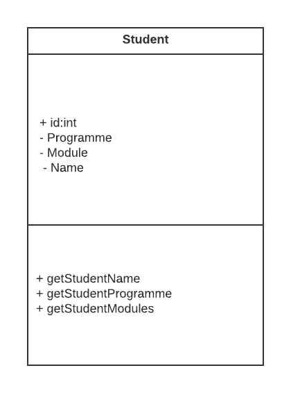
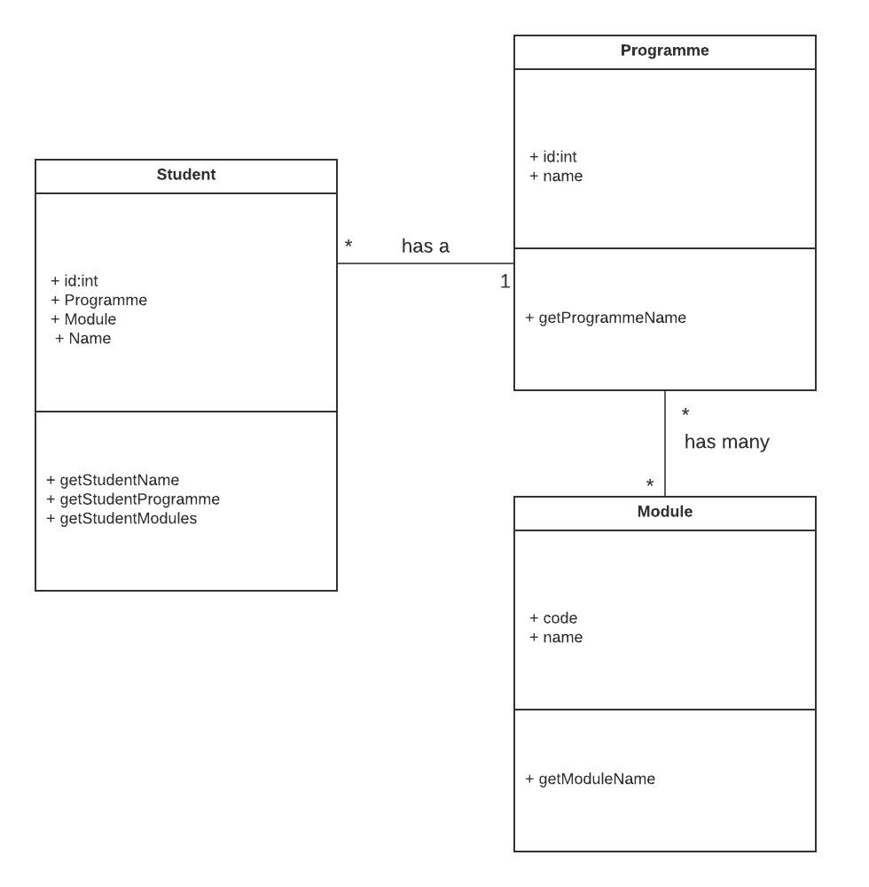

# Software Development 2 Lab 09 -- Models and Controllers

We are going to further improve our code by implementing a fairly rudimentary version of the 'MVC' - Model, View, Controller design pattern.


We have already started by separating the frontend views from the main logic of express by using pug templates.

Now we will look at how we can tidy up the 'business logic' and the database interactions.


## Using OOP to create Models

We looked at how Object Orientated Programming can create code that more closely models real-world entities and by so doing makes you code architecture robust and understandable.

Look back at [Week 5 lab - OOP ](https://roehampton.github.io/module-content/msc-software-development-2/week-05/lab/)to remind yourself.

Lets re-create the Student class, but this time contruct our classes dynamically from data in the database and adapt it to the data we want to model.

For this lab, we will re-create the single-student page to utilise OOP and the MVC pattern.  To remind you, the page currently looks like this (for student with id = 1)



Take a look at the code we roughed out in weeks 6 and 7, it looks pretty messy!

### The student class

Although data about a single student resides in various tables in the relational database, a student can be modelled as follows:



Lets implement this in code.

Create a new directory called ```models``` inside your app directory.
Within this, create a new file called ```student.js```.

Add the following code

```javascript

// Get the functions in the db.js file to use
const db = require('./../services/db');

class Student {
    // Student ID
    id;
    // Student name
    name;
    // Student programme
    programme;
    // Student modules
    modules = [];

    constructor(id) {
        this.id = id;
    }
    
    async getStudentName() {
    }
    
    async getStudentProgramme()  {
    }
    
    async getStudentModules() {
    }
}

module.exports = {
    Student
}
```

#### Testing the student class

Lets use the ```single-student``` route in the app.js file to test our development

In ```app.js``` 

1. Add the following near the top of the file to ensure access to the code for our new model

```
// Get the models
const { Student } = require("./models/student");
```

2. amend the single-student route as follows:

```javascript

// Task 3 single student page
app.get("/single-student/:id", function (req, res) {
    var stId = req.params.id;
    // Create a student class with the ID passed
    var student = new Student(stId);
    console.log(student);
    res.send(student);

});
```

Load the page at ```http://localhost:3000/single-student/1```

Note the console output, that usefully indicates to you that the output is a class of type Student.

#### Querying the database: getting the name

To get the name of the student from the ID we need to query the database. So this is where it gets more interesting!

Complete your 'stub' function for getStudentName() as follows:

```javascript
 async getStudentName() {
        if (typeof this.name !== 'string') {
            var sql = "SELECT * from Students where id = ?"
            const results = await db.query(sql, [this.id]);
            this.name = results[0].name;
        }

    }

```

Now amend in ```app.js```: 

(note the addition of the async keyword in the anonymous function signature)

```javascript
// Task 3 single student page
app.get("/single-student/:id", async function (req, res) {
    var stId = req.params.id;
    // Create a student class with the ID passed
    var student = new Student(stId);
    await student.getStudentName();
    console.log(student);
    res.send(student)

});

```

Load the page at ```http://localhost:3000/single-student/1```

And try some other IDs as well.

#### Creating the student template
 
Even thoug we have just a small amount of data, lets look at how we are going to send this to the frontend to complete our framework and how our student class helps us to this neatly.

1. Add a pug template for a single student.  In ```views`` directory, create ```student.pug``` with the following:

```javascript
extends layout
block content
    h1 Student page for: #{student.name}
    p The ID for the student is: #{student.id}
    p Later on we will be able to display the programme and modules
    
```

2. Amend app.js to call the template as follows

```
app.get("/single-student/:id", async function (req, res) {
    var stId = req.params.id;
    // Create a student class with the ID passed
    var student = new Student(stId);
    await student.getStudentName();
    res.render('student', {student:student});
});
```

(only one line has changed... ie. calling res.render() instead of res.send().  Note how we can pass the student class to the template and access its properties easily)


### Completing the Programmes and Modules classes


__Using the same way of working, you can build models for Programmes and Modules, and note that our student class contains a Programme class and an array of Module classes.  This may seem complicated at first, but note that it is a complete representation of a student in one data structure.__


Here is the class diagram for this example.



Test yourself by 

1. Creating a Programme class 
2. Creating Module class

(NB for the above you will need to 'require' the new classes into student by including the following at the top of your file:

```
const { Programme } = require('./programme');
const { Module } = require('./module');
```

You will also have to require the db class in each of your models:

```javascript

const db = require('./../services/db');

```


3. Completing the getStudentProgramme() function in the Student class
4. Completing the getStudentModules() function in the Student class
6. Adding to your student.pug template to display the complete information

Remember to use the console as you develop your code to see if you are getting the results you need with each step.

[Solutions: Link](./solutions-lab09.md)