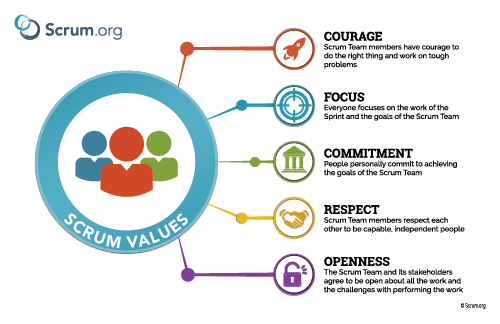

# Software Development 2 Lecture 9 -- Test-Driven Development (TDD)

In this lecture we will examine the practice of Test-Driven Development (TDD).  TDD is a practice where testing is given the highest priority.  You will find that TDD can improve the overall quality of your code by ensuring that it is well tested from the outset.

## What is Test-Driven Development?

Test-Driven Development is development driven by tests.  We write automated tests first.  Development emerges from this process, in that we:

- Only write new code if an automated test fails.
- We eliminate duplication as we only write code to pass a test.

TDD changes individual and group behaviour as:

- Design emerges organically and running code provides feedback.
- Programmers write their own tests, rather than waiting for a QA department.
- Development environments provide feedback on small batch sizes.
- Designs create highly cohesive and loosely coupled components to make testing easy.

The TDD mantra is: **red-green-refactor**:

1. **Red**: write a small test that will fail.
2. **Green**: make the test work quickly, not worrying about quality.
3. **Refactor**: fix all the bad code created just to pass the test.

The lifecycle is illustrated below:

 By <a href="//commons.wikimedia.org/w/index.php?title=User:Xarawn&amp;action=edit&amp;redlink=1" class="new" title="User:Xarawn (page does not exist)">Xarawn</a> - Own work, <a href="https://creativecommons.org/licenses/by-sa/4.0" title="Creative Commons Attribution-Share Alike 4.0">CC BY-SA 4.0</a>, <a href="https://commons.wikimedia.org/w/index.php?curid=44782343">Link</a>

How do we test our software in this manner?  We write a small automated unit test.  And when should the test be written?  Before the code to be tested is written.

### Why Test First?

> No software engineers release even the tiniest change without testing, except the very confident and the very sloppy.
> -Kent Beck, Test-Driven Development by Example.

Writing code introduces stress: the stress in not knowing if our application still works.  And there is a reinforcement feedback loop at play:

1. You feel more stressed about your code.
2. You do less testing because you are stressed.
3. You make more errors.
4. Return to step 1.

TDD reduces this stress as when we feel stressed we just run the automated test.  Fear becomes boredom.  We just press the button and get the all-clear.  You feel good and thus reduce the errors you make, further reducing stress.

There is also a cost in not fixing problems as soon as possible.  As more changes are committed, we become unsure what has caused the problem.  As time progresses, the time to fix the problem increases greatly.  Writing tests first negates this problem.

### Benefits of Automated Testing

As a software engineer we want to know if our code works.  Automated testing means our tests can be fast enough that they are run often.  Doing so means we catch the bug before anyone else sees the errors.  It also means we can find the actual source of a problem rather than hunting through lots of code for a potential problem that is occurring somewhere else.

We also reduce our cognitive load.  We try to keep all the necessary information in our head, but this just leads to problems:

1. As we gain experience, the more we realise needs to be done.
2. The more that we realise needs to be done, the less attention we pay on what we are doing.
3. The less attention we have on what we are doing, the less we accomplish.
4. The less we accomplish, the more we know needs to be done.
5. Return to step 2.

Finally, writing only the code to fix failing tests changes the team dynamic:

- Defect density is reduced, thus QA changes to proactive rather than reactive work.
- Reduced problems means the Scrum Master can better estimate the velocity and thus completion time.
- Software engineers can work collaboratively constantly as they are not spending time fixing defects.
- We have potentially shippable software as it has been tested.

## Undertaking Test-Driven Development

Kent Beck provides a simple process to get started with TDD:

1. Start simply.
2. Write automated tests.
3. Refactor to add design decisions one at a time.

Which test should you start with? Pick a variant of a test for an operation that has no side effects.  This means you can answer other questions such as:

- Where does the operation belong?
- What are the correct inputs?
- What is the correct output given those inputs?

The question then becomes which test to write next.  Do you have a list of tests? Pick the test that will teach you something and that you are confident you can implement.  If not, some ideas from *Test-Driven Development by Example* are:

- **Explanation Test**: spread the use of automated testing by asking for and giving automated tests to explain code.
- **Learning Test**: write a test to better understand externally produced software?
- **Another Test**: write tests for ideas generated by technical discussion to ensure you stay on topic.
- **Regression Test**: tests that would have been written originally. When you write a regression test, determine how you could have recognised the need for this test originally.

*Test-Driven Development by Example* contains many other examples.

### What to Test?

At what level do you write tests?

- Each test introduces just a single line of logic and some refactoring.
- Each test introduces hundreds of lines of logic and hours of refactoring.

You should be able to do either, but you will find smaller batch sizes makes sense over time.

### What Don't You Have to Test?

Remember that we want to turn fear into boredom.  So really the answer you have to find yourself: at what point will you no longer fear the changes you have made.  However, *Test Driven Development by Example* does state that the following should be tested:

- Conditionals.
- Loops.
- Operations.
- Polymorphism.

### How Do You Know If You Have Good Tests?

Tests need to inform you quickly of problems.  If your tests have the following attributes you have a problem:

- **Long setup code**: if running a test requires 100s of lines of setup code your objects are likely too large and should be split.
- **Setup duplication**: if you cannot reuse setup code between tests your code is too tightly coupled.
- **Long running tests**: if tests take long to run they won't be run often, and indicates a likely design problem.  Test suites should only take 10 minutes to run.
- **Fragile tests**: if tests break then we have parts of the application affecting other parts.  This will need to be fixed.

### Assertions

From [Wikipedia](https://en.wikipedia.org/wiki/Assertion_(software_development)):

> In computer programming, an assertion **is a statement that a predicate (Boolean-valued function, i.e. a true–false expression) is always true at that point in code execution**. It can help a programmer read the code, help a compiler compile it, or help the program detect its own defects.

Assertions allow us to state what should be true at a given point in the execution of a program.  This includes unit testing output.  Again, asserts should be written first.  Our tests should enable the passing of these asserts.

## Refactoring

From [Wikipedia](https://en.wikipedia.org/wiki/Code_refactoring):

> Code refactoring is **the process of restructuring existing computer code - changing the factoring - without changing its external behavior**. Refactoring is intended to **improve nonfunctional attributes of the software**. Advantages include **improved code readability and reduced complexity; these can improve source-code maintainability and create a more expressive internal architecture or object model to improve extensibility**.

Refactoring in TDD is a bit different in that we really only care about the test passing.  Therefore, the external behaviour may change if we need to ensure all tests pass.  Some ideas for refactoring include:

- Two pieces of similar code?  Bring them closer and unify when identical.  This works at different scales:
  - Loops.
  - Conditional branches.
  - Methods.
  - Classes.
- Change long methods into smaller ones by calling the new method.  Tools can normally help you do this.

## Test-Driven Development and Extreme Programming (XP)

We have only brushed over Extreme Programming (XP) as a concept mainly because we cover the general practices in other areas.  [Wikipedia](https://en.wikipedia.org/wiki/Extreme_programming) defines Extreme Programming as:

> Extreme programming (XP) is a software development methodology which is intended to improve software quality and responsiveness to changing customer requirements. As a type of agile software development, it advocates frequent "releases" in short development cycles, which is intended to improve productivity and introduce checkpoints at which new customer requirements can be adopted.

Kent Beck was also an advocate of Extreme Programming, and therefor makes a special point on how TDD meets XP in *Test-Driven Development by Example*:

- **Pairing**: tests can be written by one programmer and the code to pass it by another.
- **Work fresh**: XP advises to work when you are fresh and stop when you are tired.  Having tests mean we can safely return to work by walking away.
- **Continuous integration**: we will cover more explicitly in [Lecture 15](../lecture15).  Testing is at the heart of CI.
- **Simple design**: as code emerges from tests, design is simple to allow such evolution.
- **Refactoring**: we have already covered.
- **Continuous delivery**: we will cover more explicitly in [Lecture 16](../lecture16).  CD requires working software, which TDD provides.

## Other Advice from Kent Beck's *Test-Driven Development by Example*

Kent Beck is a big advocate of developer lifestyle and mindset.  As such *Test-Driven Development by Example* provides other lessons.

### Clean Code

A well-known and respected book in the software industry is *Clean Code: A Handbook of Agile Software Craftsmanship* by Robert ("Uncle Bob") Martin.  **Clean code that works** should be our goal, and TDD helps provide this.  Clean code that works is a good goal because:

> - It is a predictable way to develop. You know when you are finished, without having to worry about a long bug trail.
> - It gives you a chance to learn all of the lessons that the code has to teach you. If you only slap together the first thing you think of, then you never have time to think of a second, better thing.
> - It improves the lives of the users of your software.
> - It lets your teammates count on you, and you on them.
> - It feels good to write it.

### Courage

As stated, TDD attempts to manage the fear in programming.  Fear has side-effects:

- It makes you tentative.
- It makes you want to communicate less.
- It makes you shy away from feedback.
- It makes you grumpy.

TDD reduces fear, and therefore:

- We learn quickly through experimentation.
- We communicate better.
- We seek feedback.
- Grumpiness you'll have to resolve yourself.

Courage is actually one of the core Scrum values as indicated below:

### Taking Breaks

Kent Beck is a strong supporter of a good work-life balance.  In particular, the need for breaks is important.  We want to break out of negative loops encountered by not taking regular time out.

- Keep a water bottle at your keyboard so you take regular breaks.
- Have commitments after regular work hours to stop you working late.
- Weekend commitments help you get your head out of work thinking.
- Holidays ensure you will refresh yourself.  Three-to-four week breaks are considered the most effective.

## Summary

In this lecture we have covered the basics of TDD.  As a method, it requires practice.  In particular, you have to change your approach from writing code first to writing tests first.  Specifically, we have:

- Defined Test-Driven Development (TDD) as a process where we write tests first.
- Described the TDD lifecycle - red-green-refactor.
- Described the advantages of TDD, focusing mainly on improved code quality, feedback, and working practices.

