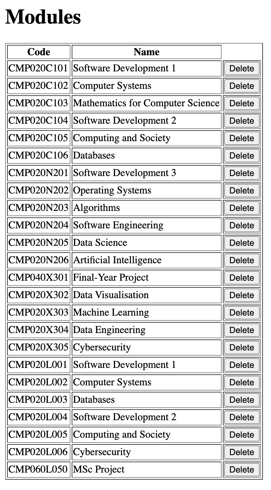
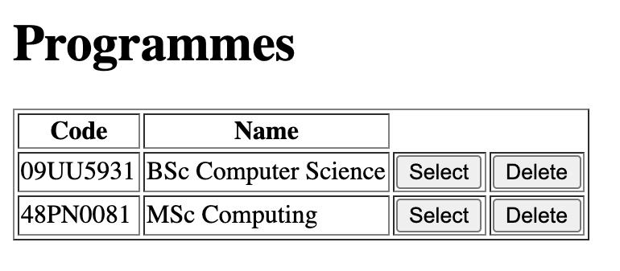
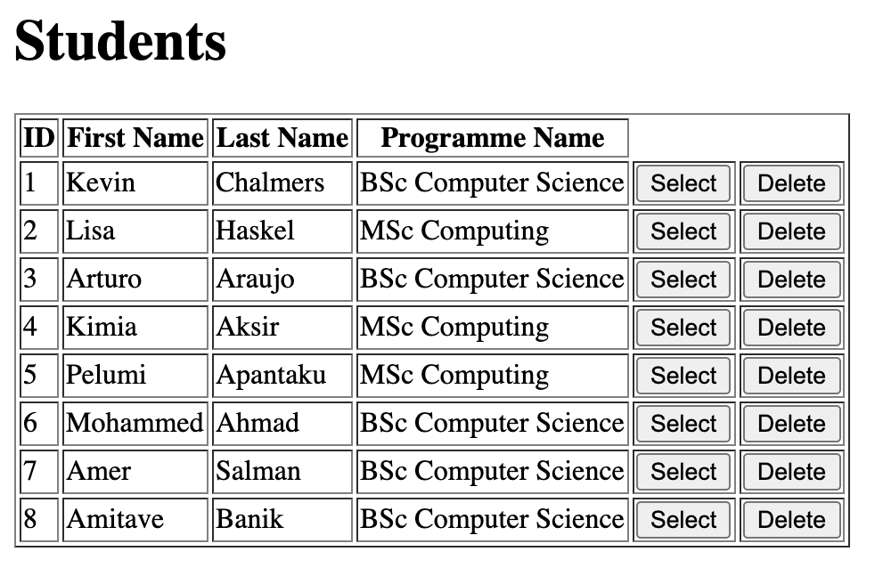
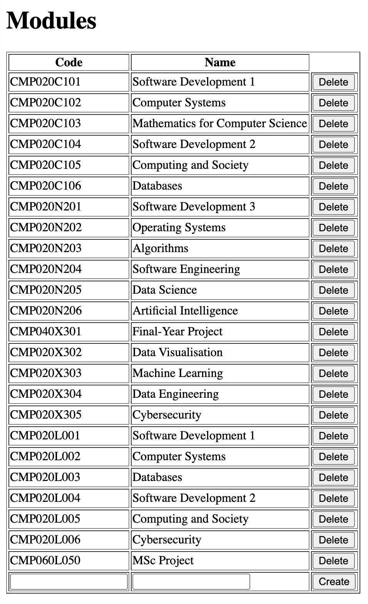
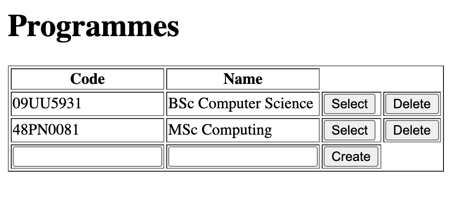

# Software Development 2 Lab 10 -- Case Study Part 3

For the final part of the case study, we will add the three elements of a CRUD application:

- Create
- Read
- Update
- Delete

These require adding new endpoints using ExpressJS and then invoking these from our front end. HTTP provides methods that we can use to invoke our CRUD behaviour. Indeed, we have already been using the `GET` message to read data from the web server. Below is description of HTTP requests and how they map to CRUD application style.

| **CRUD** | **HTTP Method** | **SQL Method** | **Description**                                              |
| -------- | --------------- | -------------- | ------------------------------------------------------------ |
| Create   | `POST`          | `INSERT`       | Post sends data to the web server.                           |
| Read     | `GET`           | `SELECT`       | Get retrieves a resource from the web server.                |
| Update   | `PUT`           | `UPDATE`       | Put replaces a resource on the web server with a new version. |
| Delete   | `DELETE`        | `DELETE`       | Delete removes a resource from the web server.               |

We will start with delete as it is the easiest to add to our application. We will then do create and finally update.

## Adding Delete

We will start with `Module`, then do `Programme` and finally `Student`. The code is very similar for each instance.

### Module

We will undertake the following process:

- Update the frontend.
- Add the ExpressJS endpoint in `app.js`.
- Add the necessary function to `data.js`.

#### Updating the Frontend

- **Update `all_modules.html` so that a delete button is added (line 10 below).**

```html
<div ng-app="mainApp" ng-controller="moduleController">
  <table border = 1>
    <tr>
      <th>Code</th>
      <th>Name</th>
    </tr>
    <tr ng-repeat="module in modules">
      <td>{{ "{{ module.code "}}}}</td>
      <td>{{ "{{ module.name "}}}}</td>
      <td><input type="button" ng-click="deleteModule(module.code)" value="Delete"></td>
    </tr>
  </table>
</div>
```

- **We now need to add a `deleteModule` function to `all_modules.js`. This is shown below.**

```javascript
mainApp.controller("moduleController", function($scope, $http) {
  $http.get("/modules").then(function(response) {
    $scope.modules = response.data;
  });
  // Sends a delete message to the server
  $scope.deleteModule = function(code) {
    // Send delete message to /module/code
    $http.delete("/module/" + code).then(function(response) {
      // When request completes, refresh list of modules
      $http.get("/modules").then(function(response) {
        $scope.modules = response.data;
      });
    });
  };
});
```

- **Rebuild your Docker image using the following command:`docker build -t student-database .`**
- **Run the Docker image as a container with the following command: `docker run -d --rm -p 5000:3000 student-database`**
- **Open your browser and visit `localhost:5000/all_modules.html`. You should receive this as the result.**



- **Stop your Docker container. Remember to use `docker ps` to find the container ID and `docker stop` to stop it.**
- **Our frontend is now ready, so commit your changes to GitHub.**
  - Add your changes.
  - Commit your changes.
  - Push your changes.

#### Adding ExpressJS Endpoint

- **We need to add a new endpoint in our `app.js` file. Add the following endpoint under the one for `get("/module/:code")`**
  - We effectively just ask the data layer to delete the module.
  - We have to respond back to the browser. We could respond with anything. Often the response contains the deleted resource.

```javascript
// Add /module delete endpoint
app.delete("/module/:code", function(req, res) {
  // Call deleteModule on data
  data.deleteModule(req.params.code, function() {
    // After delete completed respond to browser OK
    res.send("OK");
  });
});
```

#### Updating the Data Layer

- **Our `data.js` file now needs a `deleteModule` function. Add this to the bottom of `app.js`.**

```javascript
// Deletes a module from the database
exports.deleteModule = function(code, callback) {
  // Create SQL delete statement
  var sql = `DELETE FROM Modules WHERE code='${code}'`;
  // Execute SQL delete statement
  db.exec(sql, function(err) {
    // Once completed, execute callback function
    callback();
  });
};
```

#### Testing

- **Rebuild your Docker image using the following command:`docker build -t student-database .`**
- **Run the Docker image as a container with the following command: `docker run -d --rm -p 5000:3000 student-database`**
- **Open your browser and visit `localhost:5000/all_modules.html`. Click one of the delete buttons to test the result.**
- **Stop your Docker container. Remember to use `docker ps` to find the container ID and `docker stop` to stop it.**
- **Our frontend is now ready, so commit your changes to GitHub.**
  - Add your changes.
  - Commit your changes.
  - Push your changes.

### Programme

We now just have to repeat this process for Programmes.

#### Updating the Frontend

- **Update the table generation code in `all_programmes.html` to the following:**
  - The new line is line 10 where we add the Delete button.

```html
<table border=1>
  <tr>
  	<th>Code</th>
		<th>Name</th>
	</tr>
	<tr ng-repeat="programme in programmes">
  	<td>{{ "{{ programme.code "}}}}</td>
		<td>{{ "{{ programme.name "}}}}</td>
		<td><input type="button" ng-click="selectProgramme(programme.code)" value="Select"></td>
		<td><input type="button" ng-click="deleteProgramme(programme.code)" value="Delete"></td>
	</tr>
</table>
```

- **We now need to add a `deleteProgramme` function to `all_programmes.js`. This is shown below.**
  - The new code is `$scope.deleteProgramme`.

```javascript
mainApp.controller("programmeController", function($scope, $http) {
  document.getElementById("selected").style.display = "none";

  $http.get("/programmes").then(function(response) {
    $scope.programmes = response.data;
  });

  $scope.selectProgramme = function(code) {
    $http.get("/programme/" + code).then(function(response) {
      $scope.selectedProgramme = response.data;
      document.getElementById("selected").style.display = "block";
    });
  };

  $scope.deleteProgramme = function(code) {
    // Send delete message to the server
    $http.delete("/programme/" + code).then(function(response) {
      // When delete complete, refresh the list of programmes
      $http.get("/programmes/").then(function(response) {
        $scope.programmes = response.data;
      });
    });
  };
});
```

- **Rebuild your Docker image using the following command:`docker build -t student-database .`**
- **Run the Docker image as a container with the following command: `docker run -d --rm -p 5000:3000 student-database`**
- **Open your browser and visit `localhost:5000/all_programmes.html`. You should receive this as the result.**



- **Stop your Docker container. Remember to use `docker ps` to find the container ID and `docker stop` to stop it.**
- **Our frontend is now ready, so commit your changes to GitHub.**
  - Add your changes.
  - Commit your changes.
  - Push your changes.

#### Updating the Backend

- **We need to add a new endpoint in our `app.js` file. Add the following endpoint under the one for `get("/programme/:code")`**
  - We effectively just ask the data layer to delete the programme.
  - We have to respond back to the browser. We could respond with anything. Often the response contains the deleted resource.

```javascript
// Add /programme delete endpoint
app.delete("/programme/:code", function(req, res) {
  // Call deleteProgramme on data
  data.deleteProgramme(req.params.code, function() {
    // After delete completed respond to browser OK
    res.send("OK");
  });
});
```

- **Our `data.js` file now needs a `deleteProgramme` function. Add this to the bottom of `app.js`.**

```javascript
// Deletes a programme from the database
exports.deleteProgramme = function(code, callback) {
  // Create SQL delete statement
  var sql = `DELETE FROM Programmes WHERE code='${code}'`;
  // Execute SQL delete statement
  db.exec(sql, function(err) {
    // Once completed, execute callback function
    callback();
  });
};
```

- **Rebuild your Docker image using the following command:`docker build -t student-database .`**
- **Run the Docker image as a container with the following command: `docker run -d --rm -p 5000:3000 student-database`**
- **Open your browser and visit `localhost:5000/all_programmes.html`. Click one of the delete buttons to test the result.**
- **Stop your Docker container. Remember to use `docker ps` to find the container ID and `docker stop` to stop it.**
- **Our frontend is now ready, so commit your changes to GitHub.**
  - Add your changes.
  - Commit your changes.
  - Push your changes.

### Student

For students we just repeat the same process.

#### Updating the Frontend

- **Update the table generation code in `all_students.html` to the following:**
  - The new line is line 10 where we add the Delete button.

```html
<table border=1>
  <tr>
  	<th>ID</th>
		<th>First Name</th>
		<th>Last Name</th>
		<th>Programme Name</th>
	</tr>
	<tr ng-repeat="student in students">
  	<td>{{ "{{ student.id "}}}}</td>
		<td>{{ "{{ student.first_name "}}}}</td>
		<td>{{ "{{ student.last_name "}}}}</td>
		<td>{{ "{{ student.programme.name "}}}}</td>
		<td><input type="button" ng-click="selectStudent(student.id)" value="Select"></td>
		<td><input type="button" ng-click="deleteStudent(student.id)" value="Delete"></td>
	</tr>
</table>
```

- **We now need to add a `deleteStudent` function to `all_students.js`. This is shown below.**
  - The new code is `$scope.deleteStudent`.

```javascript
mainApp.controller("studentController", function($scope, $http) {
  document.getElementById("selected").style.display = "none";

  $http.get("/students").then(function(response) {
    $scope.students = response.data;
  });

  $scope.selectStudent = function(id) {
    $http.get("/student/" + id).then(function(response) {
      $scope.selectedStudent = response.data;
      document.getElementById("selected").style.display = "block";
    });
  };

  $scope.deleteStudent = function(id) {
    // Send delete message to the server
    $http.delete("/student/" + id).then(function(response) {
      // When server responds, referesh the list of students
      $http.get("/students").then(function(response) {
        $scope.students = response.data;
      });
    });
  };
});
```

- **Rebuild your Docker image using the following command:`docker build -t student-database .`**
- **Run the Docker image as a container with the following command: `docker run -d --rm -p 5000:3000 student-database`**
- **Open your browser and visit `localhost:5000/all_students.html`. You should receive this as the result.**



- **Stop your Docker container. Remember to use `docker ps` to find the container ID and `docker stop` to stop it.**
- **Our frontend is now ready, so commit your changes to GitHub.**
  - Add your changes.
  - Commit your changes.
  - Push your changes.

#### Updating the Backend

- **We need to add a new endpoint in our `app.js` file. Add the following endpoint under the one for `get("/student/:id")`**
  - We effectively just ask the data layer to delete the student.
  - We have to respond back to the browser. We could respond with anything. Often the response contains the deleted resource.

```javascript
// Add /student/code delete endpoint
app.delete("/student/:id", function(req, res) {
  // Call deleteStudent on data
  data.deleteStudent(req.params.id, function() {
    res.send("OK");
  });
});
```

- **Our `data.js` file now needs a `deleteProgramme` function. Add this to the bottom of `app.js`.**

```javascript
// Deletes a student from the database
exports.deleteStudent = function(id, callback) {
  // Create SQL delete statement
  var sql = `DELETE FROM Students WHERE id=${id}`;
  // Execute SQL delete statement
  db.exec(sql, function(err) {
    // Once completed, execute callback function
    callback();
  });
};
```

- **Rebuild your Docker image using the following command:`docker build -t student-database .`**
- **Run the Docker image as a container with the following command: `docker run -d --rm -p 5000:3000 student-database`**
- **Open your browser and visit `localhost:5000/all_students.html`. Click one of the delete buttons to test the result.**
- **Stop your Docker container. Remember to use `docker ps` to find the container ID and `docker stop` to stop it.**
- **Our frontend is now ready, so commit your changes to GitHub.**
  - Add your changes.
  - Commit your changes.
  - Push your changes.

## Adding Create

To provide creation facilities, we will just add a new row to our table that will take in new data. We then use the HTTP `POST` command to send data to the server.

### Module

Again we will start with `Module` as this is the simplest.

#### Updating the Frontend

- **Add a new row (`<tr>`) to the table in `all_modules.html` that contains two text boxes and a Create button.**
  - Note that our two text boxes use `new_module` which we will have to define in `all_modules.js` within the `$scope` value.
  - Note all that the Create button will call `createModule` when it is clicked.

```html
<table border = 1>
  <tr>
    <th>Code</th>
    <th>Name</th>
  </tr>
  <tr ng-repeat="module in modules">
    <td>{{ "{{ module.code "}}}}</td>
    <td>{{ "{{ module.name "}}}}</td>
    <td><input type="button" ng-click="deleteModule(module.code)" value="Delete"></td>
  </tr>
  <tr>
    <td><input type="text" ng-model="new_module.code"></td>
    <td><input type="text" ng-model="new_module.name"></td>
    <td><input type="button" ng-click="createModule()" value="Create"></td>
  </tr>
</table>
```

- **The Create button requires `new_module` and `createModule` to be defined with `$scope`. Update controller in `all_modules.js` to define this.**
  - New code is at the bottom starting at line 16.
  - We go throw three steps when we create a module.
    - We post to the `/modules` endpoint, sending the `new_module` data.
    - When the request completes, we reset `new_module`.
    - We then refresh the list of modules.

```javascript
mainApp.controller("moduleController", function($scope, $http) {
  $http.get("/modules").then(function(response) {
    $scope.modules = response.data;
  });
  // Sends a delete message to the server
  $scope.deleteModule = function(code) {
    // Send delete message to /module/code
    $http.delete("/module/" + code).then(function(response) {
      // When request completes, refresh list of modules
      $http.get("/modules").then(function(response) {
        $scope.modules = response.data;
      });
    });
  };

  $scope.new_module = new Module("", "");

  // Sends a put message to the server
  $scope.createModule = function() {
    // Send post message to /modules
    $http.post("/modules", $scope.new_module).then(function(response) {
      // When request completes, reset new_module
      $scope.new_module = new Module("", "");
      // Then refresh list of modules
      $http.get("/modules").then(function(response) {
        $scope.modules = response.data;
      });
    });
  };
};
```

- **Rebuild your Docker image using the following command:`docker build -t student-database .`**
- **Run the Docker image as a container with the following command: `docker run -d --rm -p 5000:3000 student-database`**
- **Open your browser and visit `localhost:5000/all_modules.html`. It should look as follows.**
  - Note the empty line that can be filled at the bottom.



- **Stop your Docker container. Remember to use `docker ps` to find the container ID and `docker stop` to stop it.**
- **Our frontend is now ready, so commit your changes to GitHub.**
  - Add your changes.
  - Commit your changes.
  - Push your changes.

#### Adding ExpressJS Endpoint

- So far we have not been sending actual data to our web server. We send HTTP requests only -- either `GET` or `DELETE`. We now need to update our ExpressJS application to understand incoming JSON data. **Add `app.use(express.json());` to `app.js` below where we call `var app = express();` as illustrated below.**

```javascript
// Import express library
const express = require("express");

// Create express application
var app = express();

// Add JSON parsing for incoming data
app.use(express.json());
```

- **We can now add our `POST` endpoint to `app.js`. Add the following below the `GET` endpoint for `/modules`.**
  - When `POST` is received, we get the `body` of `req` and call `addModule` on the data layer -- we will need to add this code.

```javascript
// Add /modules post endpoint
app.post("/modules", function(req, res) {
  // Call addModule on data
  data.addModule(req.body, function() {
    res.send("OK");
  });
});
```

#### Updating the Data Layer

- **We now need to add `addModule` to `data.js`. Add the following code at the bottom of `data.js`.**
  - We create a SQL `INSERT` statement for the incoming data and then execute it on the database.

```javascript
// Add a module to the database
exports.addModule = function(module, callback) {
  // Create SQL insert statement
  var sql = `INSERT INTO Modules VALUES ('${module.code}', '${module.name}')`;
  // Execute SQL insert statement
  db.exec(sql, function(err) {
    // Once completed, execute callback function
    callback();
  });
};
```

#### Testing

- **Rebuild your Docker image using the following command:`docker build -t student-database .`**
- **Run the Docker image as a container with the following command: `docker run -d --rm -p 5000:3000 student-database`**
- **Open your browser and visit `localhost:5000/all_modules.html`. Add a new entry and click Create to test it.**
- **Stop your Docker container. Remember to use `docker ps` to find the container ID and `docker stop` to stop it.**
- **Our frontend is now ready, so commit your changes to GitHub.**
  - Add your changes.
  - Commit your changes.
  - Push your changes.

### Programme

We will now run quickly through and repeat the same process for `Programme`.

#### Updating the Frontend

- **Add a new row (`<tr>`) to the table in `all_programmes.html` that contains two text boxes and a Create button.**
  - Note that our two text boxes use `new_programme` which we will have to define in `all_programmes.js` within the `$scope` value.
  - Note all that the Create button will call `createProgramme` when it is clicked.

```html
<table border=1>
  <tr>
    <th>Code</th>
    <th>Name</th>
  </tr>
  <tr ng-repeat="programme in programmes">
    <td>{{ "{{ programme.code "}}}}</td>
    <td>{{ "{{ programme.name "}}}}</td>
    <td><input type="button" ng-click="selectProgramme(programme.code)" value="Select"></td>
    <td><input type="button" ng-click="deleteProgramme(programme.code)" value="Delete"></td>
  </tr>
  <tr>
    <td><input type="text" ng-model="new_programme.code"></td>
    <td><input type="text" ng-model="new_programme.name"></td>
    <td><input type="button" ng-click="createProgramme()" value="Create"></td>
  </tr>
</table>
```

- **The Create button requires `new_programme` and `createProgramme` to be defined with `$scope`. Update controller in `all_programmes.js` to define this. Enter this code at the end of the controller definition.**
  - We go throw three steps when we create a module.
    - We post to the `/modules` endpoint, sending the `new_module` data.
    - When the request completes, we reset `new_module`.
    - We then refresh the list of modules.

```javascript
$scope.new_programme = new Programme("", "");

// Sends a post message to the server
$scope.createProgramme = function() {
  // Send a post message to the server
  $http.post("/programmes", $scope.new_programme).then(function(response) {
    // Reset new_programme
    $scope.new_programme = new Programme("", "");
    // Refresh list of programmes
    $http.get("/programmes").then(function(response) {
      $scope.programmes = response.data;
    });
  });
};
```

- **Rebuild your Docker image using the following command:`docker build -t student-database .`**
- **Run the Docker image as a container with the following command: `docker run -d --rm -p 5000:3000 student-database`**
- **Open your browser and visit `localhost:5000/all_students.html`. It should look as follows.**
  - Note the empty line that can be filled at the bottom.



- **Stop your Docker container. Remember to use `docker ps` to find the container ID and `docker stop` to stop it.**
- **Our frontend is now ready, so commit your changes to GitHub.**
  - Add your changes.
  - Commit your changes.
  - Push your changes.

#### Updating the Backend

- **We can now add our `POST` endpoint to `app.js`. Add the following below the `GET` endpoint for `/programmes`.**
  - When `POST` is received, we get the `body` of `req` and call `addProgramme` on the data layer -- we will need to add this code.

```javascript
// Add /programmes post endpoint
app.post("/programmes", function(req, res) {
  // Call addProgramme on data
  data.addProgramme(req.body, function() {
    res.send("OK");
  });
});
```

- **We now need to add `addProgramme` to `data.js`. Add the following code at the bottom of `data.js`.**
  - We create a SQL `INSERT` statement for the incoming data and then execute it on the database.

```javascript
// Add a programme to the database
exports.addProgramme = function(programme, callback) {
  // Create SQL insert statement
  var sql = `INSERT INTO Programmes VALUES ('${programme.code}', '${programme.name}')`;
  // Execute SQL insert statement
  db.exec(sql, function(err) {
    // Once completed, execute callback function
    callback();
  });
};
```

- **Rebuild your Docker image using the following command:`docker build -t student-database .`**
- **Run the Docker image as a container with the following command: `docker run -d --rm -p 5000:3000 student-database`**
- **Open your browser and visit `localhost:5000/all_programmes.html`. Add a new entry and click Create to test it.**
- **Stop your Docker container. Remember to use `docker ps` to find the container ID and `docker stop` to stop it.**
- **Our frontend is now ready, so commit your changes to GitHub.**
  - Add your changes.
  - Commit your changes.
  - Push your changes.

## Exercises

Over the past three labs, you've been given a lot of code. **It is very easy to fall into the trap of just typing this in without thinking about it -- you need to show you can apply these ideas**. As such, you need to complete the following yourself:

1. Add the ability to add a new student.
2. Add the ability to update a module name.
3. Add the ability to update a programme name.
4. Add the ability to update a student first name, last name, and programme.
5. Add the ability to add grades.

