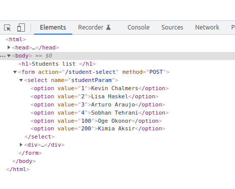

# Software Development 2 Code extras - Option list, bootstrap, css and images in static directory


## How to build an options list

There are three stages to this task: 

1. Retrieve the valid options from the database
2. Render an option list in the PUG template, in the context of a form with a 'submit' button
3. Create a route in app.js that can receive the request with the option appended and know what to do with it.

To provide and example using the students, modules and programmes example, lets create a drop-down list of students, such that when we select a student, we are sent to the relevant single-student page.

Lets add this list to the front page of our app, ie the 'root route', /.


### Task 1: Retrieve the valid options from the database

To create our dropdown list, we need to have a list of student names and their id's.

We know how to do this, we can simply query the database with:

```sql
SELECT * from Students;
```

We could put this query directly into our app.js file but lets keep some compliance with our MVC design, and instead add a new async function to the student.js file to get all students, and inside it, make use of our Student class so we know what to expect.

1 We will need a 'setter' function in our Student class so that we can set the name once created.  'getters' and 'setters' are a foundational part of OOP design.  Here we will write our setter using s a simple syntax that you could find in any language that supports OOP, though FYI Javascript has its own custom getter and setter behaviour described eg. here: https://www.javascripttutorial.net/es6/javascript-getters-and-setters/

For now - __within your student class definition__ add the following:

```javascript
 setStudentName(name) {
        this.name = name;
    }
    
```

2. Now we have that available, we can add a neat getAllStudents() method OUTSIDE of the class, but which makes use of the student class and returns an array of student objects.  This is nice, because when we send this data to the template, we can neatly and predictably access its properties....

Add the following AFTER the student class definition (in student.js) but before the module.exports:

```javascript
async function getAllStudents() {
    var sql = "SELECT id, name from Students"
    const results = await db.query(sql);
    var students = [];
    for (var row of results) {
        // Use our Student class to neatly format the object going to the template
        var student = new Student(row.id);
        // Set the student name
        student.setStudentName(row.name);
        // Push the student class onto the students array
        students.push(student);
    }

    // Return the array of all students
    return students;
}
```

3. Add this new function to the module.exports so that the rest of our app can use it.

(In student.js), makes sure your module exports includes the new function as follows:

```javascript
 
module.exports = {
    Student,
    getAllStudents
}
```


4. Finally, write some code in app.js that will test to see if our new function works well.  Remove any existing code in your root route definition (ie. in app.get('/') {} ) and replace with the following:

```javascript

// Create a route for root - /
app.get("/", async function(req, res) {
    var students = await getAllStudents();
    res.send(students);  
});

```

Test that you are getting the students array correctly by going to 

```
localhost:3000
```

You should see an ouput of the student objects.


### Task 2: Render an option list in the PUG template, in the context of a form with a 'submit' button

Now lets look at how to create an option list in PUG.

We are working on the home page, so lets make our changes in index.pug which will currently have some test content.

Lets start by injecting our array of student objects into the template.

In app.js, amend the root route as follows, to call the index template and inject the students array into it, to appear in the template as a variable called students

```
// Create a route for root - /
app.get("/", async function(req, res) {
    var students = await getAllStudents();
    res.render('index', {students: students});
});
```

Check that it works, by deleting the existing contents of index.pug and replacing it as follows:

```
extends layout
block content
    h1 Students list 
    - console.log(students)


```

Load localhost:3000.  Are you getting what you expect?  You should at this point only see the heading 'Students list', but in your VS code console you should see the students list outputted.

Once thats working well, lets add the options and form to the index.pug template. The whole thing should look like this - note the explanatory comments.

```
extends layout
block content
    h1 Students list 
    //- Define a form whose data will be passed to the /student-select route via a POST request
    form(action='/student-select', method='POST')
        //- The POST parameter will be called student
        select(name='studentParam')
            //- We loop through the students array, extracting a variable called student
            for student in students
                //- we build the option list from the id and name properties on the student object
                option(value=student.id) #{student.name}
        <div>
        //- render the submit button
        input(type='submit' value='Submit')

```

Go to localhost:3000. 

You should see your options list rendered on the page.  Inspect the list wtih developer tools.  You should see something like this:

.

Notice that the 'value' attribute is the student ID.  Its this id that we will use in the next task.

### Task 3: Create a route in app.js that can receive the request with the option appended and know what to do with it.

Finally, we need to create a route which can handle the POST parameter from the form submission.

In this case, we will simply create a new 'post' route in express, capture the id and redirect on to the single-student/:id page we have already created.

In app.js, do the following:


1. Add this line below where the express app variable is created.  This will allow us to read POST parameters send via HTML forms:

```javascript
// Make sure we get the POST parameters
app.use(express.urlencoded({ extended: true }))
```

2. Add the new POST route:

```javascript
// Create a post route to handle the form submission of the option list
app.post('/student-select', function (req, res) {
    // Retrieve the parameter and redirect to the single student page
    id = req.body.studentParam;
    res.redirect('/single-student/' + id);
});

```


Now, when you go to localhost:3000, you should be able to choose a student, press submit and be redirected to the relevant student page.


## Bootstrap with your express app

```
npm install bootstrap

docker-compose up --build
```

Add this line to app.js

```javascript
app.use('/bootstrap', express.static('node_modules/bootstrap/dist'));
```

Add these lines so that layout.pug looks like this:

```
html 
    head    
        title #{title}
        script(language="javascript" src="/bootstrap/js/bootstrap.min.js")
        link(rel="stylesheet" href="/bootstrap/css/bootstrap.min.css")
        link(rel="stylesheet" href="/css/style.css")
    body 
        block content


```

## Images in your express app


Check that you have this line already and a static directory in the top level of your app

```javascript
// Add static files location
app.use(express.static("static"));
```

Create an images directory INSIDE the static directory.  Upload your images inside it.

Include images in your templates along the lines of:

```
//- Example of an image: the actual image should be in /static/images 
img(src='/images/cat.jpeg' width='500px' height='200px')

```

## A custom stylesheet in your express app

Check you have the static directory as above.
Create a directory inside it called css.
Create a file inside called style.css
Include this in your pug templates by adding another line in your layout.pug template, in the head section, as follows:

```
        link(rel="stylesheet" href="/css/style.css")

```