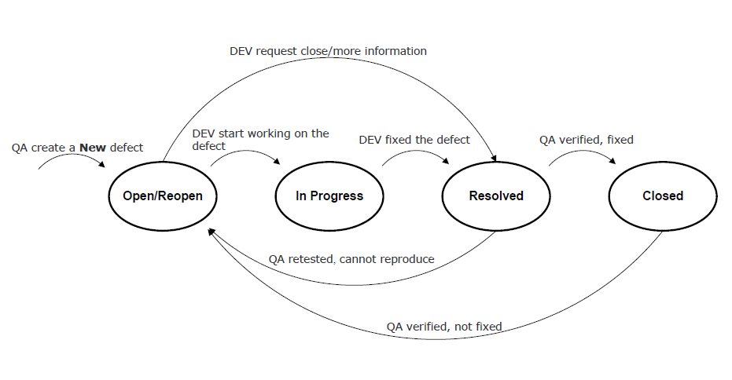
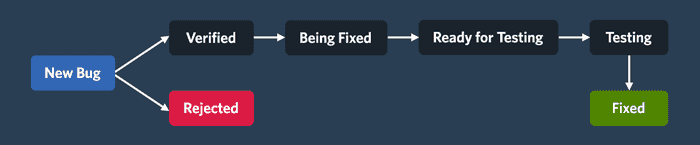
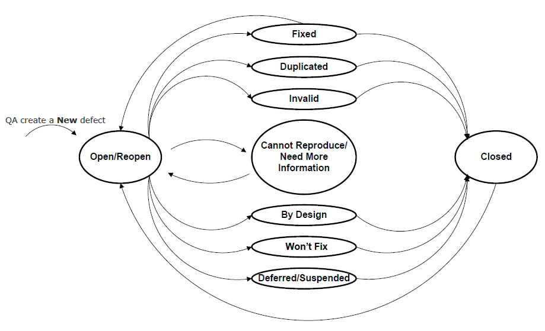

# Software Development 2 Lecture 10 -- Bug Tracking

## Bugs, Smells, and Technical Debt

First, let us define the term bug. From Wikipedia:

> A software bug is an error, flaw, failure or fault in a computer program or system that causes it to produce an incorrect or unexpected result, or to behave in unintended ways.

A bug is something amiss with our program. We have to correct bugs, but, first, we need to determine what is amiss.

A similar term is a code smell. From Wikipedia:

> In programming, a code smell is a characteristic in the code that shows a deeper problem.

Poor implementation contributes to code smell which leads to separate issues. A smell arises from indifferent or rushed programmers not complying to quality demands.

Bugs and smells form part of technical debt. We must devote time paying off our technical debt. If technical debt builds interest, it can bring significant, longer-term complications.

## Bug Tracking systems

Remember our focus is developing processes and methods. For example, GitHub is more than version control. GitHub is a software configuration management system.

Bug finding is a craft, driven via code reviews, testing, users, and luck. We examine bug reporting later in this lecture. Once a user or QA report a bug, we need to manage or track it.

From Wikipedia:

> A bug tracking system or defect tracking system is a software application that keeps track of reported software bugs in software development projects.

This definition does not inform us - a bug tracking system is a program that tracks bugs.

A bug tracking system is a database recording data on bugs. We define what bug data to store later in the lecture. Another crucial part of the system is managing a bug's lifecycle. We examine bug state later in the lecture.

A bug tracking system should integrate into our project management workflow. We track bugs as issues, and therefore they show on our Kanban/Sprint board.

Bug tracking systems are issue tracking systems. From Wikipedia:

> An issue tracking system (also ITS, trouble ticket system, support ticket, request management or incident ticket system) is a computer software package that manages and maintains lists of issues.

Again, Wikipedia is unclear. A bug tracking system functions with bugs and an issue tracking system functions with issues. Issues are general. For example, feature requests can be issues. A bug is a defect we need to resolve.

Developers used spreadsheets for bug tracking, but caused:

- Lack of communication: hard to discuss the bug.
- Lack of visibility: bug discussion is via emails not seen by the full team.
- Lack of real-time updates: no notifications on bug progress or new bugs.
- Lack of fluid properties: challenging to manage bug priority.
- Lack of a central repository: no one location to store description, screenshots, progress and feedback.
- Lack of insights: difficult to see patterns and trends.
- Lack of integration with other work: bug tracking exists separate to the rest of our work, which goes against the single repository of truth paradigm.

A spreadsheet of bugs is limiting. Bugzilla is a full bug tracking system. It provides a database, lifecycle management and notifications. These features are useful, but we lack integration with our repository.

A better solution is GitHub issues. Alternatively, we can adopt a tool that uses GitHub issues. Zube is such a tool, albeit designed for Kanban/Sprint planning.

Jira is more sophisticated, integrating with GitHub issues and providing both Kanban and bug tracking features.

## Bug Tracking Workflow

Let us now consider a bug tracking workflow. There are four stages of bug tracking:

- Capturing: where QA or users discover bugs.
- Prioritising: where the team sort the bugs into a work order.
- Tracking: where the team fix bugs and update their status.
- Releasing: where customers receive bug fixes.

The basic lifecycle of a bug is:

A bug's lifecycle stages are:

- open/reopen: when someone reports the bug, or QA marks the bug as not fixed.
- in progress: when development work on fixing the bug.
- resolved: when development submits the fix and is awaiting a QA review.
- closed: when QA make sure the bug fix passes inspection.

Another bug lifecycle is:

A bug is either accepted or rejected. If accepted, development and QA fix and test the solution.

A more detailed bug state is:

These states are labels for a bug. The state is more informative to QA and other stakeholders. For example, the defect is a design choice or one that the team won't fix.

On GitHub, bugs are issues. We can set a template for reporting. We can use labels to mark the state of a defect. Combining these features with GitHub's project board or Zube's Kanban/Sprint board provides a complete bug management system.

So, bug tracking via our backlog is possible. Ticket systems do this. A good practice is tracking bugs via our backlog and board to support a good workflow:

- We can check for duplicate bugs in the backlog.
- We create a new defect as a card in the backlog.
- We can prioritise and assign bugs.
- When we fix the bug, it moves to the done column.

## Bug Tracking Best Practices

The best practices of bug tracking are:

- Be thorough. The more information presented on the bug, its cause, and its fix, the better for the team.
- Make sure a bug is valid.
- Make sure we have complete information on the bug; e.g., title, description, screenshots, etc. 
- Make sure people only report bugs once.
- Make sure people give details to reproduce a bug.
- Think through the bug.
- Always look for new bugs: no program is bug-free.

A key aspect of bug tracking is bug communication. Any good bug report should have:

- Steps required to reproduce the bug.
- What was the expected result?
- What was the actual result?

These key elements help the development team to find and fix the bug.  Withholding part of this information means the team lacks the knowledge of the defect and thus cannot find or fix it.

## Bug Communication

To communicate a bug, we must provide a good description. A good description includes:

- A description of what happens. What is the observed defect?
- A description of when it happens. What are the causes of the defect?
- If the defect always occurs. Is the bug intermittent?
- A description of how the bug occurs at present. Maybe the circumstances under which the bug occurs have changed.
- What are the steps required to reproduce the bug?

Bug reporting is an integral ingredient of our software maintenance task. There are two types of bug reporting:

- QA and other members of the team undertake internal bug reporting.
- Users’ of the software undertake external bug reporting.

Our bug tracking process must support both types of reporting. We give templates to capture information.

## Bug Reporting

Good bug reporting practice is essential. To illustrate poor communication, I will use examples from teaching. These examples are universal.  If you’ve written in this fashion before, don’t worry.  Others have sent emails like this before.  From now, improve your delivery of issues.

### Be Specific

"I ran the code, and it’s not working." If you communicate this, you haven’t told the teaching team much. First, what do you mean you ran the code? What does running the code mean? Saying you ran the code tells us little.  Be specific. No one else lives in your head. Without the specific information you have, we cannot help you fix the bug.

### Be Verbose

"Lab 3 doesn’t work." OK, why does lab 3 not work? "The program doesn’t run." OK, what part of the lab are you doing? "The part with Docker." And so on.

Be verbose. Offer as much information as you can in a bug report. It is easy for the developer to ignore irrelevant information. Solving a lack of information can only happen by asking more questions. No one else has the knowledge you have. Thus share as much information as you can.

### Watch Your Pronouns

"It doesn’t work." What is "it"? Be careful with pronouns and related words (e.g., it, he, she, they, this, etc.).

### Inform What Else You've Done

"I cannot connect to the database container." OK, after digging around we are unsure why. "Oh, I installed MySQL on my machine. Is that a problem?" Yes. We find quicker solutions with improved information.  State what configurations you have used, or any extra steps you’ve tried to solve the problem. This information is vital to reduce time wasted trying to resolve the issue.

### Don't Use Anecdotal Evidence or Perform Confirmation Bias

"Lab 7 isn’t working, and everyone I’ve spoken to says they have the same problem." Give the developer credit.  They either know the problem or will find it with you. Stating you know someone else with a problem doesn’t help:

- The other person may have a different problem.
- The other person may have a different configuration.
- You’ve performed confirmation bias. You don’t know who has a working system. You are trying to justify your problem. If a legitimate problem, you need not to justify it.

### Proof Read

Finally, read what you wrote. Always review and edit any text you send to others. If you rush and want it done and sent, you might not make sense, you might miss information, or you might offend. Time saved rushing disappears because development requests more information to understand the issue. Furthermore, people can become confused or upset. If submitting coursework, you will lose marks. So take your time and review what you have done.

## Summary

Bug tracking and management is a big subject, but there are few formalised texts on the process.  Most companies have their own methods.  However, some standard tools are out there.  Specifically, we have:

- Defined software bugs (defects), smells (poor implementation), and technical debt in how they relate.
- Described a bug tracking system as essentially a database which holds facts on a defect and allows bug lifecycle management.
- Described a bug tracking lifecycle, from open to fixing to closed.
- Evaluated good bug reporting practice, particularly focusing on good communication.