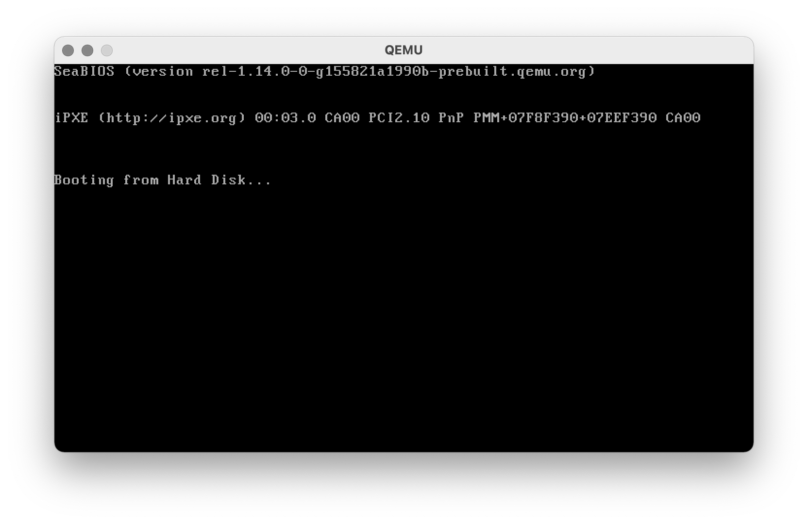
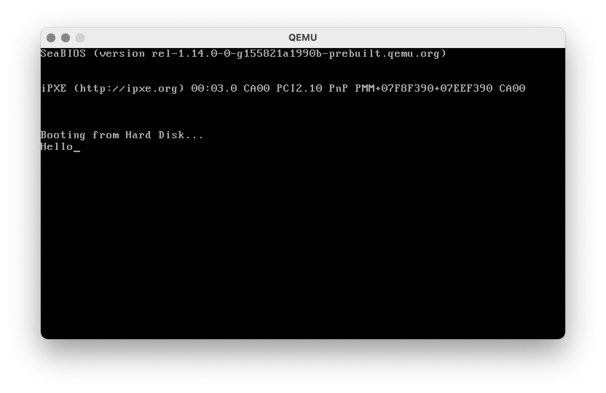
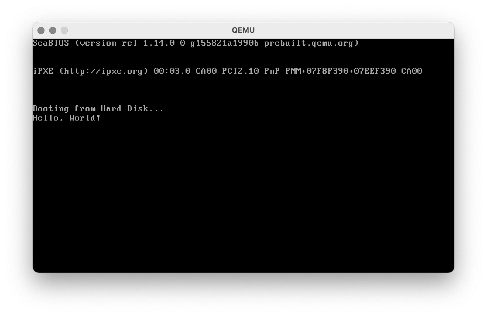

# Operating Systems Lab 01 -- Bootloading

<script src="https://cdn.jsdelivr.net/npm/code-line"></script>
<script>CodeLine.initOnPageLoad({toggleBtn: {show: false}, copyBtn: {show: false}})</script>
<script src="/module-content/script/links.js"></script>

<link rel="stylesheet" href="/module-content/css/block.css">

In this lab, we will write a **bootloader** for an operating system. We are going as close to running code on a raw machine as you can go. We will be working in assembly in this lab.

## What is a Bootloader?

In short, a bootloader is responsible for booting a computer. It is the first code that a computer will run when started (outside the built in Basic Input-Output System (BIOS)). A standard computer has a storage device (e.g., hard drive, USB stick, etc.) which the BIOS knows to use when the computer is started. This storage device has a **boot sector** stored at the start of its data.

## Boot Sector

Data on a storage device is stored in **disk sectors**. A disk sector is the minimal storage size that the storage device works to. That is, when you store data on the storage device, it is divided into chunks of disk sector size, and padded accordingly.

On a hard drive, a disk sector was traditionally 512 bytes in size, 2048 for CDs and DVDs, and newer hard drives use 4096 bytes.

Although you are working on a modern computer, we will be using 512 bytes as a disk sector size. This is because we are working with the computer at the lowest level, and all computers still have to support booting in 16-bit mode.

A **boot sector** is the first sector on a storage device. It is 512 bytes in length. And crucially it must end with the byte values `55 AA` (in hexadecimal). This is the key part that indicates that it is a boot sector. Below is the representation of the first bootloader we will write. Note that the last two bytes are `55 AA`. Most of our first bootloader will be zeroed memory.

```
EB FE 00 00 00 00 00 00 00 00 00 00 00 00 00 00
00 00 00 00 00 00 00 00 00 00 00 00 00 00 00 00
00 00 00 00 00 00 00 00 00 00 00 00 00 00 00 00
00 00 00 00 00 00 00 00 00 00 00 00 00 00 00 00
00 00 00 00 00 00 00 00 00 00 00 00 00 00 00 00
00 00 00 00 00 00 00 00 00 00 00 00 00 00 00 00
00 00 00 00 00 00 00 00 00 00 00 00 00 00 00 00
00 00 00 00 00 00 00 00 00 00 00 00 00 00 00 00
00 00 00 00 00 00 00 00 00 00 00 00 00 00 00 00
00 00 00 00 00 00 00 00 00 00 00 00 00 00 00 00
00 00 00 00 00 00 00 00 00 00 00 00 00 00 00 00
00 00 00 00 00 00 00 00 00 00 00 00 00 00 00 00
00 00 00 00 00 00 00 00 00 00 00 00 00 00 00 00
00 00 00 00 00 00 00 00 00 00 00 00 00 00 00 00
00 00 00 00 00 00 00 00 00 00 00 00 00 00 00 00
00 00 00 00 00 00 00 00 00 00 00 00 00 00 00 00
00 00 00 00 00 00 00 00 00 00 00 00 00 00 00 00
00 00 00 00 00 00 00 00 00 00 00 00 00 00 00 00
00 00 00 00 00 00 00 00 00 00 00 00 00 00 00 00
00 00 00 00 00 00 00 00 00 00 00 00 00 00 00 00
00 00 00 00 00 00 00 00 00 00 00 00 00 00 00 00
00 00 00 00 00 00 00 00 00 00 00 00 00 00 00 00
00 00 00 00 00 00 00 00 00 00 00 00 00 00 00 00
00 00 00 00 00 00 00 00 00 00 00 00 00 00 00 00
00 00 00 00 00 00 00 00 00 00 00 00 00 00 00 00
00 00 00 00 00 00 00 00 00 00 00 00 00 00 00 00
00 00 00 00 00 00 00 00 00 00 00 00 00 00 00 00
00 00 00 00 00 00 00 00 00 00 00 00 00 00 00 00
00 00 00 00 00 00 00 00 00 00 00 00 00 00 00 00
00 00 00 00 00 00 00 00 00 00 00 00 00 00 00 00
00 00 00 00 00 00 00 00 00 00 00 00 00 00 00 00
00 00 00 00 00 00 00 00 00 00 00 00 00 00 55 AA
```

## Getting Started

We will be using the following tools in this lab:

- Linux desktop (although with the right tools this will work on any platform).
- The Netwide Assembler NASM.
- QEMU -- a lightweight hardware emulator.
- Visual Studio Code as an editor.

QEMU effectively allows us to run our bootloader in a virtual machine. We will use it to run our bootloader as if it was raw hardware.

## First Bootloader

Our first boot loader will talk to the computer in its most basic fashion -- 16-bit Real Mode. Although modern processors have moved on considerable from the 16-bit era, there is still a lot of code out there that runs in this mode. Therefore, CPU manufacturers support older systems through emulation. For Intel, this means they support Intel 8086 emulation.

**Our first bootloader will do nothing.** It will simply run on the raw (emulated) hardware. To do this, we will create a loop in assembly code. If you don't remember how we can do this, below is an example:

```assembly
loop:
	jmp loop		; Goto loop
```

Our program will keep looping back to loop.

The only other task we have to do is ensure we create our boot sector properly. To do this, we will fill up to the 510th byte with a zero, and then add `55 AA`.

To fill our memory up with zeros, we do the following:

```assembly
times 510 - ($ - $$) db 0
```

`db 0` you should remember -- it declares a byte with value 0. `times` does this a number of times. The question is what does `510 - ($ - $$)` do? `510` should be obvious -- we want to fill up to the 510th byte. `$` is the current memory location this code exists on. `$$` is the start of the program. So, our line of code means the following:

- 510 minus (the current program location minus the start of the program location).

Don't worry, you don't have to remember this specifically, but you should recognise what it is.

Finally, to add `55 AA` to the end of the sector we use the following:

```assembly
dw 0xaa55
```

Memory is filled backwards in assembly, and therefore we declare our value backwards. We can now put our program together.

1. **Open up Visual Studio Code on your Linux Desktop.**
2. **Open a folder (from the File menu) that you want to work from.**
3. **Create a file `firstboot.s`**.
4. **Enter the following program.**

```assembly
; A boot sector program that loops forever

; An infinite loop. Program will always
; jump back to loop.
loop:
	jmp loop

; We need to fill 512 bytes total. Last
; two bytes used to define this sector as
; a boot sector.

; Fill 510 - program size bytes
; Program size is current location $ minus
; Start location $$
; db 0 means fill with zeros
times 510 - ($ - $$) db 0

; This value at the end of the 512 byte  
; sector indicate it is a boot sector
dw 0xaa55
```

To build your bootloader we will use nasm. Run the following from your terminal (you can open this via the **View** menu in Visual Studio Code):

```shell
nasm firstboot.s -f bin -o firstboot.bin
```

We now use QEMU to run our bootloader using the following from the terminal:

```shell
qemu-system-i386 firstboot.bin
```

This will open a new terminal window as follows:



In the terminal, use Control-C to exit QEMU.

Well done! Your bootloader works and successfully boots the computer. However, it doesn't do anything yet. Let's print something to the terminal.

## Second Bootloader

Our second bootloader will actually do something -- it will print `Hello` to the screen. This doesn't sound like much but remember:

- We are dealing with the machine at the absolute lowest level -- all we have are the basic BIOS functions.
- We are in complete control of each instruction the computer will process.

Our job is to create the specific set of instructions that will print `Hello` to the screen. We have to look at **BIOS functions** to understand what to do.

### Calling BIOS Functions

The computer comes with a small collection of BIOS functions that we can use to communicate with various parts of the raw computer system. You have no libraries of code to call on here -- no C functions such as `printf`. We will have to set the computer up to do this work for us.

To ask the BIOS to do something in our bootloader we use an interrupt. An interrupt stops the CPU doing its current work to run a higher priority process. Interrupts can be hardware based (e.g., read from network device) or software based like we will do.

To create an interrupt to ask BIOS to work with the screen, we use the following assembly instruction.

```assembly
int 0x10
```

But how do we tell the CPU what to do? We need to set appropriate CPU registers -- in particular the `A` register. We need to do two things:

- Set `ah` (the first 8 bits of `A`) to `0x0e`.
- Set `al` (the last 8 bits of `A`) to the character we want to print.

So for example, to print `H` we have to set register `A` as follows:

|       | `ah`   | `al` |
| ----- | ------ | ---- |
| Value | `0x0e` | `H`  |

When we use `int 0x10` this will cause the letter `H` to be printed to the screen.

### Printing `Hello`

Let us put the whole idea together:

1. **Create a new file `secondboot.s`.**
2. **Enter the following code.**

```assembly
; A bootloader that prints a message

mov ah, 0x0e    ; Set scrolling teletype BIOS function
mov al, 'H'     ; Set character to write
int 0x10        ; Call the BIOS function
mov al, 'e'     ; Set character to write
int 0x10        ; Call the BIOS function
mov al, 'l'     ; Set character to write
int 0x10        ; Call the BIOS function
mov al, 'l'     ; Set character to write
int 0x10        ; Call the BIOS function
mov al, 'o'     ; Set character to write
int 0x10        ; Call the BIOS function

; Loop to current location.
; In other words, infinite loop.
jmp $

; Pad to 510 bytes
times 510 - ($ - $$) db 0

; Add byes to indicate boot sector
dw 0xaa55
```

Note that we have to print each letter one at a time. This is because we have no print function to use.

To build this program we will use nasm again on the terminal:

```shell
nasm secondboot.s -f bin -o secondboot.bin
```

And then run it using QEMU as follows:

```shell
qemu-system-i386 secondboot.bin
```

This will open a window as follows:



Again, use Control-C to exit.

### Exercise

Expand this example to print `Hello, World!`. This is quite easy.

## Third Bootloader

Let us expand this bootloader once more to create a print function (we are really going back to basics here). You don't have to understand everything here -- for those who do we will explain later. The key idea we want you to know is about memory organisation on boot.

### Memory Organisation on Boot

When your computer boots, a PC will typically have a memory layout as follows. If you are interested, you can look up what some of these pieces of memory are for.

| **Address** | **Memory**              | **Size**  |
| ----------- | ----------------------- | --------- |
| `0x0`       | Interrupt Vector Table  | 1 KB      |
| `0x400`     | BIOS Data Area          | 256 bytes |
| `0x500`     | Free                    | 638 KB    |
| `0x7c00`    | ==Loaded Boot Sector==  | 512 bytes |
| `0x9fc00`   | Extended BIOS Data Area | 639 KB    |
| `0xA0000`   | Video Memory            | 128 KB    |
| `0xC0000`   | BIOS                    | 256 KB    |
| `0x10000`   | Free                    | ?         |

At memory location `0x500` is a section of free memory, and within it, at location `0x7c00` the boot sector is loaded (as highlighted above).

Unfortunately, when we write assembly code for the raw machine, this offset in memory is not added. We have to define it ourselves. To do so, at the start of our assembly program we add the following:

```assembly
[org 0x7c00]
```

This means the assembler will know the offset in memory our program is stored in. This is important when we start working with data stored in our programs.

### Hello World Program

Let us use this new knowledge now. Below is a program that will print `Hello, World!`. It does so as follows:

1. It sets the memory location of where our message is stored into the `bx` register. At the bottom of the program you will see `hello` declared.
2. We call the `print_function` function. This is something we have to define in our code. The explanation is below for those who are interested.

So now you need to do the following:

- **Create a new file called `thirdboot.s`.**
- **Enter the code below.**
- **Build the program.**
- **Run using QEMU.**

```assembly
; Printing strings

; Tell assembler where this code is loaded
[org 0x7c00]

mov bx, hello           ; We use bx to point to where we will print
call print_function     ; Call print_function

jmp $                   ; Loop forever

print_function:
    pusha               ; Push registers onto the stack
    mov ah, 0x0e        ; Scrolling teletype BIOS function
print_char:
    mov al, [bx]        ; Move memory pointed to by bx into al
    cmp al, 0           ; Check if character is zero (end of string)
    je end_print        ; If zero, end print
    int 0x10            ; Call interupt
    inc bx              ; Move to next character
    jmp print_char			; Loop
end_print:
    popa                ; Pop registers back from the stack
    ret                 ; Return from function

hello:
    db 'Hello, World!',0,0xa

times 510 - ($ - $$) db 0
dw 0xaa55
```

Your output will be as follows:



Remember to use Control-C to quit the program.

### Exercise

Extend the program so it also prints a goodbye message. You will need to do the following:

- Add a new message under `hello`.
- Set the `bx` register.
- Call the `print_function`.

### For those who need to know -- Explanation of `print_function`

We didn't explain `print_function` above, although those of you who remember assembly enough will know what it is doing. There are some operations we had to do, however.

#### Saving and Restoring Registers

`pusha` means push all the current register values onto the stack. This is important when we start a function as it ensures we can get back to our initial state. `popa` restores our registers.

#### Getting Data From Memory

Using `[bx]` means get the memory currently pointed to by the memory location stored in the `bx` register. Hopefully you remember these ideas from programming in C and C++.

#### General Algorithm

The general algorithm we are using is as follows:

```
Push registers onto the stack.
Set BIOS print character function.
Loop
	Load the memory pointed to by the bx register into the al register.
	If al equals 0 (end of string) exit loop.
	Call BIOS to print.
End loop
Pop registers back from the stack.
```

Look at the code above and ensure you understand what it is doing.

## Over to You

This is the rawest you will have ever dealt with a computer system. In fact, it has all sorts of problems associated with it. For example, your bootloader has the computer working without memory protection. This means you can do all sorts of dangerous things to your computer. Indeed, it used to be the case that you could wipe a hard drive with just a couple of well delivered assembly or C calls.

What you should do now is experiment your bootloader based on your previous experience in assembly.

## For the Brave -- Creating a Bootable Image to Write to a USB

The `.bin` files you have been creating can be used to create a bootable USB. It won't do much, but it shows you that what we are doing is real.

You can do this in Linux and MacOS using the following command:

```shell
dd if=firstboot.bin of=/your/usb/address
```

On Windows, you can use WinISO to do the conversion. You will need to boot your computer in a way so you can boot from the USB key.

This is all the information we will give you. You should be able to work this out for yourself if you are reading this section.