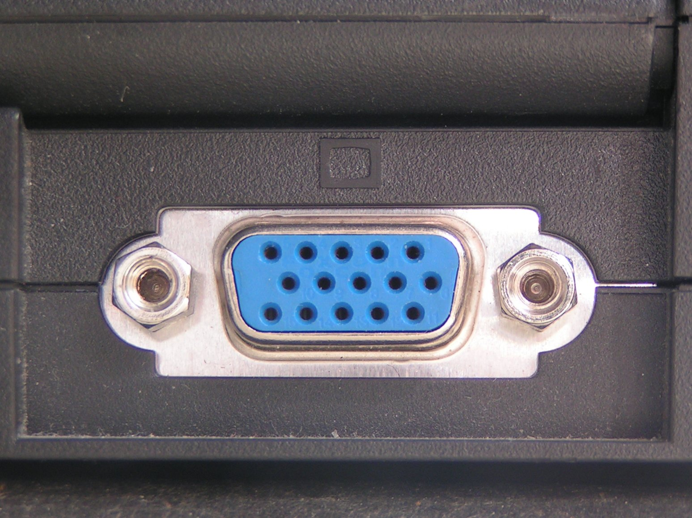
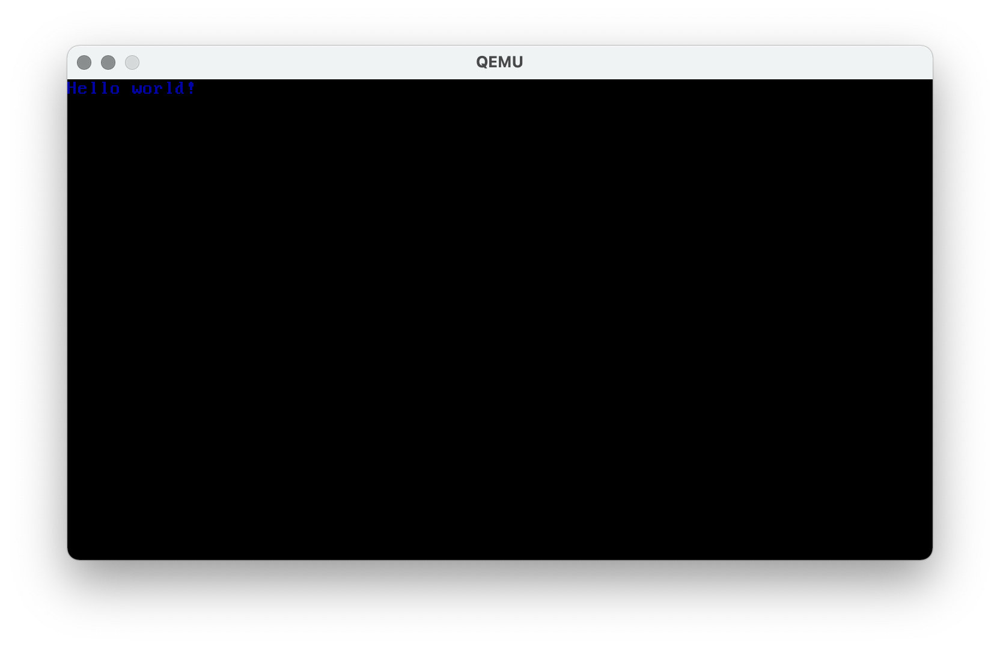
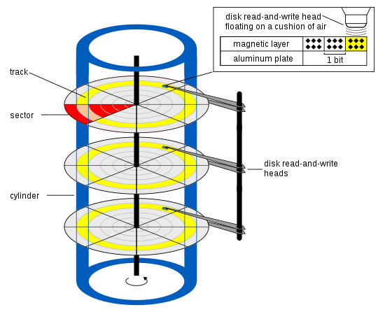
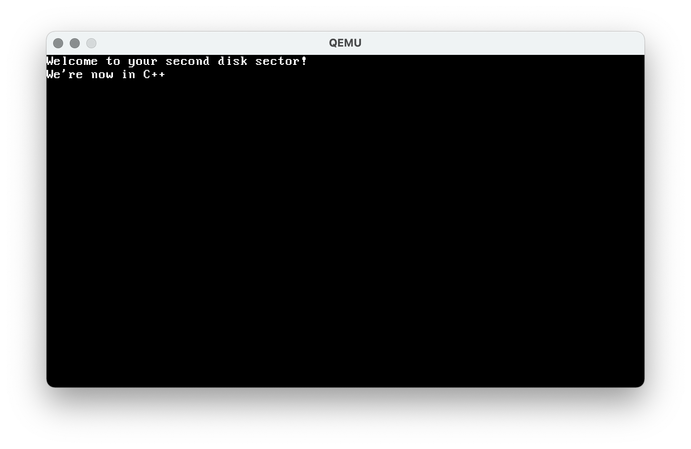

# Operating Systems Lab 02 -- Bootloading Part 2

<script src="https://cdn.jsdelivr.net/npm/code-line"></script>
<script>CodeLine.initOnPageLoad({toggleBtn: {show: false}, copyBtn: {show: false}})</script>
<script src="/module-content/script/links.js"></script>

<link rel="stylesheet" href="/module-content/css/block.css">

In this lab we will extend our bootloader so it enters 32-bit protected mode. This is getting towards where a modern operating system starts from. However, we still have to work on 16-bit mode first -- this is how the computer starts.

**NOTE -- we are still working in Visual Studio Code and Linux here.**

## An Improved 16-bit Bootloader

Last time we used jumps, etc. to print out our string. The CPU comes with better instructions to handle this for us. This is:

- `lodsb` -- loads a byte into `al` register as currently pointed to be `si` register.

This instruction effectively does our loop for us. It grabs the byte pointed to by the value in `si` into `al`, and then increments `si`.

We will also add another couple of changes:

- `bits 16` -- tells NASM we are using 16-bit instructions. This is important when we jump into 32-bit mode.
- `cli` -- clears any interrupt flags. This is just good practice.
- `hlt` -- halts execution.

Below is a better version of our last bootloader.

1. **Create a new file called boot3.s.**
2. **Enter the code below.**
3. **Build the program using NASM.**
4. **Run using QEMU.**

As a reminder, you build using NASM as follows:

```shell
nasm -f bin boot3.s -o boot3.bin
```

And we use QEMU as follows:

```shell
qemu-system-i386 boot3.bin
```

```assembly
; Tell nasm to produce 16 bit code
bits 16
; Memory offset from where the bootloader is loaded
[org 0x7c00]

; Main boot
boot:
    ; Point si register to our message
    mov si, hello
    ; Set character teletype mode
    mov ah, 0x0e
    ; Loop for printing
loop:
    ; Load next byte pointed to be si register
    lodsb
    ; Check if end of string
    cmp al, 0
    ; If end, jump to halt
    je halt
    ; Ask BIOS to print character
    int 0x10
    ; Loop
    jmp loop
; End of program
halt:
    ; Clear interrupt flag
    cli
    ; Halt execution
    hlt

; Hello message
hello:
    db "Hello, world!",0xd,0xa,0

; Fill rest of boot sector
times 510 - ($ - $$) db 0
dw 0xaa55
```

### Exercise

Update this program so it also prints a `Goodbye, world!` message.

This is the last time we'll get you to enter some assembly code. The following examples start getting larger yet repetative because of what we are doing. We will provide you with a link to download the program.

## Getting into 32-bit Protected Mode

Getting into 32-bit mode is not difficult as such, but we have to undertake a number of steps which look strange. Essentially, we have to set the state of the computer in a particular way to tell it to enter 32-bit protected mode. In this section, we will walk through these steps.

### Accessing More Memory

In 16-bit mode, we don't have access to much memory. This is again because we are back in a time when memory was counted in kilobytes or possible megabytes and not gigabytes. We have to ask the computer to enable more memory for us during the boot process. We do this by using the following lines of code to activate the 20th address line in memory.

```assembly
; Active 20th address line.
; Now have access to more than 1MB of memory
mov ax, 0x2401
int 0x15
```

Again, this is us talking directly to the computer using an interrupt. `int 0x15` denotes a memory function.

### VGA Text Mode

As we move into 32-bit mode we also change how we interact with the output from the computer. We are going to talk to the **Video Graphics Array.**

#### What is VGA?

VGA is a video display controller and graphics standard and was ubiquitous in the 1990s. Indeed, you still see VGA inputs and outputs on many devices. Indeed, you might recognise the connector:



Or the cable:


Amongst other things, VGA allows us to have coloured graphical output. We will look at that later. For now, you should understand that we are now talking to video memory (in VGA terms) when printing to the screen.

#### Setting Text Mode

All we have to do is tell the computer we want VGA Text Mode 3. We do this using the standard pattern of setting a register and calling an interrupt.

```assembly
mov ax, 0x3
int 0x10
```

### Loading a Global Descriptor Table

Now we are entering 32-bit mode we need to think about how our memory is laid out. We're getting into some complicated ideas now. To do this, we need a **Global Descriptor Table**.

#### What is a Global Descriptor Table?

A Global Descriptor Table (GDT) is used to tell the CPU about different segments of memory. This is important as we are entering a mode where areas of memory are protected. We are effectively telling the CPU how to offset itself into the correct areas of memory, and to give it a lookup table to determine if a program can access these bits of memory.

#### For those who need to know -- Global Descriptor Table Format

A global descriptor table contains several entries. The general layout is:

| **Name**    | **Size** | **Description**                                  |
| ----------- | -------- | ------------------------------------------------ |
| Limit       | 16 bits  | Describes the maximum addressable unit.          |
| Base        | 24 bits  | The start address of the segment.                |
| Access Byte | 8 bits   | A set of flags definining memory protection.     |
| Limit       | 4 bits   | Rest of the description of the addressable unit. |
| Flags       | 4 bits   | Set of flags describing how memory is accessed.  |
| Base        | 8 bits   | Final 8 bits of the start address segment        |

The Access Byte defines memory protection and takes the following format:

| **Name**   | **Size** | **Description**                                              |
| ---------- | -------- | ------------------------------------------------------------ |
| Present    | 1 bit    | Must be 1 to indicate the value is present.                  |
| Ring level | 2 bits   | What ring does the memory exist in? 0 for kernel mode, 1 or 2 for device drivers, 3 for applications. |
| Descriptor | 1 bit    | 1 for code and data segments, 0 for system segments          |
| Executable | 1 bit    | Can this code be executed at a higher ring level?            |
| Direction  | 1 bit    | Does this memory grow up from the base or down from the segment. |
| Read/Write | 1 bit    | Is this memory readable and writable?                        |
| Accessed   | 1 bit    | Has the CPU accessed this memory?                            |

The flags have the following format:

| **Name**    | **Size** | **Description**                                              |
| ----------- | -------- | ------------------------------------------------------------ |
| Granularity | 1 bit    | How is limit defined? 0 for 1 byte blocks, 1 for 4KB blocks. |
| Size        | 1 bit    | 0 for 16 bit mode, 1 for 32 bit protected mode.              |
| -           | 2 bits   | Not used.                                                    |

OK, let us build a basic GDT segment descriptor. We'll do this at a four-bit level. Let us say we want to use 3 GB of memory which is `CFFFF` times 4B blocks. This would mean we have the following values.

| 0    | 4    | 8    | 12   | 16   | 20   | 24   | 28   | 32   | 36   | 40   | 44   | 48   | 52   | 56   | 60   |
| ---- | ---- | ---- | ---- | ---- | ---- | ---- | ---- | ---- | ---- | ---- | ---- | ---- | ---- | ---- | ---- |
| F    | F    | F    | F    |      |      |      |      |      |      |      |      | C    |      |      |      |

We will start our memory with a base address of 0, so we have to fill in the base values.

| 0    | 4    | 8    | 12   | 16   | 20   | 24   | 28   | 32   | 36   | 40   | 44   | 48   | 52   | 56   | 60   |
| ---- | ---- | ---- | ---- | ---- | ---- | ---- | ---- | ---- | ---- | ---- | ---- | ---- | ---- | ---- | ---- |
| F    | F    | F    | F    | 0    | 0    | 0    | 0    | 0    | 0    |      |      | C    |      | 0    | 0    |

For access we will have `10011010`. That is, it it present, the memory is in kernel mode, it is a code/data segment, is executable, it grows from the base, is read/write, and hasn't been accessed. `10011010` is `9A` in hexadecimal.

| 0    | 4    | 8    | 12   | 16   | 20   | 24   | 28   | 32   | 36   | 40   | 44   | 48   | 52   | 56   | 60   |
| ---- | ---- | ---- | ---- | ---- | ---- | ---- | ---- | ---- | ---- | ---- | ---- | ---- | ---- | ---- | ---- |
| F    | F    | F    | F    | 0    | 0    | 0    | 0    | 0    | 0    | 9    | A    | C    | F    | 0    | 0    |

Now we will define the flags, which will both be one in our case. We'll set the not used flags to 1 as well, giving `1111` or `F`.

Remember, if you were building an operating system you'd have to do this for each memory segment. Thankfully, we'll just give you the code.

#### Defining the Global Descriptor Table

Below is the GDT we will use. It defines a few labels that are useful for us to use, including the start and the end. The description above (for those that are interested) will help you understand what the values mean.

```assembly
; Global Descriptor Table
; Don't worry about these values unless you are interested
gdt_start:
    dq 0x0
gdt_code:
    dw 0xFFFF
    dw 0x0
    db 0x0
    db 10011010b
    db 11001111b
    db 0x0
gdt_data:
    dw 0xFFFF
    dw 0x0
    db 0x0
    db 10010010b
    db 11001111b
    db 0x0
gdt_end:
```

#### Global Descriptor Table Pointer

Our GDT exists in memory -- it will be in our loaded boot sector. However, we need to tell the CPU where this information is located. To do this we need to provide two pieces of information:

- The size of the GDT structure.
- Where in memory the GDT structure is.

To do this we just need to declare a couple of values using the labels we defined above.

```assembly
gdt_pointer:
    ; Size of the GDT structure
    dw gdt_end - gdt_start
    ; Location in memory of the GDT structure
    dd gdt_start

; Defines offsets into the GDT structure
CODE_SEG equ gdt_code - gdt_start
DATA_SEG equ gdt_data - gdt_start
```

#### Setting the Global Descriptor Table

To tell the CPU where the GDT is we use the `lgdt` (*load GDT*) instruction.

```assembly
lgdt [gdt_pointer]
```

And that is the most horrible part of this assembly code over with!

### Enabling 32-bit Protected Mode

We're almost there. Next we need to tell the CPU to enable 32-bit protected mode. There is a special CPU register, `cr0`, that we can set the flag on. To do this, we use the `or` instruction. **REMEMBER** -- an or in binary will just activate a single bit. For example:

```
    0010
 or 0100
    ====
    0110
```

The code to do this is below.

```assembly
; First, get the CPU register
mov eax, cr0
; Then enable protected mode bit in this value
; Remember what or does in binary
or eax, 0x1
; Then store the new value back into the CPU register.
; This will enable protected mode.
mov cr0, eax
```

After all this, we can finally say we are using 32-bit code. We tell NASM this in the same way as 16-bit.

```assembly
bits 32
```

### Setting Data Segments

The CPU contains a collection of registers that need to be set to allow access to memory. The `DATA_SEG` value we created earlier allows us to do this easily.

```assembly
mov ax, DATA_SEG
mov ds, ax
mov es, ax
mov fs, ax
mov gs, ax
mov ss, ax
```

### Printing via VGA

OK, we are finally at the point where we can print something to the screen. But we are in VGA mode now. This means we have to fill a location in memory with the text we want to write to the screen. That location starts at `0xB8000`. For example, to print `Hello, world!`, we will have memory as follows:

| `0xB8000`   | `0xB8001` | `0xB8002`   | `0xB8003` | `0xB8004`   | `0xB8005` | .... |
| ----------- | --------- | ----------- | --------- | ----------- | --------- | ---- |
| Colour code | `H`       | Colour code | `e`       | Colour code | `l`       | .... |

 However, VGA doesn't just print text, it prints coloured text. We have 16 colours to explore.

#### Setting Colours

VGA print data takes the following form:

| **Name**          | **Size** | **Description**                         |
| ----------------- | -------- | --------------------------------------- |
| Background colour | 4 bits   | The background colour of our character. |
| Foreground colour | 4 bits   | The foreground colour of our character. |
| Character         | 8 bits   | The character to display.               |

The 4-bit VGA colour mode we are dealing with provides 16 colours (`0` to `F` in hexadecimal):

| Code | Colour        |
| ---- | ------------- |
| 0    | Black         |
| 1    | Blue          |
| 2    | Green         |
| 3    | Cyan          |
| 4    | Red           |
| 5    | Magenta       |
| 6    | Brown         |
| 7    | White         |
| 8    | Gray          |
| 9    | Light Blue    |
| A    | Light Green   |
| B    | Light Cyan    |
| C    | Light Red     |
| D    | Light Magenta |
| E    | Yellow        |
| F    | Bright White  |

Let's say we have a character `a` (`61` in hexadecimal) we want to print and we want to print it with a white background and black text. Our complete value to print is `7061`). As we normally have our character in a register for printing already, we just need to `or` the colour value (e.g., `or eax, 0x7000`).

#### VGA Printing Code

Below is an example of the code we will use to print using VGA. Notice how we fill up memory by moving two bytes at a time (`add ebx, 2`). The VGA memory remains the same -- we just fill it up like a buffer for what we want to display.

```assembly
    ; Now load the location of where our message is
    mov esi, hello
    ; Set memory location of VGA text buffer. This is 0xb8000
    mov ebx, 0xb8000

; Now loop until end of string
loop:
    ; Load next character
    lodsb
    ; Check if end of string
    cmp al, 0
    ; If end, jump to halt
    je halt
    ; Set text colour to blue
    or eax, 0x0100
    ; Load data to display into VGA memory
    mov word [ebx], ax
    ; Increment location to write to next
    add ebx, 2
    ; Loop
    jmp loop
```

### Complete Code Listing

You can access the complete code listing [here](bootloader4.s){:target="_blank"}. If you want to type this in (it is always good practice to improve your typing skills and attention to detail) then go ahead, or you can just download, build and run it in the normal fashion. You will get the following output:



You might not be able to notice the blue text in this image, but it is more obvious when you run it yourself.

### Exercises

1. Change the program so it prints out the `hello` message with white text on a black background (see above if you need a hint).
2. Now add a goodbye message that prints with yellow text on a blue background. **BONUS** -- can you get the message to print on a new line? **WARNING** -- you cannot just add a new line; VGA memory doesn't work like that.

## Reading From the Disk

We've learned now how to do a few things:

- Create a boot sector.
- Set up memory for 32-bit protected mode.
- Enable 32-bit protected mode.
- Interact with VGA.

Next we will look at reading from the disk. This is important when we need to read in more than just the boot sector (all the CPU will do by default). We will do two new things in the next example (a continuation of the last example):

1. Fill two disk sectors (1024 bytes).
2. Talk to the disk and ask it to read the second sector.

Remember how low-level we are here. We don't have `fread` or similar. We are talking directly to the disk. That means, we have to control it at the lowest level.

### Disk Layout

Disk layout in the world we are working in is based on hard drives (disks) being made of literal **disk** plates that magnetic data was written to and read from. Each disk has two sides, and each side is made up of **tracks** and **sectors**.

- A **track** is essentially a ring on the disk. A disk has multiple tracks on each side.
- A **sector** is how tracks are divided into smaller pieces. Each track has multiple sectors.

As there are two sides to each plate, this means a plate has two **heads**. Heads are connected together, so we use the terminology **cylinder** to represent the same tracks across all the disk plates. Below is an illustration of the general idea.



To read data from a disk, the operating system has to perform the following operations:

1. Select the disk to read.
2. Select the cylinder to read.
3. Select the head to use to read.
4. Select the sector to read.
5. Read the number of sectors you require.

As we are working at the lowest level of the machine, we will have to do this.

### Setting Up the Disk to Read

As always, we have to ask the BIOS to perform our operations for us. BIOS will need to know the values we indicated above. These are set in registers as follows:

| **Register** | **Value**                                                    |
| ------------ | ------------------------------------------------------------ |
| `ah`         | Tells BIOS what operating we want to perform -- we use 2 fo read disk sectors. |
| `al`         | The number of sectors we want to read.                       |
| `ch`         | The cylinder index to read from.                             |
| `dh`         | The head index to use to perform the read.                   |
| `cl`         | The sector index to read from.                               |
| `dl`         | The disk to read from.                                       |
| `bx`         | The location in memory to read into.                         |

Once we set all these values, we use interrupt `0x13` to ask the BIOS to perform the operation. Below is the code to perform this operation.

```assembly
; We are so low level we are reading the disk by sectors
; Tell BIOS we want to read sectors. Set ah register to 0x2
mov ah, 0x2
; Set sectors to read
mov al, 1
; Set cylinder index to read from
mov ch, 0
; Set head index
mov dh, 0
; Set sector index
mov cl, 2
; Set disk to read from
mov dl, [disk]
; Set target pointer
mov bx, copy_target
; Ask the bios to perform the disk read
int 0x13
```

The only other thing we will have to do is fill the first disk sector before adding the 32 bit code. You will see this in the complete code.

### Complete Code

You can access the complete code listing [here](bootloader5.s){:target="_blank"}. If you want to type this in (it is always good practice to improve your typing skills and attention to detail) then go ahead, or you can just download, build and run it in the normal fashion. You will get the following output:


### Exercise

Update the program to add a third disk sector to read from (**REMEMBER** -- update the number of sectors read). In the third disk sector print an additional message.

## Getting to C++

Writing an entire operating in assembly would be tedious and error prone. Thankfully, we can jump into C++ very easily from assembly. All we have to do is create a small stack, declare the C++ function we are calling, and call it. This is actually quite simple.

To declare some stack, we use the following assembly code:

```assembly
; Declare .bss (data) section
section .bss
; Set memory alignment to 4 bytes
align 4
; Declare the bottom of the kernel stack
kernel_stack_bottom: equ $
; Reserve 16 KB
resb 16384
; Top of kernel stack 16KB from bottom.
kernel_stack_top:
```

And then to use this stack and call our C++ function we use the following:

```assembly
; Set stack pointer to kernel_stack_top
mov esp, kernel_stack_top
; Declare external kmain function (declared in C++)
extern kmain
; Call the kmain function
call kmain
```

We'll return to the assembly shortly. First, we have to write our C++ function.

### `kmain` -- Our Main Kernel Function

Our main kernel function will just print a message in a similar way do how we do things in assembly -- we write some data to a location in memory corresponding to VGA memory.

A C++ compiler can cause us problems when linked to assembly code. C++ can *mangle* names (make them more efficient for C++). We can stop the C++ compiler doing this by declaring a function as externally visible to C as follows:

```c++
extern "C" <function>
```

Below is the C++ function we will call:

```cpp
extern "C" void kmain()
{
    // Define colour of text (white)
    const short colour = 0x0F00;
    // Define message to print
    const char* hello = "We're now in C++!";
    // Pointer to VGA text memory
    short* vga = (short*)0xb8000;
    // Print out each character one at a time
    for (int i = 0; i < 16; ++i)
    {
        // Set text into VGA memory
        vga[i + 80] = colour | hello[i];
    }
}
```

As we are now using C++ code, we need more than NASM to build our program -- we need to use a C/C++ compiler. As we are on Linux, we will be using `gcc`. We will also need to write a *linker script*. We've added this below, but you will be able to download it.

```
ENTRY(boot)
OUTPUT_FORMAT("binary")
SECTIONS {
	. = 0x7c00;
	.text :
	{
  	*(.boot)
		*(.text)
	}
  .rodata :
  {
    *(.rodata)
  }
  .data :
  {
    *(.data)
  }
  .bss :
  {
  	*(.bss)
  }
}
```

### Getting it All Working

We have to follow some different steps this time as we are building a mix of assembly and C++.

- Download the assembly for the main bootloader available [here](bootloader6.s){:target="_blank"}.
- Build the bootloader, **but** using a slightly different command shown below:

```shell
nasm -f elf32 bootloader6.s -o bootloader6.o
```

- Download the linker script available [here](linker.ld){:target="_blank"}.

- **Type in the C++ code in a file called `kmain.cpp`.**
- Build the entire kernel using the following command:

```shell
gcc -m32 kmain.cpp bootloader6.o -o kernel.bin -nostdlib -fno-pie -ffreestanding -mno-red-zone -fno-exceptions -fno-rtti -Wall -Wextra -Werror -T linker.ld
```

- Run the program using QEMU:

```shell
qemu-system-i386 kernel.bin
```

You should get the following output:



## Over to You -- Experimenting with the Bootloader

You are now in C++ so can do some more -- so take some time to play around with your bootloader. A couple of points to note:

- You have no C++ standard library. You cannot include standard headers and start acting as if you are in a normal runtime environment. We are a long way from there.
- You have very limited stack and system management set up. Things could fail easily.

We have finished our journey in bootloading. There is more out there you can examine, but we've covered the basic ideas:

- Setting a boot sector.
- Set up protected memory.
- Entered 32-bit mode.
- Interacted with video graphics display.
- Read from the disk.
- Run C++ code.

This is the boot idea for normal desktop/laptop computers running with Intel/AMD processors. ARM has different start up. If you are interested in writing an OS for a Raspberry Pi you can follow this course [Department of Computer Science and Technology – Raspberry Pi: Baking Pi – Operating Systems Development (cam.ac.uk)](https://www.cl.cam.ac.uk/projects/raspberrypi/tutorials/os/){:target="_blank"}.
