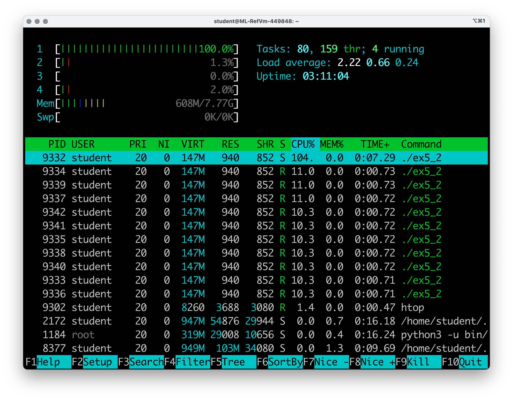

# Operating Systems Lab 05 -- Scheduling

<script src="https://cdn.jsdelivr.net/npm/code-line"></script>
<script>CodeLine.initOnPageLoad({toggleBtn: {show: false}, copyBtn: {show: false}})</script>
<script src="/module-content/script/links.js"></script>

<link rel="stylesheet" href="/module-content/css/block.css">

In this lab, we will continue our exploration of threads and processes by controlling how our threads and processes are scheduled on hardware.

## Before Getting Started

On the Linux machines you are working on, it is likely we need to activate the *real-time scheduler*. This will allow us to manipulate scheduling. This is quite easy to do.

1. **Start the Linux machine.**
2. **Once started, open the terminal and type `sudo nano /etc/security/limits.conf`**. `sudo` means run as super-user. **You will be asked for your password -- enter it.**
3. **Scroll to the bottom of the file and enter the following two lines PRECISELY**.

```
* soft rtprio 0
* hard rtprio 20
```

4. **Press Control and O together to save the file.**
5. **Press Control and X together to exit nano.**
6. **Restart the machine.**

## Starting Application -- Finding Prime Numbers

In this lab, we will be using a program that finds prime numbers to simulate work. This is just so we can see the outcome of different scheduling setups. The program has two functions alongside `main`:

- `find_primes` will find prime numbers under 100000. You don't have to modify this code.
- `do_work` is the function that our threads will run. You will have to modify this once during the exercises.

Perform the following steps:

1. **Download the code [`ex5_1.c`](ex5_1.c){:target="_blank"}**.
2. **Complete the program by replacing the lines `// *** COMPLETE ME ***` as appropriate.**
3. **Build the application using `gcc ex5_1.c -o ex5_1 -pthread -lm` on the terminal.**
4. **Run the application  using `./ex5_1` on the terminal.**

Your output will be similar to the following. Note two points:

- The threads don't necessarily launch in order.
- The threads don't necessarily complete in order.

```shell
0 working
1 working
5 working
8 working
3 working
6 working
2 working
4 working
7 working
9 working
Thread 2 found 78498 primes
Thread 1 found 78498 primes
Thread 9 found 78498 primes
Thread 6 found 78498 primes
Thread 8 found 78498 primes
Thread 4 found 78498 primes
Thread 7 found 78498 primes
Thread 0 found 78498 primes
Thread 5 found 78498 primes
Thread 3 found 78498 primes
```

We will slowly take ourselves to a point where we have control over the order that threads execute.

## Setting Processor Affinity

The first task we are going to do is set the **processor affinity** of our process. Remember, processor affinity is about which processor a process or thread executes on.

To set our processor affinity, we require the ID of the process. We did this in [Lab 03](../week-03/index.html), but as a reminder to get the ID of the current process we use `getpid()`.

```c
pid_t pid = getpid();
```

To set the processor affinity for a process, we use the `sched_setaffinity` function:

```c
sched_setaffinity(pid, sizeof(cpu_set_t), cpuset);
```

`sched_setaffinity` takes three parameters:

- `pid` -- the process we are setting the processor affinity of.
- `sizeof(cpu_set_t)` -- the size of the data being used in the function. As a system can have a different number of processors, we need to tell the function how large the data is.
- `cpuset` -- a pointer to a value of type `cpu_set_t` which describes which processors to run on.

As we require a `cpu_set_t` value we need to declare such as value:

```c
cpu_set_t set;
```

We set the values in this data using macro functions. All we want to do is zero the data using `CPU_ZERO` and then set CPU 0 to on using `CPU_SET`:

```c
CPU_ZERO(&set);
CPU_SET(0, &set);
```

We can then use this `set` value when calling `sched_setaffinity` as follows:

```c
sched_setaffinity(pid, sizeof(cpu_set_t), &set);
```

### Your Task

1. **Download the code [`ex5_2.c`](ex5_2.c){:target="_blank"}**.
2. **Complete the program by replacing the lines `// *** COMPLETE ME ***` as appropriate.**
3. **Build the application using `gcc ex5_2.c -o ex5_2 -pthread -lm` on the terminal.**
4. **Run the application  using `./ex5_2` on the terminal.**

Your output will be approximately the same as in `ex5_1` but will be slower. To see the difference, open a terminal window and type `htop`. Run your application again and see that only one CPU core is used (see below). If you run `ex5_1` you'll see all CPU cores are used.



**Why did we do this?** The machine you are using has four physical cores, and so the OS will be able to schedule across all four cores. Using just one core will allow us to see the outcomes of our scheduling decisions.

### Exercise

Experiment with selecting different processor cores (including more than one) and see the difference using `htop`.

## Setting Process Scheduler

Now we will change the scheduler used by the process. To do this we use the `sched_setscheduler` function:

```c
sched_setscheduler(pid, scheduler, param);
```

`sched_setscheduler` takes three parameters:

- `pid` -- the ID of the process we want to set the scheduler of.
- `scheduler` -- the type of scheduler we want to use. There are the following choices:
  - `SCHED_OTHER` -- the standard round-robin time-sharing scheduler used by Linux.
  - `SCHED_IDLE` -- for running very low priority background jobs. Only uses the processor if no `SCHED_OTHER` processes do.
  - `SCHED_BATCH` -- a variant of `SCHED_IDLE` for batch processing, favouring throughput with larger time slices. 
  - `SCHED_FIFO` -- a real-time scheduler with a *first-in, first-out* scheduling policy (i.e., a queue).
  - `SCHED_RR` -- a real-time scheduler with a round-robin scheduling policy.
- `param` -- of type `struct sched_param` which we use to set the priority of the process. **This is only relevant for `SCHED_FIFO` and `SCHED_RR`. The others must use a priority of zero.**

For example, if we want to use a FIFO scheduler with priority 20 (the highest priority we've set), we use the following code:

```c
struct sched_param param;
// Set priority to maximum (20)
param.sched_priority = 20;
// Set scheduler to FIFO queue
sched_setscheduler(pid, SCHED_FIFO, &param);
```

### Your Task

1. **Download the code [`ex5_3.c`](ex5_3.c){:target="_blank"}**.
2. **Complete the program by replacing the lines `// *** COMPLETE ME ***` as appropriate.**
3. **Build the application using `gcc ex5_3.c -o ex5_3 -pthread -lm` on the terminal.**
4. **Run the application  using `./ex5_3` on the terminal.**

Your output will look as follows:

```shell
0 working
Thread 0 found 78498 primes
1 working
Thread 1 found 78498 primes
2 working
Thread 2 found 78498 primes
3 working
Thread 3 found 78498 primes
4 working
Thread 4 found 78498 primes
5 working
Thread 5 found 78498 primes
6 working
Thread 6 found 78498 primes
7 working
Thread 7 found 78498 primes
8 working
Thread 8 found 78498 primes
9 working
Thread 9 found 78498 primes
```

**Note** -- we now have a fixed order to our threads running. The order is how they enter the queue which is 0 to 9. Each thread must complete before another gets a chance to run on the processor.

### Exercise

Experiment with the different schedulers listed above. **Remember** -- for `SCHED_OTHER`, `SCHED_IDLE` and `SCHED_BATCH` priority must be zero.

## Sleeping on the FIFO Queue

Now we have created a mechanism for controlling the order in which threads are scheduled. But what happens if one of these threads block? We can simulate this outcome by using the `sleep` function.

1. **Download the code [`ex5_4.c`](ex5_4.c){:target="_blank"}**.
2. **Complete the program by replacing the lines `// *** COMPLETE ME ***` as appropriate.**
3. **Build the application using `gcc ex5_4.c -o ex5_4 -pthread -lm` on the terminal.**
4. **Run the application  using `./ex5_4` on the terminal.**

Your output will be as follows:

```shell
0 working
1 working
2 working
3 working
4 working
5 working
6 working
7 working
8 working
9 working
Thread 0 found 78498 primes
Thread 1 found 78498 primes
Thread 2 found 78498 primes
Thread 3 found 78498 primes
Thread 4 found 78498 primes
Thread 5 found 78498 primes
Thread 6 found 78498 primes
Thread 7 found 78498 primes
Thread 8 found 78498 primes
Thread 9 found 78498 primes
```

**Note** -- when your threads go to sleep, it allows another process to be scheduled from the queue. Effectively, we loop the processes around the queue. They are initially scheduled, go to sleep, and on wake up go to the back of the queue again.

### Exercise

Try and implement the random sleeping period from Lab 04 in this exercise. What is the output now?

## Setting Thread Priorities

What happens when we use priorities in the FIFO scheduler? **Try and predict the output before running this application.**

We can set the priority of a thread using `pthread_setschedprio`:

```c
pthread_setschedprio(thread, priority);
```

`pthread_setshedprio` takes two parameters:

- `thread` -- the thread we want to set the priority of.
- `priority` -- the priority we want to give the thread.

### Your Task

1. **Download the code [`ex5_5.c`](ex5_5.c){:target="_blank"}**.
2. **Complete the program by replacing the lines `// *** COMPLETE ME ***` as appropriate.**
3. **Build the application using `gcc ex5_5.c -o ex5_5 -pthread -lm` on the terminal.**
4. **Run the application  using `./ex5_5` on the terminal.**

Your output will be as below. **Note** -- the order of running has reversed as the priorities match the threads.

```shell
9 working
Thread 9 found 78498 primes
8 working
Thread 8 found 78498 primes
7 working
Thread 7 found 78498 primes
6 working
Thread 6 found 78498 primes
5 working
Thread 5 found 78498 primes
4 working
Thread 4 found 78498 primes
3 working
Thread 3 found 78498 primes
2 working
Thread 2 found 78498 primes
1 working
Thread 1 found 78498 primes
0 working
Thread 0 found 78498 primes
```

## Setting Thread Scheduler

We can also set the scheduler used by threads. This can be done in two different ways -- we will do it during thread creation. Remember, `pthread_create` takes four parameters:

- A pointer to a `pthread_t` type -- this will contain the ID of the thread after `pthread_create`.
- A pointer to a `pthread_attr_t` type -- this is what we will use to change the scheduler of the process.
- The function that the thread will run.
- A pointer to any arguments we want to pass to the thread function.

`pthread_attr_t` is the value we are interested in. It allows us set the scheduler used by the thread. To use a `pthread_attr_t` we undertake the following steps:

1. Initialise the `pthread_attr_t` using `pthread_attr_init`.
2. Set that we don't want to use the creating process/thread scheduler by using `pthread_attr_setinheritsched` with the parameter `PTHREAD_EXPLICIT_SCHED` -- that is we want to use an explicit scheduler we set.
3. Set the scheduling policy by using `pthread_attr_setschedpolicy`. We can use any of the scheduling types defined above.
4. Create the thread using `pthread_create`, passing a pointer to the `pthread_attr_t` value as the second parameter.

As an example, the below code will set the scheduler for a thread to be `SCHED_RR` (the round robin scheduler).

```c
pthread_attr_t attr;
pthread_attr_init(&attr);
pthread_attr_setinheritsched(&attr, PTHREAD_EXPLICIT_SCHED);
pthread_attr_setschedpolicy(&attr, SCHED_RR);
pthread_create(&threads[i], &attr, do_work, (void*)i);
```

### Your Task

1. **Download the code [`ex5_6.c`](ex5_6.c){:target="_blank"}**.
2. **Complete the program by replacing the lines `// *** COMPLETE ME ***` as appropriate.**
3. **Build the application using `gcc ex5_6.c -o ex5_6 -pthread -lm` on the terminal.**
4. **Run the application  using `./ex5_6` on the terminal.**

As we are using a round robin scheduler we will get an output similar to that of the first program.

```shell
0 working
1 working
2 working
3 working
4 working
5 working
6 working
7 working
8 working
9 working
Thread 0 found 78498 primes
Thread 1 found 78498 primes
Thread 4 found 78498 primes
Thread 8 found 78498 primes
Thread 9 found 78498 primes
Thread 2 found 78498 primes
Thread 3 found 78498 primes
Thread 5 found 78498 primes
Thread 6 found 78498 primes
Thread 7 found 78498 primes
```

### Exercise

As with the exercise where you set the process scheduler, experiment with the different scheduler types when creating a thread.

## Round Robin and Thread Priorities

We can also attach a priority to a thread using `pthread_attr_t`. Let us do so to see how priorities impact a round-robin scheduler.

To define the priority of a thread using `pthread_attr_t` we again return to `struct sched_param` we used when defining the priority of the process. Remember that is has a parameter `sched_priority` that we set to define the priority of a process of thread within a scheduler.

To attach a `struct sched_param` to a `pthread_attr_t` we use the `pthread_attr_setschedparam` function, passing a pointer to both the `pthread_attr_t` and the `struct sched_param`. Below is an example.

```c
pthread_attr_t attr;
pthread_attr_init(&attr);
pthread_attr_setinheritsched(&attr, PTHREAD_EXPLICIT_SCHED);
pthread_attr_setschedpolicy(&attr, SCHED_RR);
struct sched_param param;
param.sched_priority = 5;
pthread_attr_setschedparam(&attr, &param);
pthread_create(&threads[i], &attr, do_work, (void*)i);
```

### Your Task

1. **Download the code [`ex5_7.c`](ex5_7.c){:target="_blank"}**.
2. **Complete the program by replacing the lines `// *** COMPLETE ME ***` as appropriate.**
3. **Build the application using `gcc ex5_7.c -o ex5_7 -pthread -lm` on the terminal.**
4. **Run the application  using `./ex5_7` on the terminal.**

Your output will be similar to the following. **Note** -- threads start and complete in batches based on priorities.

```shell
8 working
5 working
2 working
Thread 8 found 78498 primes
Thread 5 found 78498 primes
Thread 2 found 78498 primes
7 working
4 working
1 working
Thread 7 found 78498 primes
Thread 4 found 78498 primes
Thread 1 found 78498 primes
9 working
6 working
3 working
0 working
Thread 3 found 78498 primes
Thread 9 found 78498 primes
Thread 6 found 78498 primes
Thread 0 found 78498 primes
```

### Exercise

Explore setting different priorities for the threads to ensure you understand the effect taking place.

## Setting Thread Affinity

We can also set which processors our threads run on. This is very similar to how we did so for the process. We use `pthread_setaffinity_np` which takes the following parameters:

- The thread we want to set the affinity for.
- The size of `cpu_set_t`.
- A pointer to a `cpu_set_t` defining the processors we want to run on.

As we are using `cpu_set_t` we can again use `CPU_ZERO` and `CPU_SET` to control which processors are used.

### Your Task

1. **Download the code [`ex5_8.c`](ex5_8.c){:target="_blank"}**.
2. **Complete the program by replacing the lines `// *** COMPLETE ME ***` as appropriate.**
3. **Build the application using `gcc ex5_8.c -o ex5_8 -pthread -lm` on the terminal.**
4. **Run the application  using `./ex5_8` on the terminal.**

Your output will look similar to the following. **Note** -- thread ordering is determined by how quickly individual cores complete work.

```shell
0 working
1 working
2 working
3 working
Thread 0 found 78498 primes
4 working
Thread 2 found 78498 primes
6 working
Thread 1 found 78498 primes
5 working
Thread 3 found 78498 primes
7 working
Thread 4 found 78498 primes
8 working
Thread 7 found 78498 primes
Thread 6 found 78498 primes
Thread 5 found 78498 primes
9 working
Thread 8 found 78498 primes
Thread 9 found 78498 primes
```

## Over to You -- Experimenting with Scheduling

You now know how to control scheduling of processes and threads via Linux system calls. Other operating systems have similar APIs that we can use. The key idea is understanding that you can control the CPU as a resource via the operating system if you need to. This can be useful in circumstances where you must control the CPU resource. Game programming is one such area.

You should experiment with scheduling and fully understand the effects of setting schedulers, priorities, and processor affinities.