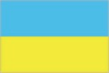
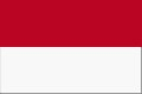
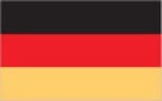
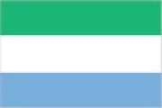
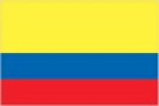
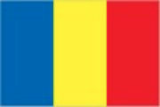
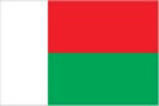
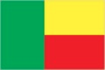

# Software Development 1 Seminar Workshop 01 -- Pseudocode

In this seminar, we are going to learn how to solve computational problems by breaking them down to simple steps.

> In computer science, pseudocode is a plain language description of the steps in an algorithm or another system. Pseudocode often uses structural conventions of a normal programming language, but is intended for human reading rather than machine reading.

## Instructions

Your group have to program a computer to draw various flags. The computer is very simple and only understands the following instruction.

```
Draw COLOUR rectangle from START to END
```

`COLOUR` is the fill-in colour of the rectangle.

`START` and `END` are coordinates in the two-dimensional plane. For example, consider the Ukraine flag.



Let us say that the top left corner is coordinate `(0, 0)` and bottom-right corner is `(600, 400)`. Then, to draw the Ukraine flag we will issue the following commands to the computer.

```
DRAW light_blue rectangle from (0,0) to (600, 200)
DRAW yellow rectangle from (0, 200) TO (600, 400)
```
> Recall: what we have done during the lab?
```
rect = Rectangle(Point(0, 0), Point(600, 200))
rect.setFill('blue')
rect.draw(Ukraine)
rect = Rectangle(Point(0, 200), Point(600, 400))
rect.setFill('yellow')
rect.draw(Ukraine)
```

### Now you try

Your group must come up with the instructions to draw the following flags.

- **Monaco**



- **Austria**


- **Armenia**


- **Germany**



- **Sierra Leone**



- **Columbia**



- **Nigeria**


- **Chad**



- **Madagascar**



- **Benin**


