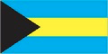
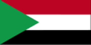
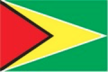

# Software Development 1
# Lab 3 

In this lab we will go in more depth into the Syntax and Semantics of Python

Lesson 1 Recap. A variable can be assigned many times. It always retains the value of the most recent assignment. Here is an interactive Python session that demonstrates the point: 

         # We initialize our variable
           myVar = 10 
           myVar
    
         # We can use the variable without modifying it 
          print(myVar - 7)
          myVar 
    
         # We can update the variable itself
         # The current value of a variable can be used to update its value
          myVar = myVar + 1 
          myVar


Lesson 2 Recap When Python encounters a call to input, it prints the prompt on the screen. Python then pauses and waits for the user to type some text and press the <Enter> key. Whatever the user types is then stored as a string. Consider: 

       # Lets try creating a variable for storing our name
       name = input ( "Enter your name: ")
       name

Executing the input statement caused Python to print out the prompt **Enter your name:** and then the interpreter paused waiting for user input. The string that the user put in is remembered in the variable name. Evaluating **name** gives back the string of characters that were typed by the user.
 

Lesson 3 Recap: When the user input is a number, we need a slightly more complicated form of input statement: 

       <variable> = str(input(<prompt>)) 

Here, we have used casting from an integer number into a string. That way, we ensure that whatever we are given by the user can be stored in our variable as a string type. We can then write a program that takes the first, middle and last names and displays the initials. By adding the extra casting into string, we ensure that any name, even the controversial X Æ A-12 (the name of Grimes's kid), can be read.

    # Read the user’s name 
    first = str(input("Enter your first name: "))
    middle = str(input("Enter your middle name: "))
    last = str(input("Enter your last name: "))

    # Extract the first character from each string and concatenate them 
    initials = first[0] + middle[0] + last[0] 

    # Display the initials 
    print("Your initials are", initials)

Example: Let’s create and analyse a program and identify keywords, conditionals and structure (colons)
We will work through a program that reads a letter of the alphabet from the user. If the user enters a, e, i, o or u then the program should display a message indicating that the entered letter is a vowel. If the user enters y then the program should display a message indicating that sometimes y is a vowel, and sometimes y is a consonant. Otherwise it should display a message indicating that the 
letter is a consonant. 

Determine if a letter is a vowel or a consonant. 


    # Read a letter from the user 
    letter = input("Enter a letter: ")
    
    # Classify the letter and report the result 
    if letter == "a" or letter == "e" or letter == "i" or letter == "o" or letter == "u": 
      print("It’s a vowel.") 
    elif letter == "y": 
      print("Sometimes it’s a vowel... Sometimes it’s a consonant.") 
    else: 
      print("It’s a consonant.") 

                
## Flags Revistied: Basic Syntax and Semantics of a High-Level Language

**Aim** -- recognise the syntax (permitted input) and semantics (input meaning) of Python.

We will continue to use Python and draw some more flags, but start to recognise correct input and meaning.


We must install an additional package to work with graphics in Python, if you ahven't already.

- **Enter the following *precisely* into the command line interface.**

```shell
pip install graphics.py
```

- **Next we have to do is ask Python to import our graphics library.**

```python
from graphics import *
```


## Syntax

You've been drawing flags using the following instructions:

- `Circle(centre, radius)` where `centre` is two-dimensional `Point` and `radius` a number.
- `Rectangle(top-left, bottom-right)` where `top-left` and `bottom-right` are both two-dimensional `Point`s.

If we were to define any of the `Point` values as just a number, we would have a syntax error. We have defined a program that uses input that is not permitted.

```python
# This instruction breaks syntax
circle = Circle(5.0, 2.0)
```

**Knowing syntax rules allows you to create instructions that the computer will understand. They take *practice* to help you remember syntax rules automatically, thus allowing you to focus on the semantics of your program.**

Some rules that govern the syntax of Python:

- `name = value` assigns a name with a value. The value can change during the lifetime of a program.
- `name = value + value * value - value` uses standard arithmetic rules to calculate the value to store in `name`. You should be familiar with these basic rules form your previous study of mathematics. We will examine expressions next week.
- `name = Type(value, ...)` allows us to create values of a given type -- such as a `Rectangle` -- and assign them to a `name`. We will examine types later in the module.
- `value.function(value, ...)` allows us to call a function on a value. We will explore functions later in the module.

## Semantics

Semantics are the meaning of your lines of code. **Knowing the meaning of code is the key skill. Mixing up a language's way of doing something with the meaning is a common error novice programmers make.** For example, consider our first program to draw the flag of France:

```python
rect = Rectangle(Point(0, 0), Point(200, 400))
rect.setFill("blue")
rect.draw(france)
rect = Rectangle(Point(200, 0), Point(400, 400))
rect.setFill(‘white’)
rect.draw(france)
rect = Rectangle(Point(400, 0), Point(600, 400))
rect.setFill(‘red’)
rect.draw(france)
france.close()
```

The **meaning** of this program, line-by-line, is:

```
Create a graphics window 600 by 400 pixels in size
Create a rectangle from point (0, 0) to point (200, 400)
Set the colour of the rectangle to blue
Draw the rectangle in the graphics window
Create a rectangle from point (200, 0) to point (400, 400)
Set the colour of the rectangle to white
Draw the rectangle in the graphics window
Create a rectangle from point (400, 0) to point (600, 400)
Set the colour of the rectange to red
Draw the rectangle in the graphics window
Close the graphics window
```

Our high-level meaning of the program is:

```
Draw a blue rectangle on the left third of the flag
Draw a white rectangle on the centre third of the flag
Draw a red rectangle on the right third of the flag
```

## Drawing Polygons

Let us apply our new understanding to draw flags using polygons. Our aim is to draw the following flag of the Bahamas:



This might look complicated, but let us break it down into a high-level meaning.

- **Ensure you study and understand the meaning of our solution. Does it make sense?**

```
Draw a light blue rectangle on the top third of the flag
Draw a yellow rectangle on the middle third of the flag
Draw a light blue rectangle on the bottom third of the flag
Draw a black triangle on the left of the flag
```

**The black triangle will be drawn on top of the rectangles, just as it would be if you did this in real-life.** Being able to break down this problem is another key skill we are working on.

A polygon is a shape that has a finite number of straight edges. You already know some polygons:

- Triangle -- 3-sided polygon
- Rectangle -- 4-sided polygon with each angle being 90 degrees

A polygon is defined by a **list** of points. For example, we can define a triangle as:

```python
triangle = Polygon(Point(0, 0), Point(200, 200), Point(0, 400))
```

**This is the syntax for polygon creation. With this we can write code that has the right meaning.**

Now let us define the flag of the Bahamas.

- **Enter this code, line-by-line, in the interactive Python console window.**

```python
from graphics import *
bahamas = GraphWin("Bahamas", 600, 400)
rect = Rectangle(Point(0, 0), Point(600, 133))
rect.setFill("light blue")
rect.draw(bahamas)
rect = Rectangle(Point(0, 133), Point(600, 266))
rect.setFill("yellow")
rect.draw(bahamas)
rect = Rectangle(Point(0, 266), Point(600, 400))
rect.setFill("light blue")
rect.draw(bahamas)
triangle = Polygon(Point(0, 0), Point(200, 200), Point(0, 400))
triangle.setFill("black")
triangle.draw(bahamas)
```

You should have the following output:


## Now you try

Write code to draw the following flags.

- **Sudan**



- **Kuwait**


- **Guyana**



- **St. Vincent**


- **Jamaica**


- **Seychelles**


- **South Africa**


- **Bahrain**


- **North Macedonia**


