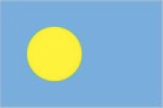

# Software Development 1 Seminar 3 -- Pseudocode & Flowchart

In this seminar, we are going to learn how to solve computational problems by breaking them down to simple steps.


###  Exercise 1: Let's do flags again.

Your group have to program a computer to draw various flags. The computer is very simple and only understands the following instructions.

```
Draw COLOUR rectangle from POINT to POINT
Draw COLOUR WIDTH line from POINT to POINT
Draw COLOUR circle with RADIUS at POINT
Draw COLOUR polygon with POINT_LIST
```

The variables(which are also syntax) in these instructions are:

- `COLOUR` is any colour.
- `WIDTH` is a number.
- `RADIUS` is a number.
- `POINT` is a two-dimensional point, e.g., `(100, 100)`.
- `POINT_LIST` is a list of points, e.g., `(10, 20), (20, 20), (20, 10)`.

With these four instructions, write the pseudocode and flowchart to instruct the computer to draw the following flags (pick up three of them, and try to use *conditional*).

- **Bangladesh**


- **Palau**



- **Niger**


- **Maldives**


- **Kuwait**


- **Saint Lucia**


- **Brazil**


- **Seychelles**


###  Exercise 2: Classifying Triangles 
A triangle can be classified based on the lengths of its sides as equilateral, isosceles or scalene: 

- All three sides of an equilateral triangle have the same length. 
- An isosceles triangle has two sides that are the same length, and a third side that is a different length. 
- If all of the sides have different lengths, then the triangle is scalene.

Task: Write a program in pseudocode/flowchart that reads the lengths of the three sides of a triangle from the user. Then display a message that states the triangle’s type. 

\_\_\_\_\_\_\_\_\_\_\_\_\_\_\_\_\_\_\_\_\_\_\_\_\_\_\_\_\_\_\_\_\_\_\_\_\_\_\_\_\_\_\_
