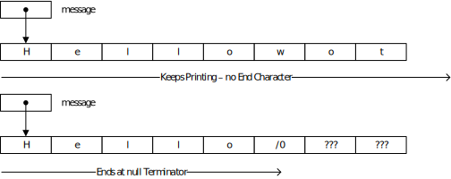
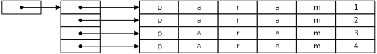

# Software Development 2 Lab 01 -- Getting Started with C

There are many ways you can develop in C and C++. Today there are three main compilers:

- GNU Compiler Collection -- `gcc`
- `clang`
- Microsoft C/C++ Compiler -- `cl`

We are going to focus on using Microsoft's compiler although you can use any compiler. The C and C++ we use is a standard. How you compile programs will be different.

If your machine is not setup with Visual Studio Code and a C/C++ compiler, use either of the following instructions. You only need go as far running the first built program:

- [Microsoft C/C++](https://code.visualstudio.com/docs/cpp/config-msvc)
- [Linux](https://code.visualstudio.com/docs/cpp/config-linux)
- [MacOS](https://code.visualstudio.com/docs/cpp/config-clang-mac)

From now on, we will provide instructions only for Microsoft C/C++ on Windows 10. Once you are setup, perform the following steps:

1. Open the Developer Command Prompt for VS.
2. In the command prompt, change to your user folder; e.g., `cd C:\Users\student\`.
3. Now create a new folder where you will undertake your work; e.g., `mkdir sd2`.
4. Change into your new folder; e.g., `cd sd2`.
5. Now start Visual Studio Code from this folder by typing `code .`.

**You will always have to start Visual Studio Code in this manner so it sees the Microsoft C/C++ tools. This is just how Microsoft have set this up.**

We are now ready to learn some C.

## Hello World!

As with every introduction to a new programming language we will start with a simple Hello World application. However, before diving straight into that let us do a brief introduction to the C programming language.

### The C Programming Language

C is one of the most (if not the most) popular programming languages in the world. It is also one of the oldest languages still in major use (C was developed between 1969 and 1973). Unlike modern languages (e.g. Java), C is not object-oriented. It is quite a simple language, and is very close to how the CPU operates (C is often called a systems programming language). Most operating systems are written in C, and most operating system APIs are C based.

C is considered the base language of many other common languages. Many languages are referred to as C like. These include Java, C#, JavaScript, Python and PHP. As such, the syntax of C is familiar to nearly all programmers as they will generally be working in a C based language. It could be argued that nearly all commercial software in the world is programmed by C like programmers.

### Hello World Code

OK, let us dive right in and write our rst C application. As stated, we will write a Hello World application. This code should be saved in a le called `hello.c`. The code is given below. **Create a new file in Visual Studio Code called `hello.c` and enter the following code:**

```c
// stdio contains standard C input - output functions
#include <stdio.h>

// Our main function .
// argc is the number of command line arguments
// argv are the command line arguments
// We will look at these later
int main(int argc, char **argv)
{
    // Print hello world to the screen
    printf("Hello world!\n");
    // Return value from program
    return 0;
}
```

Let us look through this code to get an idea of what is going on:

- Lines starting with a `//` are comments. These lines are ignored by the compiler. You should use comments as much as possible to understand your code.
- Line 2 is `#include <stdio.h>`. Lines that start with a `#` are pre-processor commands. This line is including the functionality in `stdio.h` file. This is part of the C standard library, and allows us to perform basic input-output (I/O) commands. Hence the name `std` (standard) `io` (input-output). Including existing code makes our life much easier.
- Line 8 is the start of our main application. The C compiler expects the main part to have the name main. We also dene two incoming parameters -- `argc` and `argv`. We will look at these values later in this unit.
- Line 11 is where we print out our Hello World message. To do this we use the `printf` function. Also note the use of `\n`. This denotes that a new line should be added to the end of the printed line.
- Line 13 is where we exit the application by returning from our main function. This returned value can be used by other applications to determine the successful completion of our Hello World application. In general, `0` is considered OK and other values are considered error codes. We won't really look into this.

> **`printf`**
>
> The `printf` function is used to print text to the command line. It takes the following form:
>
> ```c
> printf("format", params...);
> ```
>
> The format part of the call is the most interesting. We will look at some examples of this through the module. However, the following examples should help:
>
> - `printf("Hello Worldnn");` -- prints `Hello World` to the command line.
> - `printf("x = %d nn", x);` -- prints the value of `x`. For example, if `x` is 5, then it prints `x = 5`. The `%d` value is a placeholder telling `printf` to insert the parameter in it's place.
> - `printf("Hello %s. You are %d years old nn", name, age);` --prints a welcome message. For example, if name is Kevin and age is 42 then it prints `Hello Kevin. You are 42 years old`. %s is another placeholder. Notice that values are placed in the placeholders in the order they are given as parameters.
>
> The place holders we will look at through the next few units. However, the two we have used just now are:
>
> `%d` an integer value
>
> `%s` a string of characters

> **Escape Characters**
>
> The `\n` value in the `printf` statement is what we call an escape character. This is a character we cannot type simply using a keyboard. The `\n` value adds a new line character. Other escape characters we will come across are:
>
> - `\t` -- inserts a tab
> - `\0` -- null terminator. Used to end strings of characters
>
> Wikipedia provides a comprehensive list of escape characters -- <http://en.wikipedia.org/wiki/Escape_sequences_in_C>.

> **Code Structure**
>
> Code quality is one of the most important habits you should pick up as a new programmer! Having tidy, well laid out code will make your life easier in the long run. Employers want to see your code, and will expect it to be of high quality. You will also be assessed in university on the quality of your code.
>
> For this module you need to adopt a style and stick to it. In C/C++, the standard style is to have curly brackets on new lines. It is likely you have seen Java and JavaScript open curly brackets on the same line. If this is what you prefer, OK. But be consistent.
>
> Indentation is also important. Code blocks should be indented based on scope. This is fundamental and carries across all languages. Get in the habit now.

### Building Your Application

We are now ready to compile our application. To do this we are using Microsoft's C/C++ compiler - `cl`. We will visit some of the different commands we can give `cl` through the module. For the moment we will perform the simplest task -- having `cl` build an executable from a single .c le. The command to do this is as follows:

```shell
cl hello.c
```

The compiler goes through two stages:

1. Compiling the code in `hello.c`.
2. Linking the generated object file to the system libraries to allow running. We will look at this stage later in this lab.

If there is a problem, then the compiler will give you an error message. For example, if we remove the `;` at the end of line 11 as follows:

```c
// stdio contains standard C input - output functions
#include <stdio.h>

// Our main function .
// argc is the number of command line arguments
// argv are the command line arguments
// We will look at these later
int main(int argc, char **argv)
{
    // Print hello world to the screen
    printf("Hello world!\n")
    // Return value from program
    return 0;
}
```

when compiled the compiler will give the following output:

```shell
hello.c
hello.c(13): error C2143: syntax error : missing ';' before 'return'
```

Here, the error message says there is a problem on line 13 of `hello.c`. It is saying that there is a missing `;` before this line. This is the `;` we removed from line 11.

This is an important concept to understand. The compiler tries its best to tell you the line that has a problem, but sometimes it will tell you the line of code after. This is because the error doesn't cause a problem on the line we removed the `;` from, but on the next one.

Make sure that your application compiles and then run it by typing hello at the command prompt:

```shell
hello
Hello world!
```

#### Now you try

Create a new programme called `name.c` that prints `Hello <name>` where `<name>` is your name.

Now add a new programme called `age.c` that prints `Hello <name>. You are <age> years old!` on one line followed by `Goodbye <name>` on another. Try to do this using just one `printf` statement.

## C Strings

So we've printed a message. Let us now look in more detail at how C treats strings of characters (how we store text). Being a lower level language, C treats text as it is represented in memory -- just a block of memory with character data in it. The text has a starting point in memory (represented by a memory address or pointer), and C will treat every character in memory after this point as a member of the string until it finds a null terminator (`\0` in text or `0` as a value).



The reason C does this is because it takes up the least amount of memory overhead. Remember C is an old language. Back then, every byte of memory was precious. Using a null terminator for strings of characters had only a single byte overhead. A string retaining its size (as Java and Python does) has a two or more byte overhead. Therefore, null terminators were used.

C provides a number of helper functions for working with strings. These functions are provided in the `string.h` header file. We will use some of these functions over the next few examples. Let us first look at different methods of declaring strings of characters in C. **Save this file as `using-strings.h`.**

```c
#include <stdio.h>
// contains helper functions for strings
#include <string .h>

int main(int argc, char **argv)
{
  // Declare a character array for message
  char msg_1[5] = {'H','e','l','l','o'};
  // Declare a second character array for message
  char msg_2[8] = " World!";
  // Declare a third message
  char msg_3[9] = "Goodbye!\0";
  // Declare a forth message - no size
  char msg_4[] = "Compiler worked out my size!";
  // Declare a fifth message - use a pointer
  char *msg_5 = "Compiler worked out my size too!";

  // Print messages . 1st message is not null - terminated
  printf("%s\n", msg_1);
  printf("%s\n", msg_2);
  printf("%s\n", msg_3);
  printf("%s\n", msg_4);
  printf("%s\n", msg_5);

  return 0;
}
```

We have used five different techniques to declare a string of characters:

1. Declaring an array of `char` by declaring each individual member of the array. The array size of 5 means that there is no null terminator.

2. Declaring an array of `char` by using a string initializer (using quotation marks). The string initialiser automatically adds a null terminator. As the array is 8 characters long, then the null terminator is included.

3. Declaring an array of `char` using the string initialiser and explicitly adding the null terminator. This actually defines two null terminators -- the one we have and one after the string.

4. Declaring an array of `char` using the string initialiser but not setting the size of the array. The compiler will work this out for us.

5. Declaring a pointer to a block of char data in memory. The compiler takes care of initialising the memory for us. There is actually no real difference between this method and the previous one. An array is just a block of memory.

> **Arrays in C**
>
> You have probably come across arrays by now, so this might be a bit of a refresh.
>
> Arrays in C operate like other languages. We have the type of the array (for strings we are using character data or `char`) and the size (the number in the square brackets). C requires that you know the size of the array at compile time. That is, **the following code will not compile**:
>
> ```c
> int x = 42;
> char data[x]; // x is not a constant value
> ```
>
> This is because C needs to allocate the required memory when the program is compiled. We will cover memory allocation in far more detail later in the module. At present, it is enough to know the standard format of array declaration:
>
> ```c
> type name[size];
> ```
>
> Where `size` is a constant value known at compile time.

> **What is a Pointer?**
>
> We've introduced the concept of pointers, and this is one of the areas new programmers in C get really caught up. We will be introducing pointers more and more throughout the module, and your understanding will grow over this time. At the moment, consider a pointer at its most basic form -- it points to a location in memory, and tells the compiler the type of memory that is located there. A pointer effectively contains a memory address (think back to computer systems and memory here) which we can use to access a particular area of memory. This is how arrays are actually dealt with.
>
> From the point of view of `printf` and strings, we pass `printf` a location in memory and tell it to consider this as character data. `printf` then goes through the memory, displaying the data on the screen using ASCII to convert values into characters, until such time it finds a null terminator (`0`).
>
> Pointers are declared using the `*` type:
>
> ```c
> type *name;
> ```
>
> The use of `*` can become confusing as we will see it used to also dereference pointers, as well as the obvious use for multiplication. We will introduce these ideas slowly.

**Compile and run your program now.** If the program doesn't compile, try and fix your errors. If you are still having problems, ask for help.

Running the application should give you an output similar to the following:

```shell
Hello
 World!
Goodbye!
Compiler worked out my size!
Compiler worked out my size too!
```

There is a very good chance that you will have some extra characters printed after the `Hello` message. This is due to the lack of null termination. `printf` keeps printing characters in memory until it encounters a null terminator. This problem is actually a classic bug in low-level programming, and can cause all sorts of problems with security.

## Reading Your Name

Outputting to the command line is one thing, but what about inputting messages? Let us look at how we capture input from the command line.

C actually provides a few different techniques for capturing input, but we are going to use the simplest one. The function we are going to use is called `fgets`. It takes the following form:

```c
fgets(string, length, stream);
```

The parameters are as follows:

- `string` -- the array of memory (`char` array or pointer) to read into

- `length` -- the maximum number of characters to read. This must be equal to or less than the size of memory being read into.

- `stream` -- the location to read data from. This is a `FILE*` (pointer to a `FILE`) type. We will look at file input/output later in the module. However, we can treat the command line as a file. It has the name `stdin` (STanDard INput).

Let us create an example application for reading in a user's name from the keyboard. This example also uses some additional string functions which we will explain shortly. The application asks for a first name and last name, and then joins them together into a full name. Pseudocode for the programme is:

```
PROCEDURE MAIN
  prompt for first name
  read first name
  add null terminator to first name
  if first name = 'Kevin' then
    print hello Kevin message
  else
    print disappointed message
  prompt for last name
  read last name
  add null terminator to last name
  add first name to full name
  add space to full name
  add last name to full name
  print full name
  print length of full name
```

The (almost) complete program is below.

```c
#include <stdio.h>
#include <string.h>

int main(int argc, char **argv)
{
    // Declare character arrays to store name
    char first_name[50];
    char last_name[50];
    char full_name[50];

    // Prompt for first name
    printf("Please enter your first name: ");
    // Read name into array from stdin (standard input)
    fgets(first_name, 50, stdin);
    
    // Remove the newline character
    // Gets the length of the string.  Finds the null terminator
    int len = strlen(first_name); 
    // Check if last character is a newline
    if (len > 0 && first_name[len - 1] == '\n')
    {
        // If so set newline character to null terminator
        first_name[len - 1] = '\0';
    }
    
    // Check if your name is Kevin
    if (strcmp(first_name, "Kevin") == 0)
    {
        printf("Hey! Another Kevin\n");
    }
    else
    {
        printf("Oh well\n"); 
    }

    // ***** DO THE SAME FOR LAST NAME *****

    // Join the strings
    // strcat looks for null terminator.  Set first character of full name
    full_name[0] = '\0';
    // Add first name to full name
    strcat(full_name, first_name);
    // Add a space
    strcat(full_name, " ");
    // Add last name
    strcat(full_name, last_name);
    // Print name
    printf("Your full name is %s which is %d characters long\n", full_name, strlen(full_name));

    return 0;
}
```

> **String Functions in C**
>
> We have used some of the first C functions from the `string.h` library. These have allowed us to work with the blocks of `char` memory data in a simple manner. There are more functions than just these, and you should do some further research if you are interested. The ones we have used are:
>
> - `strlen` -- gets the length of a string.
> - `strcmp` -- compares two strings to see if they are equal. Returns `0` if the strings match. Returns `< 0` if the first string comes before the second alphabetically. Returns `> 0` if the first string comes after the second alphabetically. The case of the strings matters here. If you remember your ASCII, upper case letters have a higher value than lower case.
> - `strcat` -- adds the second string to the end of the first string. Addition is done at the first null terminator in the first string. All characters in the second string are added.
>
> As we are dealing with raw memory, some of these functions can overwrite parts of memory you do not intend to. **Be careful of your data sizes!**

### Now You Try

The code for this application is not complete, and you need to add the functionality to read in the last name (the part that says `// ***** DO THE SAME FOR LAST NAME*****`). It is almost identical to the first name reading code, except we are using the last name variable. Once working and running, you should get an output similar to the following:

```shell
Please enter your first name: Kevin
Hey! Another Kevin
You entered 5 characters
Please enter your last name: Chalmers
You entered 9 characters
Your full name is Kevin Chalmers which is 14 characters long
```

> **Variable Naming**
>
> *We have declared our rst variable data values in C!!!* As you can see it isn't hard. However, what you should be taking note of is the variable names used. **Variable names should describe the variable!** Again, this falls under code quality, and it is important to use sensible consistent names throughout your code. There are a number of variable naming *standards* and if you have one and are consistent then go ahead and use it. Just ensure your code is tidy and understandable.

## Conditionals and Loops

So far our applications have been very basic. We perform a number of operations in order then exit. We did introduce an `if` statement in the last piece of code, and didn't really explain it. You should have come across `if` statements by now, but just as a refresher.

> **What is an `if` Statement?**
>
> if is our most basic form of branching statement in C. It allows us to test a condition and execute a piece of code based on the value of that condition. If the condition value evaluates to true, then we execute the code within the brackets of the `if` statement.
>
> ```c
> if (condition)
> {
>     // If condition is true this code is run
>     ...
> }
> ```
>
> If the condition evaluates to false, then we don't execute the code. When we want different code to run when the condition isn't true, we use the `else` statement:
>
> ```c
> if (condition)
> {
>     // If condition is true this code is run
>     ...
> }
> else
> {
>     // If condition is false this code is run
>     ...
> }
> ```
>
> We can combine multiple `if` statements together:
>
> ```c
> if (condition1)
> {
>     // If condition1 is true this code is run
>     ...
> }
> else if (condition2)
> {
>     // If condition1 is false and condition2 is true this code is run
>     ...
> }
> else
> {
>     // If condition1 is false and condition2 is false this code is run
>     ...
> }
> ```

`if` statements and branching/conditional operations are what we call selection operations. So far we have only been using sequence of operations. Adding selection allows us to run different code based on conditions. Sequence and selection provide two of the three main constructs of programming:

- **Sequence** -- commands are executed in sequence.
- **Selection** -- a choice (selection) of commands can be taken based on some conditional value. This allows different sequences of code to be run based on conditions.
- **Iteration** -- a sequence of commands can be run more than once. This is supported by the use of looping statements.

> **Loops in C/C++**
>
> C and C++ supports three basic loop types. These are:
>
> - `while(condition)` -- the commands in the while block are executed as long as the given condition is true. This means that the loop may never run if condition is false.
> - `do ... while(condition)` -- the commands in the `do while` loop are executed as long as the given condition is true. The loop will execute at least once.
> - `for(value; condition; command)` -- `for` loops allow us to perform some form of initialisation (the `value` part) at the start of the loop, test for a condition at the start of each loop iteration (the `condition` part), and perform a command at the end of each iteration (the `command` part).
>
> We will come across examples of these as we work through the rest of the module.

Now we have introduced the basic ideas of looping and conditionals, let us build a simple application using these techniques. The application we are going to build will print out a triangle of stars based on a number input.

```
PROCEDURE MAIN
  flag := 1
  while flag = 1 do
  	prompt for number of stars
  	read in number of stars
  	if number = 0 then
  	  flag := 0
  	  continue
  	for i = 0 to number do
  	  for j = 0 to i do
  	    print *
  	  print new line
  	print goodbye
```

The code for this algorithm is:

```c
#include <stdio.h>
#include <stdlib.h>
#include <string.h>

int main(int argc, char **argv)
{
    // Flag (1 or 0) to indicate if we should continue
    int flag = 1;
    // while loop
    while (flag)
    {
        // Character array to read number into
        char buffer[10];
        // Prompt for value
        printf("How many stars? (0 to quit) ");
        // Read in value
        fgets(buffer, 10, stdin);
        // Convert string to number
        int number = atoi(buffer);
        // If number equals 0 then set flag and continue
        if (!number)
        {
            flag = 0;
            continue;
        }
        // Print stars
        for (int i = 0; i < number; ++i)
        {
            for (int j = 0; j < i; ++j)
            {
                printf("*");
            }
            printf("\n");
        }
    }
    // Say goodbye
    printf("Goodbye!\n");

    return 0;
}
```

> **True and False in C**
>
> Line 9 might seem strange to those who haven't used C before. We are not testing to see if the `flag` value is equal to `1`. We are treating it like it is either a true or false value. This is one of problems that can effect new C programmers.
>
> C does not have a boolean type as Python. It is actually quite a limitation. As such, C can treat any value as a boolean value. The following rules are used to determine if a value is true or false:
>
> - Value equals 0 means that value is false
> - Any other value means true -- including negative values
>
> To be fair, a `bool` type is provided by the `stdbool.h` header file, but loops and conditionals don't require you to use them -- they use the above rules.
>
> Treating boolean type values in this manner has it's advantages and disadvantages:
>
> - An object that is `null` (we will look at this in more detail later in the module) then it is `0` (false). This allows us to write statements based on whether an object is valid or not. This can make code neater, but can be confusing to non-C/C++ programmers.
> - The execution of a statement is `0` or `1` based on whether it is successful. **This can lead to many bugs in C/C++ programs (although a good compiler should spot it).**
>
> On the last point, the following code is an example of one of the issues:
>
> ```c
> int x = 10;
> if (x = 5)
> {
>     // Note the single equals.  We assigned 5 to
>     // x successfully.  The code in the if block
>     // will run!
> }
> ```
>
> The `if` condition on line 2 does equal true (1) as we can successfully assign `5` to `x`.

> **`break` and `continue`**
>
> Line 23 contains another keyword -- `continue`. This keyword is used to control how a loop operates. There is another similar keyword -- `break`.
>
> - `continue` -- ends this iteration of the loop and allows the condition to be checked to see if another iteration should be executed.
>
> - `break` -- exits the loop completely.
>
> The `break` statement is also used in `case` statements which we will look at shortly. These statements are useful to remember when you want to change the behaviour of a loop.

> **Converting a String to a Value**
>
> We have introduced a lot of new ideas in this piece of code! On line 18 we used another new function -- `atoi`. This function converts a string to an integer (aSCII to integer). Why do we need to do this? Well there is a difference between a value and its string representation. This is another fundamental concept you need to understand! If you remember your ASCII codes (or you can look up an ASCII table), the character for `1` is equal to 49. This is how the computer stores the textual representation. We need to convert this to the actual value 1. The `atoi` function does this for us.
>
> We will look at other conversion functions shortly.

Running this application provides output similar to the following:

```shell
How many stars? (0 to quit) 8

*
**
***
****
*****
******
*******
How many stars? (0 to quit) 4

*
**
***
How many stars? (0 to quit) 1

How many stars? (0 to quit) 0
Goodbye!
```

### Now You Try

It isn't quite working the way we want it to yet! Work through the following exercises to fix the problems.

1. Fix the application so the correct number of stars are output. You will notice that we do not print a line of stars with the number entered. You will have to modify the conditional test on the `for` loop to fix this.
2. Modify the application so it doesn't need the `flag` value. To do this you will need to use the `break` statement.

Now complete the following problems:

1. Write an application that outputs your name surrounded by stars, such as this:

   ```shell
   ******************
   * Kevin Chalmers *
   ******************
   ```

   The following algorithm will help:

   ```
   PROCEDURE MAIN
     prompt for name
     read name
     length := strlen(name) + 4
     for i in 0 to length do
       print *
     print new line
     print *
     print space
     print name
     print space
     print *
     print new line
     for i in 0 to length do
       print *
   ```

2. Write an application that prompts for a student name and then asks for grades. The application for keep asking for grades until -1 is entered. Once -1 is entered, an average grade should be given. The application should ask for student names until 0 is entered as a student name.

3. Write an application that outputs a Christmas tree of a given height. For example, given 5 as an input:

   ```shell
       *
      ***
     *****
    *******
   *********
       *
   ```

## `case` Statements -- Creating a Menu

When we discussed `if` statements we introduced the idea of using multiple `else if` statements to combine different conditions. Although this is good for many general cases, we sometimes want to branch based on the value of a variable. This is where `case` statements come in useful. In particular, menus are a perfect example of using a `case` statement effectively.

As an example, let us build a simple menu application.

```
PROCEDURE MAIN
  flag := 1
  while flag = 1 do
    print menu
    read input
    switch input do
      case 1
        print hello
      case 2
        print goodbye
      case 0
        print exit
        flag := 0
      case default
        print error
```

The general idea is that we print a menu, get the input, and act on the input based on the menu options.

```c
#include <stdio.h>
#include <stdlib.h>
#include <string.h>

int main(int argc, char **argv)
{
    int flag = 1;
    while (flag)
    {
        // Print menu
        printf("1 - say hello\n");
        printf("2 - say goodbye\n");
        printf("0 - exit\n");
        printf("Enter choice - ");
        // Read input
        char buffer[10];
        fgets(buffer, 10, stdin);
        // Convert to number
        int number = atoi(buffer);

        // Work on input
        switch (number)
        {
            case 1:
                printf("Hello World!\n");
                break;
            case 2:
                printf("Goodbye World!\n");
                break;
            case 0:
                printf("Exiting...\n");
                flag = 0;
                break;
            default:
                printf("*** INVALID INPUT ***\n");
                break;
        }
    }
    return 0;
}
```

> **The `default` Keyword**
>
> The `default` keyword is only called if none of the other cases are met. It is useful to deal with erroneous behaviour. It can be left out if you wish.

An example output from this application is:

```shell
1 - say hello
2 - say goodbye
0 - exit
Enter choice - 1
Hello World!
1 - say hello
2 - say goodbye
0 - exit
Enter choice - 2
Goodbye World!
1 - say hello
2 - say goodbye
0 - exit
Enter choice - 4
*** INVALID INPUT ***
1 - say hello
2 - say goodbye
0 - exit
Enter choice - 0
Exiting...
```

### Now You Try

What will happen if you remove the break statements from the switch-case statements? Try this out. Do you understand the output?

## Functions

We have looked at how we can use conditionals and loops to avoid writing lots of code, but what other techniques do we have? Hopefully you remember the idea of writing functions (or methods, procedures, sub-routines depending on how you were introduced to the idea). Functions allow us to separate our code into different, reusable sections. This is the foundation of working in a structured programming manner.

> **What is a Function?**
>
> We are going to use the more general definition of function in a programming context rather than the mathematical or functional programming idea. A function is just a collection of statements that we can run that returns some form of value (possibly `void` which means no value) given a set of parameters. In C, a function takes the following form:
>
> ```c
> return-type function-name(params)
> ```
>
> The parts of the function definition are:
>
> - `function-name` -- the name we use to call the function. For example, we have been using `printf` throughout our code.
>
> - `return-type` -- the type of value returned by the function. We will look in more detail at data types in the next unit.
>
> - `params` -- a collection of parameters (with types) we pass to the function.
>
> The point of a function (or procedure, method, sub-routine) is to allow us to call another piece of functionality. Usually we write functions that are reusable (have a particular purpose) and small (allow us to separate our code into easy to understand chunks). Writing functions comes with practice!. You might find it difficult to determine how to separate your code initially, but it will come with experience and practice.

> **Parameter Passing**
>
> Parameter passing is another area where novice programmers can slip up. At the moment you should consider that a parameter you pass into a function is a copy. Let us reiterate that idea -- **parameters passed into a function are a copy of that value!** This means that if you change the value in a function, this change is not reflected outside the function. The function has only changed its copy. There is a good chance you have worked with the idea of passing values by reference in Python and not thought about it.

Let us build an example for working with functions. Our application will prompt a user for their name and then calculate their wage based on hours worked and hourly rate.

We will also write a short function (or procedure -- it doesn't return a value) that will remove the newline character from our entered name. We did this before in our name application. We will also enable the modification of this value by passing it in as a pointer. Do not worry about this at the moment. We will introduce these ideas more and more through the units we are working through.

```
FUNCTION CALCULATE_WAGE(rate, hours)
  return rate * hours
  
PROCEDURE MAIN
  flag := 1
  while flag = 1 do
    read name
    if name = 0 then
      flag = 0
      continue
    read rate
    read hours
    wage := CALCULATE_WAGE(rate, hours)
    print wage
```

```c
#include <stdio.h>
// The main C standard library header
#include <stdlib.h>
#include <string.h>

// Calculate wage
double calculate_wage(double rate, double hours)
{
	return rate * hours;
}

// Remove newline.  Pass in modifiable value
void remove_newline(char *str)
{
	// Gets the length of the string
	int len = strlen(str); 
	// Check if last character is a newline
	if (len > 0 && str[len - 1] == '\n')
  {
		// If so set newline character to null terminator
		str[len - 1] = '\0';
  }
}

int main(int argc, char **argv)
{
	// Flag to continue
	int flag = 1;
	while (flag != 0)
	{
		// Buffer for name
		char name[50];
		// Buffer for number
		char number[10];
		// Prompt for first name
		printf("Please enter your name: ");
		// Read name into array
		fgets(name, 50, stdin);
		// Strip newline
		remove_newline(name);
		// If name is 0 then exit
		if (strcmp(name, "0") == 0)
		{
			flag = 0;
			continue;
		}
		// Prompt for hourly rate
		printf("Enter hourly rate: ");
		// Read value into array
		fgets(number, 10, stdin);
		// Convert to float
		double rate = atof(number);
		// Prompt for hours
		printf("Enter hours: ");
		// Read value into array
		fgets(number, 10, stdin);
		// Convert to float
		double hours = atof(number);
		// Calculate wage
		double wage = calculate_wage(rate, hours);
		// Output
		printf("Wage for %s: %.2f\n", name, wage);
	}
	// Print goodbye
	printf("Goodbye!");
	
	return 0;
}
```

> **The `stdlib.h` Header File**
>
> We have added a new header file -- `stdlib.h`. This is the STanDard LIBrary header file, and contains quite a collection of useful functions -- this is actually where the string conversion functions reside. However, it should be one of the headers you always include in a C application. In general, the following headers are the ones you should generally include as default:
>
> - `stdlib.h`
> - `stdio.h`
> - `string.h` -- if you are using text at all

> **The `atof` Function**
>
> We already used the `atoi` function. `atof` converts a string to a point (decimal) number (aSCII to oat). `atof` returns a double value (double precision floating point). We will look at data types in the next unit.

> **Declaration Order**
>
> C and C++ are not as forgiving as Python and other languages when it comes to declaration order. Before you can use a function or variable it has to be declared. This is a question of scope. We will be covering scope in more detail later in the module. At the moment, realise that if you want to use a function or variable at a point in your file, it must be declared earlier in the file than where you use it. Otherwise you will get an error. The exercise will illustrate this.

An example output from this application is shown below:

```shell
Please enter your name: Kevin
Enter hourly rate: 35
Enter hours: 35
Wage for Kevin: 1225.00
Please enter your name: Bob
Enter hourly rate: 50
Enter hours: 40
Wage for Bob: 2000.00
Please enter your name: Frank
Enter hourly rate: 100
Enter hours: 10
Wage for Frank: 1000.00
Please enter your name: 0
Goodbye!
```

### Now You Try

Move the `calculate_wage` function after `main` and compile the program to see what happens. You should get an error message similar to the following (the line number may be different):

```shell
functions.c
functions.c(64) : error C2371: 'calculate_wage' : redefinition; different basic types
```

Now write an application that presents a menu asking if the user wants a Christmas tree or a triangle. The application will then ask for a size and print the requested object. The application should keep asking the user what they want to print until asked to exit. The Christmas tree and triangle code should be written as functions.

## Command Line Arguments

For our final application let us examine the two values that we declare for our main application -- `argc` and `argv`.

`argc` provides a count of the number of command line arguments that have been passed into the application. It is an integer value that provides information about its partner value -- `argv`.

`argv` is an interesting parameter. Its type is `char**`, or a pointer to a pointer of `char`. If you remember from our work on strings at the start of the unit, we defined a string as a `char*`. We also defined an array of `char` as a `char*`. A `char**` can be considered as an array of strings. `argc` tells us how many strings we have. As the strings are null terminated, we can use `strlen` to get the length of each string if we want.



As an example of working with the command line arguments, try the following (fairly short) application.

```c
#include <stdio.h>
#include <string.h>

int main(int argc, char **argv)
{
	// Loop for number of arguments
	for (int i = 0; i < argc; ++i)
	{
		printf("Argument %d: %s\n", i, argv[i]);
	}
	printf("All arguments printed.\n");
	
	return 0;
}
```

Running this application (let us assume you have called it `command-line`) provides the following output:

```shell
command-line hello world programming fundamentals
Argument 0: command-line
Argument 1: hello
Argument 2: world
Argument 3: programming
Argument 4: fundamentals
All arguments printed.
```

Notice that the name of the application is argument 0.  This does depend on the operating system running the application.  Windows provides the name as an argument.  This is worth remembering.