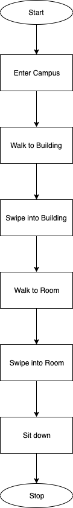
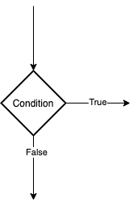
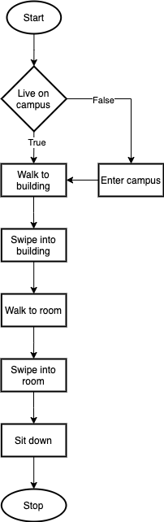
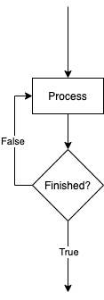
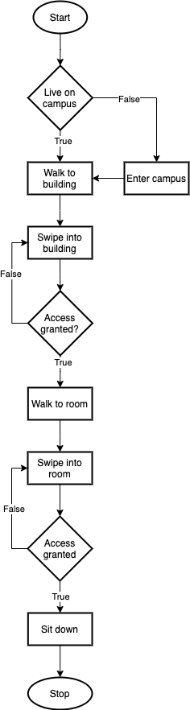
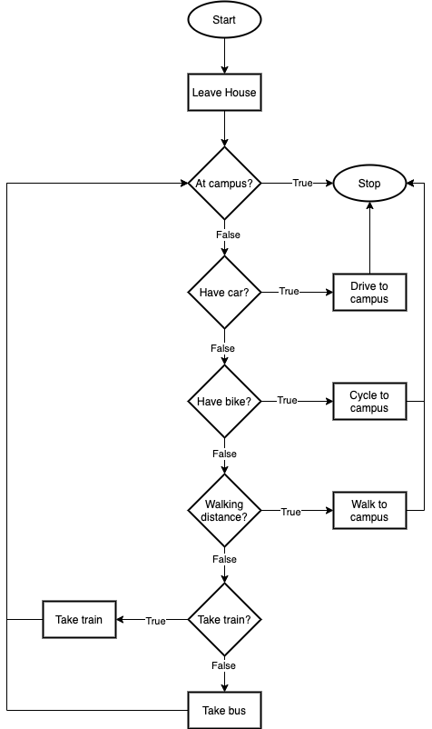

# Software Development 2 Seminar 01 -- An Introduction to Flowcharts

## Introduction

Flowcharts allow visual representation of workflows, logic and algorithms. Flowcharts contain the following elements:

- Sequence of steps -- represented by rectangles.
- Decisions -- represented by diamonds.
- Start and stop -- represented by ellipses.

## Sequence

We want to model a series of steps that take place. For example, let us consider what happens when you arrive at university to attend a class. You enter the campus, walk to the building, swipe in, walk to the room, swipe in, and finally sit down. We can model this as follows:

The **Start** and **End** elements tell us where our logic starts and finishes. In this example, the steps always take place strictly in order -- there is only one route through the diagram.

## Decision

If we only have a sequence of steps we would be very restricted. We can add decision elements to our flowcharts that allow different flows to be followed based on a logical decision. This element looks as follows:

`Condition` defines a test to determine which path to follow. If we return to our previous example of attending a university class, we can add a decision of whether we are entering campus or not based on if we live on campus of not.

## Repetition

Sometimes we need to repeatedly perform an action before we are finished. We can model this using a decision node that causes us to go back in the process flow. It looks something like this:

The decision controls the loop. Depending on the outcome of the check we either loop back or continue.

Now consider our going to class example. It isn't the case that we just swipe once to get into a building or room. Sometimes, we have to swipe again. Let us add that to the flow of control.

We now loop trying to gain access to buildings and rooms -- potentially forever. Humans would give up after a few attempts. A computer won't unless we give it   instructions on when to stop trying.

## Another Example

Let us look at a more complex example, one where we have to travel to campus before going to class. We will have five modes of transport to take: a car, a bike, the bus, the train, or walking.

## Exercises

Draw a flowchart for the following scenarios:

1. When registering a student, their name and address must be recorded, they should be issued with an ID card, and then added to modules.

2. When boarding an airplane each passengers' boarding card must be checked, if the card is not for that flight, they should be denied boarding, otherwise they may proceed. When all of the passengers have been checked a manifest should be printed off.

3. Students sit six modules per year. If any mark is less than 40%, then the student fails that module and will have a resit letter sent to them. If all marks are greater than or equal to 40% then the marks are averaged.

   If the average is greater than 70% they will be awarded a first class degree. If the average is between 60% and 69% they should be awarded a 2:1 degree. If the average is between 50% and 59% they will be awarded a 2:2 degree. And if the average is between 40% and 49% they will be awarded a third class degree.

   All students that are awarded are sent a letter telling them their award.

4. Produce a flowchart to illustrate the process by which a call is handled within the following help desk scenario.

   All calls to the help desk are logged and allocated a call-id. Calls concerning faults in critical systems are passed to critical systems support team, who allocate an engineer. All other faults are passed to the duty technician who allocates them as follows -- printer faults are allocated to the printer technician, applications faults are allocated to a member the applications team and hardware faults are allocated to a member the hardware systems group.

   After a call has been allocated, a response will be sent to the user confirming details of the allocation. When the issue has been resolved, the user will be sent a message asking them to confirm that the issue has been resolved. If it has then call is closed otherwise the call is passed back to the critical systems support team or the duty technician, for reallocation.

   Any call regarding an issue that is not a fault is passed to the help desk supervisor for action.