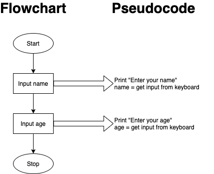
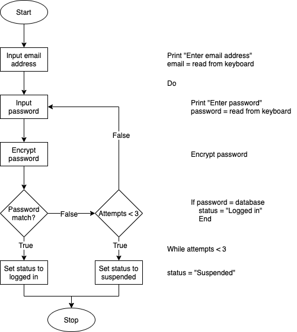

# Software Development 2 Seminar 02 -- Designing Systems Using Flowcharts

## Physical Systems

Flowcharts are good at modelling the flow of activities and the decisions made within a system -- be it a computer system or a business process system. The previous example used getting to class, which is taking system's modelling at a very high-level. A physical system represents a system that is based on real entities (students, buildings, rooms). When designing information systems we may look at systems that have real world elements. However, we are going to focus on designing systems at a lower level. **Remember** -- flowcharts are just one way to design and understand a computing problem. It is just one of many tools available to the software engineer. Flowcharts can be used in a number of ways, and they may also be used as part of other methodologies such as in the Unified Modelling Language (UML) where they are known as activity diagrams.

## Modelling Software Systems

In this module we will use flowcharts as a means of modelling logic that will later be defined as code. Our system boundaries will be our software boundaries, so we do not model anything that does not exist outside our software. Each process or step in our flowchart should represent one logical operation in our program. For example, if we ask someone for their name and age, this would translate as follows:

Note that the activities are also easy to express as pseudocode. We will ensure our flowcharts can be expressed in pseudocode from now on.

Let us now use a flowchart to design the *flow of control* within our programs. Let us take a more complex example:

> A user will be asked for an email address and password, the password will then be encrypted and compared to the encrypted password held in the database. If the passwords match the user's status is set to 'logged in', if the password has not been entered correctly after 3 attempts then the user's status will be set to 'suspended'.

This is actually typical of a specification given for software. Before we try and draw the flowchart let us highlight the key information from the specification:

> A user will be **asked for an email address and password**, the **password will then be encrypted** and compared to the encrypted password held in the database. If the passwords match the user's **status is set to 'logged in'**. If the password has not been entered correctly after 3 attempts then the user's **status will be set to 'suspended'.**

The highlighted text represent statements (normally sentences that contain a verb). We can extract these statements from the specifications and draw up a list of operations:

- Input email address.
- Input password.
- Encrypt password.
- Compare to password in database.
- Set status to logged in.
- Set status to suspended.

We've separated some of the statements into two operations and reworded them to make sense. Each of these operations can be written in a couple of lines of pseudocode.

We also not that there is a decision to be made:

> A user will be asked for an email address and password, the password will then be encrypted and **compared to the encrypted password held in the database**. If the passwords match the user's status is set to 'logged in', if the password has not been entered correctly after 3 attempts then the user's status will be set to 'suspended'.

- Password same as database.

There is also a loop:

> A user will be asked for an email address and password, the password will then be encrypted and compared to the encrypted password held in the database. If the passwords match the user's status is set to 'logged in', if the password has not been entered correctly after **3 attempts** then the user's status will be set to 'suspended'.

- Attempts < 3

Note that some of these activities will actually require several steps, such as `Encrypt Password`. Later, we will break our activities down further so we can match activities with small groups of statements -- or functions.

## Exercises

1. Modify the password example so that when a user has entered a wrong password they have the option to have a new password emailed to them. If this option is selected a new password will be generated, the password will then be sent out in an email to the user and then encrypted and stored in the database.

2. The system designed as part of the previous question is not secure enough, when a new password is emailed to a user their status should be changed to 'newpw' and they should then be logged out. When a user logs in successfully, if their status is 'newpw' they should then be invited to change their password. A new password must be entered twice, the passwords will then be validated as follows; both passwords match, password length >8 character and password contains at least one number. If the validation fails then an appropriate error message should be displayed and the user invited to enter the passwords once more.

3. Consider the following specification and flowchart

   > A central heating design system will allow the engineer to input details of each room in a house. For each room the engineer will enter the length, width and height. If the room has external walls they will enter the length of external wall. They must select the window type of each room (from single glazed, double glazed or none), if single or double glazed is selected then the window area should be entered. For each room the system will calculate and print the radiator capacity. After the details of each room have been entered the engineer will be asked if they wish to enter another room. When all of the rooms have been entered then the system will calculate and print the boiler capacity.

   

   Produce pseudocode for the system.

4. Consider the following specification for part of an online auction system.

   > Once the user has accessed the web page with details of the item that they wish to bid on the wil be presented with a bid button. Pressing the bid button causes a dialog to be displayed requesting the amount to bid. If the user enters an amount <0 or non numeric an error message should be displayed and the dialog displayed again. Once a numeric amount has been entered the amount should be compared to the current price, if the new amount is higher then highest bidder should be set to the current user. If the amount entered is <= the current price then a message should be displayed inviting them to bid again by clicking on bid. If the bid button is pressed and there is no user logged in, then the user will be redirected to the login page.

   Produce a flowchart describing the actions of the system when the Bid button is clicked.

5. An on line banking application allows users to perform a number of operations on their bank account. The following description covers the actions of the system once the user has logged in and selected an account.

   > A menu will be displayed with the options Show Balance, Show Transactions, Transfer Money and home. The options will work as follows:
   >
   > - Show Balance will retrieve the balance from the database and display it on the page.
   >
   > - Show transactions will retrieve a transaction from the database and display it on the page, this will continue until there are no more transactions to display.
   > - Transfer money, will prompt the user for the sort code and account number of the account they are transferring to. It will then ask for the amount. If the amount is <= 0 then the user will prompted again. Once an amount has been entered then the details of the transfer will be displayed (Account details and amount) and the user will be asked to confirm that they want the transfer to go ahead. If they confirm that the transfer is to go ahead then the transfer details will be sent to the bank's main server.
   > - Home will redirect the user to the bank's home page.

   Produce a flowchart that describes the displaying of the menu and the actions of the four options.

