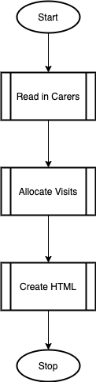
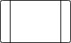
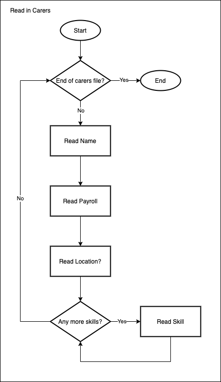
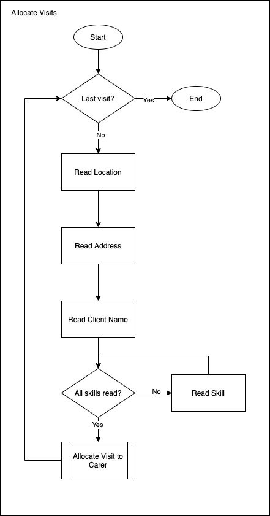

# Software Development 2 Seminar 03 -- Software Design Using Flowcharts

## Design

As we discussed previously we are using flowcharts to help design the flow of control within our software. Designing the flow of control is an area many students struggle with when they start studying software development. We are using flowcharts to help you understand the concept via a visual process.

Our development process will take three steps:

1. Draw the flowchart.
2. Produce pseudocode form flowchart.
3. Translate pseudocode into program code.

## Functional Decomposition

We can use a flowchart to design the flow of control of an application. However, we may sometimes face a complex problem that is hard to break down into a simple flowchart. One method to make this easier is [functional decomposition](https://en.wikipedia.org/wiki/Functional_decomposition) (sometimes called *algorithmic decomposition*). Decomposition is the gradual breaking down of something into its component parts. For software development, that means breaking down our high-level problem into smaller sub-problems until we can solve those sub-problems. For instance, consider the following specification:

> A system is required to build work schedules for care workers. The system should first load the details of the available carers from a text file. Each carer has a name, payroll number, a base location (the coordinates of where that worker is based) and a number of skills. Each skill is a single word representing a skill/qualification held by that person. The system will then load a diary file. Each entry comprises the location of a visit (given as coordinates), the address, the name of the client and details of any skills required. Each visit is allocated to a carer. Each visit is allocated to the nearest carer (based on the coordinates of the previous visit of base location if it is the first visit) who has matching skills. Once all of the visits have been allocated an HTML file is created that shows the work schedule for each carer.

The specification suggests a complex piece of software -- one with more than one method. Let us first produce a top-level design.



We have decomposed the problem into three processes which we can now consider separately. Each of these processes is a subprocess. Note that we use the following symbol:



to denote that the process is a subprocess. Let us create the first subprocess that reads in the carers information.



We can then produce the pseudocode as follows:

```pseudocode
BEGIN Main
    Read_In_Carers()
    Allocate_Visits()
    Create_HTML()
END

BEGIN Read_In_Carers
    WHILE NOT end of Carers File DO
        Read Name
        Read Payroll
        Read Location
        WHILE more skills DO
            Read Skill
        END WHILE
    END WHILE
END
```

Decomposition has allowed us to reduce our problem into a series of easily understood subprocesses. There are a few guidelines you may find useful:

- The subprocess name should reflect its purpose.
- The subprocess should only undertake one task (reflected in its name).
- Further subprocesses can be used to break down a subprocess if it is too long.

Returning to our example, allocating visits will include a further subprocess.



## Exercises

1. Produce a flow chart for the sub method *Allocate Visit to Carer*. This method must consider each carer in turn. If the carer has all of the skills associated with the visit take note of the distance value between the carer and the visit. Allocate the visit to the carer with the smallest distance value.
2. Produce a flowchart for *Create HTML*. Don't worry about HTML formatting at this stage.
3. Produce pseudocode for the entire system.