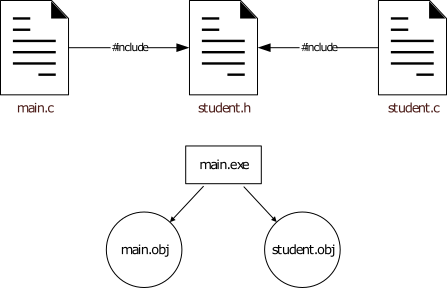

# Software Development 2 Lab 05 -- Pre-processor

We have now covered how data is represented on the machine when working with C.  Let us now look a bit more into how code is generated and how we break our code up into separate files.  We are going to move onto developing larger and larger applications from now on as we will be able split our code up accordingly.  First, we need to look into what is known as the *pre-processor*.

## The Pre-Processor

The pre-processor is a part of the code generation step that occurs when working with C based languages.  The pre-processor runs before the main compilation as it changes the file that needs to be compiled.  It can do this in a number of ways, some of which are compiler dependant.  The pre-processor commands we will look at are fairly standard, so will work on any compiler (more or less).

We can now re-imagine our compilation step as follows:

*pre-processor* **&rarr;** *compiler* **&rarr;** *linker*

This means we can consider the code generation going through the following stages:

*Original C* **&rarr;** *Pre-processed C* **&rarr;** *Assembly* **&rarr;** *Object Code* **&rarr;** *Executable*

Pre-processor lines are denoted with the hash sign (`#`).  You should notice that we have already been using pre-processor commands - our `#include` statements are such commands.  We will look at what these do shortly.  First, we will look at what happens when we define values and perform conditional compilation.

### Some Pre-Processor Commands

Before looking at our first application using pre-processor commands let us look into some pre-processor commands.  These statements allow us to control some of the compilation of our program in particular ways.  It is in fact very common to see pre-processor commands in C and C++ code.

The first pre-processor command we will look at is `#define`.  This command allows us to define values which we can then use in our code.  The pre-processor will replace any use of the defined name with the given value. 

```c
#define TEST
#define NUMBER 1234
#define NAME "Kevin"
```

On line 1 we define `TEST`.  There is no value associated with this definition.  If we were to use it in code it would be replaced with nothing.  Line 2 defines `NUMBER` and assigns it the value 1234.  Any time the pre-processor encounters `NUMBER` it will replace it with 1234.  Finally, line 3 defines `NAME` and assigns it the value `"Kevin"`.

Let us look at how this affects the code we write. Here is an example application using `#define` before the pre-processor is run across it.

```c
// Pre-processor will replace NAME with "Kevin"
char *student_name = NAME;
// Pre-processor will replace NUMBER with 1234
unsigned int student_matric = NUMBER;
```

During compilation, the pre-processor is the first stage to run.  It looks at the `#define` statements and uses them to modify the code to be compiled.  This generates the actual code that the compiler compiles.

```c
// Actual line compiled
char *student_name = "Kevin";
// Actual line compiled
unsigned int student_matric = 1234;
```

It is just a straight swap.  There is no checking of code to see if it is correct by the pre-processor.  It simply modifies any place it finds a defined value and replaces it accordingly.  The compiler is where the check is made to ensure that the code is correct.

Another use of defined values is in performing conditional checks and compiling different code accordingly.  This is a very powerful feature of the pre-processor, allowing you to write code that, for example, can target different platforms.

```c
#ifdef TEST
printf("Test defined\n");
#else
printf("Test not defined\n");
#endif
```

In this example different code is produced by the pre-processor based on whether or not `TEST` is defined.  This means different code is compiled based on the defined values.  The following table illustrates the different code compiled based on whether or not `TEST` is defined.

| **Defined Value**  | **Code Compiled**               |
| ------------------ | ------------------------------- |
| `TEST` defined     | `printf("Test defined\n");`     |
| `TEST` not defined | `printf("Test not defined\n");` |

There are a number of different pre-processor commands.  We will use a couple of these in the module.  The following table describes the most common pre-processor statements.

| **Pre-processor Command** | **Description**                                              |
| ------------------------- | ------------------------------------------------------------ |
| `#include`                | Includes (adds) code from a header file to the code file as part of the code to be compiled. |
| `#define`                 | Defines a values which is then replaced in the code file when found, or used for conditional compilation. |
| `#undef`                  | Undefines a value. Removes a previous `#define`.             |
| `#if`                     | Used to check a value of a defined pre-processor value.      |
| `#ifdef`                  | Used to check if a value has been defined.                   |
| `#ifndef`                 | Used to check if a value has not been defined.               |
| `#else`                   | Used with `#if`, `#ifdef` and `#ifndef`.                     |
| `#elif`                   | An *else-if* statement.                                      |
| `#endif`                  | Ends a pre-processor if block.                               |
| `#pragma`                 | Tells the compiler that the rest of the line contains instructions.  These are generally compiler specific, but we will look at one that is fairly cross compiler |

## Creating a Header File

The real reason we have been looking at the pre-processor is so that we can start understanding what a header file is.  You've been using header files since our very first application (for example `stdio.h`), but our description has been a little vague.  A header file is essentially a collection of previously written code (normally just declarations -- more on this later) that we want to include in our own code.  It can contain any standard C statement or declaration -- it essentially allows us to separate our code into different.

Let us start by declaring a new header file.  **Create a new file called `hello.h`:**

```c
#pragma once
// This file needs to know what printf is
#include <stdio.h>

void hello_world()
{
	printf("Hello world!\n");
} 
```

> **What is `#pragma once`?**
>
> We already mention the `#pragma` command is an instruction to the compiler and/or linker.  The `#pragma once` statement is used to tell the compiler to only include the header file once.  This is actually quite important.  If a header is included more than once, then the functions and other declarations in the header are also added twice.  This leads to a compilation error.
>
> `#pragma once` is a technique to ensure a header is only included once.  Another technique is to use *header guards*.  A header guard used conditional compilation to ensure that the header is only included once.  An example is shown below:
>
> ```c
> #ifndef HELLO_HEADER_GUARD
> #define HELLO_HEADER_GUARD
> 
> // Code defined here...
> 
> #endif
> ```
>
> When the header is first included, the `#define` is encountered, meaning the `#ifndef` can only be true once.  This technique does require more code (and thinking of different header guard defines for each header file), but is technically more platform independent and portable.  This is because `#pragma once` is not an official part of the C standard.  However, pretty much every compiler supports it.

Now that we have created our header file we can create our main application file.  **Enter the code below in a new C (a `.c`) file called `hello.c`.**

```c
// Include the hello header.  Note the use of quotes this time
#include "hello.h"

int main(int argc, char **argv)
{
	hello_world();
  return 0;
}
```

As you can see, our main application just calls the `hello\_world` function defined in our header file.  Essentially our application is the same as our original *Hello World* application.

Compile the program as normal.  The header file is automatically included (as it was when we included other header files).  The pre-processor generates a single code file for the compiler which takes the following form:

```c
#include <stdio.h>

void hello_world()
{
	printf("Hello world!\n");
} 

int main(int argc, char **argv)
{
	hello_world();
  return 0;
}
```

> **What about `stdio.h`?**
>
> The code listing above isn't truly what the pre-processor generates.  The `stdio.h` file is also added at the top.  However in the Microsoft C library this file is over 700 lines of code long.  Hence we haven't included it here.

> **Declaration Order**
>
> Declaration order is an important concept in most languages, but especially in C and C++.  In languages such as Python, Java and C\#, methods and functions and be declared in separate files and the compiler will work it all out for you.  In C and C++ you have to ensure that something is declared before you use it.  This means that sometimes you have to specify that a function or `struct` exists before you explicitly define what it is.  In this module we won't encounter this requirement specifically, but you should be aware of this requirement if you carry on through C and C++ programming.

If you run this program you will get the same output at the standard *Hello World* application.

## Makefiles

Up until this point, your program building and running has been relatively simple. **The real world doesn't work like that**. You have to get used to managing build and execution configuration files. We will introduce you to this idea in this module via makefiles.

A makefile is a handy method of building applications by containing all the necessary instructions in a single file, rather than typing them in the command line each time.

Visual Studio Code does not fully support makefiles yet, although Microsoft have feature development to support it. You can download this now. To do so, follow the installation instructions [here](https://github.com/microsoft/vscode-makefile-tools). We will cover this in class.

Once installed, you should create a `makefile` (note -- no filename extension) file in Visual Studio Code.

### Simple Makefile

Below is a simple `makefile` to build our `hello.c` file:

```makefile
hello:
	cl hello.c
```

**NOTE -- if you are using MacOS replace `cl` with `clang`. If you are using Linux, replace `cl` with `gcc`.**

The `makefile` declares a new build target -- `hello` -- which is built by invoking `cl hello.c`.

We can now call `make` stating we want to undertake the `hello` build.  We do this as follows:.

```shell
make hello
```

And it is as simple as that.  You might be asking yourself *what is the point in that?*.  Well, we can perform more than one instruction as part of the build, and it also allows us to store our build configurations in a file so we don't have to remember how to perform the build.  This will become important as we build more complex applications. **You should start writing make files from now on.**  In fact, you are required to use them for your assessment.

## Example -- Student Details

Let us now build an example that uses separate code files.  For this we will revisit our student example.  First, let us define our `student.h` header file:

```c
#pragma once

// A structure representing a student
struct student
{
    unsigned int id;
    char *name;
    char *address;
};

// Declaration of print student method - not implementation
void print_student(struct student s);
```

Note the use of `#pragma once` again.  Otherwise we have two declarations.  The first is a `struct student`.  The second is the `print_student` function.  Here we are just declaring the function.  We have provided no implementation detail.  This is in the `student.c` code file:

```c
#include "student.h"
#include <stdio.h>

void print_student(struct student s)
{
    printf("ID: %d\n", s.id);
    printf("Name: %s\n", s.name);
    printf("Address: %s\n", s.address);
}
```

Our implementation file just contains the details of how we implement `print\_student`.  It includes the `student.h` and `stdio.h` header files.  Otherwise we are just implementing the same code as before.

Finally our main application file is as follows:

```c
#include "student.h"

int main(int argc, char **argv)
{
    struct student s;
    s.id = 123456;
    s.name = "Kevin Chalmers";
    s.address = "University of Roehampton";
    print_student(s);
    return 0;
}
```

This is just the same `main` as we developed before.  Notice that we have only included the `student.h` header file.

To understand what is happening now when we build the application examine the figure below.  At the top of the figure is our `student.h` file acting as a bridge between our `main.c` and `student.c` files.  Underneath this is the how the two generated `obj` files are linked together to form the main application.



### Exercises

1. Compile and build the new version of the student application.  You will need to create a `makefile` entry that uses the line `cl student.c main.c` (or with `clang` or `gcc` as appropriate).
2. Determine what the two code files would look like after the pre-processor pass. This gives you an idea of how the implementation details are separate with the header file acting as a bridge.

## File Input and Output

Let us look at the key ideas of file I/O in C:

- Read in data from a file.
- Write data to a file.

This may be a new concept to some of you -- how we go about reading and writing files.  In C, the principles are actually similar to working with reading and writing from the command line.  We are just going to perform the actions with a file.

File I/O is another fundamental part of computing.  It forms two-thirds of a high level view of an application:

*Input* **&rarr;** *Process* **&rarr;** *Output*

We will look at both input and output over the next two sections.  Let us first look at how we open a file.

### Opening a File

To open a file in C we use the `fopen` function.  This will return a `FILE*` (pointer to a `FILE`).  The call requires a filename and a mode.  The filename has to be a correct filename in the system relative to the place where the executable is run (for our purposes the same folder).  `fopen` is illustrated below.

```c
FILE *file = fopen("filename", "mode");
```

The `mode` value is a string telling C how to open the file.  There are a few different methods of opening a file.  The table below describes the different methods.

| **Mode** | **Description**                                              |
| -------- | ------------------------------------------------------------ |
| `r`      | Opens the file for reading.                                  |
| `w`      | Opens the file for writing. Existing files with the same name are overwritten. |
| `a`      | Opens the file for appending (writing at the end). Will not discard existing file contents. File seeking operations are ignored. |
| `r+`     | Opens the file for reading and updating.                     |
| `w+`     | Opens the file for reading and updating. Overwrites the existing file. |
| `a+`     | Opens the file for reading and updating at the end. Will not discard contents. File seeking operations are ignored. |
| `b`      | Opens the file as binary rather than text.                   |

#### Opening a File for Text Reading

We are going to read a text file. We do this as follows:

```c
FILE *file = fopen("filename", "r");
```

#### Reading a Text File

Let us now write a test application to open a text file, read it in, and then print it.  To do this we will also write a function that will read in a file and return the amount of data read. The code for our test application is below.  We will explain the new parts presently.

```c
#include <stdlib.h>
#include <stdio.h>
#include <string.h>

// Reads in a text file
char* read_file(char *filename)
{
    // Open file for reading
    FILE *file;
    file = fopen(filename, "r");
    // Move to the end of the file
    fseek(file, 0, SEEK_END);
    // Find out file position
    long size = ftell(file);
    // Rewind back to the start
    fseek(file, 0, SEEK_SET);
    // Allocate memory for that number of values + 1
    char *data = (char*)malloc(size + 1);
    // Read in data
    fread(data, sizeof(char), size, file);
    // Set final byte of memory to null terminator
    data[size] = '\0';
    // Return data
    return data;
}

int main(int argc, char **argv)
{
    // Read in file
    char *data = read_file("test.txt");
    // Print
    printf("%s\n", data);

    // Free the allocated memory - otherwise a memory leak! (very bad)
    free(data);
    
    return 0;
}
```

> **Allocating Memory**
>
> We used two new functions in this example -- `malloc` and `free`.  `malloc` (Memory ALLOCation) creates a block of memory for us to use. This is required as we don't know the number of values we require to store the file contents.  We therefore use `malloc` to create the memory block.  `malloc` requires just one value -- the amount of data (in bytes) we need to allocate.  
>
> `malloc` returns a pointer to the memory location it has allocated memory at.  This pointer is of type `void` (so we have a `void*`).  This means that the type of memory is undefined (it is just a block).  We cast it to a pointer to `char` (a `char*`) to set the `data` value.
>
> The other function we have used is `free`.  This releases any allocated memory once we have finished with it.  **This is very important!**.  Let me repeat that -- **THIS IS VERY IMPORTANT!**.  If you do not free your allocated memory it cannot be used, leading to memory leaks.  Over time, this could lead to your application running out of memory.  Ensuring you free your allocated memory is an important consideration in C and C++ (there is no garbage collector like in Python, Java and C\#).  We will spend an entire unit exploring this concept.

> **`fread` and `fclose`**
>
> We have two other functions for working with files.  The first is `fread`.  This reads in data from a file.  It takes the following parameters:
>
> - the memory location to read the file into
> - the size of the data type being read in (e.g., `sizeof(char`))
> - the number of values of the data type to read in
> - the file to read in from
>
> Points 2 and 3 above provide us with the amount of data to read in (the size of the type times the number of values).
>
> The second new function we used was `fclose`.  This closes the file. **You should always close your files after you have finished with them!**.  If you don't close the file you can cause system conflicts.  If you are writing to a file, you may lose the information sent to the file when the application exits.  The application *will not* automatically push the contents to the hard drive, even on exit.  Therefore data can be lost.

#### Exercise

Create a text file in the same folder as your program called `test.txt` and add some text to it. Then, compile and run the program to ensure you know it works.

### Writing Text Files

Let us extend the previous version of the application now to also save the data in a text file.  The following code will accomplish this for you.  You should hopefully understand what is meant by a text file by now.

```c
#include <stdlib.h>
#include <stdio.h>
#include <string.h>

// Reads in a text file
char* read_file(char *filename)
{
    // Open file for reading
    FILE *file;
    file = fopen(filename, "r");
    // Move to the end of the file
    fseek(file, 0, SEEK_END);
    // Find out file position
    long size = ftell(file);
    // Rewind back to the start
    fseek(file, 0, SEEK_SET);
    // Allocate memory for that number of values + 1
    char *data = (char*)malloc(size + 1);
    // Read in data
    fread(data, sizeof(char), size, file);
    // Set final byte of memory to null terminator
    data[size] = '\0';
    // Return data
    return data;
}

void write_file(char *filename, char *data)
{
    // Create file
    FILE *file;
    file = fopen(filename, "w");
    // Find the length of the string
    long len = strlen(data);
    // Write len bytes to the file
    fwrite(data, sizeof(char), len, file);
    // Close the file
    fclose(file);
}

int main(int argc, char **argv)
{
    // Read in file
    char *data = read_file("test.txt");
    // Print
    printf("%s\n", data);
    // Write the output
    write_file("output.txt", data);

    // Free the allocated memory - otherwise a memory leak! (very bad)
    free(data);
    
    return 0;
}
```

>  **`fwrite`**
>
> We used `write` as a command here.  This works exactly as `fread` but in reverse, writing data to the file rather than reading it in.

### Exercise

Compile and run this program and ensure it outputs the text to the file `output.txt`.

## Command Line Parameters

For our final application let us examine the two values that we declare for our main application -- `argc` and `argv`.

`argc` provides a count of the number of command line arguments that have been passed into the application.  It is an integer value that provides information about its partner value -- `argv`.

`argv` is an interesting parameter.  Its type is `char**`, or a pointer to a pointer to `char`.  If you remember from our work on strings, we defined a string as a `char*`.  We also defined an array of `char` as a `char*`.  A `char**` can be considered as an `array of strings`.  `argc` tells us how many strings we have.  As the strings are null-terminated, we can use `strlen` to get the length of each string if we want.  The following image illustrates the idea:


As an example of working with the command line arguments, try the following (fairly short) application.

```c
#include <stdio.h>
#include <string.h>

int main(int argc, char **argv)
{
	// Loop for number of arguments
	for (int i = 0; i < argc; ++i)
	{
		printf("Argument %d: %s\n", i, argv[i]);
	}
	printf("All arguments printed.\n");
	
	return 0;
}
```

Running this application (let us assume you have called it \texttt{command-line}) provides the following output:

```shell
command-line hello world programming fundamentals
Argument 0: command-line
Argument 1: hello
Argument 2: world
Argument 3: programming
Argument 4: fundamentals
All arguments printed.
```

Notice that the name of the application is argument 0.  This does depend on the operating system running the application.  Windows provides the name as an argument.  This is worth remembering.

## Exercises

We've covered a lot of ideas in this unit and you should go through it again to ensure you are comfortable of, and understand the, concepts discussed.  File reading we will return to in C++ (where our life gets a little easier).  So there is only a one exercise here.

- Write an application that prompts the user for a name and writes it to a file as text.  Each name should be on a new line.  The application should continue asking for names until END is entered. You may find `fprintf` useful here.
  