# Software Development 2 Lab 05 -- Debugging

<script src="https://cdn.jsdelivr.net/npm/code-line"></script>
<script>CodeLine.initOnPageLoad({toggleBtn: {show: false}, copyBtn: {show: false}})</script>

<link rel="stylesheet" href="/module-content/css/block.css">

In this lab, we will explore **the most important skill a programmer can learn -- DEBUGGING.** Debugging will enable you to explore your code, find issues, and follow a workflow that involves experimenting until you find the issue with your code. **Start practising this skill now.**

## Starting Program

**Create a new project in Visual Studio using the starting code below.**

```c
#include <iostream>

using std::cout;
using std::endl;

int sum_digit(int num)
{
    int sum = 0;
    int rem;
    while (num > 9)
    {
        rem = num % 10;
        num /= 10;
    }
    sum += num;
    return sum;
}

int main(int argc, char** argv)
{
    int res = sum_digit(1223);
    cout << "The sum of digits " << res << endl;
    return 0;
}
```

This function `sum_digit` should sum all the digits that make up a number. For example:

- `sum_digit(5)` = 5
- `sum_digit(10)` = 1
- `sum_digit(13)` = 4
- `sum_digit(1223)` = 8

**Run this program in Visual Studio and check the output.** Note the output from our application:

```shell
The sum of digits 1
```

This is not the correct answer for our `sum_digit(1223)` which should be 8. Let us try and work out what the problem is.

### Breakpoints

We need to determine where the problem is. At the moment, we don't know anything about where our problem is. So let us just step through the code one line at a time.

Debugging works by setting breakpoints -- lines of code that we want the computer to pause waiting for us to say when to continue on.

**To set a breakpoint we left-click just to the left of a line in Visual Studio. Do this now for line 21 (the first line of main).** A red dot will appear next to this line as shown below.

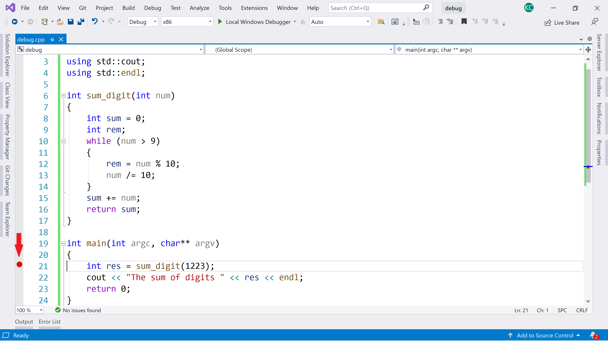

Now let us run our application again. **Click the small green triangle for *Local Windows Debugger*.** The image below illustrates the area. Your application will start to run again.

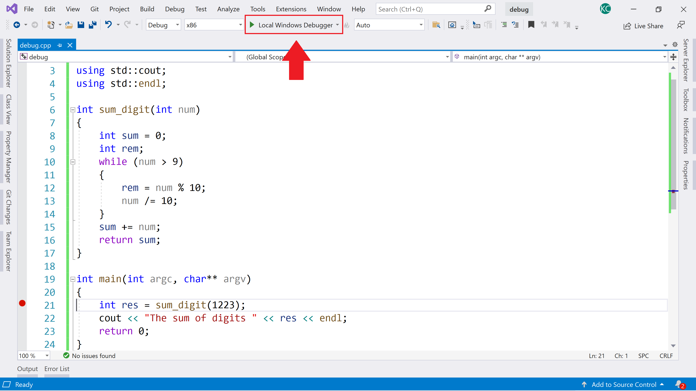

Your Visual Studio Code window will change to the one below. We've highlighted two points of interest.

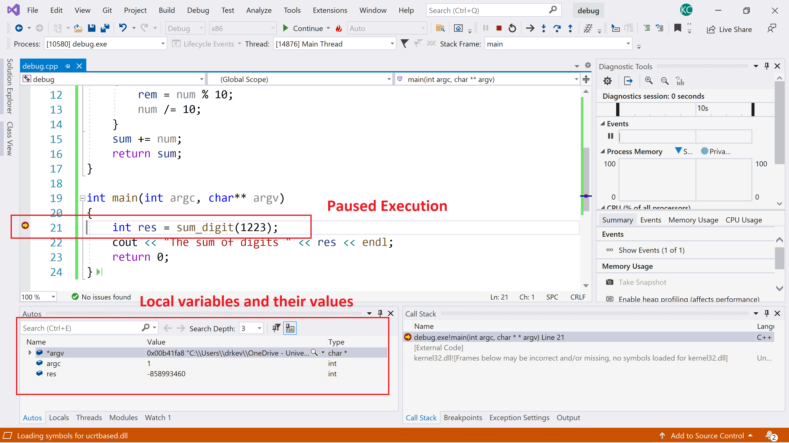

On the bottom-left you will see the local variables and their current values. In `main`, only three variables are used -- `arc` and `argv` (the parameters passed into the program when it was started), and `res` where we store the result of `sum_digit()`. **Note that as `res` is uninitialised it has a value based on what was already in memory**. Above it is `-858993460` but it could be anything.

We've also highlighted the current line where the execution is paused. This is currently the line which we put a breakpoint on.

At the top of the window, the following buttons will have appeared.

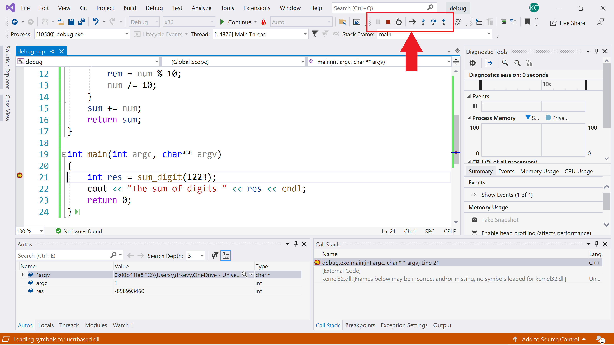

These buttons are (from left-to-right):

- **Pause** -- can cause a running programming to pause. We won't be looking at this.
- **Stop** -- stops the program execution.
- **Restart** -- will restart the program execution.
- **Next statement** -- shows the next statement that will be executed. Can be useful but we won't be using it in this module.
- **Step into** -- if the current line of code calls a function, pressing this button will cause the computer to enter this function. So, this will not execute the line of code if a function is present, but jump into the function.
- **Step over** -- will step over the line of code currently paused on, executing it on the way. Basically, it executes the current line of code.
- **Step out** -- if the current line of code is within a function, pressing this button will complete the function and return to the calling line of code.

Let us now execute the current line of code. **Press the step over button. It is the one illustrated below.**


Notice your Visual Studio screen has updated as below:

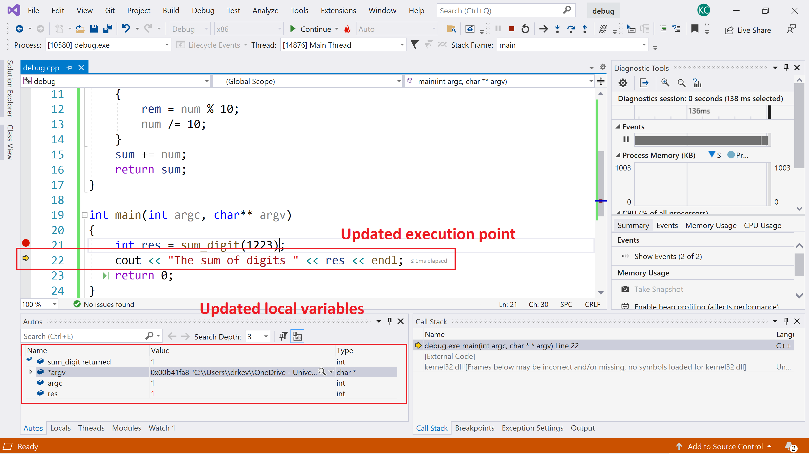

- Execution has moved onto the next line of code. We have completed the call to `sum_digit`.
- The variables have been updated. **Note that `res` is 1. We know this is wrong. `res` should be 8 after we call `sum_digit`**.
  - Also not that we can see `sum_digit_returned`.

So we now know the problem is within `sum_digit`. **Restart the execution by pressing the restart button, which is illustrated below.**


This time, we will step into the `sum_digit` function. **Press the step into button now. It is illustrated below.**


Your screen will be updated to the following. There are three points of interest:

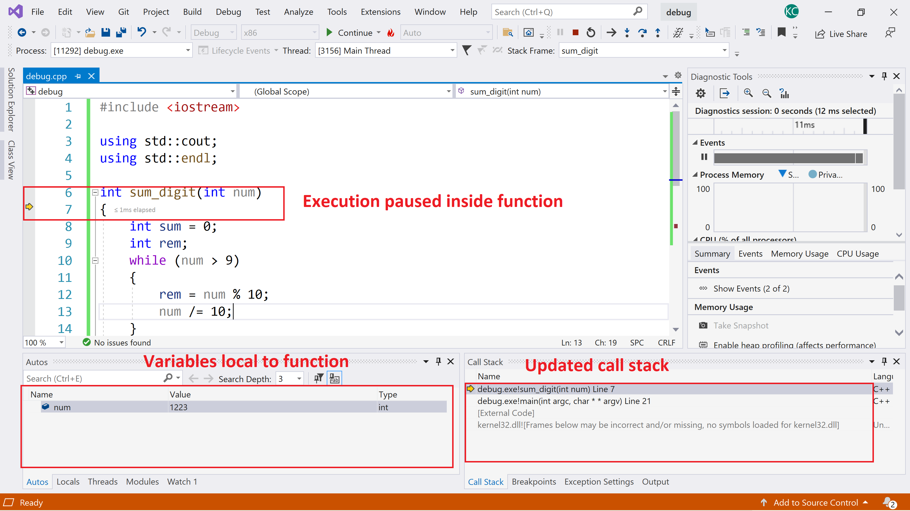

- The variables section in the bottom-left has been updated to the local variables in the `sum_digit` function. Currently it has one value:
  - `num` -- the parameter passed into `sum_digit`. This is 1223 at the start.
  
- The execution is now paused on line 7 which is the start of `sum_digit`.
- The **call stack** is updated. The call stack is the list of function calls that has led to where we are right now in the program execution. The top item is the current function. Currently there are eight functions called, but most of these are from the operating system. **This will be different depending on the system you are running your program from.** Starting from the bottom:
  - `kernel32.dll` is part of the Windows 10 operating system. This is the 32-bit kernel mode in the operating system. There are also many functions in this library.
  - `[External Code]` is code that was built into the program to help it run in Windows.
  - We get to our own code. `debug.exe!main` is the debugger executing our `main` function. It is running Line 21 which is the line we put our breakpoint on.
  - `debug.exe!sum_digit` is the current function being executed -- `sum_digit`. This is running on Line 7.

So we now know that our function seems to be starting correctly. 1223 is being passed in as a parameter. Let us finish the function. **Click the Step Out button now. It is illustrated below.**


Your application will now return to the main function. **Next press the Continue (below) button to run the application to completion. Close any terminal windows that have opened.**

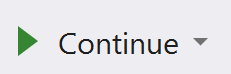

**Start the application again by clicking on the Green Triangle with Continue at the top of the Visual Studio window.**

Your application will pause at the breakpoint. **Now do the following actions to get to the start of the `while` loop:**

- **Step Into**.
- **Step Over twice.**

Your Visual Studio window should look like the following, with execution paused at the start of the `while` loop.

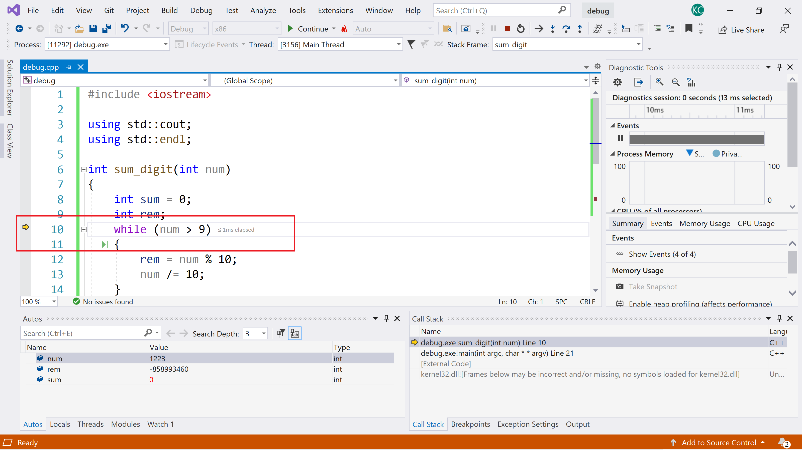

Let us now step through one iteration of the loop and see what happens. **Step Over three times to pause your code at the end of the loop as illustrated below.**

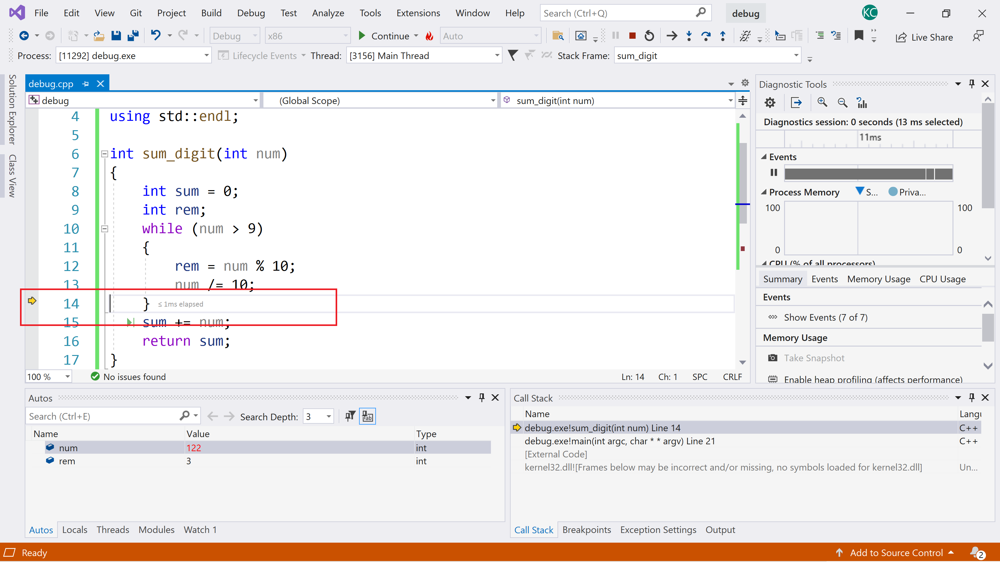

**Now look at your variables.** They should be:

- `num` 122
- `rem` 3

OK, `sum` didn't change. That is our bug. We've been stupid and forgotten to update `sum` during the `while` loop. Let us fix that now. **Press the Stop button to stop running the program. It is illustrated below.**

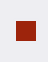

**Fix the `while` loop by adding the line `sum += rem;`. See below for where to add it.**

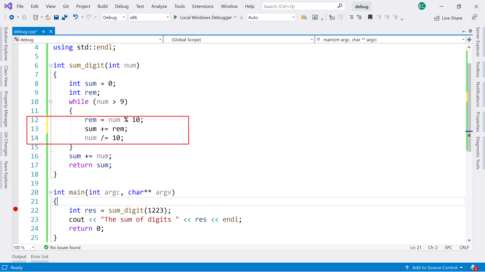

**Now restart the program and step through again until the end of the first iteration of the `while` loop. See below as an example of the Visual Code window.** Notice now that `sum` is updating. **Use Continue to run the application to completion and check the output is correct.**

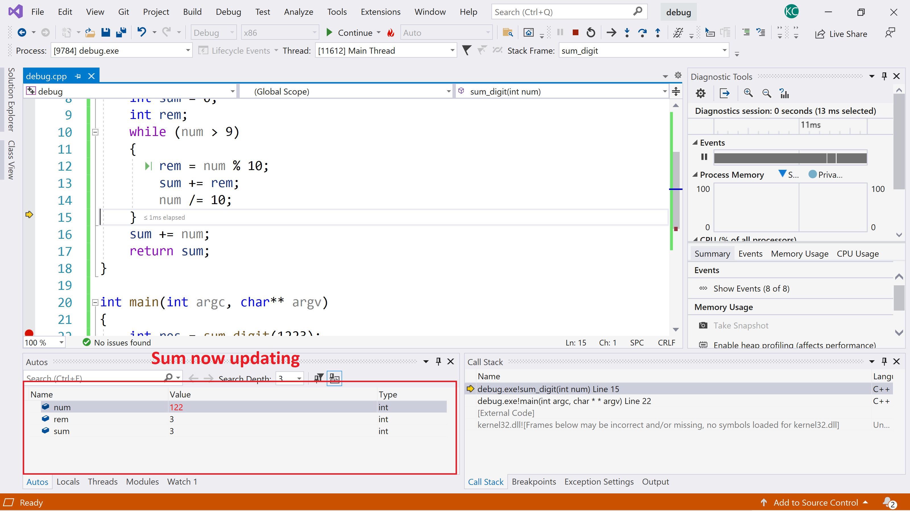

**Left-click on the breakpoint to remove it and test the application with different numbers for `sum_digit` to check it is working.**

### General Debugging Workflow

Our general debugging workflow is as follows:

1. Run application and find there is an error.
2. Set a breakpoint as close to where you know the error is. If you don't know, use the start of the application.
3. Step through the program trying to find where the error is occurring. Use Step Over initially until you find which function the error is occurring.
4. Set new breakpoints closer to where the problem seems to be.
5. Repeat steps 3 and 4 until you find where the bug is.

### Exercise

Find where the bug is in the following application. It generates the factorial of an input from the user. For example:

- Factorial(1) = 1
- Factorial(2) = 2 * 1 = 2
- Factorial(3) = 3 * 2 * 1 = 6
- Factorial(4) = 4 * 3 * 2 * 1 = 24

```c
#include <iostream>

using std::cout;
using std::cin;
using std::endl;

int main(int argc, char **argv)
{
    int num;
    int total;
    cout << "Enter the number: ";
    cin >> num;
    for (int i = 1; i < num; ++i)
    {
        total = total * i;
    }
    cout << "The factorial of " << num << " is " << total << endl;
    return 0;
}
```

## Advice

Programming is a bit of a lifestyle choice. To be a good programmer, you need to put a lot of hours of practice in. That means working through tutorials, fixing your errors, and training yourself in the skill of programming. Debugging really helps here. You should be spending 10-20 hours outside class practicing programming. It is a key skill in computer science, and you will find we will be moving much faster in what we expect you to achieve from now on.