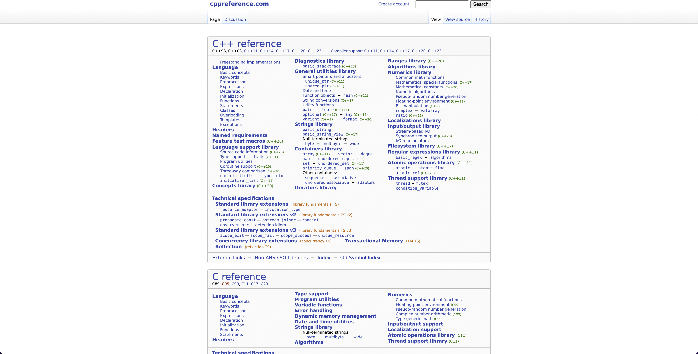
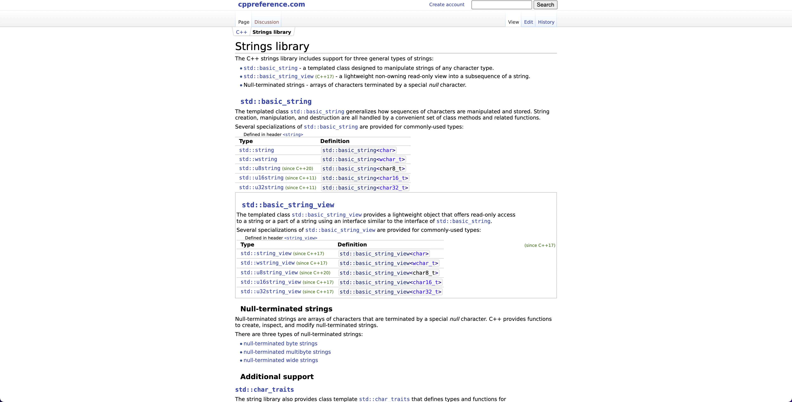
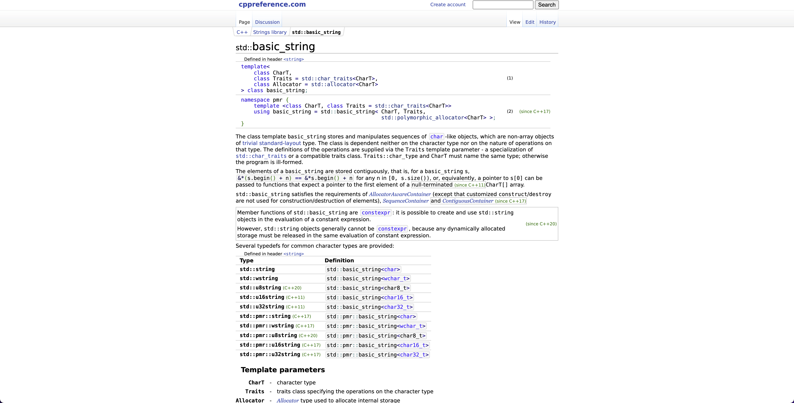
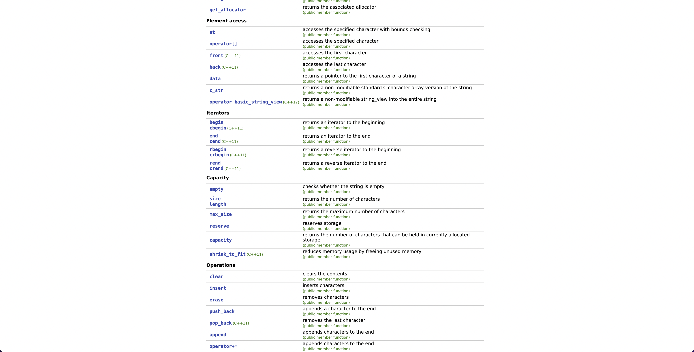
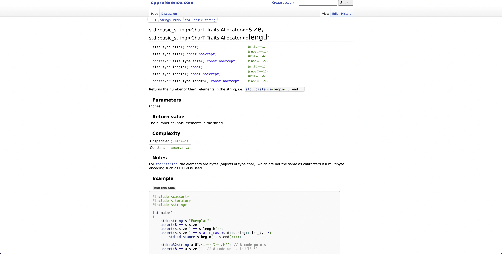

# Software Development 2 Lab 06 -- Documentation

<script src="https://cdn.jsdelivr.net/npm/code-line"></script>
<script>CodeLine.initOnPageLoad({toggleBtn: {show: false}, copyBtn: {show: false}})</script>

<link rel="stylesheet" href="/module-content/css/block.css">

In this lab, we will explore how to read and write programming language and library documentation. You need to take your time learning these skills. As you progress through your studies, you will have to take more ownership of solving particular programming problems that you have, and when you enter industry you will have to solve these problems by yourself. We are starting your journey on building those skills.

## Reading Documentation

Every programming language and supporting standard library has an online resource for where you can look up information about the language. For C++, this is [cppreference.com](https://en.cppreference.com/w/).



And for you as a new programmer, this looks *scary*. And even for experienced C++ programmers, there is a lot of information in here that is hard to read. Put there is normally a technique to get the answer you want out of documentation. For example, let us say we want to know how to get the length of a `string`. Well, the *Strings library* section might be the best place to look. Let us click on that:



Now this might not have helped as much as we'd have liked. We now see areas such as `std::basic_string`, `std::basic_string_view` and *Null-terminated strings*. But we do know from our code that we use `std::string` which we can click on.



OK this might be even more confusing -- it has taken us to `std::basic_string`. This is because a `std::string` in C++ is defined as `std::basic_string<char>` (see the type definition in the window). Remember our exploration of **generic types**. These are types that can be defined with a type parameter. We used `vector<int>` for example. A `std::string` is `std::basic_string<char>`, a `std::wstring` (a string allowing characters outside ASCII, e.g., Arabic, Cyrillic, Chinese, etc.) is `std::basic_string<wchar_t>` (`wchar_t` is a wide character, normally 16-bits in length).

**But**, we are almost at our answer. **Scroll down the page until you find an area called capacity.**



When we scrolled down, we started to see the data and methods available for `std::string`. In there, you will see the `size` and `length` members of `std::string`. They are defined as *returns the number of characters*. That sounds like what we want. **Click on these now.**



There is still a lot of information here that you might not understand, but at the bottom of the page there is an *Example.* Now it is time to read some code and check if you understand it. *Which you won't!* **But,** there is a usage of `s.size()`, where `s` is a `std::string`. So we can try that in our code:

```c++
#include <iostream>
#include <string>

using std::cout;
using std::endl;
using std::string;

int main(int argc, char **argv)
{
  string test = "Hello";
  cout << test.size() << endl;
  return 0;
}
```

This simple test program will demonstrate if `size` does return the length of a string. *And it does!*

### Exercise

**Ensure you have watched this weeks videos. They will provide more examples.**

You job is to write a program that performs the following steps:

1. Asks the user for their name.
2. Reads the user name into a `string`.
3. Gets the first three characters of the `string` into a new variable. **HINT** -- read the `std::string` documentation for the operation `substr` (which is short for *substring*).
4. Print out the first three characters of the name.
5. Adds the letters `woohoo` to the end of the user name. **HINT** -- read the `std::string` documentation about appending or concatinating strings (there are different ways to do this).
6. Prints the manipulated user name.
7. Inserts the letters `abc` after the first three characters in the string. **HINT** -- read the `std::string` documentation about inserting into a string.

## Writing Documentation

**You don't write code for yourself -- you write code for others!** Software development is a multi-billion dollar business and when you enter it, you will be working with thousands or millions of lines of existing code. **Read this** [Infographic: How Many Millions of Lines of Code Does It Take? (visualcapitalist.com)](https://www.visualcapitalist.com/millions-lines-of-code/).

So how do we go about ensuring our code is usable? We have to write documentation. This means having something similar to the following:

```c++
#include <iostream>
#include <string>
#include <fstream>

using std::cout;
using std::cin;
using std::endl;
using std::string;
using std::getline;
using std::stoi;
using std::ofstream;

/*
* Main function.
* 
* argc -- the number of arguments entered on command line
* argv -- actual arguments entered on command line
*/
int main(int argc, char** argv)
{
	// The first name of the user
	string first_name;
	// The last name of the user
	string last_name;
	// The full name of the user
	string full_name;
	// Buffer to read in age
	string temp;
	// The age of the user
	int age;
	// Prompt user for their first name
	cout << "Enter first name: ";
	// Read first name from keyboard
	getline(cin, first_name);
	// Prompt user for their last name
	cout << "Enter last name: ";
	// Read last name from the keyboard
	getline(cin, last_name);
	// Build full name from first name and last name
	full_name.append(first_name);
	full_name.append(" ");
	full_name.append(last_name);
	// Print full name to console
	cout << full_name << endl;
	// Prompt use for their age
	cout << "Enter age: ";
	// Read age into temp buffer (safer)
	getline(cin, temp);
	// Convert temp buffer to int and store in age
	age = stoi(temp);
	// Print out age
	cout << age << endl;
	// Open file
	ofstream output("temp.txt");
	// Write name to file
	output << full_name << endl;
	// Write age to file
	output << age << endl;
	// Close file
	output.close();
	// End of main
	return 0;
}
```

**Enter this code now!** You should be able to understand it as it is well commented.

### Do you want to know more?

Visual Studio can produce more documentation than just comments. Indeed, much programming language documentation is automatically generated from the comments within code. So your comments also provide an online reference. If you want to know more, explore the following link [XML documentation (Visual C++) | Microsoft Docs](https://docs.microsoft.com/en-us/cpp/build/reference/xml-documentation-visual-cpp?view=msvc-170). You can then build documentation using Microsoft Sandcastle [GitHub - EWSoftware/SHFB: Sandcastle Help File Builder (SHFB). A standalone GUI, Visual Studio integration package, and MSBuild tasks providing full configuration and extensibility for building help files with the Sandcastle tools.](https://github.com/EWSoftware/SHFB) You won't be able to install this in the computing labs though.

## Exercises

You should be working on the coursework. Use the lab time effectively to get assistance from the module tutor.
