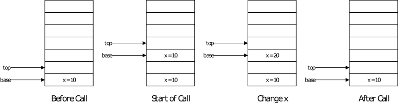
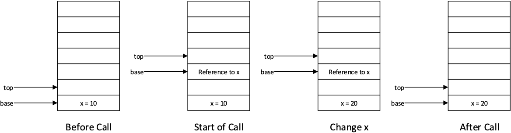
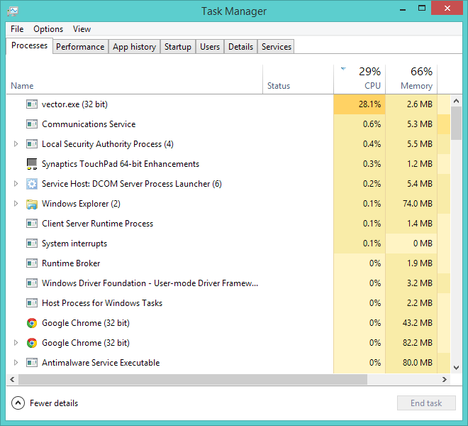
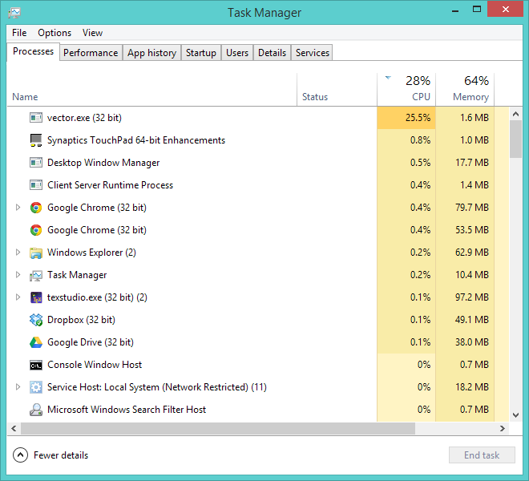
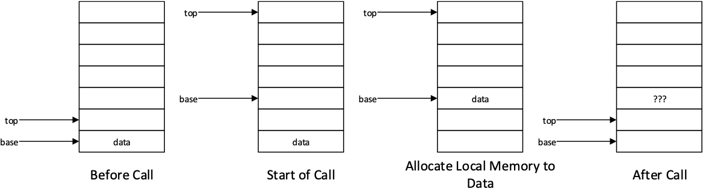

# Software Development 2 Lab 07 -- Introduction to C++ and Calling Conventions

<link rel="stylesheet" href="/module-content/css/block.css">

In this unit we are going to look at how we work with functions / operations in more detail. We are interested in how our variables are transferred and used by our functions / operations.  This involves our first major investigation into what a pointer is and what a reference is.  The former concept becomes very important when we look at memory management in the next unit.  To use the latter concept, we need to change the language we are using to C++.  This is the language we will use from now on.

## The C++ Programming Language

C++ was first developed in the late 1970s / early 1980s.  It is considered a successor or the next step (hence the ++) to C.  As such, everything you have done up until this moment in C works in C++.  C++ just adds some new constructs to make our life *a lot* easier.  One of the major differences between C and C++ is that C++ has *object-orientation* (like Python, Java and C\#).  We won't look at object-orientation in C++ until a few units, but we already introduced some of the basic ideas with C `struct`s.

As with everything, describing a programme language doesn't tell you as much as actually using the language.  With that in mind let us move onto a simple *Hello World* example.  *From this point onwards you should consider that every piece of code we provide as an example is C++*.

### Hello World in C++

Our *Hello World* example is given below.  The extension of a C++ file is `.cpp`.  On Windows, `cl` is both a C and C++ compiler. **On Linux and MacOS you will have to use `g++` and `clang++` respectively.** **Save the following code as `hello.cpp` and run it**.

```cpp
#include <iostream>

using std::cout;
using std::endl;

int main(int argc, char **argv)
{
  cout << "Hello, world!" << endl;
  return 0;
}
```

OK, we have a couple of new ideas here.  First, the include file.  Here we are including the file `iostream` (note no `.h`).  This is part of the standard C++ library and provides some basic input-output mechanisms (such as command line input-output).  The header name is an abbreviation of *input-output streams*.

On line 3 and line 4 we state which parts of `iostream` we are using -- `std::cout` and `std::endl` both in the `std` namespace (library). On line 8 we have our *print* statement -- and this will look very strange to new C++ programmers.  First of all, let us describe the two objects being used:

- `cout` -- this is the command line (we stated we were using this with `using std::cout`. `cout` can be interpreted as *Console OUTput*.
- `endl` -- this is a new line character supported by the operating system. `endl` can be interpreted as *END Line*.

Now the new operators.  We are using the operator `<<` which is known as the *stream output* operator.  You can read the entire command as *to the console stream `"Hello, world!"` then an end line*.  There is an equivalent *stream input* operator (`>>`) which you should look at in an exercise soon.

## Working with `string` in C++

We spent a fair bit of time working with character strings in C.  In particular, we looked at how strings are represented in C, how this can cause issues, and how we operate on strings.  In C++ we have a `string` type which makes our life *a lot* easier.  Underneath this `string` type there is still a `char*` -- we just don't need to interact with it directly.  The `string` type is provided in the `string` header in C++ (note again no `.h`).

As an example application, let us rebuild our command line example in C++.  The code is below:

```cpp
#include <iostream>
#include <string>

using std::cout;
using std::endl;
using std::string;

int main(int argc, char **argv)
{
  string command = "";
  // Loop round command lines, appending to the string
  for (int i = 0; i < argc; ++i)
    command += string(argv[i]) + string(" ");
  // Print the command line
  cout << command << endl;
  // Print out the length of the string
  cout << "Command line is " << command.size() << " characters long" << endl;
  return 0;
}
```

Here we are using the `string` object.  As with `cout`, `string` is part of the *Standard Library* namespace (hence the `std::` part).

Let us look at some of these lines in more detail:

- Line 2 -- here we have included the \texttt{string} header file
- Line 10 -- we declare an initial `string` with no text.  Notice we can initialise a C++ `string` as we did with strings in C using `""`.  Consider this a string initializer for C based languages.
- Line 13 -- here we join the `string` objects together.  Notice that we can just use the `+` operator to do this.  The `+` operator concatenates `string` objects together.  Line 13 effectively says *Add to command (the `+=` part) the next command line argument and a space.*
- Line 15 -- here we print the command line string using `cout`.  Note that `cout` will happily stream a `string` object for us.
- Line 15 -- here we print the length of the `string` object.  Note that we can get that by calling the `size` method on the `string` object.  The `string` maintains its length for us so we can call the `size` method to access the value.
- Line 15 -- also note here that we are streaming multiple values to `cout`.  This allows us to create more complicated outputs if we need to.

### Exercise

Write the equivalent C++ application for reading in a name and saying hello to the person.  You will need to use the stream input operator and a `string` object.  The other object you need is `cin` (*Console INput*).  To give you some guidance in how to structure the statement use the following:

*From console input read into name* (where *name* is the `string` you are reading into).

## Accessing Raw String from C++ `string`

We can rewrite the above application by accessing the raw C string and then calling `printf` (therefore mixing C and C++).  This code is shown below:

```cpp
#include <cstdio>
#include <string>

using std::string;

// A function that will print a C string
void print(const char *str)
{
  printf("%s\n", str);
}

int main(int argc, char **argv)
{
  // Declare an empty string
  string command = "";
  // Loop round command lines, appending to the string
  for (int i = 0; i < argc; ++i)
  {
    command += string(argv[i]) + string(" ");
  }
  // Get the C string (raw string) from the C++ string
  const char *str = command.c_str();
  // Call print
  print(str);

  return 0;
}
```

We are combining a few different ideas here.  Let us look at these in turn:

- Line 1 -- here we are including the `cstdio` header (again no `.h`).  This header provides C++ with access to the functionality provided in the C `stdio.h` header.
- Line 7 -- we have declared a function that will print the value.  Notice the use of `const` here.  We are stating that the value in the `char*` will not change.  We will be looking at `const` in more detail later in the unit.
- Line 9 -- we are calling the standard `printf` function from C in our C++ code.  As stated previously this is perfectly acceptable.
- Line 22 -- this is where we are accessing the raw C string from our C++ `string` object.  This is done using the `c_str` method on `string`.  Note the return type -- it is a `const char*`.  This is because you should not be modifying this value outside of the `string` object -- hence it is a `const`.  The value you have (the pointer to a location in memory) points to the exact same location as the `string` object is storing its `char*`.

In general we don't have to write code that accesses the raw C string of a C++ `string`.  However, you might find that sometimes you are working with a predominantly C based library or framework (for example OpenGL, OpenCL, CUDA, etc.) and you want to have the simplicity of C++ `string` objects but have to give the relevant function calls `char*`.  The access to `c_str` provides this.

The output from this application should be the same as the previous application.

## Reading Input from the Command Line with `cin`

You should have attempted this in an exercise already, so hopefully nothing here is that new.  Just in case though, let us see how we capture input from the command line in C++. 

```cpp
#include <iostream>
#include <string>

using std::cout;
using std::cin;
using std::endl;
using std::string;

int main(int argc, char **argv)
{
  // Declare strings to store name
  string first_name;
  string last_name;
  string full_name;

  // Prompt for first name
  cout << "Please enter your first name: ";
  // Read in first_name using cin
  cin >> first_name;

  // Check if your name is Kevin
  if (first_name == "Kevin")
  {
    cout << "Hey! Another Kevin\n";
  }
  else
  {
    cout << "Oh well\n";
  }

  // Output number of characters entered
  cout << "You entered " << first_name.length() << " characters" << endl;
  // Prompt for last name
  cout << "Please enter your last name: ";
  cin >> last_name;
  // Output number of characters entered
  cout << "You entered " << last_name.length() << " characters" << endl;

  // Join the strings
  full_name = first_name + string(" ") + last_name;

  // Print name
  cout << "Your full name is " << full_name << " which is ";
  cout << full_name.length() << " characters long" << endl;;

  return 0;
}
```

Let us look at some of these lines, particularly where we have done things differently:

- Lines 12 - 14 -- declare the C++ `string` objects we are going to use
- Line 19 -- we read in from `cin` the `first_name` value using the stream input (`>>`) operator
- Line 22 -- we perform a string comparison.  Note now we can just use the standard equality operator (`==`) rather than calling a function to compare.  The equality operator will perform the same process
- Line 32 -- we use the `length` method to get the length of the string.  This will return the same value as `size` and therefore is interchangeable.

As you can see, working with input-output and strings is easier in C++ than C.  This is one of the benefits of having object-orientation.  We can operate on our data more effectively and therefore reduce our code.

## Using `getline` to Read Lines of Text

OK, this is our final example of working with the C++ `string` object before moving onto the main point of this unit.  Here we are going to use a nice helper function provided in the C++ Standard Library known as `getline`.  This function allows us to read an entire line from an input stream until we encounter the newline character.  This allows us to work around the problem of having space characters in our input streams.  The example application is below.  It simply prompts for and reads in someone's full name.

```cpp
#include <iostream>
#include <string>

using std::string;
using std::cout;
using std::cin;
using std::getline;
using std::endl;

int main(int argc, char **argv)
{
  // Declare string to store name
  string full_name;

  // Prompt for name
  cout << "Please enter your full name: ";
  // Read in full_name using cin and getline
  getline(cin, full_name);

  // Print name
  cout << "Your full name is " << full_name << " which is ";
  cout << full_name.length() << " characters long" << endl;;

  return 0;
}
```

Line 18 is where we are using the `getline` function.  Notice is takes two parameters:

1. the stream to read from.  This could be the command line, a file, or something similar
2. the `string` to read into

**Compile and run this application to get an idea of the result**.  You should understand everything else about this code by now.

## Passing by Value (Copying Data)

With that short tour of C++ focusing on command line interaction and strings we are ready to move onto the main focus of this unit -- how values are passed to functions / operations in C and C++.  This is where we have to start understanding a little about how values are passed as parameters, and our initial introduction to the stack in the *Inline Assembly* unit will help us here.

Over the next few sections we are going to look at the three techniques for passing a value as a parameter to a function / operation.  There are as follows:

- Passing a value by copying it to the function / operation (*pass-by-value*)
- Passing a value by providing a reference to the function / operation (*pass-by-reference*)
- Passing a value by providing a pointer to the function / operation (*pass-by-pointer*)

The first technique we will look at is pass-by-value.  This is the technique we have been using in most cases up until now.  This technique involves creating a copy of our value(s) and giving them to the function / operation.  This means that anything the function / operation does with the value is not reflected in the caller.

With that in place, let us look at our pass-by-value application.  This is below.

```cpp
#include <iostream>

using std::cout;
using std::endl;

void foo(int x)
{
  cout << "Start of function, x = " << x << endl;
  x = 20;
  cout << "End of function, x = " << x << endl;
}

int main(int argc, char **argv)
{
  int x = 10;
  cout << "Before function call, x = " << x << endl;
  foo(x);
  cout << "After function call, x = " << x << endl;
  return 0;
}
```

There is nothing unusual or new in this application.  The idea we are trying to examine is what is happening in memory and with the variables.  We have already covered the stack, and we have mentioned the stack pointers (that tell us the bottom and top of the stack).  With that in mind, we can visualise what is happening in our application as shown below.



To start with we have our value that is declared in our main application.  This is the value at the bottom of the pointer.  When we call the function, we push a copy of `x` onto the stack (let us assume that there is something else on the stack between our two `x` values).  When we change the value of `x` in the function, only the function's copy is modified.  The original value (at the bottom of the stack) is unaffected. Therefore, when the function exits, this change has been lost.

> **Scope (yet again)**
>
> Basically we are looking at scope here again.  The scope of the main application is different than the scope of the function.  As such, any variables that are *not references or pointers* will be copies, and be different in each scope.  Our work in pass-by-reference and pass-by-pointer allows us to overcome scoping limitations such as these.

## Passing by Reference

Now let us move onto working with *pass-by-reference*.  This technique allows us to avoid passing a copy of a value to a function / operation but rather pass a *reference* to the value.  This means that the function / operation is directly accessing the same value as the caller of the function.

When it comes to calling a function / operation that uses pass-by-reference, you as the caller of the function / operation has to do nothing different.  It is the function / operation that declares that is taking in a reference to a value.  It does this by declaring a parameter as a reference using the *reference-type* specifier.  This is the ampersand (`&`) character.  For example, to pass a parameter using pass-by-reference we would declare our function / operation as follows:

```cpp
return-type function-name(parameter-type &name) { ... }
```

Any type can have the *reference-type* specifier added to it.  For example, a reference to a `char` is of type `char&`.  An `int` is of type `int&`.  And so on.

> **The `&` Specifier and the `&` Operator**
>
> We are now getting into one of the areas that can really confuse new C++ programmers -- the use of the `&` symbol.  We now have four different uses for this symbol.  These are summarised in the following table.
>
> | **Use**                | **Example**        | **Description**                                              |
> | ---------------------- | ------------------ | ------------------------------------------------------------ |
> | Bitwise and operator   | `int c = a & b;`   | Performs a bitwise and operation on two values. This takes the bit pattern of the values and logically ands the individual bit pairs. |
> | Logical and operator   | `bool c = a && b;` | Performs a logical and on two boolean values.                |
> | Address of operator    | `int *a = &b;`     | Gets the address of (to create a pointer to) a value;        |
> | Reference to specifier | `int &a = b;`      | Declares a variable as a reference type.                     |
>
> The main confusion comes between the use of `&` as an operator to get a pointer to a value and declaring a variable as a reference type.  This is because they are related.  Both of these capabilities rely on us not storing a value directly but having a way of accessing the value.
>
> To help clarify the difference, try and remember the following:
>
> - A pointer type is declared using `*` (e.g., `char*`).  To get a pointer to a value, we use the `&` operator on a variable.  When using `&` on a variable, we are getting a pointer to it.
> - A reference type is declared using `&` (e.g. `char&`).  To get a reference to a value, we simply assign the variable to the reference type.  We use `&` to declare types (e.g., variable declarations, parameter declarations) as we do with `*` for pointer types.

References may seem strange but you have actually been using them all the time in modern object-oriented languages.  Everything in Python, Java and C\# (except the primitive types such `int`) are passed as references.  This means that in all likelihood you already think in references.  This can make working in `pass-by-value` a bigger headache.  However, as you may notice, we can pass any type as a reference in C++ (using the `&` specifier).  In Python and Java we cannot, although C\# does provide some of this capability.

With that introduction to pass-by-reference let us move onto our example application.  This is the same as the previous pass-by-value one but this time we use a reference for the parameter.  The code is below.

```cpp
#include <iostream>

using std::cout;
using std::endl;

void foo(int &x)
{
  cout << "Start of function, x = " << x << endl;
  x = 20;
  cout << "End of function, x = " << x << endl;
}

int main(int argc, char **argv)
{
  int x = 10;
  cout << "Before function call, x = " << x << endl;
  foo(x);
  cout << "After function call, x = " << x << endl;
  return 0;
}
```

Our change is on line 6 where we declare the parameter `x`.  Now the type is `int&` rather than just `int`.  This means that we are modifying the exact same value that `main` has in `foo`.  Below is an example.



As we can see, the modification to `x` in the function is reflected in the main application.  The reference means that we have not created a copy of the value.

> **Why use References?**
>
> There are a number of reasons for and against using references over copying data between functions.  A few to consider are:
>
> - *Pass-by-value* copies data when the variable is passed. With small sized data types this is unlikely to concern us as the memory overhead and cost of copying is low.  However, on anything larger than the size of copy for a reference we start to degrade performance.  A reference is only 4 bytes in size (or 8 on a 64-bit operating system) and therefore can be copied in a single instruction.  Anything larger than this on pass-by-value will be slower.
> - *Pass-by-reference* allows you to modify (and therefore return) multiple values in a function.  This has its advantages when trying to write some operations that need to output multiple values.
> - *Pass-by-Reference* does mean that you can modify values in a function.  This could cause unforeseen behaviour if you are calling someone else's code.
> - *Pass-by-Reference* can lead to multiple objects having access to the same value.  This can enable multiple objects to *mutate the state* (in other words modify the attributes) of the object and be difficult to track in large applications.
>
> The developers of Java decided that pass-by-reference was the best method (they have a garbage collector to clean up memory -- C++ doesn't which we will explore next unit).  In practice, pass-by-reference is also recommended in C++, but it has it's limitations.  For example, there is no such thing as a `null` reference in C++.  This means a reference must always point to an initialised value.  Also, a reference cannot change to point to a different location in memory.  It is fixed and will always point to the same location.  This has it's pros and cons.  The pointer type is more versatile, but therefore also more volatile.

## Example -- Copying and Sorting by Value and Reference

Let us look at how pass-by-value impacts memory usage in comparison to pass-by-reference.  We will build two applications that perform a sort on two large arrays of data passed.  The first way will involve pass-by-copy which will require two copies of the array to be in existence, and hence more memory being used.  The second will involve pass-by-reference and hence reduce memory usage.  To do this we will also use a `vector` to store our data.

> **What is a `vector` in C++**
>
> A `vector` in C++ terms is very similar to a standard array except it provides mechanisms to add, remove, insert, etc.  The `vector` will resize itself based on requirements.  This means that if you add a value to the `vector` it will increase in size, and if you remove an item the `vector` will decrease in size.
>
> It is very likely that you have used a data store object that resizes in other languages.  Python has a `List` data type. Java has an `ArrayList`.  We will use `vector` in places from now on, but we will cover data structures in more depth in a later unit.
>
> A `vector` has a type associated with it.  This is declared in angle brackets in the variable declaration.  For example, to declare a `vector` that stores type `int` we use `vector<int>`.  This uses a technique called `templates` which allow us to provide compile time type information -- a generic type.  We will only briefly cover templates as they can be used for far more sophisticated purposes than we can fully cover in the module.

Our test application is below.

```cpp
#include <iostream>
#include <vector>

using std::cout;
using std::endl;
using std::vector;

void sort_copy(vector<int> data)
{
  // Iterate through each value
  for (int i = 0; i < data.size(); ++i)
  {
    // Loop through values above index i
    for (int j = 0; j < data.size() - (i + 1); ++j)
    {
      // Test if data[j] > data[j + 1]
      if (data[j] > data[j + 1])
      {
        // Swap values
        int temp = data[j + 1];
        data[j + 1] = data[j];
        data[j] = temp;
      }
    }
    // Print % completed
    if (i % 1000 == 0)
    {
      cout << ((float)i / (float)data.size()) * 100.0f << "% sorted" << endl;
    }
  }
}

void sort_reference(vector<int> &data)
{
  // Iterate through each value
  for (int i = 0; i < data.size(); ++i)
  {
    // Loop through values above index i
    for (int j = 0; j < data.size() - (i + 1); ++j)
    {
      // Test if data[j] > data[j + 1]
      if (data[j] > data[j + 1])
      {
        // Swap values
        int temp = data[j + 1];
        data[j + 1] = data[j];
        data[j] = temp;
      }
    }
    if (i % 1000 == 0)
    {
      cout << ((float)i / (float)data.size()) * 100.0f << "% sorted" << endl;
    }
  }
}

int main(int argc, char **argv)
{
  // Create a vector of numbers in reverse order
  vector<int> data;
  for (int i = 0; i < 262144; ++i)
  {
    data.push_back(262144 - i);
  }

  cout << "Sorting by copy..." << endl;
  sort_copy(data);
  cout << "Sorting by reference..." << endl;
  sort_reference(data);

  return 0;
}
```

Let us point out a few lines of interest:

- Line 8 -- here we are passing the vector by *value*.  Note that we don't use any specifier on the data type for the parameter.
- Lines 11, etc. -- we use the method `size` on the `vector`.  This provides the number of elements currently stored in the `vector`.
- Line 13, etc. -- notice that we can use standard array notation to access members of the `vector`, e.g., `data[I]`.  Within the `vector` is an actual array used to store the data.  C++ provides *operator overloading* which allows us to access this array.
- Line 33 -- here we are passing the vector by *reference*.  We have used the `&` specifier on the data type for the parameter.
- Line 63 -- we use the `push\_back` method on the `vector` to add values to the end of the data store.  For the first call to `push\_back` we set the 0<sup>th</sup> element, for the second call the ​1<sup>st</sup> element, and so on.
- Line 67 -- we call the pass-by-value version of sort.  Notice we don't have to use any additional code to call with pass-by-value.
- Line 69 -- we call the pass-by-reference version of sort.  Notice we don't have to use any additional code to call with pass-by-reference.

The size of the `vector` data in memory is approximately one megabyte.  When we use the pass-by-value version, we create a copy of the `vector` and therefore add another one megabyte of memory usage.  This can be seen using your systems task manager.

### Exercise

To truly test this application you will need to open Windows Task Manager (or equivalent on Linux and MacOS).  Watch the application memory usage when the application has copied the vector, and also when it has passed by reference.  An example is shown below. Note that the copy version uses 2.6 MB of memory and the reference version 1.6 MB (or 1 MB less).

| **Copy**                          | **Reference**                   |
| --------------------------------- | ------------------------------- |
|  |  |

## Array Library in C++

We have now introduced enough C++ to allow us to implement a simple array library using C++ objects and techniques.  We will create two pieces of functionality:

1. Sorting data in the array
2. Generating random values to fill the array

We will use the `vector` type to make life easier.

### Sorting

Our C++ header for `sort` is called `sort.h` and is declared below.

```cpp
#pragma once

#include <vector>

void sort(std::vector<int> &data);
```

Notice that we use `std::vector` in our declaration here. If you remember how the preprocessor works, you will recall that this file is just included at the top of our file. **If we added `using std::vector` in our header file, our source file would also be using it and this might not be what we want. NEVER ADD `using` TO A HEADER FILE -- it's bad practice.**

The code for `sort.cpp` is below.

```cpp
#include "sort.h"
#include <iostream>

using std::cout;
using std::endl;
using std::vector;

void sort(std::vector<int> &data)
{
  // Iterate through each value
  for (int i = 0; i < data.size(); ++i)
  {
    // Loop through values above index i
    for (int j = 0; j < data.size() - (i + 1); ++j)
    {
      // Test if data[j] > data[j + 1]
      if (data[j] > data[j + 1])
      {
        // Swap values
        int temp = data[j + 1];
        data[j + 1] = data[j];
        data[j] = temp;
      }
    }
    if (i % 1000 == 0)
    {
      cout << ((float)i / (float)data.size()) * 100.0f << "% sorted" << endl;
    }
  }
}
```

### Generating

Our generation method will take a size value and return a new `vector` of that size filled with random values.  As such, our header file `generate.h` is defined as follows:

```cpp
#pragma once

#include <vector>

std::vector<int> generate(int size);
```

The implementation will use C++ random mechanisms to create the `vector`.  The code is below.  We will look at C++ random after the code is introduced.

```cpp
#include "generate.h"
#include <random>

using std::vector;
using std::random_device;
using std::default_random_engine;

std::vector<int> generate(int size)
{
  // Create random device
  // This is a true random device if your hardware supports it
  random_device device;
  // Create a random number generator seeded by this device
  default_random_engine engine(device());
  // Create distribution - how should randoms be distributed
  // We use uniform for normal randomness
  uniform_int_distribution<int> dist;
  // Generate random numbers
  vector<int> data;
  for (int i = 0; i < size; ++i)
  {
    data.push_back(dist(engine));
  }
  return data;
}
```

> **Random Number Generation in C++**
>
> Random number generation is very sophisticated in C++. Why they spent so long on this and still haven't added a networking  to the standard library is anyone's guess. However, we need two objects to generate random numbers in C++:
>
> - Something to generate random values -- in this case the `default_random_engine`.
> - Something to decide how the random numbers are distributed -- in this case a `uniform_int_distribution`.
>
> If you don't know about how values are distributed the following diagram might help.
>
> )
>
> We can get random numbers without using a distribution, but generally you will want to use one.
>
> A random engine will produce values in a predictable order, so we have to seed it with an initially truly random number. Here, we use `random_device` which will produce a truly random number if your hardware supports it.

### Test Application

We can now build a test application to test our library.  This is shown below.

```cpp
#include "generate.h"
#include "sort.h"
#include <iostream>

using std::cout;
using std::endl;
using std::vector;

int main(int argc, char **argv)
{
  vector<int> data = generate(65536);
  sort(data);

  // Print the first 100 values
  for (int i = 0; i < 100; ++i)
  {
    cout << data[i] << endl;
  }
  return 0;
}
```

### Exercise

You can now build the application (remember -- you should be using make files for this).  An example output is given below:

```shell
... previous lines
2416421
2453633
2472376
2515740
2585328
2588164
2609197
2623708
2625554
2660361
2669049
2669493
2678787
2750678
2751473
2772010
```

## Files in C++

Let us now use file input and output. C++ works on the basis of *streams*, which we have already seen with `cout` and `cin`.  Files, once opened, are also just streams we can read from and write to.  The below describes some of the common base stream types in C++.

| **Type**       | **Friendly Name**   | **Description**                                          |
| -------------- | ------------------- | -------------------------------------------------------- |
| `istream`      | Input Stream        | A stream that data can be read from.                     |
| `ostream`      | Output Stream       | A stream that data can be written to.                    |
| `iostream`     | Input-output Stream | A stream that can be read from and written to.           |
| `fstream`      | File Stream         | Represents an input-output stream that points to a file. |
| `stringstream` | String Stream       | Provides a stream that writes to a `string` object.      |

The one we are interested in here is `fstream`, or more specifically `ifstream` to read data from and `ofstream` to write data to.

> **Working with `ofstream`**
>
> - **Creating a `ofstream`** -- to create a `ofstream` object we use the call `ofstream var-name(filename, mode);`. The *filename* parameter is a `string` representing the filename. The *mode* determines the mode we open the file in (e.g., binary). It is an optional parameter.
> - **Writing Data** -- we can use the streaming operator (`<<`) to write individual values. However, we can also use `write` to read in a set amount of data into an area of memory.
> - **Closing a `ofstream`** -- the method `close` is used to close a `ofstream`.

> **Working with `ifstream`**
>
> - **Creating a `ifstream`** -- to create a `ifstream` object we use the call `ifstream var-name(filename, mode);`.  The *filename* parameter is a `string` representing the filename.  The *mode* determines the mode we open the file in (e.g., binary). It is an optional parameter.
> - **Seeking in a File** -- we can seek to a particular position in a file using the `seekg` command.  We can use this to move to the end of a file and then get the position using `tellg`.
> - **Getting the Current File Position** -- we can use `tellg` to tell us which position in the file (byte number) we are currently accessing.
> - **Reading in Data** -- we can use the streaming operator (`>>`) to read in individual values.  However, we can also use `read` to read in a set amount of data into an area of memory.
> - **Closing a `ifstream`** -- the method `close` is used to close a `ifstream`.

Let us now look at an example.  The code for our application is below.  This should be straightforward by now.

```cpp
#include "generate.h"
#include "sort.h"
#include <string>
#include <iostream>
#include <fstream>

using std::string;
using std::cout;
using std::endl;
using std::vector;
using std::ifstream;
using std::ofstream;

void write_file(const string &filename, vector<int> &data)
{
  // Open file for output
  ofstream file(filename);
  // Loop through each value in the vector
  for (int &val : data)
  {
    // Output value to the file
    file << val << endl;
  }
  // Close the file
  file.close();
}

vector<int> read_file(const string &filename)
{
  // Vector to read into
  vector<int> data;
  // Open file for input
  ifstream file(filename);
  // Loop until end of file (eof)
  while (!file.eof())
  {
    // Read in value
    int temp;
    file >> temp;
    // Add to the vector
    data.push_back(temp);
  }
  return data;
}

int main(int argc, char **argv)
{
  // Generate a random vector
  vector<int> data = generate(65536);
  // Save the random vector to a file
  write_file("numbers.txt", data);
  // Sort the data
  sort(data);
  // Read back in the unsorted data
  vector<int> unsorted = read_file("numbers.txt");

  // Print the first 100 values of each
  for (int i = 0; i < 100; ++i)
  {
    cout << data[i] << "\t" << unsorted[i] << endl;
  }
  return 0;
}
```

## `const` References

Our final look at references considers the use of `const` which we saw in the file I/O example.  Remember in C we used `const` to define constant values, whether it be variables or parameters.  We can also declare references as `const`.  This means that the value stored in the reference cannot be changed.  Let us look at an example.

```cpp
#include <iostream>
#include <string>

using std::string;
using std::cout;
using std::endl;

string join(const string &a, const string &b)
{
  // This line won't compile
  return a.append(b);
}

int main(int argc, char **argv)
{
  string greeting = join(string("Hello,"), string(" World!"));
  cout << greeting << endl;
  return 0;
}
```

The `append` method used on line 11 is not `const`, and therefore your code won't compile.  However, if we modify our `join` function to use the append operator (`+`) we create a copy of the strings and therefore get around the problem.  This code is below.

```cpp
string join(const string &a, const string &b)
{
    // This line will compile
    return a + b;
}
```

You might ask then why do we pass by `const` at all.  For one reason, **safety** -- we are stating we are not going to modify the value.  For another reason, the compiler can actually improve the application performance if it knows a value is `const`.  This can be an important benefit when writing optimised code, and you should consider using `const` whenever it is suitable.

### Exercise

Can you write another version of `join` that uses the `append` method of `string`?  This is possible.  You must use the same function prototype as already defined (i.e., the values must be `const`).

## Pointers

So references where the easier part of this unit.  The more difficult part is understanding pointers.  Pointers are considered the most difficult part of working with C and C++ as they take novice programmers a bit of time to understand.  This isn't helped by the use of similar symbols between references and pointers in C++.

Remember that a pointer is just a location in memory that we treat like a particular value.  This is similar to references, except that we can make a pointer point to different parts of memory as required.  Remember that a reference is fixed.

To declare a pointer we use the `*` specifier with the type.  For example, a pointer to an `int` is declared as `int*`.  To get the address of a variable we use the `&` operator (address of operator).  To get the value stored in the memory location pointed to by a pointer we use the `*` operator.  Let us summarise this a little.  This is given below.

| **Operator / Specifier** | **Example**                  | **Description**                                              |
| ------------------------ | ---------------------------- | ------------------------------------------------------------ |
| Pointer type specifier   | `int *x;`                    | Declares that a variable of parameter is a pointer type.     |
| Address-of operator      | `int *x = &y;`               | Gets the memory address of a variable.                       |
| Dereference operator     | `int z = *x;`<br />`*x = 5;` | Accesses the value stored in the memory location, allowing retrieval or modification. |

Let us now implement our \emph{pass-by-pointer} application as we did for pass-by-value and pass-by-reference.  This time we will also print out the memory location of our variable to illustrate that it is not changing throughout the application.  The code for our application is below.  Note the use of the \emph{address-of} and \emph{dereference} operators.

```cpp
#include <iostream>

using std::cout;
using std::endl;

void foo(int *x)
{
  cout << "Address of x in function = " << x << endl;
  cout << "Start of function, x = " << *x << endl;
  // Have to dereference pointer to change value
  *x = 20;
  cout << "End of function, x = " << *x << endl;
  cout << "Address of x at end of function = " << x << endl;
}

int main(int argc, char **argv)
{
  int x = 10;
  cout << "Starting address of x = " << &x << endl;
  cout << "Before function call, x = " << x << endl;
  // Have to pass the pointer (or address of) x to the function
  foo(&x);
  cout << "After function call, x = " << x << endl;
  cout << "End address of x = " << &x << endl;
  return 0;
}
```

An example output from this application is below.  Note that the memory address remains the same throughout the application.

```shell
Starting address of x = 003FFC30
Before function call, x = 10
Address of x in function = 003FFC30
Start of function, x = 10
End of function, x = 20
Address of x at end of function = 003FFC30
After function call, x = 20
End address of x = 003FFC30
```

## Arrays as Pointers to Memory

One of the most common uses for pointers in C and C++ is when we are working with arrays.  Arrays are just blocks of memory, and as pointers hold memory locations, an array is just a pointer to the starting memory location of the block of memory representing the array.  This allows us to pass around large blocks of memory as a pointer thus avoiding copying.

> **Arrays Revisited**
>
> We have covered arrays in C and C++ in a few places now, although we haven't delved to far into the subject (this will happen in the next unit).  Remember to create an array in C / C++ we use the following:
>
> ```cpp
> type name[size];
> ```
>
> This will create a `fixed` (compile time defined) size array.  This is an important distinction in C in comparison to Python,  Java and C#.  In Java, array sizes are defined at runtime as standard.  In C and C++ our arrays are of fixed size at compile time unless we use memory allocation.
>
> In C, memory allocation is handled using the `malloc` function.  This returns a pointer to a memory block of the required size.  In C++ we can use the `new` operator to create an array of the required size at runtime:
>
> ```cpp
> type *name = new type[size];
> ```
>
> This is how array allocation in Java and C# works (apart from the pointer part).  
>
> In C and C++ arrays are a pointer to the start of the memory block where the memory is located.  The size of the array is not stored however (unlike in Java) so we have to pass this value around.  This is why working with `vector` in C++ is almost always a better choice.

An example array application is below:

```cpp
#include <iostream>

using std::cout;
using std::endl;

int* create_array()
{
  // This memory is created on the stack
  int data[20];
  for (int i = 0; i < 20; ++i)
  {
    data[i] = i;
  }
  return data;
  // Stack emptied - memory gone
}

int* create_array_new()
{
  // Memory created on the heap
  int *data = new int[20];
  for (int i = 0; i < 20; ++i)
  {
    data[i] = i;
  }
  return data;
  // Memory on the heap still relevant
}

void create_array(int *data)
{
  for (int i = 0; i < 20; ++i)
  {
    data[i] = i;
  }
}

int main(int argc, char **argv)
{
  int *data = create_array();
  // Print out all elements
  for (int i = 0; i < 20; ++i)
  {
    cout << data[i] << endl;
  }

  data = create_array_new();
  // Print out all elements
  for (int i = 0; i < 20; ++i)
  {
    std::cout << data[i] << std::endl;
  }
  // Free the memory
  delete[] data;
  // Set to nullptr
  data = nullptr;

  // Create array from pointer
  // This will cause a memory allocation error
  // nullptr (memory address 0) cannot be allocated to
  create_array(data);

  // Allocate memory
  data = new int[20];
  // Create array from pointer
  create_array(data);
  // Print out all elements
  for (int i = 0; i < 20; ++i)
  {
    std::cout << data[i] << std::endl;
  }
  // Free the memory
  delete[] data;
  // Set to nullptr
  data = nullptr;

  return 0;
}
```

Compiling this version of the code will cause a runtime error because of line 61 (or more specifically on line 34 which is called by line 61).  Try running the application as is to check this.  After that, **comment out line 61 and run**.  You should get an output as follows:

```shell
0
14754591
14908184
14908272
6291172
14908272
6291164
14754917
6291172
6291184
14768466
14908272
-255
14908272
6291192
14751355
6291208
14755646
14908272
14908272
0
1
2
3
4
5
6
7
8
9
10
11
12
13
14
15
16
17
18
19
0
1
2
3
4
5
6
7
8
9
10
11
12
13
14
15
16
17
18
19
```

The interesting values printed out are the first 20.  This is what happens when we return a pointer to a location on the stack which is no longer valid.  The data here has been overwritten.  This means that we have a variable that is pointing to an area of the stack we may use later, which will cause a possible *stack corruption* problem later.  Stack corruption is where our stack is modified unintentionally, commonly by pointing to an invalid location on the stack.  The below figure provides an illustration of what is happening.



## `const` Pointers and Pointers to `const`

We covered `const` in relation to references previously.   Now let us look at how `const` affects pointers.  There are actually two potential `const` parts to a pointer -- the data stored in the pointer (*constant data*) and the memory location pointed to by the pointer (*constant pointer*).  The below table illustrates the different approaches.

| **`const` Part**  | **Example**          | **Description**                                              |
| ----------------- | -------------------- | ------------------------------------------------------------ |
| Value             | `const int *x`       | The value pointed to is constant and cannot be changed. The memory address can be changed however. |
| Pointer           | `int *const x`       | The memory address is constant and cannot be changed. However, the value pointed to can be changed. |
| Value and pointer | `const int *const x` | Both the value pointed to and the memory address are constant. |

Let us now build an example application.  The code below has a number of lines you will have to comment out, but you should first build the code without the commented out lines.  This is so you can see the compiler error that C++ will provide.

```cpp
#include <iostream>

using std::cout;
using std::endl;

void foo(const int *x)
{
  cout << "Address of x in function = " << x << endl;
  cout << "Start of function, x = " << *x << endl;
  // Wont compile - value pointed to is const
  *x = 20;
  cout << "End of function, x = " << *x << endl;
  cout << "Address of x at end of function = " << x << endl;
}

void foo2(int *const x)
{
  cout << "Address of x in function = " << x << endl;
  cout << "Start of function, x = " << *x << endl;
  // Will compile - pointer is const, not value pointed to
  *x = 20;
  cout << "End of function, x = " << *x << endl;
  cout << "Address of x at end of function = " << x << endl;
}

void foo3(int *const x)
{
  cout << "Address of x in function = " << x << endl;
  cout << "Start of function, x = " << *x << endl;
  // Won't compile - trying to change address pointed to
  x = nullptr;
  cout << "End of function, x = " << *x << endl;
  cout << "Address of x at end of function = " << x << endl;
}

int main(int argc, char **argv)
{
  int x = 10;
  cout << "Starting address of x = " << &x << endl;
  cout << "Before function call, x = " << x << endl;
  // Have to pass the pointer (or address of) x to the function
  foo2(&x);
  cout << "After function call, x = " << x << endl;
  cout << "End address of x = " << &x << endl;

  return 0;
}
```

The compiler error provided by Microsoft's C++ compiler is as follows:

```shell
 cl const_pointer.cpp
Microsoft (R) C/C++ Optimizing Compiler Version 18.00.30501 for x86
Copyright (C) Microsoft Corporation.  All rights reserved.

const_pointer.cpp
C:\Program Files (x86)\Microsoft Visual Studio 12.0\VC\INCLUDE\xlocale(337) : wa
rning C4530: C++ exception handler used, but unwind semantics are not enabled. S
pecify /EHsc
const_pointer.cpp(8) : error C3892: 'x' : you cannot assign to a variable that i
s const
const_pointer.cpp(28) : error C3892: 'x' : you cannot assign to a variable that
is const
```

> **What is `nullptr`?**
>
> We have introduced another new term in this code -- `nullptr`.  This is a new addition to C++11 and provides the equivalent of `None` in Python or  `null` in Java and C#.  `nullptr` effectively points at memory location 0.  `NULL` is a commonly defined value in C and C++ and is also 0.  It is quite common to point unallocated memory to location 0 to allow code checks.

We've only begun to stray into pointers here, and the next unit will look at memory allocation and management.  Here we have to use pointers, although the C++11 standard has introduced some helper objects to make our life easier.

## Namespaces

One final idea from C++ we will introduce in this unit is the idea of *namespaces*.  A namespace is just a nice way of managing a collection of code that we consider to be part of a unit (such as a library).  We've actually been using namespaces since the start of our C++ work.  This is the `std` part we have been putting in front of our objects from the standard library.

There is a debate amongst C++ programmers about when you should use the full object name, but usually you want to reduce the amount of typing you have to undertake when coding.  Typically in our main application we want to just tell the compiler that we are using a particular namespace and then just use the object names directly.  We do this using the `using` statement for an entire namespace:

```cpp
using namespace std;
```

Because we have told C++ that we are using a particular namespace we can now access our objects directly.  So instead of writing `using std::string` and `using std::cout` we can just use `using namespace std`. In header files we should not use the namespace.  This is common practice in C++ code.

As an example application, let us rewrite our file I/O code with a `using namespace` statement.

```cpp
#include "generate.h"
#include "sort.h"
#include <string>
#include <iostream>
#include <fstream>

using namespace std;

void write_file(const string &filename, vector<int> &data)
{
  // Open file for output
  ofstream file(filename);
  // Loop through each value in the vector
  for (int &val : data)
  {
    // Output value to the file
    file << val << endl;
  }
  // Close the file
  file.close();
}

vector<int> read_file(const string &filename)
{
  // Vector to read into
  vector<int> data;
  // Open file for input
  ifstream file(filename);
  // Loop until end of file (eof)
  while (!file.eof())
  {
    // Read in value
    int temp;
    file >> temp;
    // Add to the vector
    data.push_back(temp);
  }
  return data;
}

int main(int argc, char **argv)
{
  // Generate a random vector
  vector<int> data = generate(65536);
  // Save the random vector to a file
  write_file("numbers.txt", data);
  // Sort the data
  sort(data);
  // Read back in the unsorted data
  vector<int> unsorted = read_file("numbers.txt");

  // Print the first 100 values of each
  for (int i = 0; i < 100; ++i)
  {
    cout << data[i] << "\t" << unsorted[i] << endl;
  }
  return 0;
}
```

As can be seen, our code is a bit simpler and there is less to write.  You are likely to come across different approaches to using namespaces in other people's C++ code. We will stick with `using std::something` for each class we use though.

## Exercises

This has been a large unit, and you should familiarise yourself with the content.  However, the following exercises will help you strengthen your understanding and knowledge of C++.

1. Investigate `std::setprecision` and how it can be used to determine the number of decimal places printed out on the command line.  Write an application that tests the `std::setprecision` method on the command line to see the different results.
2. C++ provides a `std::sort` function.  Investigate this and then use it to rewrite the array library developed in this unit using `std::vector`.  In particular, compare the performance of the `sort` method with our trivial bubble sort.
3. Other C++ random engines and distributions exist.  Investigate these random engines by using them in your array library.  Look at the output results to understand how they generate values.
4. Modify the distribution in your array library so that numbers only up to 255 are generated.
5. **For the Brave** -- we haven't covered certain aspects of call conventions in this unit.  Investigate the `__cdecl`, `__stdcall` and `__fastcall` calls.