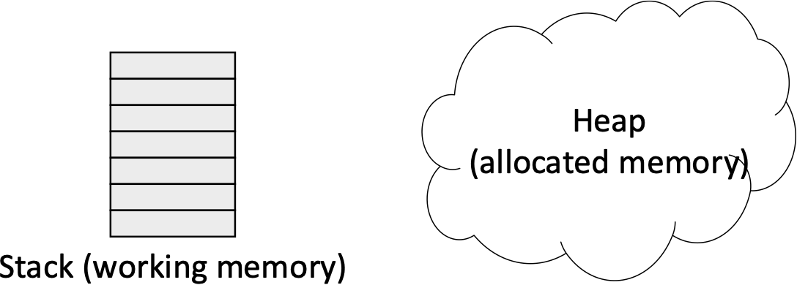

# Software Development 2 Lab 08 -- Memory Management: Using the Stack and Heap

In this unit we are going to expand on our work with understanding pointers by beginning to work with memory.  When working with a low-level systems language such as C/C++, memory management is an important consideration. 

In this unit we are going to investigate how we allocate memory, the difference between the stack and the heap, as well as looking a bit deeper into scope.  We will also look at the new C++ features called \emph{smart pointers}.  For those of you who are a little more adventurous we will also look at basic value casting in C++.

## Scope of Values

We have already looked into scope in a basic manner.  In this part we will look at scope in a bit more detail.  In particular, we will build inner scopes in our functions to give you an idea of how scope works in a bit more detail.

> **What is Scope?**
>
> Scope is about which values are currently valid in a particular piece of code.  In general, you should understand scope from the basic idea of having a variable available only after you have declared it.  For example:
>
> ```cpp
> x = x + 1; // Don't know what x is here
> int x = 0; // x only declared now
> ```
>
> As `x` is declared after we use it we will get a compiler error -- `x` is undeclared (not in scope).
>
> Scope becomes more complex when we work with functions and classes.  When we call a function, we pass any variables we want to the function's scope.  In the previous unit we looked at how this could mean passing by value or passing by reference.  If we don't pass in the variable, then the value is not in scope.
>
> Scope actually works in C / C++ from the point of view of values declared within braces.  For example, consider the following:
>
> ```cpp
> void func()
> {
>   // Main scope of the function
>   {
>     // Scope A - can see main scope
>     {
>       // Scope B - can see scope A and main scope
>     }
>     {
>       // Scope C - can see scope A and main scope.  Scope B no longer valid
>     }
>   }
> }
> ```
>
> We can only see values in our outer scope -- not our inner scope.  This means whenever you use a curly brace (such as in a `while` loop or `if` statement) you create a new inner scope.  Any values declared in these scopes are destroyed (removed from the stack) when the scope is exited.
>
> In C and C++ we have the ability to create values that are in the *global* scope.  This can be useful, but is often frowned upon.  Passing values around the application as parameters is considered best practice.
>
> Scope can be a tricky concept for new programmers.  Spend your time understanding which values are valid at particular points of your application.  Our next two example applications explore scope in more detail.

### Which `x` is in Scope?}

Our first application investigating scope will look at how we can declare new values in inner scope with the same variable name, but still retain the values in the outer scope.  In a way, you can consider the inner scopes as the scope of a function (without parameter passing).  Below is our example application.  Notice how we keep redeclaring `x` in each inner scope, then unwind to get back to the original value.

```cpp
#include <iostream>

using std::cout;
using std::endl;

int main(int argc, char **argv)
{
  // Outermost declaration
  int x = 10;
  cout << "Outermost x = " << x << endl;
  {
    // Now in new scope
    int x = 20;
    cout << "\tInner x = " << x << endl;
    {
      // Now even further in scope
      int x = 30;
      cout << "\t\tInner inner x = " << x << endl;
      {
        // Let's stop here
        int x = 40;
        cout << "\t\t\tInnermost x = " << x << endl;
        // Now unwind scope
      }
      cout << "\t\tInner inner x = " << x << endl;
    }
    cout << "\tInner x = " << x << endl;
  }
  cout << "Outermost x = " << x << endl;

  return 0;
}
```

Each time we enter a new scope we redeclare our `x` variable.  **We are not redefining the value stored in `x` -- we are creating a new variable**.  This is an important concept to understand.  As these are new variables, we are not changing the value of the previous scope.  It still exists.  Therefore, this application will print out values of each scope, then return back to the first scope.  The output from this application is below:

```shell
Outermost x = 10
  Inner x = 20
    Inner inner x = 30
    	Innermost x = 40
    Inner inner x = 30
  Inner x = 20
Outermost x = 10
```

### Values out of Scope

So what happens when a value is out of scope?  Well, we end up in a situation where we have *undeclared identifiers*.  This leads to a compiler error.  Effectively the value hasn't been declared from the point of view of the compiler and therefore cannot be used.  The following application illustrates this:

```cpp
#include <iostream>

int main(int argc, char **argv)
{
  // Declare an int here
  int i = 10;
  {
    // Declare another int here - can access i
    int j = i * 2;
    {
      // Declare another int here - can access i and j
      int k = i + j;
    }
    // Compile error here - k not in scope
    j = j + k;
  }
  // Compile error here - j not in scope
  i = i + j;

  return 0;
}
```

We have two problems in this code.  On line 15 we are attempting to access variable `k`, but this was declared in a scope that we have now exited (it existed in lines 10 to 14).  Therefore the compiler will give an error.  A similar problem exists on line 18. `j` was only in scope lines 7 to 16.  At line 18 it no longer exists (it has been removed from the stack) and therefore our compiler again throws an error.

Those errors from the compiler are important to spot.  The fact that values are not in scope is given and the particular line the problem exists in provided.  Being able to spot problems with out-of-scope variables is another stumbling block for new programmers.

### Losing Values on the Stack

So now we know the pitfalls of working with scope we can relate back to what we have been working to up until this point.  In the last unit we discussed passing values as values, references and pointers.  In this unit we are interested in memory management.  Our problem really comes into effect when we allocate a block of data on the stack and then try and return it.  **Remember that when we return from a function we lose the stack created for the function.**

The problem becomes apparent when working with arrays.  As we have seen in C and C++ we can declare an array on the stack in our code if we know the size of our array at compile time.

```cpp
int array[10];
```

If we do this in a function the data declared on the stack is lost when we exit its scope.  Therefore, if we return a such an array, the pointer is no longer pointing to valid memory.  This will happen also if we try to return a pointer to a value declared in a function.  We are effectively pointing to a location on the stack that has been deemed no longer allocated.

We get around this by allocating memory outside the stack - in the global memory space or heap.  Before discussing the heap in any detail let us look at an example application that shows what happens when we return values from a function using a pointer.  We also illustrate what happens when we try to set values in a memory location we are not allowed to.

```cpp
#include <iostream>

using std::cout;
using std::endl;

int* create_array()
{
  // This memory is created on the stack
  int data[20];
  for (int i = 0; i < 20; ++i)
  {
    data[i] = i;
  }
  return data;
  // Stack emptied - memory gone
}

int* create_array_new()
{
  // Memory created on the heap
  int *data = new int[20];
  for (int i = 0; i < 20; ++i)
  {
    data[i] = i;
  }
  return data;
  // Memory on the heap still valid
}

void create_array(int *data)
{
  // Initialise data in pointed to memory
  for (int i = 0; i < 20; ++i)
  {
    data[i] = i;
  }
  // Memory passed is still valid
}

int main(int argc, char **argv)
{
  int *data = create_array();
  // Print out all elements
  cout << "Array 1" << endl;
  for (int i = 0; i < 20; ++i)
  {
    cout << data[i] << endl;
  }
  
  data = create_array_new();
  // Print out all elements
  cout << endl << "Array 2" << endl;
  for (int i = 0; i < 20; ++i)
  {
    cout << data[i] << endl;
  }
  // Free the memory
  delete[] data;
  // Set to nullptr
  data = nullptr;

  // Create array from pointer
  // This will cause a memory allocation error
  create_array(data);

  // Allocate memory
  data = new int[20];
  // Create array from pointer
  create_array(data);
  // Print out all elements
  cout << endl << "Array 3" << endl;
  for (int i = 0; i < 20; ++i)
  {
    cout << data[i] << endl;
  }
  // Free the memory
  delete[] data;
  // Set to nullptr
  data = nullptr;

  return 0;
}
```

If you try and run this application you will get a runtime error (the application will hang) because of the attempt to allocate to `nullptr` (which represents memory location 0).  We will come back to `nullptr` later.  If you fix the code and run the application you will get incorrect output for Array 1.

```shell
Array 1
16741608
16590431
16747288
16747376
10157064
16747376
10157056
16590789
10157064
10157076
16604322
16747376
-255
16747376
10157084
16587195
10157100
16591518
16747376
16747376
```

Notice that these are not the values you are expecting.  The array has been cleared and now we have random values in the memory.

## Allocating Data in the Free Store (the Heap)

So we now know the limitation of working with the stack when trying to return values from functions.  Overcoming this involves us working with global memory.  The free store (the heap) allows us allocate memory that is not freed until such time as we wish to free it.  This is advantageous for a number of reasons, but also leads us to some of the biggest problems for new *and experienced* software developers.  There is a reason why Python, Java, and C# hides this with a garbage collector.  However, understanding memory allocation can be very important to comprehend when your values are valid and when they are cleared up.

In a way, you can consider the stack as working memory -- it is very ordered, is cleaned up when finished with, and is also quite limited (more on this later).  The heap is a large blob of memory that we can allocate to and keep values on for long term storage.  



The question now is how do we allocate memory on the heap?  Well we have already seen this in a few places through the previous few units.  Now let us look at this in more detail, starting with how we do this in C for raw blocks of memory.

### The `malloc` Function

We have already seen the `malloc` function when we worked with file I/O.  `malloc` stands for *Memory ALLOCation*.  It is used to allocate a block of memory of a given size on the heap.  It takes the following form:

```c
void *variable = malloc(size);
```

Notice first that `malloc` returns a pointer to `void`.  This means that the type of memory isn't defined.  `malloc` simply returns a pointer to a block of memory.  This means that you have to cast it to the relevant type (e.g., `int*`).

The only parameter that `malloc` takes is the number of bytes that need to be allocated.  This is the `size` parameter.  Remember that this is the number of *bytes* being allocated.  Typically we use `sizeof` and the number of values we want to determine the number of bytes that we need.  For example, to allocate 100 `int` values on the heap we would use:

```c
int *data = (int*)malloc(sizeof(int) * 100);
```

This is all we need to know about allocating memory in C.  We will look into C++ allocation shortly.  However, first we need to look at how we deallocate memory.

### The `free` Function

In C and C++ we are usually responsible for allocating memory and ensuring that it is cleaned up afterwards.  This involves us using the `free` function.

```c
free(value);
```

`free` takes the pointer created by a call to `malloc`.  It doesn't need to know the size of the data as this is kept track of.  Essentially your calls should look something like this:

```c
int *data = (int*)malloc(sizeof(int) * 100);
// Do some work with data. Once finished call free.
free(data);
```

> **Why do we need to `free`?**
>
> One of the biggest disadvantages levelled at C and C++ is the fact that you have to be responsible for tracking memory that has been allocated on the heap.  Once you have finished with it, you call `free` to deallocate.  If you don't free used memory, then your application slowly increases its memory usage until it runs out.
>
> A bigger problem occurs when lose a pointer to allocated memory by it going out of scope.  This is a *memory leak*.  Without the pointer, you cannot free the memory.  Do this enough times, and the above problem occurs, but this time we have no way to rectify the issue.  This is one of the issues new C/C++ programmers commonly face as well.

> **Memory Leak Problems**
>
> Once we *lose* a memory address (the pointer) we cannot free the memory involved.  However, the Operating System will still have the memory marked as allocated until your application exits.  We have seen a few ways now that we can create memory leaks and memory allocation problems and for the novice programmer remembering these can take time.
>
> In current software development using the types of systems we do losing a few bytes of memory in an applications lifetime can be seen as not a bad thing.  A few years ago when memory was far more limited it was a bigger issue.  On limited systems (such as embedded systems) losing a few bytes of memory can be an issue.
>
> In an application that has some form of control loop (such as game that loops 60+ times a second) losing a few bytes every iteration is a major issue as that memory won't come back until the application exits.  This can escalate quickly to your application existing with a memory problem or just slowing down considerably.

## Limits of the Stack

So far we have seen that using the heap can overcome values being out of scope.  However, we already found out in the last unit that we can overcome this by passing in pointers and references.  We could *possibly* get around many of our problems in this way, but actually there is a particular issue that we have to deal with -- *the limit of the stack*.

Your applications only have a limited amount of stack space.  On Windows the default is one megabyte.  This isn't that much really.  This means that when you are working with any application that needs more that one megabyte of stack space you need to use the heap.  In any reasonably sized application this will be the case.

To test the limits of the stack, try the following application:

```cpp
#include <cstdlib>
#include <cstdio>

// Size of data to allocate
const unsigned int SIZE = 1048576;

int main(int argc, char **argv)
{
  // Try and create data on the stack
  // This is 1MB - common stack size.
  // Other values take us over the stack size
  char data[SIZE];
  for (int i = 0; i < SIZE; ++i)
  {
    printf("%d\n", data[i]);
  }

  return 0;
}
```

When you compile and run this application you will get a runtime error (the application will crash).  This is because we have attempted to allocate an array of one megabyte on the stack.  The other values in scope will take us over one megabyte, hence the runtime error.

### Exercise

Try and find the limit of the amount of memory you can allocate on both 32-bit applications.  There is a limit to the size a single variable can have (two gigabytes), so create one gigabyte variables until you hit a problem.  You should also allocate a two gigabyte variable just to see that this is an issue.  **Do not try this with a 64-bit application!**.  The limit on 64-bit will be larger than your memory and hard drive will likely be able to handle.  The operating system will allocate memory into your hard drive swap space if there is not enough main memory to cope.

## Using `new` in C++ to Allocate Memory

Allocating memory in C using `malloc` can be useful when working in C, but C++ provides a different mechanism -- the `new` operator.  `new` will also allocate memory on the heap but does so in a manner that is easier to read.

C++ memory location using `new` operates on the surface as C memory allocation using `malloc` does.  Memory is still allocated in a block and we still need to `free` (or `delete` in C++ terms) the memory after we are finished with it.  In the next section we will look at automatic memory management in C++ to make our life even easier.

### Using `new` to Allocate Memory

`new` is not a function in C++ as `malloc` -- it is an operator.  Using `new` in C++ takes the following form for allocating a single value:

```cpp
type *name = new type(parameters);
```

Notice that we don't have to tell `new` the size of the value -- it can work this out itself.  We can also pass parameters (or the value) to the call to `new`.  As an example, to allocate a new `int` with the value 5 we would use:

```cpp
int *value = new int(5);
```

### Using `delete` to Free Memory

As `malloc` is paired with `free` in C, `new` is paired with `delete`.  `delete` is also an operator and as such the call is very simple.

```cpp
delete name;
```

We just use the variable name that we allocated to and work accordingly.  For example, to delete the variable we allocated using `new` above we use the following:

```cpp
delete value;
```

### Using `new` to Allocate Arrays

So we have seen how to use \texttt{new} to allocate a single value.  What about arrays of values?  Well in C++ we can do this in a similar manner to the one you have experienced in Java:

```cpp
type *name = new type[size];
```

Again, we don't need to pass the size of the individual type -- C++ can work this out for us.  It just needs to know how many items you wish to allocate.  As an example, to allocate 100 `float` values we would do the following:

```cpp
float *values = new float[100];
```

> **Arrays in C and C++ Revisited**
>
> Notice that we are still just working with a pointer (single `*`) when using `new` when working with an array or a single value.  Remember from our discussion before that an array is just a memory location where we state that a certain type of data is.  In C++ we don't even know how many values there are in that memory location -- we have to keep track of this ourselves.
>
> When working with arrays in C and C++ it is worth remembering that we can access individual values as an offset from this base address.  
>
> When we used `malloc` we did not really specify that we might be only allocating a single value in memory -- but it is possible.  In C++ the distinction is more obvious because of the different syntax used.

### Freeing Arrays with `delete[]`

In C++ we have to specify that we are deleting an array when calling `delete`.  The call is as follows:

```cpp
delete[] name;
```

Otherwise the idea is the same.  For example, to delete our 100 `float` values used above we undertake the following:

```cpp
delete[] values;
```

### Test Application

Let us now build a test application for using `new` and `delete`.  This is shown below.  It follows the same pattern we used for `malloc`.

```cpp
#include <iostream>

using std::cout;
using std::endl;

int* foo()
{
  // Create memory on the heap
  int *data = new int(5);
  // Return data
  return data;
}

int* foo2(unsigned int size)
{
  // Create an array on the heap
  int *data = new int[size];
  // Return data
  return data;
}

int main(int argc, char **argv)
{
  // Call foo
  int *data = foo();
  // Output address and value
  cout << "Address = " << data << ", value = " << *data << endl;
  // Delete the memory
  delete data;

  // Call foo2
  int *data2 = foo2(20);
  // Output addresses and value
  for (int i = 0; i < 20; ++i)
  {
    cout << "Array address = " << &data[i] << ", value = " << data[i] << endl;
  }
  // Delete the memory
  delete[] data2;

  return 0;
}
```

Notice on line 36 we are also printing the *address of* the array elements.  This is to illustrate that the array elements are continuous in memory.

## Best Practice When Working with Allocated Memory

We have actually been very bad in our current use of memory.  When deleting or freeing memory we should always set our memory to `null` afterwards.  In raw memory terms this means setting the pointer to 0 (equivalent to not allocated).  In C we should do the following:

```c
void *mem = malloc(1024);
// Do something with the memory
free(mem);
// Set pointer to null (0)
mem = 0;
```

In C++ we would do something like this:

```cpp
int *x = new int(5);
// Do something with x
delete x;
x = 0;
```

In modern C++ (C++11 onwards) we can use the `nullptr` value (which also equals 0):

```cpp
int *x = new int(5);
// Do something with x
delete x;
x = nullptr;
```

**From this point onwards you should always free your memory and then set it to `null`**.  In particular, when working with C++ you should use `nullptr` as this is the standard.  Remember this as it can solve a number of issues.  We will also return to `nullptr` in the next few sections.

## `shared_ptr` and Automatic Memory Management

Working with memory has been a major issue for new (and even experienced) C and C++ programmers.  Thankfully the C++11 standard introduced new data types that overcome many of the issues encountered when working with memory -- *smart pointers*.  There are two types of smart pointers -- `shared_ptr` (pronounced *shared puter*) and `unique_ptr` (*unique puter*).  We will look at `shared_ptr` first.

> **Garbage Collection**
>
> In languages and runtimes such as Java, C\#, Python and JavaScript our memory management is handled for us.  This is done using a technique called *garbage collection*.  Garbage collection means that the runtime takes care of determining when memory is being used and when it can be freed.  This makes the life of a programmer *much easier*.  However, it has an impact on performance -- the tracking of valid and invalid memory and the freeing of it takes processor time.
>
> From the advent of Java many people have considered garbage collection the best method for most applications.  However, the introduction of smart pointers have driven a vocal argument about garbage collection being a problem.  At the end of the day, unless you are writing high performance, well optimised code, there is really no argument against garbage collection -- you should always use a language that is best fit for the purpose (no language is good in all conditions).  However, understanding when your values are valid and not in memory is an important skill.

> **Working with `shared_ptr`**
>
> `shared_ptr` tries to work as much like a standard pointer as possible.  This means that much of our previous examination of pointers in C++ carries on to `shared_ptr`.  Many of the differences come from declaration and creating the `shared_ptr`.
>
> To declare a `shared_ptr` we use the following:
>
> ```cpp
> shared_ptr<type> name;
> ```
>
> The `type` parameter tells us what is pointed to.  So for example to create a `shared_ptr` of type `int` we do the following:
>
> ```cpp
> shared_ptr<int> value;
> ```
>
> To actually create a `shared\ptr` (remember that declaring a pointer doesn't mean allocating memory) we need to pass a pointer as a parameter:
>
> ```cpp
> shared_ptr<type> name = shared_ptr<type>(new type(params...));
> ```
>
> So to create a `shared_ptr` of type `int` we would use the following:
>
> ```cpp
> shared_ptr<int> value = shared_ptr<int>(new int(5));
> ```
>
> Another method of creating a `shared_ptr` is using the `make_shared` function.  This function works out the correct method to create the object by the parameters passed to it.  So for an `int` we can use the following:
>
> ```cpp
> shared_ptr<int> value = make_shared<int>(5);
> ```
>
> The `make_shared` function is the better method for creating `shared_ptr` values in general as it involves no copying of data.
>
> The `shared_ptr` value behaves much like a standard pointer otherwise.  When the dereference operator (`*`) is used we can access the value.  There are other operations on `shared_ptr` but the only one we will look at just now is getting the usage count.  This is done using the `use_count` method on the `shared_ptr`.  This tells us how many references there are to the pointer.  When the `shared_ptr` is passed as a parameter (enters a new scope) the use count is incremented.  Exiting a scope or setting one of the `shared_ptr` to `nullptr` decrements the count.  When the count equals 0 the memory is deleted.

Let us build an example application using `shared_ptr`.  This is shown below:

```cpp
#include <iostream>
#include <memory>

using std::cout;
using std::endl;
using std::shared_ptr;
using std::make_shared;

void foo(shared_ptr<int> value)
{
  // Print out number of accessors to the shared object - should be 2
  cout << "In foo, count on shared_ptr = " << value.use_count() << endl;
  // shared_ptr behaves like a pointer - we can assign to it by dereferencing
  *value = 5;
}

int main(int argc, char **argv)
{
  // We can create a shared_ptr by wrapping it around an allocated object
  shared_ptr<int> value = shared_ptr<int>(new int(10));
  cout << "Initial address = " << value << ", value = " << *value << endl;
  // We can also create a shared_ptr by using the make_shared function
  value = make_shared<int>(70);
  cout << "After make shared, address = " << value << ", value = " << *value << endl;
  // Print out number of accessors to the shared object
  cout << "Before foo, count on shared_ptr = " << value.use_count() << endl;
  // Let's call foo
  foo(value);
  cout << "After foo, address = " << value << ", value = " << *value << endl;
  // Print out number of accessors to the shared object
  cout << "After foo, count on shared_ptr = " << value.use_count() << endl;
  // Let's set value to nullptr - this will clear the memory 
  value = nullptr;
  // Print out number of accessors to the shared object.  Should be 0
  cout << "After nullptr, count on shared_ptr = " << value.use_count() << endl;

  return 0;
}
```

> **What is `nullptr`?**
>
> We already mentioned that `nullptr` can be used to set a pointer to null.  However, it does more than this.  `nullptr` was introduced with smart pointers.  It allows us to set a smart pointer to null.  `nullptr` can be used as a `shared_ptr` value which 0 does not.  However, `nullptr` can be used as 0.  Therefore, `nullptr` should be used wherever possible.

> **Referencing Counting of Pointers**
>
> The idea of referencing counting of pointers has been around for a long time.  Almost every company that used C++ extensively created their own version of a reference counting data type.  C++11 introduced this as a language feature of C++ rather than a user defined type.  This has changed how C++ should be approached as a programming language.  In general, smart pointers are the method you should use from now on.

> **Using `make_shared`**
>
> `make_shared` is a useful C++ function which uses some C++ magic to work -- magic we won't look at in this module.  If you are interested then looking at *variadic templates* and *metatemplate programming* is a worthwhile area of research (after the module though).
>
> `make_shared` works by calling the necessary *constructor* (more on this when we discuss object-orientation).  It works this out by the parameters passed as the compiler working out the correct method to call.  If no constructor exists with those parameters we get a compiler error.

The following is an example output from the application:

```shell
Initial address = 00D3A948, value = 10
After make shared, address = 00D3AA7C, value = 70
Before foo, count on shared_ptr = 1
In foo, count on shared_ptr = 2
After foo, address = 00D3AA7C, value = 5
After foo, count on shared_ptr = 1
After nullptr, count on shared_ptr = 0
```

The use count value illustrates how reference counting works.  This is the important aspect of `shared_ptr`.  We can pass the value around happily and when we no longer need it the memory is cleared up.  Our other smart pointer -- `unique_ptr` -- is not for sharing.  It is only valid in one scope.

## `unique_ptr`

`shared_ptr` is a good replacement for almost every situation where we would use a pointer.  However, it comes with an overhead for the management of the reference counting.  It is also the case that sometimes we don't need to share the pointer -- there is only ever one owner.  This is true for when we have to allocate large temporary blocks of memory inside functions.  The `unique_ptr` is a solution to this.

> **Why we need `unique_ptr`**
>
> `unique_ptr` works by monitoring which scope currently owns the pointer.  The pointer can only be owned by one function.  When you pass the `unique_ptr` to another function the ownership is passed to this function and the caller loses ownership.
>
> This idea can be quite tricky for new programmers to understand.  C++11 introduced the idea of *move semantics*.  Move semantics is an area we won't cover in this module any further, but you should look into these further if you are to become a C++ programmer.  Move semantics mean that we *move* data from one function to another.  No copying takes place, but also no reference passing occurs.  This is the middle ground between pass-by-value and pass-by-reference.
>
> We need `unique_ptr` for situations where we don't need reference counting.  In general you probably should stick with `shared_ptr` unless you are sure you don't need pointer sharing.  This takes experience and thought to determine.

> **Difference between `unique_ptr` and `shared_ptr`**
>
> The difference between `shared_ptr` and `unique_ptr` is the reference counting.  `unique_ptr` has none -- it uses move semantics to ensure that only one owner of the pointer exists.  When that owner goes out of scope the memory is cleared up.
>
> `shared_ptr` adds to the use count every time a copy (pass-by-value) of the pointer is made.  The use count is decremented every time one of these copies goes out of scope.  When the use count equals 0 the memory is cleared up.
>
> Using `shared_ptr` and `unique_ptr` is now the common practice in C++.  Working with raw memory should only occur when working at a low level such as using hardware.  This makes working with C++ easier for new programmers -- once they understand using smart pointers.

An example application of using `unique_ptr` is below.  Note the problems encountered when passing the data to a function without using a reference.

```cpp
#include <iostream>
#include <memory>

using std::cout;
using std::endl;
using std::unique_ptr;
using std::make_unique;

void foo(unique_ptr<int> value)
{
  // Let's set the value to 500.  Can treat just as a pointer
  *value = 500;
  // We don't return unique_ptr.  We have lost *ALL* the data
}

unique_ptr<int> foo2(unique_ptr<int> value)
{
  // This time we will move the answer back
  *value = 500;
  return value;
}

void foo3(unique_ptr<int> &value)
{
  // Using a reference solves the problem
  *value = 1000;
}

int main(int argc, char **argv)
{
  // Create a unique_ptr value
  unique_ptr<int> value(new int(50));
  // Print data
  cout << "Address = " << value.get() << ", value = " << *value << endl;
  // Call foo.  We have to "move" the pointer into foo
  foo(move(value));
  // Print data.  Cannot print value.  No longer valid
  cout << "After foo, address = " << value.get() << endl;

  // Recreate the value
  value = make_unique<int>(500);
  // Print data
  cout << "Address = " << value.get() << ", value = " << *value << endl;
  // Call foo2.  We have to "move" the pointer into foo
  value = foo2(move(value));
  // Print data
  cout << "After foo2, address = " << value.get() << ", value = " << *value << endl;

  // Call foo3.  Use a reference to avoid a move
  foo3(value);
  // Print data
  cout << "After foo3, address = " << value.get() << ", value = " << *value << endl;

  return 0;

}
```

On line 23 we overcome the move of a `unique_ptr` by using pass-by-reference.  Passing smart pointers by reference overcomes many issues that we had to use pointers-to-pointers.  An example output from this application is below:

```shell
Address = 0107A948, value = 50
After foo, address = 00000000
Address = 0107A948, value = 50
After foo2, address = 0107A948, value = 500
After foo3, address = 0107A948, value = 1000
```

## The `auto` Keyword

We are now getting to a point where we are getting quite complicated type names.  For `shared_ptr`, `unique_ptr` and `vector` we can end up writing quite long type names.  For example, we could easily have a type of the following:

```cpp
vector<shared_ptr<vector<int>>> data;
```

This is a `vector` containing a collection of `shared_ptr` to `vector` of `int` -- or a multidimensional array like structure using `vector`.  This is actually not an uncommon thing to do in large applications.

Writing out this type name can be tiresome.  Thankfully C++11 introduced the `auto` keyword.  This allows the compiler to determine the type for us.  An example application is below.

```cpp
#include <iostream>
#include <memory>

using std::make_shared;

int main(int argc, char **argv)
{
  // Use the auto keyword - compiler determines the type
  auto data = make_shared<int>(5);
  // ... data is a shared_ptr<int>.  Compiler fills in the type
  return 0;
}
```

> **Using the `auto` keyword**
>
> The `auto` keyword for a data type only works when the compiler can work out the type.  For example we cannot simply write the following:
>
> ```cpp
> auto x;
> ```
>
> The compiler has no way of determining the type -- `x` could be anything.  Changing this to the following:
>
> ```cpp
> auto x = 5;
> ```
>
> Means that `x` is determined to be of type `int`.
>
> The `auto` keyword comes in very handy as you get further into C++ programming.  The `auto` keyword should not be confused with dynamic typing seen in languages such as JavaScript and Python.  The compiler is determining the type of your variable and this type cannot be changed.  For example, it is not OK to write the following:
>
> ```cpp
> // Type is shared_ptr<int>
> auto x = make_shared<int>(5);
> // Now just try and set x to 5 (so just an int)
> x = 5;
> // This will cause a compiler error
> ```
>
> `auto` does not enable dynamic typing in C++ -- due to it's low level nature this is not possible.  Don't think of `auto` as any type.  It is just a method to let the compiler fill in the type for us.

