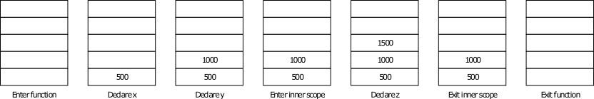
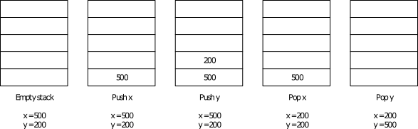

# Software Development 2 Lab 06 -- Inline Assembly Programming

<script src="https://cdn.jsdelivr.net/npm/code-line"></script>
<script>CodeLine.initOnPageLoad({toggleBtn: {show: false}, copyBtn: {show: false}})</script>
<link rel="stylesheet" href="/module-content/css/block.css">

**WARNING -- before starting this lab it is recommended that you use a Windows machine only with the Microsoft compiler. Assembly is platform-specific and we will only cover the Microsoft toolchain.**

We've looked at how our C data values are represented in memory (their *low-level representation*).  In this unit, we will look closer at how our operations are represented.  This requires us to look at the assembly code.

If we look at how a compiler works, we can take the following high-level view:

*C Code* **&rarr;** *Assembly Code* **&rarr;** *Object Code* **&rarr;** *Executable*

In this unit, we will look at how we can use assembly code directly in our C++ code.  This can be very useful if you ever want to undertake very low-level optimisation.  However, for our purposes, we are trying to understand how our C++ code translates to assembly code.  This allows us to understand our code in more detail.  In general, you are unlikely to write inline assembly in all but the rarest circumstances as a C++ programmer.  However, understanding what your code looks like on the machine is very useful.

One thing to remember is that assembly code is architecture-specific.  That is, the assembly code that works on a standard PC generally won't work on your mobile phone (unless it uses an Intel-based CPU).  Programming in assembly is very platform-specific, hence the performance gains it can give.

## Disassembly


## Stepping through Assembly


## First Inline Assembly Application

Let us look at how we add assembly code to our C++ code.  **The approach we take is supported by the Microsoft compiler and is not guaranteed to work in other compilers.**  You should read the necessary documentation for these compilers to discover how to write inline assembly for them.

> **Declaring an Inline Assembly Block**
>
> To use inline assembly in our C++ code we have to declare a block of code as being assembly.  For the Microsoft compiler we do this as follows:
>
> ```c
> __asm
> {
> 	// Assembly commands go here
> }
> ```
>
> The assembly block can access any values that are accessible where the assembly block is declared.  Any local variables to the function and any global variables can be accessed via their name.  The C++ compiler will generate the proper assembly code to use them.

We won't really look at assembly code instructions supported by standard x86 processors in any detail.  The following table provides an overview of the instructions we will use in this unit.

| **Instruction** | **Parameters**     | **Description**                                              |
| --------------- | ------------------ | ------------------------------------------------------------ |
| `mov`           | destination source | Moves the value stored in source to the destination.  At least one of the two parameters must be a register |
| `add`           | destination source | Adds the value source to the value destination.  The result is stored in destination. Destination needs to be a register. |
| `push`          | source             | Pushes value stored in source onto the local stack.  We will discuss the stack during this unit, and look at its limitations later in the module. |
| `pop`           | destination        | Pops a value from the local stack into the destination.      |
| `call`          | procedure name     | Executes the given procedure.  We will look at what this means in later in the unit. |
| `jmp`           | location           | Causes control to jump to the location given.  Jumping allows us to implement branching instructions like `if` and `while`. |
| `cmp`           | value1 value2      | Compares the two values.  Sets relevant flags on the CPU based on the outcome of the comparison.  Allows conditional jumping. |
| `jge`           | location           | A jump instruction that jumps if the result of a comparison set the greater than flag. |

Let us now write our first application using inline assembly.  Our application will declare two values (in standard C++) and print out their values.  Our assembly block will then store the value of one variable into the other.  Finally, we will print the values again (in standard C++).

To store one variable into the other we use the following process:

- Load (using `mov`) the first value into the `eax` register (the `eax` register is the standard accumulator register)
- Load (using `mov`) the value store in the `eax` register into the second value.
  \end{enumerate}

And that is it.  This is essentially equivalent to the following command:

```c
x = y;
```

The code for this application is given below.  As you can see it is very simple. **Add this code file now -- `assemble.cpp`**:

```c
#include <iostream>

using std::cout;
using std::endl;

int main(int argc, char **argv)
{
    int x = 500;
    int y = 0;
    
    cout << "Before assembly, x = " << x << ", y = " << y << endl;

    __asm
    {
        mov eax, x
        mov y, eax
    }

    cout << "After assembly, x = " << x << ", y = " << y << endl;
    return 0;
}
```

## Second Inline Assembly Application

Our second application behaves similarly to the first, but now we are only going to work with one variable.  This we will change the value of the single variable in the assembly block using a fixed value.  Our code for this application is below.

```c
#include <iostream>

using std::cout;
using std::endl;

int main(int argc, char **argv)
{
	int x = 0;
	cout << "Before assembly, x = " << x << endl;
	__asm
	{
		// Same as x = 500
		mov x, 500
	}
	cout << "After assembly, x = " << x << endl;
	return 0;
}
```

The assembly block is essentially the same as the following C code:

```c
x = 500;
```

Running this application will provide the following output:

```shell
Before assembly, x = 0
After assembly, x = 500
```

We have now looked at variable assignment in assembly, and you can see how C++ commands roughly translate to assembly code.  Let us now move on to other operations.

## Using Assembler Operations

Assembly provides a number of standard operations to manipulate numerical values.  One of these is `add`.  This command allows us to add a value to one of the registers.  This is our standard method of adding values together.  To do this we normally perform the following operations in assembly:

- Store first value into a register
- Add second value to the register
- Store the result to memory

This is the standard approach to performing simple arithmetic operations in assembly code.  There are a number of different assembly code instructions that deal with arithmetic operations.  Our application will perform addition.

Our application will add two variables -- `x` and `y` -- and store the result in another variable `z`.  We will use the `ecx` register to undertake our calculation.  Converting our steps above into assembly code we get the following:

```assembly
mov ecx, x
add ecx, y
mov z, ecx
```

Our application code is below:

```c
#include <iostream>

using std::cout;
using std::endl;

int main(int argc, char **argv)
{
	int x = 500;
	int y = 200;
	int z = 0;
	
	// Add using assembly
	__asm
	{
		// Move x into ecx register
		mov ecx, x
		// Add y to ecx register
		add ecx, y
		// Store in z
		mov z, ecx
	}
    
    cout << "z = " << z << endl;
	
    // Add in code
	z = x + y;
	
	return 0;
}
```

The application is the equivalent of the following code.  In fact, we also perform the operation at the end of the main application (line 26).  You can examine this as part of an exercise.

```c
z = x + y;
```

Running this application will provide you with the following output:

```shell
z = 700
```

### Exercises

- Try some other arithmetic operations and test the results.  Ensure that you get the result you expected.  The operations to try are:
  - `sub` -- subtraction
  - `imul` -- multiplication
  - We won't try division here as it is a bit more complicated, but the recommended reading will help.
- For each application, you have built in this section (addition, subtraction, multiplication) compare the resulting Assembly code you have written to the one generated by the compiler (such as the command on line 26 in the last example).  Ensure you are getting the same result to ensure you understand the concepts covered.

## Using the Stack

Now that we understand the basic concepts of how simple instructions in C++ are converted to assembly code instructions we can move on to starting to understand what happens when we call functions in C++.  You might have seen some of the code for this in our assembly code generated by the compiler, but we haven't really gone into any detail yet.  Before we can really look at function calling, we have to understand a fundamental part of our running application -- *the stack*.

### What is the Stack?

When working with a running application written in a low-level language such as C++, we have to consider two parts of memory.  The first part -- and the only part we have really been working in -- is the stack.  The other part of memory, *the heap or free store*, is dynamic memory controlled by the user.

The stack can be considered the *working memory* of our application.  It keeps track of the variables that are currently in *scope*.  Variables in scope are the values that we can currently directly access.  Again, we will cover exactly what this means in a later unit.  However, for the moment you should understand that when you call a function that only variables passed into the function are accessible unless you have any global variables as well.

The stack is therefore a list of the values that you have created during the running of your application using standard variable declaration.  It allows us to grab these variables and use them for our operations. The CPU keeps track of the current stack for us, adding or removing values as they come into and out of scope.

As an example, consider the following piece of code:

```c
void func()
{
	// Enter the function
	// Declare 2 values
	int x = 500;
	int y = 1000;
	{
		// Enter an inner scope
		int z = x + y;
		// Exit inner scope - z removed from stack
	}
	// Exit the function - x and y removed from stack
}
```

The code above operates on the stack as illustrated below.  When we enter the function, we can consider the stack to be empty (it isn't really, but for our example here we can consider it as such).  When we declare our first variable `x` it is added to the stack.  Then `y` and finally `z`.  As each scope is exited, certain values are removed from the stack.  Therefore, we keep track of values that have been declared.



> **WARNING - This is a Simplified Idea of the Stack**
>
> This is not truly how the stack works in practice.  Space is allocated on the stack well before you actually declare the values.  The stack is in fact a limited resource.  Generally, only 1 MB of space is allocated to a stack, and we have an offset on the stack to the various variables that have been declared.  A *stack pointer* keeps track of how much of the stack is in scope, moving up and down based on need.  No values are really *removed* from the stack, the CPU just considers memory beyond the stack pointer as no longer valid and may overwrite it if it wishes.

We will see why we need the stack for this purpose through this unit of the module and some later units.  For just now, we will look at how we work with the stack.

### Working with the Stack

When it comes to working with the stack, we are really only interested in the following two commands:

- `push` -- adds a value to the stack
- `pop` -- removes a value from the stack and stores it in the given location

These two machine instructions are very simple, and only take a single parameter.  For example, if we want to store the value in variable `x` on the stack, we use the command `push x`.  To remove a value from the stack and store it in variable `y` we use `pop y`.  The instructions are simple, **but the idea of how the stack operates is important**.  You should familiarise yourself with the basic concept, and use the next few examples to fully understand what is happening.

### Test Application

Our test application will swap two variables -- `x` and `y` -- using the stack as a swap space.  **We already know that this is not how the C++ compiler would actually perform this operation, so do not convince yourself that it is**.  Therefore this isn't a real-world example.  However, this example does give you a good idea of how the stack operates.

```c
#include <iostream>

using std::cout;
using std::endl;

int main(int argc, char **argv)
{
	int x = 500;
	int y = 200;
	
	__asm
	{
		// Push x onto the stack
		push x
		// Push y onto the stack
		push y
		// Pop stack into x
		pop x
		// Pop stack into y
		pop y
	}
	
	cout << "x = " << x << ", y = " << y << endl;

	return 0;
}
```

The below figure illustrates how this application operates when executing the Assembly code section (although the stack isn't really empty).  The output of this application is also shown below.



```shell
x = 200, y = 500
```

## Calling Functions

With our understanding of the stack, we can now move on to calling actual functions.  This requires us to set parameters to pass to the function -- which is where the stack comes in.  However, before moving on to how we use the stack to accomplish this, we will look at how we actually `call` a function.

### Calling Procedures in Assembly

To call a procedure in Assembly we use the `call` command.  All this instruction requires is the name of the procedure you wish to call.  For example, to call `printf` we simply use the instruction `call printf`.  This will cause the CPU to *jump* to the set of instructions that define the `printf` procedure.  At the end of the procedure, the CPU returns to where it encountered the `call` operation and continues executing the instructions.  This is achieved by the `ret` instruction.

### Setting the Stack

As you should realise by now, calling a function/procedure is only one part of the puzzle.  We also have to pass parameters into the call for the procedure to use.  This is where the stack comes in.

Before calling a procedure, you have to add the values of the parameters to the stack.  This is because the called procedure needs a *copy* of these values (we will look at call conventions later in the module).  As we need to create a copy, and the procedure needs to know where these values are stored (based on it's parameter list), we have to push these values onto the stack.

As an example, consider a function defined as follows:

```c
void func(int x, int y) ...
```

We need to set the values of `x` and `y` for the procedure to operate.  For example, let us say we called the procedure as follows:

```c
func(1000, 2000);
```

To actually call this function in assembly we would have to use the following instructions:

```assembly
push 2000
push 1000
call func
```

Notice that we push the parameter values from right to left, not left to right.  This is because the procedure will look at the top of the stack as the starting point for its parameters and work downwards.  Therefore, the first parameter for the procedure (`x` in our example) has to be at the top of the stack, the second one value down, the third two values down, etc.  **This is another important idea to realise and is underpinned by an understanding of how the stack works -- last-in, first-out.**

### Clearing the Stack

Setting the stack for use by a procedure is what you should do before you call it.  After the procedure has returned you need to clean up the stack again.  This is done by popping the relevant number of values of the stack (actually in practice there is a better way -- see the exercises).  In our example we will pop any stack values into the `ebx` register to clean the stack.

### Example Application

To review, we use the following three-stage process when calling a procedure in Assembly code:

1. Set the stack with the relevant parameters.  Remember we push these values in reverse order than we use them.

2. Call the procedure.

3. Clean the stack of any set parameters.

Let us now see what happens when we create and call our own function in C++.  To do this we will write a small subtraction function that will take two values as parameters and return the difference.  The code for this sample is given below:

> **Getting Return Values from a Function Call**
>
> So far we haven't covered how we get our return value after a function call.  Well, this value has been stored for us in one of the registers -- `eax`.  This means that we can retrieve it from there if we wish.  For example, let us say we are going to write the following code:
>
> ```c
> int z = sub(1000, 500);
> ```
>
> In Assembly code this becomes the following set of instructions (if we do naive stack cleaning):
>
> ```assembly
> push 500
> push 1000
> call sub
> mov z, eax
> pop ebx
> pop ebx
> ```
>
> Line 4 is the important one.  This is where we store the result of the function call into our required memory location.  It is the job of the function to store the function result into the `eax` register.

```c
#include <iostream>

using std::cout;
using std::endl;

int sub(int x, int y)
{
	return x - y;
}

int main(int argc, char **argv)
{
	int result = 0;
	
	__asm
	{
		// Push 500 onto stack
		push 500
		// Push eax onto stack
		push 200
		// Call sub
		call sub
		// Move eax into result
		// eax contains the result of the call
		mov result, eax
		// Clean up stack - pop into ebx
		pop ebx
		pop ebx
	}   

	cout << "result = " << result << endl;
	
	return 0;
}
```

You should understand this code enough so that we don't have to explain it in any detail.  The more important part if the generated assembly code:

Running this application gives the following result:

```shell
result = -300
```

## Why did we Just Look at Assembly?

Just to end this unit, we will reflect on why we have looked at assembly.  The main point here is to understand how C++ code is converted into assembly code.  It is rare that you would write the type of assembly code we have, but, hopefully, you see the similarity between standard C++ code and what the machine executes as instructions.  Remember that a typical processor these days will have a clock speed between 2 and 4 GHz.  This implies that the CPU is executing 2 to 4 billion of these instructions per second (again, this is a simplified description -- it isn't as easy as that).  The fact that C++ compiles to small, compact assembly instructions is the reason C++ is considered a fast language.

## Additional Resources

Our aim in this unit was to give you an understanding of how C++ code converts to assembly.  As such, we haven't delved too deeply into a wide range of aspects in low-level programming.  However, if you are interested the following link provides a reasonable starting position:

<http://www.cs.virginia.edu/~evans/cs216/guides/x86.html>{:target="_blank"}

## Exercises

1. Investigate the `struct` examples from the previous unit.  You should examine the disassembly from some of the previous examples and examine how C++ works with `struct` values.  Try your best to try to figure out what is happening, but don't let yourself get too caught up if you are unsure.  Ask for help if needed.
2. Using the `esp` register.  The `esp` register is the stack pointer and can be modified to tell the CPU where it should consider the stack to be valid.  When we looked at function call, we used `pop` to clear the values we added to the stack.  This is efficient for one parameter, but not the most efficient for greater numbers of parameters (lots of `pop` instructions).  A better method is to set the `esp` register so that it points back to where the valid stack ends.  Can you change some of our example applications to achieve this? *Hint - the assembly code from some of the other applications where you have called functions may help you here.*  The `ebp` register (*stack base pointer*) is also used.
3. **For the Brave** -- Write an application, using inline assembly as much as possible, that prompts the user for their name and reads in the result using `fgets`.  This is not as simple as it sounds.
4. **For the Brave** -- Write an application, using inline assembly as much as possible, that works on an array of 10 integers.  The application will have two `for` loops.  The first loop will set the value of the numbers in the array from 0 to 9.  The second `for` loop will print the entries and sum the total.  At the end of the second `for` loop, the total should be displayed.

