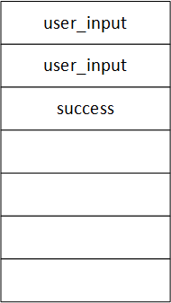

# Software Development 2 Lab 10 -- Defensive Programming

<script src="https://cdn.jsdelivr.net/npm/code-line"></script>
<script>CodeLine.initOnPageLoad({toggleBtn: {show: false}, copyBtn: {show: false}})</script>

<link rel="stylesheet" href="/module-content/css/block.css">

This final unit will explore some of the real problems that can be faced when writing bad code.  Bad code is one of the biggest costs to a company.  You may even have heard the term [technical debt](https://en.wikipedia.org/wiki/Technical_debt).  This is the idea that your easy solution now has a cost in the future -- either from rework or other costs.  We will look at some examples of bad code and where you can explore to find more.

## Why Bad Code is Bad

Admit it.  You've written some bad code during this module.  For whatever reason, there is a bit of code that you hacked together and ended up just leaving alone.  There are many reasons you may have done this:

- You didn't understand the code being asked for and you cobbled together something that seems to work.
- You have been unsure about what to do, or a bit lazy, and you searched Stack Overflow for an answer and just pasted it in hoping it would be OK.
- You left your coursework submission too late and have ended up hacking something to meet the deadline.  This is a common reason in industry also.
- Something other reason just to get by.

The problem is that your code still exists.  If you had written it for a piece of production software you would have a big problem.  How often have you had a program fail and you have cursed it.  What about lost data or work?  Maybe even you have had a device die for no reason except what seems to be bad software.  We have all been there.

You are training to become a programmer.  If you are willing to complain about bad code you should be willing to do something about it by writing good code.  It is your duty to the rest of us!  Spending that time on actually writing good solutions to problems will make you a better programmer overall as your skills and craft will increase.

Your code is never just for you.  You write code that others can use, or will work with to maintain a system.  One of the reasons we assess your code quality is that you need to get into good habits now.  Developing bad habits will just give you more work later.  And just wait until you have to do group work.

And for those of you who use Stack Overflow and do not learn the solution -- we know!  This will not serve you in the coming years as you struggle to understand advanced techniques.  The point is, Stack Overflow is great **IF** you learn the solution and integrate it into your code.  If you just copy-and-paste that is all you have learned: to copy-and-paste.  The easy path is not going to serve you in the long-term.

So writing good code is a duty, and you have to spend the time learning your craft.  Bad code leads to vulnerabilities and inefficiencies that will be problematic later.  It also means that you enforce bad habits which take time to overcome.  And you are not the special one who this idea does not apply to.  Every programmer (including me) should constantly practice to improve their overall coding capability.

## Some Dangerous Code Examples

The key message of this unit is that code can be dangerous.  We will look at a number of different reasons how this can be.  **Be warned** -- these examples are simple but many applications still suffer from the problems illustrated.  Our aim here is to show what can happen when you write bad code.  But first, we are going to review how the stack works.  We will be exploiting this behaviour in our dangerous code examples.

### Stack Behaviour

Let us review once again how the stack works.  Remember that when you declare local values they are added to the stack in the order that you placed them.  For example, if we use the following code example:

```c
#include <stdlib.h>

int main(int argc, char **argv)
{
  int x;
  int y;
  char str[8];
  return 0;
}
```

Our stack would look like the one shown below.  Note that the stack fills from the top, not the bottom.  This is what happens in memory.  It allows the stack and heap to grow towards each other.


The problem is that we can point directly into the stack -- we just need a memory address -- and overwrite values.  This is especially problematic when using operations that are unbounded.  An unbounded operation is one that will just copy as much data as possible from a given memory address or to a given memory address.  This will lead to accessing unwanted data or overwriting existing data.  We discussed this idea when working with character arrays that were not null-terminated.  So how dangerous can this be?

### Overwriting Data

The following code sample -- `password.c` -- is an example of what will happen when you overwrite data.  We are using the dangerous `gets` operation to read in user input.  `gets` is unbounded and will simply read in user input into memory until a new line is detected.

```c
#include <stdlib.h>
#include <stdio.h>
#include <string.h>

#define PASSWORD "password"

int main(int argc, char **argv)
{
  // String to read user input into
  char user_input[8];
  // Flag to indicate is login was successful.
  int success = 0;

  printf("Enter password: ");
  // **** DANGER ****
  // Do not use gets
  gets(user_input);

  // If password is correct grant root access
  if (strcmp(user_input, PASSWORD) == 0)
  {
    printf("Login successful\n");
    success = 1;
  }
  else
  {
    printf("Login failed\n");
  }

  // Check if root access given
  if (success)
  {
    printf("Root access granted\n");
  }

  return 0;
}
```

Looking at the stack for this application we have that shown it is:



So what is the problem here?  Well look at how the stack is laid out.  What happens when we read into `user_input`?  The danger is that is too much data is read in (via `gets` on line 17) it will overwrite the value of `success`.  Note that `success` is set to 0 (false) at the start of the application, and we only change is to 1 (true) when the password is correct.  The problem is, `gets` may overwrite the value of `success`.  For `success` to be determined as true, it just needs to be non-zero (remember our discussion on data types).  Thus, any suitable input from `gets` may result in the message `Root access granted` from appearing.

OK it is not as bad as all that.  Modern C and C++ compilers recognise various problems with stack overwriting and try and protect against it.  This is typically referred to as a [stack guard](https://en.wikipedia.org/wiki/Buffer_overflow_protection).  By default, compilers will have this switched on.  So to break our code we have to switch it off.  To do so, compile the program as follows:

```shell
cl filename /GS-
```

If you run this application you can test out some basic behaviour:

```shell
Enter password: hello
Login failed

Enter password: password
Login successful
Root access granted

Enter password: xxxxxxxxxx
Login failed
Root access granted
```

Oops.  Looks like we granted root access to a user who didn't successfully login.  Oh well, I'm sure nothing bad will happen....

> **Rule 1 -- Don't use `gets` (or other unbounded operations)**
>
> This is our first rule when writing good quality code in C and C++.  You might think that we had to manipulate things to make this work but it is a toy example.  The compiler may not pick up that you have written the above vulnerability if the example is complex.
>
> Also -- for the copy-and-paste Stack Overflow crowd -- how often do you blindly follow instructions and copy code?  You may switch off the stack guard because of an example you found on the Internet.  *If you don't know what you are doing, then you can create vulnerabilities in your code!*

> **Default Compiler Flags on Microsoft's Compiler**
>
> We can test the default compiler flags that `cl` uses as follows:
>
> ```shell
> cl filename /Bd
> ```
>
> Most of these are going into a depth that we are not covering in the module.  However, there are a few ones worth noting:
>
> - **W** Warnings off.  By default `cl` turns off warnings.  Turning these back on can help write better code.  You can even turn warnings into compiler errors (`WX`), although if you do so with the maximum warning level you'll find that the standard library code will stop your programs from compiling.
> - **GS** Stack guard on.  This is what we talked about above.
> - **Zp8** Data is aligned to 8 bytes.  This is about how memory is laid out for optimal performance.  This will become important if you study anything which requires fast code.
> - **Ot** Generate fast code (optimisation).  Optimisation can be turned off, or produce small code, or both.  Optimisation effectively reorders the instructions and memory to suit requirements.  This can be advantageous but makes debugging harder.
> - **Ob0** Disables inline function expansion (doesn't replace functions by inserting code).  This is an important optimisation that can be switched on to allow faster yet larger code to be produced.
> - **MT** Create multithreaded application (even if you don't need them). By default all Windows applications have multithreaded support turned on.
>
> We will not concern ourselves with these flags beyond the stack guard, but you should be aware of what the compiler is doing to produce your code.

### Acting Like a Superuser

Another problem that can occur is when we let a program act as the administrator or root.  When a program does this, any other process it creates also has those rights.  So what does that mean?  Well in C we can execute external applications using the `system` command.  An example is shown in the code below.

```c
#include <stdlib.h>
#include <stdio.h>
#include <string.h>

void get_name(char *name)
{
  printf("Enter your name: ");
  gets(name);
}

int main(int argc, char **argv)
{
  // We are going to read in our name and run notepad.
  char name[16];
  char program[32];
  strcpy(program, "notepad");

  // Get the name of the user.
  get_name(name);

  // Run notepad -- DANGER! What are we actually running?
  system(program);

  return 0;
}
```

Note that at the start of the program we copy `notepad` into our execution string (line 16) and this command is executed as a new process (line 22).  When we read in the name we can overwrite this execution string.  Problems occur when we write to sections of the file system we aren't meant to. 

## Stack Behaviour During Function Calls

We also discussed setting the stack when we worked with inline assembly.  We did this for passing parameters into a call.  Well, a bit more happens than that.  For a function to return at the end of the call it needs a return address.  This value is also stored on the stack, and can also be overwritten.


If we can overwrite the return value with the address of some other piece of code then it will be executed instead.  Can we do this?  Yes!  And all we need is the address of the code we want and Python.

## Stack Smashing -- Running Uncalled Code

The following program is another toy example where we get the addresses of our code directly.  In practice, hackers will use debug tools (like we have already used) to find these values.  We are just doing it in a simpler manner.

```c
#include <stdio.h>
#include <string.h>

void copy_string(const char *input)
{
  char buf[8];
  // This prints out the current stack
  printf("My stack is:\n%p\n%p\n%p\n%p\n%p\n%p\n%p\n%p\n\n");

  // Copy raw user input into the buffer - VERY DANGEROUS!
  strcpy(buf, input);
  printf("%s\n", buf);

  // Print the stack again
  printf("My stack is:\n%p\n%p\n%p\n%p\n%p\n%p\n%p\n%p\n\n");
}

void uncalled()
{
  printf("How was this called?!?");
}

int main(int argc, char **argv)
{
  // We could get the function addresses using a debugger but we will cheat!
  printf("Address of main = %p\n", main);
  printf("Address of copy_string = %p\n", copy_string);
  printf("Address of uncalled =  %p\n", uncalled);

  char input[8];
  gets(input);

  copy_string(input);
  return 0;
}
```

So let us run the application.  The following gives an example:

```shell
Address of main = 00131070
Address of copy_string = 00131000
Address of uncalled =  00131050
xxxx
My stack is:
FFFFFFFF
00000001
00AFFE80
001310C1
00AFFE78
78787878
00131100
00AFFEC8

xxxx
My stack is:
78787878
00000000
00AFFE80
001310C1
00AFFE78
78787878
00131100
00AFFEC8
```

The key points to note is where the return address is on the stack.  It is the fourth entry down (`001310C1` in this example).  With that information, we can send input into the application that calls this code.  We do this via Python, which allows us to send a hex string to the application by piping data.  Data is pushed in reverse order on Windows, so we have to flip the input.  To call `uncalled` we just use its address -- `00131000`.  The following is an example (replace memory address accordingly):

```shell
python -c "print('x' * 12 + '\x50\x10\x13\x00')" | exploit

Address of main = 00131070
Address of copy_string = 00131000
Address of uncalled =  00131050
My stack is:
FFFFFFFF
00000001
00EFF87C
001310C1
00EFF874
78787878
78787878
78787878

xxxxxxxxxxxx
My stack is:
78787878
78787878
78787878
00131050
00EFF874
78787878
78787878
78787878

How was this called?!?
```

And there you go.  You have now executed code that should not have been.  This could be anything, and if the program has administrator privileges then things are worse.

## Some CERT Coding Standards

The point of this unit is to introduce some coding standards.  We will use the CERT set of rules(<https://wiki.sei.cmu.edu/confluence/display/seccode/SEI+CERT+Coding+Standards>).  These are defined to support secure and safe code.  A number of languages are defined, including C and C++.  We will be using C.  You should bookmark this resource as it will be useful for you in the future.

For this section we will only look at a small number of rules.  This will give an introduction to some problems that can occur.  Some you may have even experienced.  You should review the rules and apply them.  These rules will make you a better programmer.  We won't look at the solutions to these problems.  To do this you should review the rules online.  Solutions are available there.

### STR30-C Do not attempt to modify string literals

A string literal is a string that you have hard-coded into your program.  For example:

```c
char *str = "hello world!";
```

This string is stored specially in memory rather than as a variable.  It is actually defined in the resulting assembly and machine code.  This means that it is in a section of memory you cannot modify.  So if you try, as the example below, you will get an error.

```c
#include <stdlib.h>
#include <stdio.h>

void modify(char *str)
{
  // Try to modify the string
  str[0] = 'm';
}

int main(int argc, char **argv)
{
  char *str = "hello world!";
  printf("str = %s\n", str);
  modify(str);
  return 0;
}
```

The C Standard Library has a number of functions that manipulate strings.  If you call them with a string literal your program will also fail.  So ensure you recognise when you want to work with a string variable rather than a constant.

### STR31-C Guarantee that storage for strings has sufficient storage for character data and the null terminator

We have already covered the problems of having strings without null-termination. Without sufficient storage for storing string data and the null-terminator we get undefined behaviour.  If we try and print a string that is not null-terminated we end up printing out extra memory.  This can be dangerous depending on what is in the memory, such as password data.

### STR32-C Do not pass a non-null-terminated character sequence to a library function that expects a string

This is a follow-on from the above rule.  If you pass a non-null-terminated string to a library then it will suffer the same problem.  In fact that is what we have shown with `printf` -- it is a library function that expects a null-terminated string.

### STR34-C Cast characters to `unsigned char` before converting to larger integer sizes

We have also covered the problem with casting data.  This is a problem when we are working with character data and working with library functions that expect `int` data.  Due to the values representing characters being signed, they will convert into incorrect data values.  This can cause problems when reading a file (the `EOF` marker might be evaluated incorrectly) or when working with signals in general.

### STR38-C Do not confuse narrow and wide character strings and functions

This is an area we have not covered: wide-character data.  You are familiar with ASCII strings which are represented by characters of values from 0 to 127.  But that does not cover the complete character set.  If you have accented characters (such as those in many European languages) or non-Latin characters (such as Chinese, Arabic, etc.) then we need more characters.  This is done by proving Unicode data, and using wide-character data.  Wide-character data is a character that is 8-bits, 16-bits, or 32-bits rather than just 8-bits.  It is declared as follows:

```c
wchar_t c;
```

So what is the problem here?  Well, if you treat data as normal-character (narrow) rather than wide-character data in functions it will cause a problem.  The following provides an example:

```c
#include <stdlib.h>
#include <stdio.h>
#include <string.h>

int main(int argc, char **argv)
{
  wchar_t *wstr1 = L"hello world!";
  wchar_t wstr2[13];
  printf("%s\n", wstr1);
  printf("%ls\n", wstr1);
  strncpy(wstr2, wstr1, 13);
  printf("%ls\n", wstr2);

  return 0;
}
```


If you run this you will get the following output:

```shell
h
hello world!
h
```

So what is happening?  The first `printf` call treats the wide-character-string as a normal-string (uses `%s`).  This means that it encounters what looks like a null-terminator immediately in the `h` character.  Its bit pattern is as follows:

```c
01101000 00000000
```

The second 8-bits are all zero, which is null.

The second `printf` is the correct way to print the string using the wide-character-string placeholder (`%ls`).

The third `printf` happens after the `strncpy` command.  This also gets hit by the incorrect use of a normal-string function.  The `wcsncpy` (Wide-Character String-N CoPY) function is the correct one.

## FIO30-C Exclude user input from format strings

We will now look at another exploit -- the format-string exploit.  This is a big problem when working with functions such as `printf` and `fprintf`.  The following code provides an example:

```c
#include <stdlib.h>
#include <stdio.h>
#include <string.h>

int main(int argc, char **argv)
{
  char buf[100];
  int x = 1;
  snprintf(buf, sizeof(buf), argv[1]);
  buf[sizeof(buf) - 1] = '\0';
  printf("Buffer is: (%d) \nMemory address for buf: (%p) \nData input: %s \n", strlen(buf), buf, buf);
  printf("X equals: %d/ in hex: %#x\nMemory address for x: (%p) \n", x, x, &x);
  return 0;
}
```

This program will copy input from `argv[1]` (remember `argv[0]` is the program name) into a buffer (line 9) and then prints it out (line 11).  Let us look at some examples.

```shell
format-string "Bob"
Buffer is: (3) 
Memory address for buf: (0x7ffc6a29c1f0) 
Data input: Bob 
X equals: 1/ in hex: 0x1
Memory address for x: (0x7ffc6a29c1ec)

format-string "Bob %p %p"
Buffer is: (33) 
Memory address for buf: (0x7ffd7c5c4eb0) 
Data input: Bob 0x7ffd7c5c4eb0 0x7fdb908acc60 
X equals: 1/ in hex: 0x1
Memory address for x: (0x7ffd7c5c4eac)
```

How did the second example end up printing memory addresses?  Well, the `%p` in the input string was used by `printf` as a placeholder, and it printed out parts of the stack (we saw this problem earlier).  We now know some useful memory addresses that we could exploit (such as the address of the buffer).

Basically, you shouldn't print out user-input using `printf` or `fprintf` (I know, we did this liberally).  When working with user-input, use `fputs` instead.

### FIO34-C Distinguish between characters read from a file and `EOF` or `WEOF`

The `getchar` function can be a source of problems.  It returns an `int` value rather than a `char`.  This is to allow certain control errors to be returned.  One value it may return is a value equalling `EOF`.  The `EOF` value is negative and not a character, but when cast to an `int` it might not be.  As such, you should actually check you have reached the end-of-file marker by calling a function:

```c
if (feof(stdin)) ...
```

This will return true only if the file end point has been reached.  Otherwise, an error is likely to have occurred.

## FIO37-C Do not assume that `fgets()` or `fgetws()` returns a nonempty string when successful

This problem occurs when reading in data and then using `strlen` or similar.  For example:

```c
#include <stdio.h>
#include <string.h>

void func(void) 
{
  char buf[1024];
  if (fgets(buf, sizeof(buf), stdin) == NULL) 
  {
    /* Handle error */
  }
  buf[strlen(buf) - 1] = '\0';
}
```

The issue is that we believe the string does not start with a null-terminator.  If the first character is a null-terminator (we hit return for the input) then we are setting `buf[0 - 1]` to null.  This is not -1 as the size is unsigned.  Hence, we are attempting to set a high-memory location to null.  The program will likely crash.

### MSC24-C Do not use deprecated or obsolescent functions

This one is probably the most important.  There are a number of Standard Library functions you should not use.  We have used these in our code before, so you should be going back through and correcting our mistakes.  There is only one deprecated function in C at the moment, and that is `gets`.  We already covered this.  The other functions are obsolescent and are listed below:

- `asctime`
- `atof`
- `atoi`
- `atol`
- `atoll`
- `ctime`
- `fopen`
- `freopen`
- `rewind`
- `setbuf`

## Some Tools and Useful Resources

Thankfully, compilers and supporting tools have got better in the last few years, and the detection of errors has improved.  A number of tools are available, and a number of useful websites.  We list some here in no particular order:

- Open Web Application Security Project (OWASP) <https://www.owasp.org/index.php/Main_Page>.
- CERT Coding Standards <https://www.cert.org/secure-coding/>
- Clang Static Analyser <https://clang-analyzer.llvm.org/>
- Parasoft C/C++ Test <https://www.parasoft.com/product/cpptest/>

You should be working on improving your coding standards now, and on integrating these tools into your workflow.  Security and secure coding are important skills with a lot of money behind them just now.  Putting in our efforts here will make you a more valuable programmer in the long-run.

