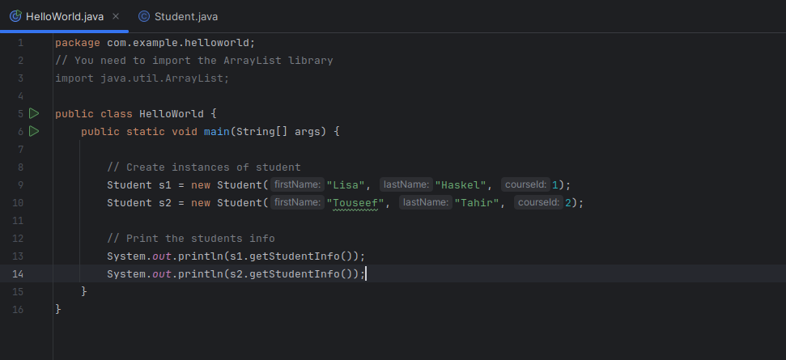

# Software Development 3
# Lab 1

## Intro to Java, Intellij and OOP


### Intellij

NB: these instructions are for Visual Studio NOT Visual Studio Code.

Intellij can be found on the University computers. On your own computers you may download from : 

[https://www.jetbrains.com/idea/download/](https://www.jetbrains.com/idea/download/)

The Community edition is free.

Launch intelliJ from the start menu of your computer.

## Hello world in Java with IntelliJ

Follow this tutorial to create your first java application:
[https://www.jetbrains.com/help/idea/creating-and-running-your-first-java-application.html](https://www.jetbrains.com/help/idea/creating-and-running-your-first-java-application.html)

Stop at the heading 'Package the application in a JAR'. We will cover this later.


### Starting Java

If you have followed the above tutorial you will have a single Java class with the following code:

```java
package org.roehampton.sd3.examples;

public class HelloWorld {
    public static void main(String[] args) {
        System.out.println("hello world");
    }
}
```
Which you should be able to run by clicking the green arrow in the line numbering section next to your code.

_NOTE THAT: In Java, a 'main' method which conforms to the signature ```public static void main(String[] args)``` will be the 'entrypoint' to your program, ie. it is the code that will run when your program is launched.

Here are the fundamental features of any programming language. You know them from your previous modules.  When you learn a new language you should always look up these topics and learn how the language implements them.


   * Types and variable declarations
   * Basic syntax: expressions and code blocks
   * Variable scope
   * Function definitions
   * Comments
   * Conditional statements
   * Loops (iteration)
   * Modules and namespaces
   * Classes and objects <----- The main part of this module!

## Getting to know Java Fundamentals

Familiarise yourself with the language fundamentals above by completing the following tasks.

### Types and variable declaration

In your public static void main method, delete the line which prints 'HelloWorld'. Replace it with the follwoing

```java
public class HelloWorld {
    public static void main(String[] args) {
        int a = 42;
        int b = 119;
        int c = a + b;
        System.out.println(c);
    }
}
```

Run the code with green arrow.  Notice that the code compiles before it is run.

Now change the variable declaration of b to the following

```java
 String b = "119";
```
What happens? Why? 

Finally change the variable declaration of c to the following

```java
 String c = a + b;
```
What happens?  Do you get the same answer as when b and c are ints?

#### Now you know...

   * how to print information back to the user
   * that you must declare each variable before you use it with the correct type
   * Java is a strongly typed language: you cannot mix types without errors occuring
   * that java is a compiled langauge so that errors may be 'compile time' or 'run time'. 


## Arrays and loops

```java
package org.roehampton.sd3.examples;
import java.util.ArrayList;

public class HelloWorld {
    public static void main(String[] args) {
        int a = 42;
        String b = "119";
        String c = a + b;
        System.out.println(c);

        // ArrayLists are collection objects that can be dynamic in size.
        ArrayList<String> d = new ArrayList<String>();
        d.add("one");
        d.add("two");
        d.add("three");

        // A simple 'for' loop can iterate over d, creating a new variable s with every iteration of the loop
        for  (String s : d) {
            System.out.println(d.indexOf(s) + ":" + s);

        }


    }
}
```

4. Add some code to the above exercise such that there is only output if the number is 6.  Comment your code with at least one single line and at least one multiline comment.


### Create your first class and objects

You will create the student class as represented by this class diagram. You will create two student objects in your 'main' function in Program.cs and output correct information about them.


1. Create a new file called Student.cs. It should be in the same directory as your Program.cs file.  _(HINT: you can right click on your project in the solution explorer, got to 'add', 'new item' and then c# code file or class. You will then need to rename the file, again with a right click.).  It is conventional that you have just one class per file, and that the file name is the same as your class name.
2. Add the following code to Student.cs (you will not be able to cut and paste!!)


3. To create objects of class Student, go back to Program.cs and write the following:



4. This code should run but its not giving you useful results. Go back into Student.cs and amend the getFormattedName() method so that the name and course of each student is printed correctly.

Hint: you can use 'string interpolation' to embed variables into strings for example:

```c#
string teacher = "LisaH";
string hello = $"Hello {teacher} !";
Console.WriteLine(hello);
```

The outupt of this snippet would be

```
Hello LisaH !
```


#### Extension tasks


1. __Dog class__

Implement the remaining methods of the Dog class used in the week 1 slides and improve the logic of the bark() function in any way that you can think of.

2. __Course class__

Design a 'course' class to complement the 'student' class.  Consider its properties and methods, and draw a class diagram to represent it.  Create a constructor.  Now see if you can re-factor your Student class to have a course class property instead of a simple ID.  

HINT: When you create a new class it is like adding a new custom type to your application.  You will need to use the class name to declare the type of the course.
