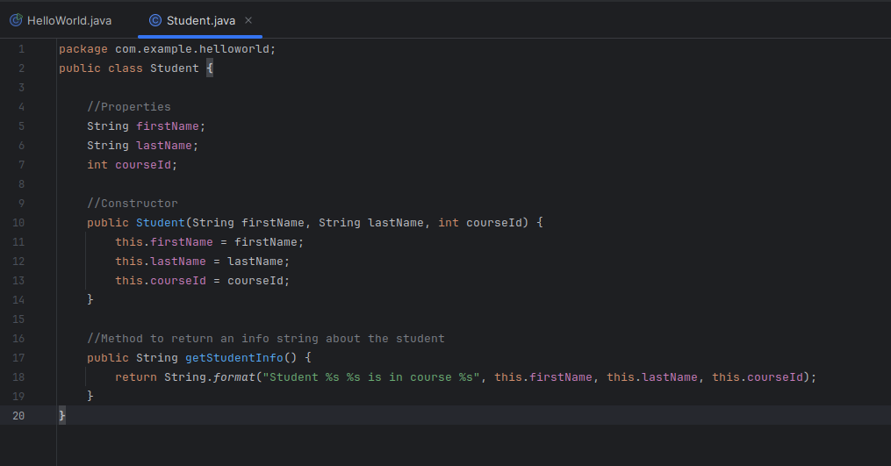

# Software Development 3
# Lab 1

## Intro to Java, Intellij and OOP


### Intellij


Intellij can be found on the University computers. On your own computers you may download from : 

[https://www.jetbrains.com/idea/download/](https://www.jetbrains.com/idea/download/)

The Community edition is free.

Launch intelliJ from the start menu of your computer.

## Hello world in Java with IntelliJ

Follow this tutorial to create your first java application:
[https://www.jetbrains.com/help/idea/creating-and-running-your-first-java-application.html](https://www.jetbrains.com/help/idea/creating-and-running-your-first-java-application.html)

Stop at the heading 'Package the application in a JAR'. We will cover this later.


If you have followed the above tutorial you will have a single Java class with the following code.

```java
package org.roehampton.sd3.examples;

public class HelloWorld {
    public static void main(String[] args) {
        System.out.println("hello world");
    }
}
```
Which you should be able to run by clicking the green arrow in the line numbering section next to your code to produce the output 'hello world'.

_NOTE THAT: In Java, a 'main' method which conforms to the signature ```public static void main(String[] args)``` will be the 'entrypoint' to your program, ie. it is the code that will run when your program is launched.__

## Starting Java

Here are the fundamental features of any programming language. You know them from your previous modules.  When you learn a new language you should always look up these topics and learn how the language implements them.


   * Types and variable declarations
   * Basic syntax: expressions and code blocks
   * Variable scope
   * Function definitions
   * Comments
   * Conditional statements
   * Loops (iteration)
   * Modules and namespaces
   * Classes and objects <----- The main part of this module!

## Getting to know Java Fundamentals

Familiarise yourself with the language fundamentals above by completing the following tasks.

### Types and variable declaration

In your public static void main method, delete the line which prints 'HelloWorld'. Replace it with the follwoing

```java
public class HelloWorld {
    public static void main(String[] args) {
        int a = 42;
        int b = 119;
        int c = a + b;
        System.out.println(c);
    }
}
```

Run the code with green arrow.  Notice that the code compiles before it is run.

Now change the variable declaration of b to the following

```java
 String b = "119";
```
What happens? Why? 

Finally change the variable declaration of c to the following

```java
 String c = a + b;
```
What happens?  Do you get the same answer as when b and c are ints?

#### Now you know...

   * how to print information back to the user
   * that you must declare each variable before you use it with the correct type
   * Java is a strongly typed language: you cannot mix types without errors occuring
   * that java is a compiled langauge so that errors may be 'compile time' or 'run time'. 
   * expressions must be terminated with a semi-colon (like c++)
   * that you must have a class with a main method of the correct signature to run your code.
   

### Arrays and loops

Just like the other languages you know, you can define collections of variables that can be referenced as a single variable, such as lists or dictionaries in Python or vectors in c++. 

Create an ArrayList as follows (there are various collection types in java) by amending your code to the following.  Read the comments to help you understand the code and note how single line and multi-line comments are indicated by ```\\``` and ```/*   */``` respectively.


```java
package org.roehampton.sd3.examples;
// You need to import the ArrayList library
import java.util.ArrayList;

public class HelloWorld {
    public static void main(String[] args) {
    
        /* ArrayLists are collection objects that can be dynamic in size.
        The type of thing that is going to be stored in the ArrayList needs to be specified in the angled brackets.
        Also note the keyword 'new'.
         */ 
        ArrayList<String> myList = new ArrayList<String>();
        // Add elements to myList
        myList.add("one");
        myList.add("two");
        myList.add("three");

        // A simple 'for' loop can iterate over myList, creating a new variable list with every iteration of the loop
        for  (String listElement : myList) {
            System.out.println(listElement);

        }
    }
}
```

__Task 1:__ Amend the code so that you also print the array index for each of the array elements.  HINT: In a Java for loop you cannot access the index directly.  Instead you can use the indexOf() method of the ArrayList, so for our example try:

```myList.indexOf(listElement)```

Why do the index numbers not correspond to the strings?

__Task 2:__ Now amend the contents of the list so that it contains animal names instead of strings of number names, for example, cat, dog, rabbit

__Task 3:__ Consider how you might check that the contents of myList is what you expect it to be, before the loop starts.  You might need to check this, for example, if you are not seeing the expected output.  HINT: See what happens if you send an object into ```System.out.println()``` for example:

```java
System.out.println(myList);
```

#### Now you know...

   * There are a number of different kinds of collections in Java.  For most, you need to define the type of thing that will be in the collection
   * That you will need to import java packages to make use of library code or custom modules
   * How to write a simple 'for' loop in java
   * How to debug your code by ouputting and examining variables at various points in the program execution
   * That collection indexes start at 0, just like in Python and C++
   * How to write comments


#### Conditionals

Add some code to the above exercise such that there is only output if the number is "three" as below

```
	    for  (String listElement : myList) {
            // Note use of print instead of println to suppress the line break
            if (listElement.equals("three")) {
                System.out.println ("Got three");
            }
            else if (listElement.equals("two")) {
                System.out.println ("Got two");
            }
            else {
                System.out.println("Got something else");

            }

        }


```

What happens if you use the customary ```==``` instead of the .equals() method in this code?

#### Now you know...

   * How to write conditional statements in java
   * That it may be safest to use a specialist, built-in .equals() method for the relevant class rather than ```==```.


### Create your first class and its objects

You will create the student class as represented by this class diagram. You will create two student objects in your 'main' function and output correct information about them.


1. Create a new file called Student.java
2. Add the following code to Student.java (you will not be able to cut and paste!!)




3. To create objects of class Student, go back to your HelloWorld file and write the following:


This code should run but its not giving you useful results. Go back into Student.cs and amend the getStudentInfo() method so that the name and course of each student is printed correctly.

Hint: You can use the + operator with strings in java, OR you can use 'string interpolation' to embed variables into strings. For example the following code will output: 

```
Hello LisaH !
```

```java
String teacher = "LisaH";
String hello = string.format("Hello %s", teacher);
Console.WriteLine(hello);
```


See: [https://www.geeksforgeeks.org/java-program-to-illustrate-string-interpolation/](https://www.geeksforgeeks.org/java-program-to-illustrate-string-interpolation/)


#### Extension tasks


1. __Dog class__

Implement the remaining methods of the Dog class used in the week 1 slides and improve the logic of the bark() function in any way that you can think of.

2. __Course class__

Design a 'course' class to complement the 'student' class.  Consider its properties and methods, and draw a class diagram to represent it.  Create a constructor.  Now see if you can re-factor your Student class to have a course class property instead of a simple ID.  

HINT: When you create a new class it is like adding a new custom type to your application.  You will need to use the class name to declare the type of the course.
