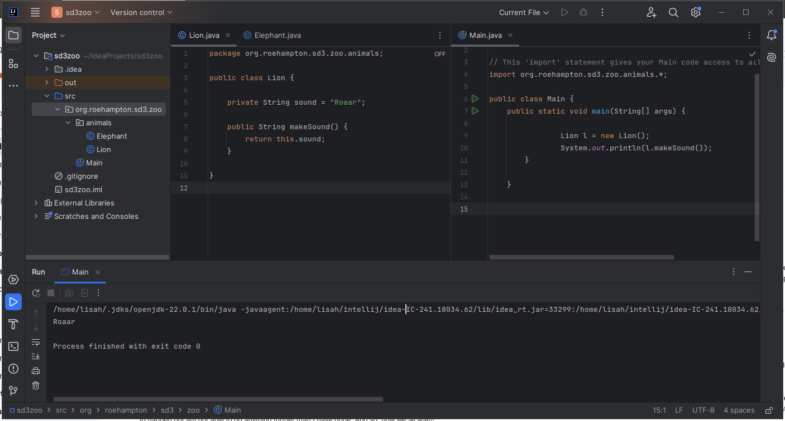

# Software Development 3

## Lab  Week 2


We will practice planning and creating classes, adding methods, modifiying them to be public or private as appropriate.

We will then create an interface to see how 'polymorphism' can occur in our code.

__Today we are going to start to model a zoo and its animals.__

Follow the steps below


__1. Design and planning__ 

Consider classes for Lion and Elephant with some relevant properties that you can think of.  Sketch a class diagram showing the basic properties and behaviours you are going to implement. Give your two classes at least one method, makeSound() which returns the approriate sound for each animal class. 

__2. Setting up your development environment and packages__

in Java, code is separated in the filesystem into 'packages'.  This helps avoid clashes in class names and neatens up the overall architecture of our code.

Because we will work with the zoo example throughout the module, lets set up a tidy and extensible structure for our code.  

Our aim is to set up an indentifiable overall package for our zoo project.  Within this, we will create a sub-package for our animal classes.

Our main method will be in its own class OUTSIDE of the animals sub-package as over time our program will be expanded to include more functionality.

  * In Intellij, create a new Java project (File -> new -> project).  Call it sd3zoo
  * Right-click on the ```src``` directory, choose new -> package
  * call the new package org.roehampton.sd3.zoo.animals

__3. Implement your Lion and Elephant classes__

Write the code in separate Java files inside the animals package (right click->new->class). 

__4. Write a main method that will run your code__

Ideally, your Main method will be in its own class file, above the animals directory, in the org.roehampton.sd3.zoo package.

Create this by right-clicking on the org.roehampton.sd3.zoo package and adding your new class called Main.

Inside your class Main, create a method called main with the required signature to be an entry point to your programme.  Inside the main method, create a new Lion and Elephant, and return the correct animal sounds to the user.  Your code should be something like this.

```java

package org.roehampton.sd3.zoo;

// This 'import' statement gives your Main code access to all the animal classes
import org.roehampton.sd3.zoo.animals.*;

public class Main {

    // The entrypoint to your programme will always have this signature.
    public static void main(String[] args) {

                Lion l = new Lion();
                System.out.println(l.makeSound());
        }

    }


```

Study the screenshot below to understand how the files should be arranged and what the code should look like.



### Improving your animal classes

Add more properties for your animals, set some of them in the constructor, ensure they are private and create getters and setters for client code to interact with them.

   * Create an age property for each of your animals __that is private__
   * Set the age of the animal in its constructor
   * Provide getters and setters to retrieve or replace the age value 
   * Create at least one additional property in your class with getters and setters.

   * Demonstrate the use of your class in your Main method.

4. Create an interface called IAnimal and define at least two methods that you think MUST be present for all your animal classes.  For example,  makeSound() and eatFood().  

5. Amend your Elephant and Lion classes such that they must implement the IAnimal interface,  ie. indicate in the class definition that the Interface should be implemented. You will notice that if the necessary methods are not yet implemented in your classes, your code will not compile until you add them.

6. Once the Elephant and Lion are working, add a new class, Penguin, that implements IAnimal and has the required methods.

7. Write a main method that creates a list of IAnimal objects which you can call 'zoo', and then loops through them calling the methods required by the interfaces.


#### Reference code

Everything you need for the lab can be adapted from the example code from the lecture.  Here it is again:


#### Shapes example code

IShape interface

```java

ackage org.roehampton.sd3.examples;

public interface IShape {

    double getArea();
    double getPerimeter();
}

```
Circle class


```java

package org.roehampton.sd3.examples;

public class Circle implements IShape {

    // Default value for radius
    private int radius= 4;

    // Get area method, required by the interface
    @Override
    public double getArea() {
        // Area of a circle πr-squared
        return Math.PI * (this.radius * this.radius);
    }

    // Get perimeter method, required by the interface
    @Override
    public double getPerimeter() {
        // Circumference of a circle 2πr
        return 2 * Math.PI * this.radius;
    }

}

```


Square class (NB shows getters and setters)

```java
ckage org.roehampton.sd3.examples;

public class Square implements IShape {
    // Property is private and has a default value
    private int height = 200;

    // Returns the area of the shape
    @Override
    public double getArea() {
        return this.height * this.height;
    }

    // Returns the perimeter of the shape
    @Override
    public double getPerimeter() {
        return 4 * this.height;
    }

    // Set the otherwise private property from outside the program
    public void setHeight(int h) {
        this.height = h;
    }

    // Return the otherwise private property from outside the program
    public int getHeight() {
        return this.height;
    }
}


 ```
 
 Circle class
 
 ```java
package org.roehampton.sd3.examples;

public class Circle implements IShape {

    // Default value for radius
    private int radius= 4;

    // Get area method, required by the interface
    @Override
    public double getArea() {
        // Area of a circle πr-squared
        return Math.PI * (this.radius * this.radius);
    }

    // Get perimeter method, required by the interface
    @Override
    public double getPerimeter() {
        // Circumference of a circle 2πr
        return 2 * Math.PI * this.radius;
    }

}


```

Main

```java
package org.roehampton.sd3.examples;
import java.util.*;

public class HelloWorld {
    public static void main(String[] args) {

        // Note that class can be instantiated as EITHER an IShape or specfic shape class
        IShape c1 = new Circle();
        Circle c2 = new Circle();
        IShape sq1 = new Square();
        Square sq2 = new Square();

        System.out.println(c1.getArea());
        System.out.println((sq2.getPerimeter()));
        
        // Show that we can create a list of any shape, 
        // so long as it implements IShape
        List<IShape> shapes = new ArrayList<>();
        
        shapes.add(c1);
        shapes.add(c2);
        shapes.add(sq1);
        shapes.add(sq2);

        for(IShape s : shapes) {
            System.out.println(s.getClass() + " has perimeter " + s.getPerimeter() + " and area " + s.getArea());
        }

    }
}
```
