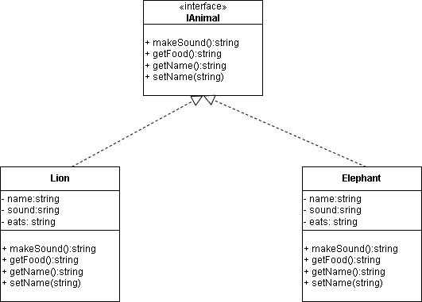

# Lab 2 solutions

## IAnimal.cs

```c#

interface IAnimal 
{
    public string makeSound();
    public string getFood();
    public string getName();
    public void setName(string name);

}
```


## Elephant.cs

```c#
class Elephant : IAnimal 
{
    // Properties
    private string name;
    private string sound = "TRUMPETTTT";
    private string eats = "Twigs and leaves";

    public Elephant(string name) {
        this.name = name;
    }
    public string makeSound() {
        return this.sound;

    }
    public string getFood() {
        return $"give me {this.eats}";
    }
    public string getName() {
        return $"{this.name}, the {this.GetType()}";
    }
    
    public void setName(string name) {

        this.name = name;

    }


}

```
## Lion.cs

```c#
class Lion : IAnimal 
{
    // Properties
    private string name;
    private string sound = "ROAAAR";
    private string eats = "Lots of meat";

    public Lion(string name) {
        this.name = name;
    }
    public string makeSound() {
        return this.sound;

    }
    public string getFood() {
        return $"give me {this.eats}";
    }
    public string getName() {
        return $"{this.name}, the {this.GetType()}";
    }
    
    public void setName(string name) {

        this.name = name;

    }


}

```


## Program.cs

```c#

using System;

class Program
{

    static void Main()
    {
    

        // Create a zoo
        Zoo zoo = new Zoo();

        // Add a lion
        zoo.addAnimal(new Lion("Elsa"));
        zoo.addAnimal(new Elephant("Elmer"));
        zoo.addAnimal(new Elephant("George"));
        zoo.addAnimal(new Lion("Walter"));

        zoo.listAnimals();

        zoo.feedAnimals();
        
    }
}

```

## Animal classes with interface


