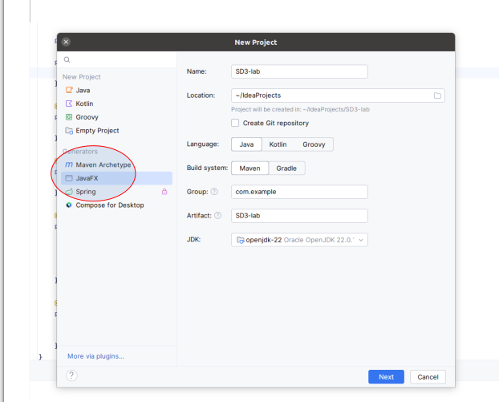
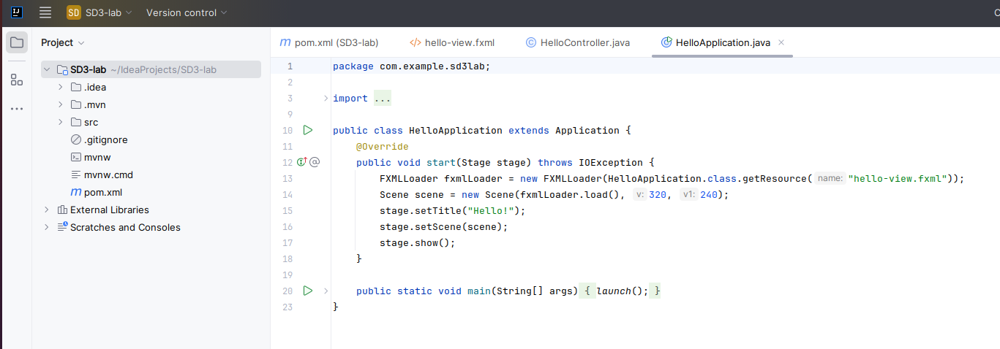
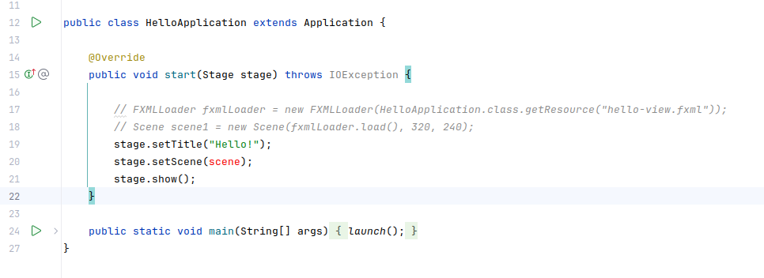
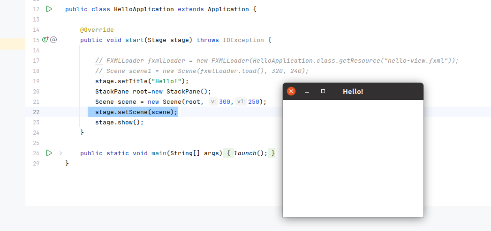
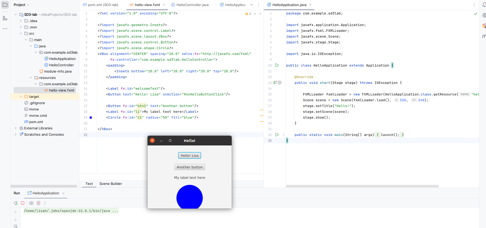

# Creating Our first JavaFX Application

Here, we are creating a simple JavaFX application which prints hello world on the console on clicking the button shown on the stage.

## Part 1: Creating a new JavaFX project in Intellij and testing JavaFX

1. Open Intellij
2. Click 'file' in the top menu
3. Choose new -> project
4. In the left navigation of the pop-up, choose 'JavaFX'
5. Give your project a name - the other options should be OK by default





6. Click 'next, no need to choose options on the next page, then choose 'create'

A new window will open showing some basic code:




You will notice that a basic __stage__ and __scene__ are set up for you.

You should see a green arrow in the HelloApplication file, indicating that your code can run.


7. Run the example application.  You should see a window pop up with a button labelled 'Hello!'.  Click the button and check that the event hander responds.

8. Change the button text.  Close your javaFX application simply closing the window.

9. Change some values so that you understand how the application works: 

   * In the default start() method you see in front of you, change the value of stage.setTitle() to "goodbye!!".  Run your application and understand what changed (HINT: look at the title in the frame of the application window)
   * Note that on line 13 there is a link to an fxml file called hello-view.fxml.  Fnd this file within the 'resources' folder.  Open this and see if you can find out how to alter the text that shows on the button by finding the ```<Button>``` tag and its text attribute.  Change the button text to your name.  To test your change you will need to go back to the HelloAppication.java file and run the application again.
   * Finally, lets change the text that is generated by the button event handler.  For this we need to find the 'controller' class. This should be in the HelloController file in the same directory as your HelloApplication file.  Find the event handler for onHelloButtonClick(), and change the output text to "Welcome to SD3".  Re-run your application and observe your changes.
   * 


## Part 2: A basic GUI - No FXML

As part of our familiarisation of JavaFX we will start by coding our GUI nodes directly into the start method.

Later, we will revert back to using the FXML to control the layout and discuss its advantages.

The point of this section is to help you understand the relationship between: 

   * Stage
   * Scene
   * Nodes
   
1. Comment out the lines that load the FXML file and set this as the file that defines the scene.




There will be an error in the 'setScene' method.

2. Add the necessary components to re-build the app:

   * ```FlowPane root=new FlowPane();``` Creates a pane node for your stage, this is the most basic layout.
   * ```Scene scene = new Scene(root, 300,250);``` Create a scene, adds a pane and sets the window size
   * ```stage.setScene(scene);``` adds the scene to the stage
   
3. At this point, your code should look like this.   You should be able to run it, but there will be nothing appearing in the window.




4. Now you can add some 'nodes' to your pane.  For example...

   * add a button: 
   
```
        // Add a button
        Button btn1=new Button("Hello SD3");
        root.getChildren().add(btn1);

```

   * add a label (some text)

```
        // Add a label
        Label bl = new Label("This is my label");
        root.getChildren().add(bl);

```

   * add a shape
   
```
        // Add a circle
        Circle circle = new Circle();
        circle.setCenterX(200);
        circle.setCenterY(200);
        circle.setRadius(50);
        circle.setFill(Color.BLUE);
        root.getChildren().add(circle);


```


Your finished code should look something like this.  Note the import statements, IntelliJ should prompt you for these.


```java

package com.example.sd3lab;

import javafx.application.Application;
import javafx.fxml.FXMLLoader;
import javafx.scene.Scene;
import javafx.scene.control.Button;
import javafx.scene.control.Label;
import javafx.scene.layout.FlowPane;
import javafx.stage.Stage;
import javafx.scene.paint.Color;
import javafx.scene.shape.Circle;

import java.io.IOException;

public class HelloApplication extends Application {

    @Override
    public void start(Stage stage) throws IOException {

        // FXMLLoader fxmlLoader = new FXMLLoader(HelloApplication.class.getResource("hello-view.fxml"));
        // Scene scene1 = new Scene(fxmlLoader.load(), 320, 240);
        stage.setTitle("Hello!");
        FlowPane root=new FlowPane();
        Scene scene = new Scene(root, 300,250);
        stage.setScene(scene);
        // Add a button
        Button btn1=new Button("Hello SD3");
        root.getChildren().add(btn1);

        // Add a label
        Label bl = new Label("This is my label");
        root.getChildren().add(bl);

        // Add a circle
        Circle circle = new Circle();
        circle.setCenterX(200);
        circle.setCenterY(200);
        circle.setRadius(50);
        circle.setFill(Color.BLUE);
        root.getChildren().add(circle);

        stage.show();
    }

    public static void main(String[] args) {
        launch();
    }
}


```


Experiment with some other GUI elements, use the link below for reference:

[https://www.javatpoint.com/javafx-tutorial](https://www.javatpoint.com/javafx-tutorial "JavaPoint tutorials and reference")


## Part 3: The 'view': Better GUI building with FXML

You should now be able to appreciate that using a separate, stuctured FXML file to define your GUI is going to be a lot easier once you've gone beyond a few elements.

1. Go back to using the FXML file to create your scene by removing your code from the previous exercise and un-commenting the FXML related lines. Your HelloApplication should now look like this:

```java


import javafx.application.Application;
import javafx.fxml.FXMLLoader;
import javafx.scene.Scene;
import javafx.stage.Stage;

import java.io.IOException;

public class HelloApplication extends Application {

    @Override
    public void start(Stage stage) throws IOException {

        FXMLLoader fxmlLoader = new FXMLLoader(HelloApplication.class.getResource("hello-view.fxml"));
        Scene scene = new Scene(fxmlLoader.load(), 320, 240);
        stage.setTitle("Hello!");
        stage.setScene(scene);
        stage.show();
    }

    public static void main(String[] args) {
        launch();
    }
}

```

__Check that you can run this code and see your button and event handler again__

Your hello-view.fxml file which should be in a subdirectory of 'resources', should not have changed since you created a new project.  It should have the following contents:

```java
<?xml version="1.0" encoding="UTF-8"?>

<?import javafx.geometry.Insets?>
<?import javafx.scene.control.Label?>
<?import javafx.scene.layout.VBox?>

<?import javafx.scene.control.Button?>
<VBox alignment="CENTER" spacing="20.0" xmlns:fx="http://javafx.com/fxml"
      fx:controller="com.example.sd3lab.HelloController">
    <padding>
        <Insets bottom="20.0" left="20.0" right="20.0" top="20.0"/>
    </padding>

    <Label fx:id="welcomeText"/>
    <Button text="Hello! Lisa" onAction="#onHelloButtonClick"/>
</VBox>

```


1. Add some additional GUI elements to the FXML file

For example, you can achieve a similar result as the former excercise by adding elements to the fxml file, nested into the VBox tags as follows:

   * ```    <Button fx:id="btn1" text="Another button"/>``` Add a button
   * ```    <Label fx:id="l1">My label text here</Label>``` Add text
   * ```     <Circle fx:id="c1" radius="50" fill="blue"/>``` Add a shape
   

Note that you will still run your code via the HelloApplication, start method, but you won't have to do any work in this file.

By now, your work should look like the below:




## Part 4: Linking the 'view' to the 'controller'

Now we have our GUI defined by the FXML file, lets look at how to create interactivity by adding event handlers to the controller and making changes to the view in response to user input.


1. Find and open the controller class. For the default project, it will be called 'HelloController' and will be in the same directory as your HelloApplication file with the start() method.

2. Note the contents of HelloController which should be as below.  Note that the property and method names match the id values in the FXML files.  Note also the @FXML annotation. 

```java
package com.example.sd3lab;

import javafx.fxml.FXML;
import javafx.scene.control.Label;

public class HelloController {
    @FXML
    private Label welcomeText;

    @FXML
    protected void onHelloButtonClick() {
        welcomeText.setText("Welcome to SD3");
    }
}
```

3. Add an event handler to your new button in the FXML file

We can use the generic 'onAction' event for now, and notice the hash infront of the event handler method name

```<Button fx:id="btn1" text="Another button" onAction="#onAnotherButtonClick"/>```

(The new event handler method name will be in red until it is added to the controller class in the next step)

4. Add an event handler method to the controller class.  It can be empty for now.

```java
    @FXML
    protected void onAnotherButtonClick() {
        
    }
```

5. Create the body for the event handler to implement our chosen functionality. Lets say we want to change the colour of the circle.

   * First, we need to register the circle UI element with the controller class by making it a property
   

```java
    @FXML
    private Circle c1;
```

   * Now add the action to the event hander
   
```java
    @FXML
    protected void onAnotherButtonClick() {
        c1.setFill(Color.RED);
    }

```

Your completed HelloController.java code should look like this:

```


import javafx.fxml.FXML;
import javafx.scene.control.Label;
import javafx.scene.paint.Color;
import javafx.scene.shape.Circle;

public class HelloController {
    @FXML
    private Label welcomeText;

    @FXML
    private Circle c1;

    @FXML
    protected void onHelloButtonClick() {
        welcomeText.setText("Welcome to SD3");
    }

    @FXML
    protected void onAnotherButtonClick() {
        c1.setFill(Color.RED);
    }
}


```


## Additional tasks

  * Create more different elements and interactions
  * Experiment with different layouts in JavaFX