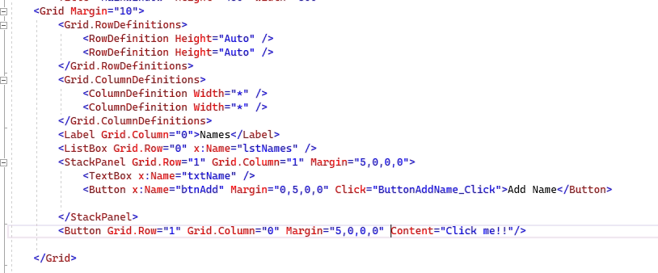
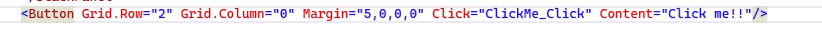

# Software Development 3

## Introduction to GUI programming with WPF

## Getting started

Follow this tutorial for the basics

[https://moodle.roehampton.ac.uk/mod/resource/view.php?id=1183897](https://moodle.roehampton.ac.uk/mod/resource/view.php?id=1183897)


## Further tasks

Once you have followed the tutorial above, have a go at the following tasks:

### 1. Add a button which gives a response when the user clicks

__You will need to__

  * Add a new button from the toolbox
  * Find it in the XAML editor
  * Use what you know to reposition it in the grid and add your own text   Mine says Click me and the code looks like this:
  



  * Add a new behaviour to the button by using the xaml editor to add a click attribute.  Mine looks like this:



  * Add a behaviour to the click so that when the button is clicked, a window pops up saying “ you just clicked me!!”

__HINT__
 You can use the function 

```c#
MessageBox.Show(“Message”);
```

to show a message ot the user.  This can be the only contents of the ClickMe_Click() function


### 2. Say a personalised hello to your user

Create a button and text input in a new 'StackPanel' element. Assign this to a new area of your screen. The user should fill in their name into the text input box and then click the button. Use the MessageBox.Show("") function to say a personalised  hello to your user.

__HINTS:__

Use a 'TextBox' control to capture the users name. 
To retrieve the text entered by the user you will need to use something similar to:

```c#
 NameBox.Text.ToString();
```
(in my example the name attribute of by TextBox is NameBox)

### 3. Add two numbers

Take user input of two integers. Write a program that adds two the numbers. If the result is an odd number, it needs to fire an event which print a message saying 'odd number'. Otherwise it prints a message saying "even number".

__HINT__

The following is a useful function to convert a string to an int:

```c#
Convert.ToInt16(_int_)
```

