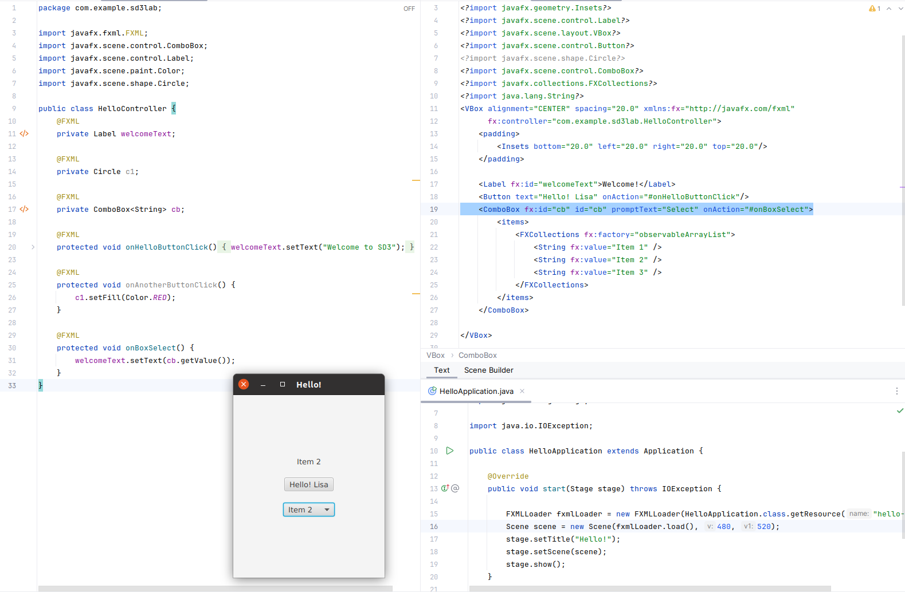
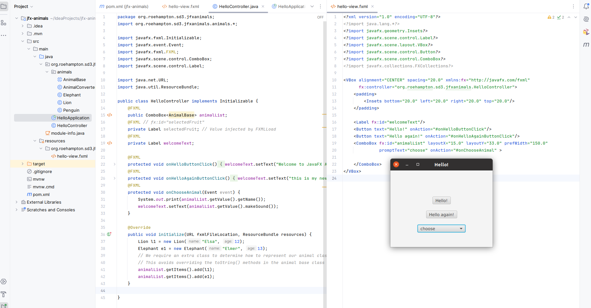
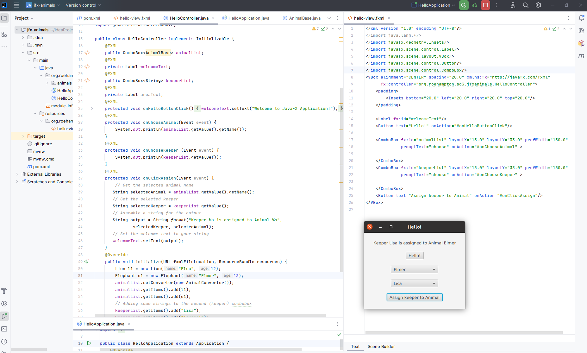

# Lab Session 9/10: JavaFX 2  "Code behind"

### Make sure you have completed the introduction tutorial for JavaFX:


[https://roehampton.github.io/module-content/software-development-3/week-08/lab/](https://roehampton.github.io/module-content/software-development-3/week-08/lab/)

## Lab exercise 1

__Create a simple drop-down list using hard-coded values and capture the result__

Your list will drop down and present the users with options "one", "two" and "three".


1.Go back to the example JavaFX project you created in the previous lab.
2.Locate the ```hello-view.fxml``` file you were working on before.  Keep the welcome text and the button.  If you prefer, delete any other experiments you created.  Your file should look like this:

```xml

<?xml version="1.0" encoding="UTF-8"?>

<?import javafx.geometry.Insets?>
<?import javafx.scene.control.Label?>
<?import javafx.scene.layout.VBox?>
<?import javafx.scene.control.Button?>
<?import javafx.scene.shape.Circle?>
<VBox alignment="CENTER" spacing="20.0" xmlns:fx="http://javafx.com/fxml"
      fx:controller="com.example.sd3lab.HelloController">
    <padding>
        <Insets bottom="20.0" left="20.0" right="20.0" top="20.0"/>
    </padding>

    <Label fx:id="welcomeText"/>
    <Button text="Hello! Lisa" onAction="#onHelloButtonClick"/>
    

</VBox>
```

Check that you can run the code and click the button to get the expected result.

3. To create a drop-down list we are going to use the 'ComboBox' tag. The ComboBox tag needs to be populated by a list of items.  In our case our items will be strings.  The following code sets up a ComboBox node, an items node and an Array list of strings that are the children of the items:

```
    <ComboBox fx:id="cb" id="cb" promptText="Select">
        <items>
            <FXCollections fx:factory="observableArrayList">
                <String fx:value="Item 1" />
                <String fx:value="Item 2" />
                <String fx:value="Item 3" />
            </FXCollections>
        </items>
    </ComboBox>

```

Add this as a child of VBox, and when you run your application you will see your select list.

4. Add an event handler that will respond to the selection, and replace the welcome text with the chosen number.  To do this:

   * Locate your controller class.  It will be in a file called HelloController.java
   * Register your ComboBox by adding an additional property as follows:
   
  ```java
     @FXML
    private ComboBox<String> cb;
```
Note the matching of the ComboBox Id with the variable name AND the matching of the items type.

   * Add an event handler to your FXML code. We will call ours ```#onBoxSelect``` and it will respond to the onAction event:
   

```xml
    <ComboBox fx:id="cb" id="cb" promptText="Select" onAction="#onBoxSelect">
```

   * Finally create an event handler in the controller file:
   
```java
    @FXML
    protected void onBoxSelect() {
        welcomeText.setText(cb.getValue());
    }

```


See below for the expected result. When you select a new value in the drop-down box, it will appear in the welcome text part of the GUI.




## Exercise 2: Linking to your OOP code

##### We will now show how you can create a 'front end' that facilitates user interactions with your existing Java classes.

You will create a combobox which instead of being populated by arbitary numbers will be populated by some animals from our zoo classes.  When selected, a text message will appear which will show the animal sound.


### Step 1: Add the animals code to your application

Create a package for the classes you have already created for your Animal base class and animals.
   * In the src/main/java folder, create a new package, called for example org.roehampton.animals
   * Inside this directory, add your AnimalBase and derived Animal classes.  If you need the classes you can download the zip from Moodle and extract [https://moodle.roehampton.ac.uk/mod/resource/view.php?id=2065527](https://moodle.roehampton.ac.uk/mod/resource/view.php?id=2065527)
   
NOTE: You may need to alter or delete the package name from line 1 of these files.

 In your hello-fxml file add the following inside the vbox:
 
 
```xml
    <ComboBox fx:id="animalList" layoutX="15.0" layoutY="33.0" prefWidth="150.0" promptText="choose" onAction="#onChooseAnimal" >

    </ComboBox>

```


   * Now go to your HelloController file.  You will need to make a number of amendments:
   1. Add an import statement to the package where your animal classes can be found. Depending on your path it will look something like this:
   

```java
import org.roehampton.sd3.jfxanimals.animals.*;

```
   
   2. Declare your Combobox, matching the id in the fxml file to the variable name:

```
   @FXML
    public ComboBox<AnimalBase> animalList;
```
3.  Add an event handler for the combobox.  This will print a message to the console, and also overwrite the original welcometext with the sound of the selected animal

```java
  @FXML
    protected void onChooseAnimal(Event event) {
        System.out.print(animalList.getValue().getName());
        welcomeText.setText(animalList.getValue().makeSound());
    }

```

4. Make your Controller class initializable - meaning that it will be abel to run an initialize method on startup so you can populate your drop-down list with some values.  Add a new import to the top of the file:

```java
import javafx.fxml.Initializable;
```

Amend the class definitition as follows:

```java
public class HelloController implements Initializable {
```

5.  Now add the following method to the controller class, which will add some animals to the dropdown list:

```java
@Override
    public void initialize(URL fxmlFileLocation, ResourceBundle resources) {
        Lion l1 = new Lion("Elsa", 12);
        Elephant e1 = new Elephant("Elmer", 13);
        // We require an extra class to determine how to represent our animal classes as strings
        // This avoids overriding the toString() methods in the animal base class
        animalList.getItems().add(l1);
        animalList.getItems().add(e1);
    }


```

At this point, you should be able to run your code and see the following:



You will notice that the drop-down box has correctly referenced your classes, but the text shown is the object reference.

__You should still be able to choose an animal and see the correct sound outputted in the welcome text area.__ 

In order to show a nicely formatted string, we will add a helper 'string converter' class.

Add a new file to your animals directory called AnimalConverter.  It will have the following contents:

```java
// Helper method to create UI components eg. drop-down box from an Animal
// Required to avoid overriding toString() in AnimalBase
import javafx.util.StringConverter;

public class AnimalConverter extends StringConverter<AnimalBase>  {
    // Method to convert an Animal Object to a String
    @Override
    public String toString(AnimalBase animal) {
        return animal == null? null : animal.getName();
    }

    // Method to convert a String to an Animal Object
    @Override
    public AnimalBase fromString(String string) {
        return null;
    }
}

```

Now amend your initialize method in the HelloController file:

Note the additional line which sets the string converter for the animalList.

```java
    @Override
    public void initialize(URL fxmlFileLocation, ResourceBundle resources) {
        Lion l1 = new Lion("Elsa", 12);
        Elephant e1 = new Elephant("Elmer", 13);
        // We require an extra class to determine how to represent our animal classes as strings
        // This avoids overriding the toString() methods in the animal base class
        animalList.setConverter(new AnimalConverter());
        animalList.getItems().add(l1);
        animalList.getItems().add(e1);
    }

```

You will notice that the animals drop-down box now appears neatly showing the animals name as the displayed value.


## Lab exercise 5: Add a second option list for keepers, create a button which will capture BOTH the selected keeper and the selected animal, and output both selections to the welcome text area.


__HINT__: This exercise is here to help you with your coursework.  In your coursework you are likely to want to capture the users choice of a bookable item (eg. flat, hotel, bike etc), and the users choice of a client who wishes to booke the item.  This part of the lab sheet is equivalent to that task.


1. We will add an additional combobox to the fxml file for the zoo keepers. It has an event handler called onChooseKeeper (_For this exercise we will represent our keepers as simple strings, but you know from the above how to  create classes with string coverters so that you can represent clients as objects should you wish to_.)

```xml

  <ComboBox fx:id="keeperList" layoutX="15.0" layoutY="33.0" prefWidth="150.0"
              promptText="choose" onAction="#onChooseKeeper" >

    </ComboBox>

```
2. Create a button in your interface. When this is clicked, the choosen value in both comboboxes will be captured

```xml

    <Button text="Assign keeper to Animal" onAction="#onClickAssign"/>

```


3. Create a reference to the KeeperList in your controller file - add this to the properties at the top

```java
    @FXML
    public ComboBox<String> keeperList;

```

4. Add an event handler in your controller file for the keepers dropdown list.  For now, lets just print the selected name to the console so we can check our work.

```java
    @FXML
    protected void onChooseKeeper (Event event) {
        System.out.println(keeperList.getValue());
    }

```

5. Add some values to the keepers dropdown in your initialize method.  Your entire initialize method should now look something like this:

```java

    @Override
    public void initialize(URL fxmlFileLocation, ResourceBundle resources) {
        Lion l1 = new Lion("Elsa", 12);
        Elephant e1 = new Elephant("Elmer", 13);
        // We require an extra class to determine how to represent our animal classes as strings
        // This avoids overriding the toString() methods in the animal base class
        animalList.setConverter(new AnimalConverter());
        animalList.getItems().add(l1);
        animalList.getItems().add(e1);
        // Adding some strings to the second (keeper) combobox
        keeperList.getItems().add("Lisa");
        keeperList.getItems().add("Touseef");

    }


```


6. Add an event handler to the controller file for the button which will capture the chosen values from  both comboboxes and print some output to the welcometext text area:


```java
 @FXML
    protected void onClickAssign(Event event) {
        // Get the selected animal name
       String selectedAnimal = animalList.getValue().getName();
       // Get the selected keeper
       String selectedKeeper = keeperList.getValue();
       // Assemble a string for the output
       String output = String.format("Keeper %s is assigned to Animal %s",
               selectedKeeper, selectedAnimal);
       // Set the welcome text to your string
       welcomeText.setText(output);
    }

```

The result should be something like the below:

