# Lab 02b: Continous Integration Setup

In this lab we will automate our build process using [Travis CI](https://travis-ci.org/).  CI is [Continuous Integration](https://en.wikipedia.org/wiki/Continuous_integration), a software engineering method where we ensure our local development software versions are merged into the mainline code several times a day.  There are several CI approaches available, but Travis is easy to plug into our software production pipeline.

## Behavioural Objectives

After this lab you will be able to:

- [ ] **Pull your project** to *return to your previous development state.*
- [ ] **Add** *continuous integration with Travis CI to your project.*
- [ ] **Integrate** *Docker into Travis CI build step.*
- [ ] **Define** the *Gitflow Workflow.*
- [ ] **Link** *Docker containers.*
- [ ] **Package** an **application JAR with IntelliJ.*
- [ ] **Create** a *release on GitHub.*

## Pulling Back Your Project

At the end of the last lab we had a working application that we could deploy to Docker.  Everything was done using three files:

- A **pom.xml** Maven build file, which we have not explored further yet.
- An **App.java** code file that contains our current code which is just a *Hello World* example.
- A **Dockerfile** that specifies how to run our application in a separate Docker container.

We have three other files in our repository:

- A **.gitignore** file to tell Git which files and folders to ignore for versioning.
- A **README.md** file for our project.
- A **LICENSE** file defining the licensing terms for our project.

Everything is in our GitHub repository.  We can pull this back in IntelliJ to start from where we left off.  If your code is still on the machine you are using you can ignore this step.

### Starting IntelliJ

Start IntelliJ to get the landing window:

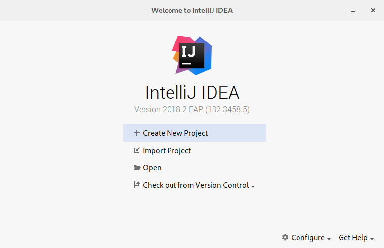

The button to click on is **Check out from Version Control**, then select **Git**:

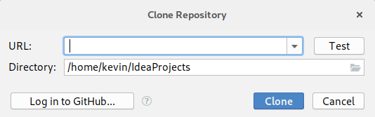

The simplest method is to click on **Login with GitHub** and add your details to the following window:

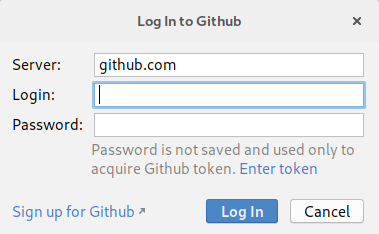

Enter your login details.  The window will stay open, so click **Cancel**.  Don't worry - you will have logged in.

Open the **Check out from Version Control** window again, and select the **sem** repo we created in the last lab.  Click **Clone** and select **Yes** to have IntelliJ create a new project from the source code.  This will open the **Import Project** window:


Select **Import project from external model** and **Maven** and select **Next**.  This will open the following window:

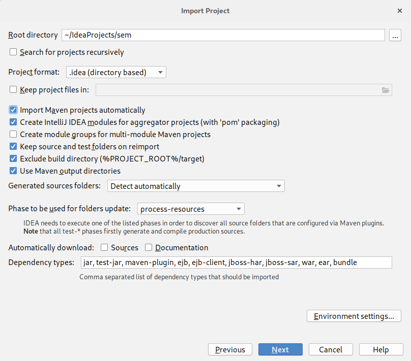

Ensure that **Import Maven Projects Automatically** is selected and click **Next**.  The following window will open:

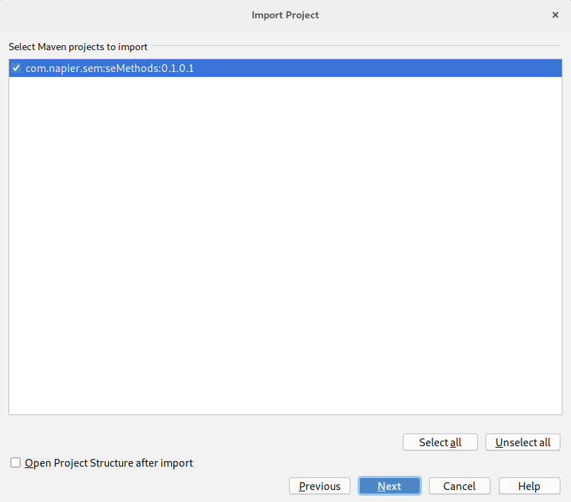

Click **Next**.  The following window will open:

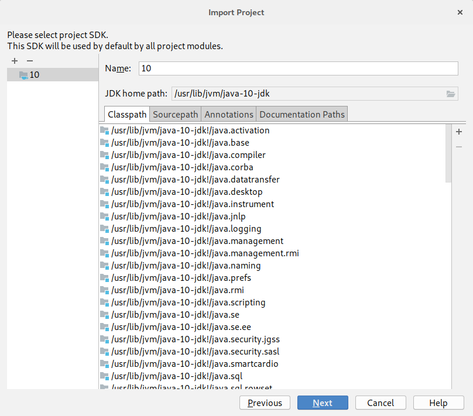

Click **Next** again.  The following window will open:

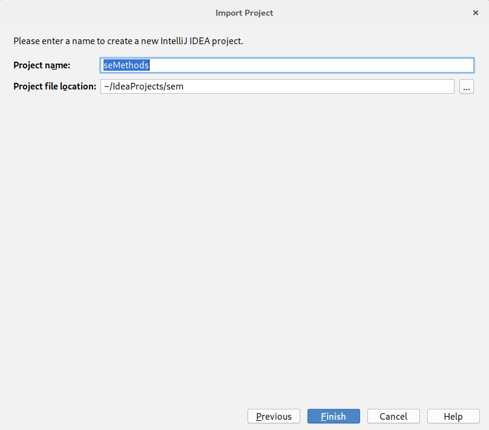

Click **Finish** to complete the import process and open the main IntelliJ window.

Now we need to check that everything works correctly.  Perform the following steps:

1. Build the project (**Build** then **Build Project**).
2. Run the project locally (open **App.java** and click the **green triangle** next to **public class App** and select **Run App.main()**).
3. Install Docker and the IntelliJ Docker plugin if needed (see [the last lab](../lab01/)).
4. Run the project via Docker (open **Dockerfile** and click the **green triangles** at the top of the file and select **Run on Docker**).

Hopefully everything has worked and we are back to the point we left off at last week.  **Remember these steps**.  You will need to repeat them every time you pull back your project to a new local system.

## Adding Travis CI to Your Repository

With our project back on our local machine we can set-up Travis CI.  This is automated via the [Travis CI website](https://travis-ci.org/).  Go there now:

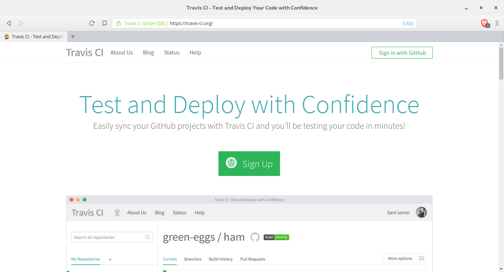

Select **Login with GitHub**.  If you are already logged into GitHub (which you probably are) this should be done fairly easily.  Once you have signed up and activated your account you should be taken to your profile page which has the URL `https://travis-ci.org/profile/<github-username>`:

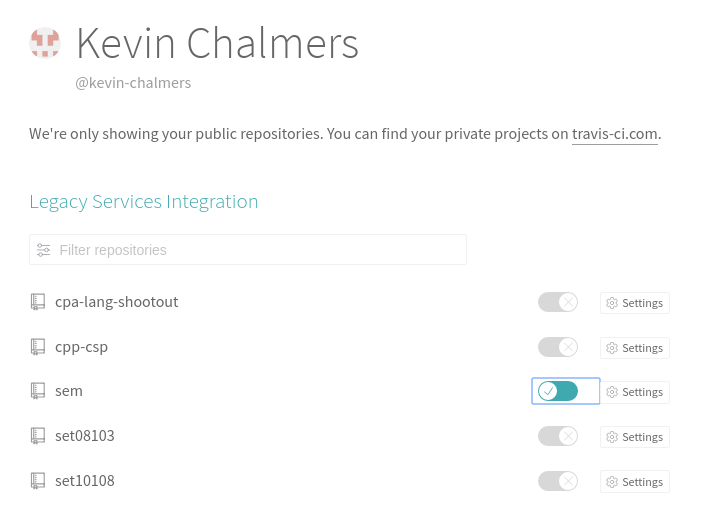

Activate Travis for the **sem** repository by activating the toggle next to the project as shown in the image.  And that is it - Travis is integrated into our GitHub account.

Travis CI is triggered by pushes to our repository and so we do not need to do anything specific within Travis itself.  However, we do need to tell Travis how to build our application.

### Adding a Travis Build File

Add a new file to the root of your project called `.travis.yml`.  The contents are below:

```yml
language: java
```

Add that is it.  Travis can take a lot of configuration which we will see as we go through the module.  However, for Maven projects Travis knows what to do, so our life is easy.

Now to push the updates to our GitHub repository.  Remember the three steps.

1. Add the updates to the commit.
2. Create a commit.  Use a sensible message.
3. Push the commit.

Now we can go to the Travis and see if our build was successful.  You can click on the **sem** project in Travis, or go to the project's dashboard `https://travis-ci.org/<github-username>/sem`.  You should see something similar to the following:

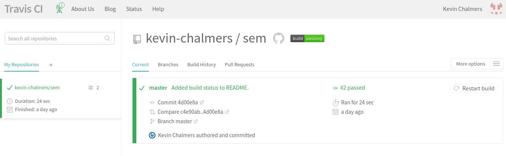

Which shows our build is passing.  You can also see the build log under this information to see where problems are.

### Adding Travis Badge

You might have seen build status badges on GitHub before like this one:

[](https://travis-ci.org/kevin-chalmers/sem)

This is taken straight from Travis CI and you can add the badge for your build status to your `README.md` file as well.  To do this, click on the build status badge for your project in Travis CI.  This will open a window allowing you to get the code to access the build status badge:

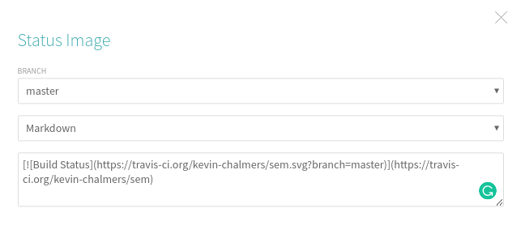

Make sure you select **Markdown**.  Now we just need to add this to our `README.md` file for the project.  Change the build status code to that which you get from Travis.

```md
# Software Engineering Methods

- Master Build Status [](https://travis-ci.org/kevin-chalmers/sem)
```

Now go through our Git update steps:

1. Add files to commit.
2. Create commit.
3. Push to GitHub.

Now if you go to your GitHub page you should see the following:

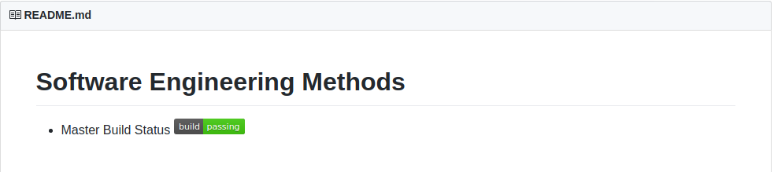

And now we have our project automatically building on pushes to GitHub, and the current build status being displayed on our GitHub landing page.

### Other Badges

You can add various badges to your project.  [Sheilds.io](https://shields.io/) is one such site that provides badges.  We are going to add two to our `README.md`: one for our license and one for our release.  The license badge takes the URL:

`[](https://github.com/<github-username>/sem/blob/master/LICENSE)`

Just replace `<github-username>` with your GitHub username.  The release badge is:

`[](https://github.com/<github-username>/sem/releases)`

At the moment we don't have any releases so the badge won't work.  We will recify this shortly.  Update your `README.md` file to the following (remembering to change the username):

```md
# Software Engineering Methods

- Master Build Status [](https://travis-ci.org/kevin-chalmers/sem)
- License [](https://github.com/kevin-chalmers/sem/blob/master/LICENSE)
- Release [](https://github.com/kevin-chalmers/sem/releases)
```

And then update your GitHub repository:

1. Add files to commit.
2. Create commit.
3. Push to GitHub.

If you go to your repository's dashboard in GitHub you should see your new badges.

## Travis and Docker

We can also have Travis build and test our Dockerfile build.  This requires updates to our `.travis.yml` file:

```yml
sudo: required

language: java

services:
  - docker

after_success:
  - docker build -t se_methods .
  - docker run se_methods
```

What we have done:

- Added superuser (`sudo`) status for the build.  This is required for Docker builds on Travis.
- Stated we want the `docker` service available in our build system.
- `after_success` means after the project has been successfully built.  Two commands are executed:
  - Build the Docker image.
  - Run an instance of the created Docker image.

Now let us test this with Travis by first adding the updates:

1. Add files to the commit.
2. Create commit.
3. Push to GitHub.

Go to your Travis CI dashboard for the repository and wait for the build to complete.  Everything should go well, and you can check that the final output - `Boo yah!` - is in the build log.

## Setting up Gitflow Workflow

Our next step is to set-up our workflow.  This is our approach to managing separate features and collaborators in our project.  [Gitflow](https://www.atlassian.com/git/tutorials/comparing-workflows/gitflow-workflow) is one such workflow that works well with Git.  To work with Gitflow we manage several branches:

- **master** which is the main Git branch.  This is created automatically when a Git repository is created.  Only main releases are tracked in this branch.
- **develop** is the integration branch.  Features are merged into this branch as they are completed. It is a *feature integration* branch.
- **feature** branches are where new features are worked on before integration with with `develop`.
- **release** is where releases are made.  A release is normally a collection of features, or a set point in time.  Note that a release must be a working version.  The `release` branch comes from a version of `develop`.  `master` is a version of `release`.
- **hotfix** branches are *maintenance* ones based on `master`.  We are fixing a production version of the code, so rather than working from `develop` we work from `master`.

### Develop Branch

The first step in setting up Gitflow is the creation of a `develop` branch in our project.  We can do this in IntelliJ.  Select **VCS**, **Git** then **Branches...** to open the branches window:

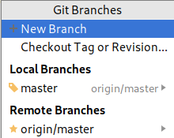

Select **New Branch** and call the branch **develop**.  Make sure the **Checkout branch** checkbox is ticked.

The `develop` branch only exists on the local system.  To add it to GitHub we have to perform a push.  Do this now.  From IntelliJ, **VCS**, **Git** then **Push**. Click **Push** and the branch will be added to GitHub. You can confirm this on GitHub by opening the branches drop-down, refreshing the page if you are currently on it:

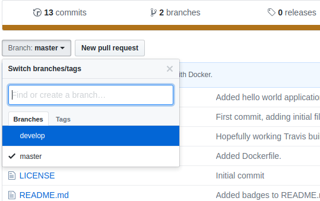

#### Adding Develop Build Status to GitHub

Travis CI will have automatically added this branch to its build.  As `develop` is a key branch of our project we will add this build status to the `README.md` file.  Get the necessary code from Travis CI as before, remembering to select the **develop** branch.  Update the `README.md` as below:

```markdown
# Software Engineering Methods

- Master Build Status [](https://travis-ci.org/kevin-chalmers/sem)
- Develop Build Status [](https://travis-ci.org/kevin-chalmers/sem)
- License [](https://github.com/kevin-chalmers/sem/blob/master/LICENSE)
- Release [](https://github.com/kevin-chalmers/sem/releases)
```

And add this to GitHub:

1. Add files to commit.
2. Create commit.
3. Push commit to GitHub.

And if you go to the dashboard for the repository on GitHub you will see that nothing has changed.  That is because we have pushed to our `develop` branch, not the `master` branch.  You can see the updates by switching to the `develop` branch on GitHub using the branches drop-down from earlier:

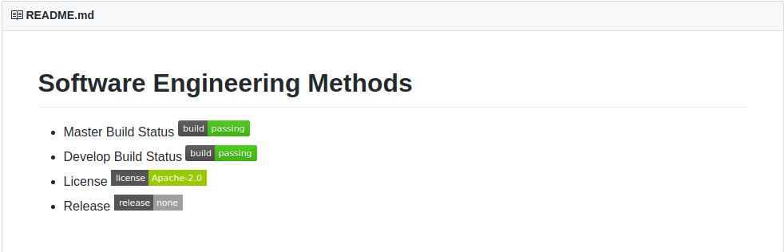

## Updating our Example Application

To end this lab we will add a new feature to our application - database support via [MongoDB](https://docs.mongodb.com/).  We will perform the following steps:

1. Start a MongoDB server via Docker.
2. Start a new feature in our project.
3. Add MongoDB support to our application.
4. Link our container with the MongoDB container.
5. Test that everything works.
6. Merge the feature into our `develop` branch.
7. Create a release.
8. Add a version.

This may seem like a lot of steps, but individually they are simple.  What could be seen as the hardest part - setting up a database and connecting to it - is simple in our build pipeline.

### Running a MongoDB Docker Image

Our first step is to start a new MongoDB container.  Let us do this via IntelliJ rather than the command line.

Open the Docker panel at the bottom of IntelliJ and make sure **Images** is highlighted:

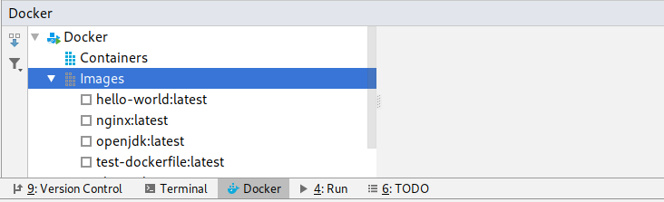

The button on the top-left allows us to pull images for Docker.  Click this button to open the **Pull Image** window:

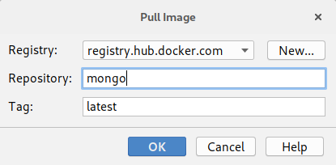

Type **mongo** as the **Repository** and click **OK**.  The latest version of MongoDB will now be pulled as an image. It will appear in the Docker panel of IntelliJ:

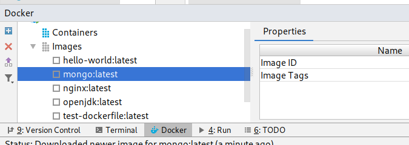

With `mongo:latest` selected, click the **blue plus sign** to **Create Container**.  This will open the following window:

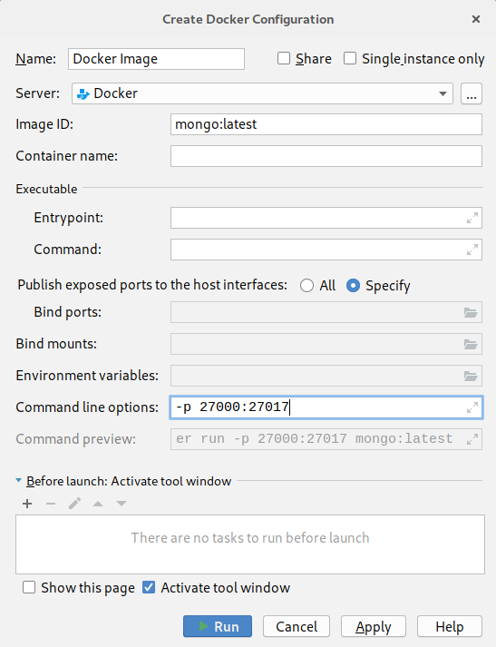

MongoDB is a server application which listens on port 27017.  We could just open that port, but just in case MongoDB is already running locally we will switch ports.  We looked at this in the last lab.  In the **Command Line Options** text box add **-p 27000:27017** as shown in the image.  Then click **Run**.  IntelliJ will start the container and it will be waiting for you to use.

### Starting a Feature Branch

We are going to add a new feature to our application.  To do this, we need to create a new branch as we did for `develop`.  The steps you need to undertake are:

1. Create a new branch called `feature/mongo-intergration` (**VCS**, **Git** then **Branches**.  **Create Branch**).
2. Push the branch to GitHub.

That is it.  We are now working on a feature branch, which we created from our `develop` branch since it was the one we had checked out.

### Adding MongoDB Support to Our Application

We will use Maven to manage the import of MongoDB functionality into our application.  This is done by adding **dependencies** to our `pom.xml` file.  IntelliJ will recognise these dependencies and pull in the relevant libraries and functionality.  The new code we want is:

```xml
    <dependencies>
        <dependency>
            <groupId>org.mongodb</groupId>
            <artifactId>mongodb-driver</artifactId>
            <version>3.6.4</version>
        </dependency>
    </dependencies>
```

We add this to the `pom.xml` file as follows:

```xml
<?xml version="1.0" encoding="UTF-8"?>
<project xmlns="http://maven.apache.org/POM/4.0.0"
         xmlns:xsi="http://www.w3.org/2001/XMLSchema-instance"
         xsi:schemaLocation="http://maven.apache.org/POM/4.0.0 http://maven.apache.org/xsd/maven-4.0.0.xsd">
    <modelVersion>4.0.0</modelVersion>

    <groupId>com.napier.sem</groupId>
    <artifactId>seMethods</artifactId>
    <version>0.1.0.1</version>

    <dependencies>
        <dependency>
            <groupId>org.mongodb</groupId>
            <artifactId>mongodb-driver</artifactId>
            <version>3.6.4</version>
        </dependency>
    </dependencies>

</project>
```

IntelliJ will manage everything for us.  Initially the test `org.mongodb` and `mongodb-driver` will be red, but once the import is complete it will turn black.  Let us to a commit.

1. Add files to the commit.
2. Create the commit.
3. Push the commit to GitHub.

Now we can test that we can talk to the MongoDB server.  We will update `App.java` to the following:

```java
package com.napier.sem;

import com.mongodb.MongoClient;
import com.mongodb.client.MongoDatabase;
import com.mongodb.client.MongoCollection;
import org.bson.Document;

public class App
{
    public static void main(String[] args)
    {
        // Connect to MongoDB on local system - we're using port 27000
        MongoClient mongoClient = new MongoClient("localhost", 27000);
        // Get a database - will create when we use it
        MongoDatabase database = mongoClient.getDatabase("mydb");
        // Get a collection from the database
        MongoCollection<Document> collection = database.getCollection("test");
        // Create a document to store
        Document doc = new Document("name", "Kevin Chalmers")
                           .append("class", "Software Engineering Methods")
                           .append("year", "2018/19")
                           .append("result", new Document("CW", 95).append("EX", 85));
        // Add document to collection
        collection.insertOne(doc);

        // Check document in collection
        Document myDoc = collection.find().first();
        System.out.println(myDoc.toJson());
    }
}
```

Now all we have to do is run the application normally (i.e. not as a Docker container).  Select **Run** then **Run** and select **App** as the configuration.  Your application should launch, connect to the MongoDB server running in the Docker container and perform some basic operations as shown.  The console output will look something like the following:

```shell
/usr/lib/jvm/java-10-jdk/bin/java -javaagent:/opt/JetBrains/apps/IDEA-U/ch-0/182.3458.5/lib/idea_rt.jar=37241:/opt/JetBrains/apps/IDEA-U/ch-0/182.3458.5/bin -Dfile.encoding=UTF-8 -classpath /home/kevin/IdeaProjects/sem/target/classes:/home/kevin/.m2/repository/org/mongodb/mongodb-driver/3.6.4/mongodb-driver-3.6.4.jar:/home/kevin/.m2/repository/org/mongodb/bson/3.6.4/bson-3.6.4.jar:/home/kevin/.m2/repository/org/mongodb/mongodb-driver-core/3.6.4/mongodb-driver-core-3.6.4.jar com.napier.sem.App
Jul 15, 2018 3:05:09 PM com.mongodb.diagnostics.logging.JULLogger log
INFO: Cluster created with settings {hosts=[localhost:27000], mode=SINGLE, requiredClusterType=UNKNOWN, serverSelectionTimeout='30000 ms', maxWaitQueueSize=500}
Jul 15, 2018 3:05:09 PM com.mongodb.diagnostics.logging.JULLogger log
INFO: Cluster description not yet available. Waiting for 30000 ms before timing out
Jul 15, 2018 3:05:10 PM com.mongodb.diagnostics.logging.JULLogger log
INFO: Opened connection [connectionId{localValue:1, serverValue:1}] to localhost:27000
Jul 15, 2018 3:05:10 PM com.mongodb.diagnostics.logging.JULLogger log
INFO: Monitor thread successfully connected to server with description ServerDescription{address=localhost:27000, type=STANDALONE, state=CONNECTED, ok=true, version=ServerVersion{versionList=[4, 0, 0]}, minWireVersion=0, maxWireVersion=7, maxDocumentSize=16777216, logicalSessionTimeoutMinutes=30, roundTripTimeNanos=4442274}
Jul 15, 2018 3:05:10 PM com.mongodb.diagnostics.logging.JULLogger log
INFO: Opened connection [connectionId{localValue:2, serverValue:2}] to localhost:27000
{ "_id" : { "$oid" : "5b4b5495da12e64fb1d0b7cc" }, "name" : "Kevin Chalmers", "class" : "Software Engineering Methods", "year" : "2018/19", "result" : { "CW" : 95, "EX" : 85 } }

Process finished with exit code 0
```

If you look at the logs of the MongoDB container in IntelliJ you will see the following lines added:

```shell
2018-07-15T14:05:09.917+0000 I NETWORK  [listener] connection accepted from 172.17.0.1:57888 #1 (1 connection now open)
2018-07-15T14:05:09.978+0000 I NETWORK  [conn1] received client metadata from 172.17.0.1:57888 conn1: { driver: { name: "mongo-java-driver", version: "3.6.4" }, os: { type: "Linux", name: "Linux", architecture: "amd64", version: "4.17.5-1-ARCH" }, platform: "Java/Oracle Corporation/10.0.1+10" }
2018-07-15T14:05:10.055+0000 I NETWORK  [listener] connection accepted from 172.17.0.1:57892 #2 (2 connections now open)
2018-07-15T14:05:10.056+0000 I NETWORK  [conn2] received client metadata from 172.17.0.1:57892 conn2: { driver: { name: "mongo-java-driver", version: "3.6.4" }, os: { type: "Linux", name: "Linux", architecture: "amd64", version: "4.17.5-1-ARCH" }, platform: "Java/Oracle Corporation/10.0.1+10" }
2018-07-15T14:05:10.113+0000 I STORAGE  [conn2] createCollection: mydb.test with generated UUID: a549ece2-96cb-4995-85af-5db19e0336b0
2018-07-15T14:05:10.559+0000 I NETWORK  [conn1] end connection 172.17.0.1:57888 (0 connections now open)
2018-07-15T14:05:10.559+0000 I NETWORK  [conn2] end connection 172.17.0.1:57892 (1 connection now open)
```

A good time to push this update to GitHub.

1. Add files to commit.
2. Create commit.
3. Push to GitHub.

Now we need to modify our application so that it runs in our Docker containers.

### Linking Containers

Linking containers requires container discovery.  There are a few ways to do this, but we will use the simplest.  Docker networking and container discovery is an entire subject in itself, and outside the scope of this module.

We are going to undertake the following steps:

1. Create a self-contained JAR for our project - this will include any external libraries.
2. Add a network bridge to docker.
3. Update our code files, Dockerfile, and MongoDB instance.
4. Update Travis CI build file.

#### Creating a Self-contained JAR

So far we have not been doing good practice.  For Java, JAR (Java ARchive) files should be deployed and not individual code files as we have been doing.  The advantage of a JAR file is it can contain library dependencies, such as the MongoDB one we have added.  Maven can build this for us automatically.

First we must update our `pom.xml` file.  Add the following below the `dependencies` section:

```xml
    <properties>
        <maven.compiler.source>1.8</maven.compiler.source>
        <maven.compiler.target>1.8</maven.compiler.target>
    </properties>

    <build>
        <plugins>
            <plugin>
                <artifactId>maven-assembly-plugin</artifactId>
                <configuration>
                    <archive>
                        <manifest>
                            <mainClass>com.napier.sem.App</mainClass>
                        </manifest>
                    </archive>
                    <descriptorRefs>
                        <descriptorRef>jar-with-dependencies</descriptorRef>
                    </descriptorRefs>
                </configuration>
                <executions>
                    <execution>
                        <id>make-assembly</id>
                        <phase>package</phase>
                        <goals>
                            <goal>single</goal>
                        </goals>
                    </execution>
                </executions>
            </plugin>
        </plugins>
    </build>
```

We have added two new sections:

1. `properties` - here we are telling Maven to produce Java 8 code (1.8).
2. `build` - there is quite a bit going on here.  You can happily reuse the code though:
    - We are defining how Maven assembles the JAR file.
    - We are telling Maven which class to run when the JAR is executed (`mainClass`).
    - We are telling Maven to build the `jar-with-dependencies` - in other words pull in the MongoDB code.

First rebuild your project so that everything is up to date: **Build** then **Build Project**. We can now ask Maven to package up our application.  In IntelliJ open the **Maven Panel** on the right hand side:

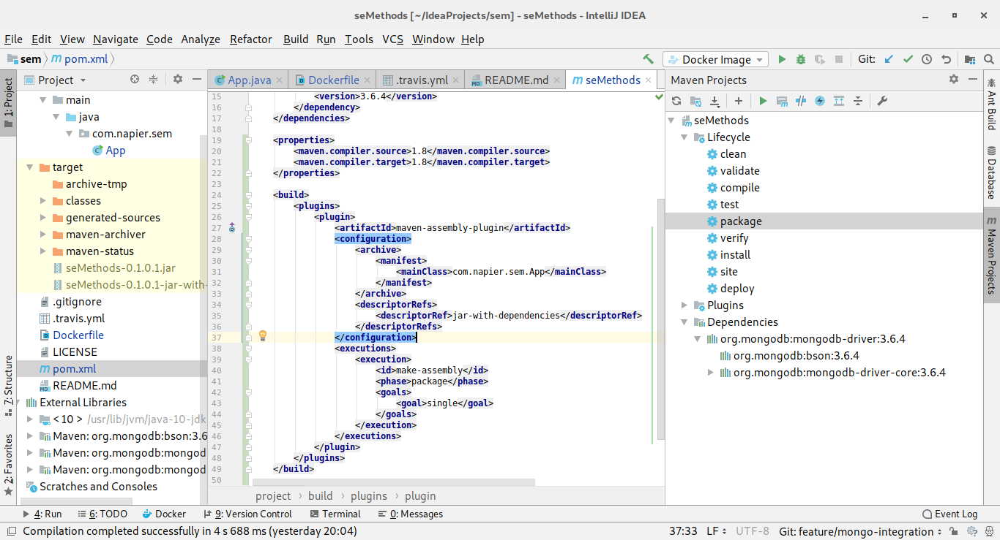

Open the **Lifecycle** collapsed menu, and select **package** and click the **green triangle in the Maven panel** to start the package process.  This will take a few seconds as your code and the external JAR libraries are combined into a single JAR.  You will see this in the **target** folder in the **Project Structure** as `seMethods-0.1.0.1-jar-with-dependencies.jar`.  So we have successfully built our project into a single JAR for deployment.  Time to push to GitHub.

1. Add files to commit.
2. Create commit.
3. Push to GitHub.

#### Creating a Network Bridge in Docker

In Docker, containers can discover each other by name if they are on the same Docker network bridge which is not the default one.  Therefore, we need to create a new bridge for our applications to talk on.  This is actually quite easy.  Run the following command from the command line:

```shell
docker network create --driver bridge se-methods
```

This will have created a new network called `se-methods`.  We can use this network to connect our main application to our MongoDB server.  Let us do this now.

#### Updating Our System

First we need to stop our current MongoDB server.  In IntelliJ you should be able to see this in the Docker panel under **Containers**.  To stop it, select the container and **click** the **red stop button** on the left:

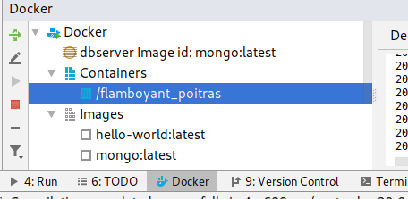

Once stopped, **right-click** on the container, and select **Delete Container** and then **Yes** in the prompt.

We need to create a new MongoDB server that uses our network infrastructure, and we also want to define the name of the server.  We do this by creating a new container from `mongo:latest` in IntelliJ using the following parameters:

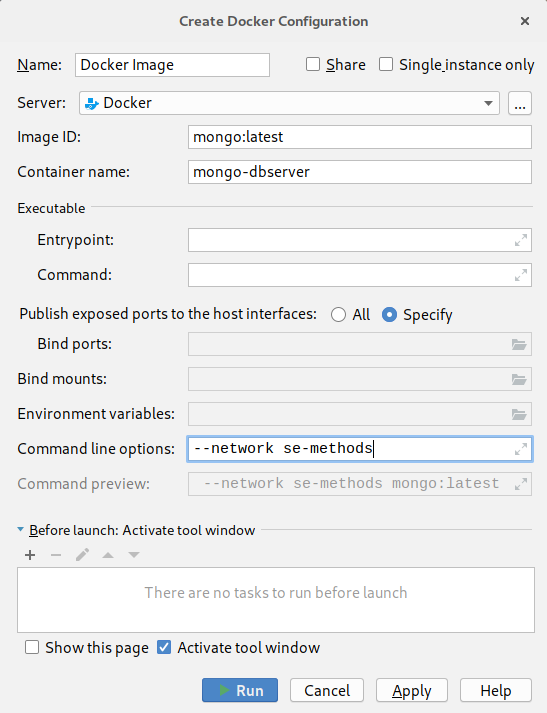

Click **Run** and the container will start.  Next we need to update our main application so it can talk to this MongoDB server.  The only line that needs updating is the `MongoClient` creation one:

```java
// Connect to MongoDB
MongoClient mongoClient = new MongoClient("mongo-dbserver");
```

We are now explicitly connecting to the server called `mongo-dbserver`, which is the name we gave to our MongoDB container.  To test this, we need to update our Dockerfile:

```docker
FROM openjdk:latest
COPY ./target/seMethods-0.1.0.1-jar-with-dependencies.jar /tmp
WORKDIR /tmp
ENTRYPOINT ["java", "-jar", "seMethods-0.1.0.1-jar-with-dependencies.jar"]
```

We have changed what we are copying to the JAR file that has been created.  We are also changing our entry point to execute this JAR.  Let us build the image for this.  You can do this by clicking the **green triangles** in the Dockerfile and selecting **Build Image for Dockerfile**.  The image will be created and added to the list of images in IntelliJ's Docker Panel, near the bottom with an `sha256` name.  If you have more than one of these because of previous builds, delete all the `sha256` images and rebuild to have only one.

To test our new image, select **Create Container** with it selected and use the following properties:

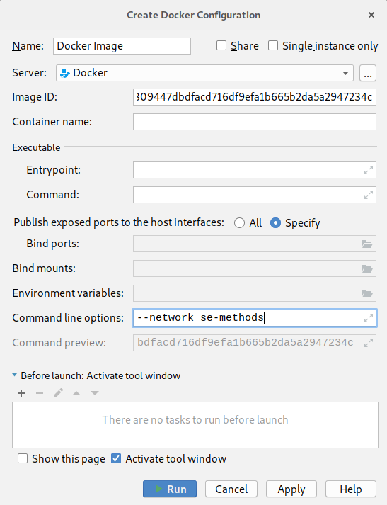

Click **Run** and our container will start our application which will connect to the MongoDB server and exit.  Time for an update to GitHub:

1. Add files to commit.
2. Create commit.
3. Push to GitHub.

#### Updating Travis Build

Now to put this into our Travis build file:

```yml
sudo: required

language: java

services:
  - docker

after_success:
  - docker network create --driver bridge se-methods
  - docker pull mongo
  - docker run -d --name mongo-dbserver --network se-methods mongo
  - docker build -t se_methods .
  - docker run --network se-methods se_methods
```

We have a few more Docker commands but these are just the ones we added via IntelliJ or otherwise.  Now push this to GitHub:

1. Add files to commit.
2. Create commit.
3. Push to GitHub.

Check with Travis CI and ensure that not only is the project building but that it successfully runs in Docker.  You will need to open some of the code folds to verify.

### Merging Feature

It's time to merge our feature back into the `develop` branch.  Before doing this, we need to check that no changes have occurred in `develop`.  Although we know there hasn't been, we need to get into the habit of managing the workflow.

To `merge` any changes in the `develop` branch onto our feature branch, select **VCS**, **Git**, then **Branches...**.  This will open up the **Branches Popup**:

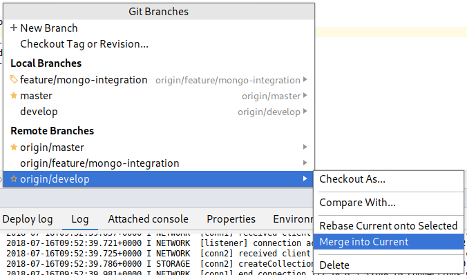

Select the `orign/develop` branch (this is the one in GitHub) and then select **Merge into Current**.  You might spot a little pop-up at the bottom stating **Already Up-to-date** which means we can proceed and merge our feature back into `develop`.

Now we just need to switch back to the `develop` branch.  Open the **Branches Popup** again, and select the `develop` branch in **Local Branches** and select **Checkout**:

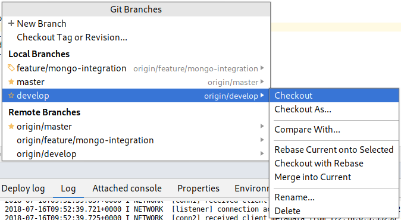

And now `merge` the `feature/mongo-integration` branch in the **Local Branches** into the current branch as before.  This will complete the feature.  We just need to `push` this change into GitHub.  It is just a `push` as all the feature changes have been added to `develop`.

### Creating a Release

Now we need to create a release.  First, **create a new release branch**.  Follow the instructions as before.

We are going to call this release `0.1.0.2` (`0.1-alpha-2`).  You will need to change the following files to reflect this:

- `pom.xml` - the `version` tag.
- `Dockerfile` - the `COPY` and `ENTRYPOINT` values need updated with the new JAR file name.

Once you've done that, test that everything still works locally.  This involves:

1. Rebuilding the project.
2. Telling Maven to package the project.
3. Building the Docker image.
4. Running the Docker image.

If everything goes well, push the changes to GitHub:

1. Add files to commit.
2. Create commit.
3. Push to GitHub.

Now we need to `merge` this release back into `master`.  The steps you need to take are:

1. **Checkout** `master`.
2. **Merge** `release` onto `master`.
3. **Push** to GitHub.

#### Version Tags

Git commits can also be tagged.  To do this in IntelliJ, select **VCS**, **Git** then **Tag** to open the **Tag** window:

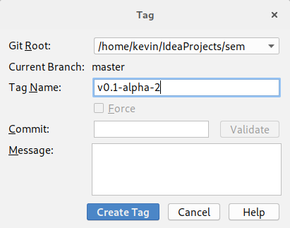

Use the name provided, and click **Create Tag**.  Now we just need to `push` the tag to GitHub.  Select push, but this time ensure the **Push Tags** checkbox is ticked as indicated:

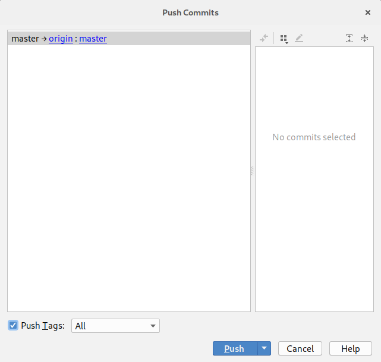

Click **Push** and your tag will be added to GitHub.

#### GitHub Release

Now to create a release on GitHub.  Go to the GitHub page for your project and select the **Releases** tab to open the following window:


Click **Create new release** to start entering the release details:

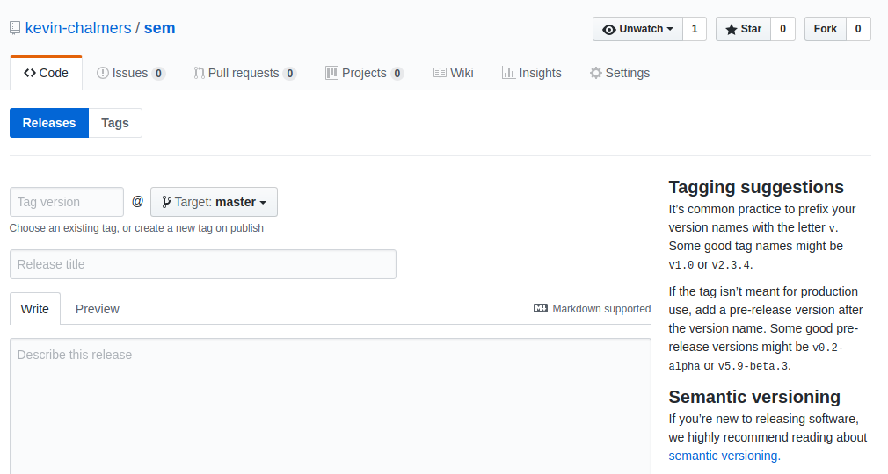

The details we want are below:

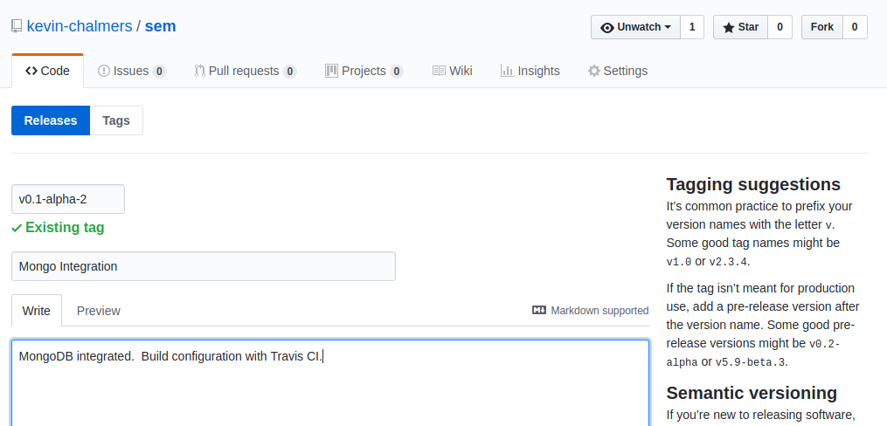

Also make sure the checkbox **This is a pre-release** is ticked.  Then click **Publish release**.  Your release details will then be presented:

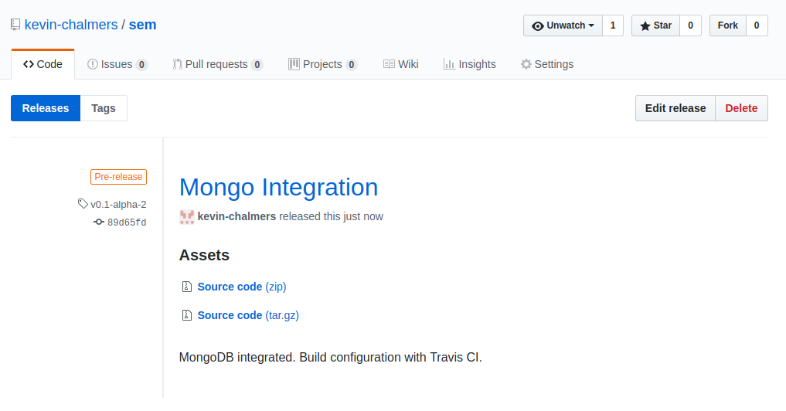

And if you go back to the main GitHub repository page you will find that your badges have been updated:

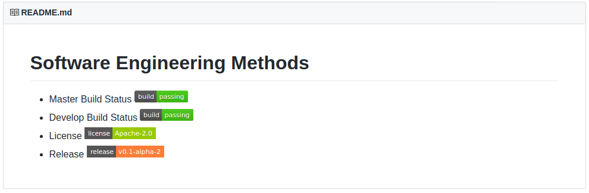

All you need to do now is merge the `release` branch back into `develop`:

1. Checkout `develop`.
2. Merge `release` into `develop`.
3. Push `develop`.

And we are done.  We have done a lot, but still not much code.  We have built our development pipeline, defined our workflow, and integrated a database along the way.  Not bad work.

### Clearing Up

Before stepping away from your machine there are some things you should do:

1. Stop any running Docker containers.
2. Delete any unneeded containers.
3. Delete any unneeded images.
4. Ensure any changes have been pushed.

With that done, you can happily walk away from the machine.

### Our Current Process

This is our current workflow.  This is an important set of steps so document them:

1. Pull the latest `develop` branch.
2. Start a new feature branch.
3. Once feature is finished, create JAR file.
4. Update and test Docker configuration with Travis.
5. Update feature branch with `develop` to ensure feature is up-to-date.
6. Check feature branch still works.
7. Merge feature branch into `develop`.
8. Repeat 2-7 until release is ready.
9. Merge `develop` branch into `release` and create release.
10. Merge `release` into `master` and `develop`.