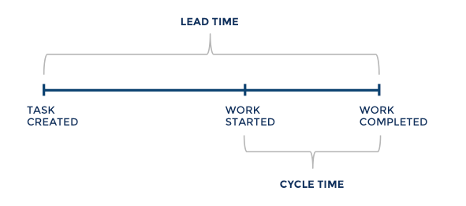
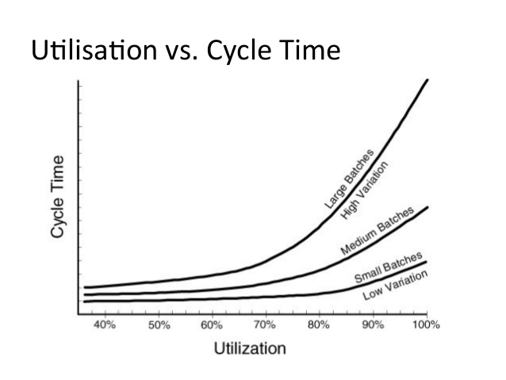
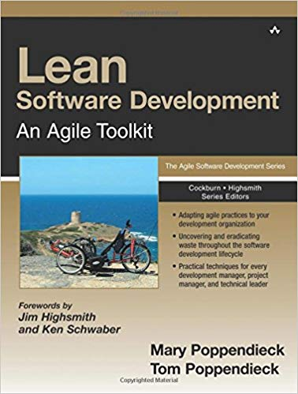

# Lecture 03: Lean Software Development

[Lean Software Development on Wikipedia](https://en.wikipedia.org/wiki/Lean_software_development).

## Behavioural Objectives

At the end of this lecture you will be able to:

- [ ] **Define** the *seven key principles of Lean Software Development.*
- [ ] **Discuss** how *Lean Software Development can be applied.*
- [ ] **Explain** *some of the tools for Lean Software Development.*
- [ ] **Identify** *Lean Software Development tools to apply to your software development process.*

## Key Principles of Lean Software Development

**Lean Software Development** defines the following seven principles:

- Eliminate waste.
- Amplify learning.
- Decide as late as possible.
- Deliver as fast as possible.
- Empower the team.
- Build integrity in.
- See the whole.

22 tools are defined within these principles which we will discuss through this lecture.

## Eliminate Waste

Waste is a concept from lean thinking.  In its simplest form:

> Waste is anything that does not create value to the customer.

For example, consider you as a student.  The value to you in university is getting an education.  Anything not providing an education at university is a waste in lean thinking.  The question a university has to ask is what does a student consider valuable as part of their education?  Anything else that a university does is a waste.

In lean, elimination of waste is the fundamental principle that everything comes from.  To do this, we need to learn how to see waste, uncover the biggest sources of waste, eliminate these, and repeat.

### Tool 1: See Waste

*Lean Software Development* uses the following quote from [Winston Royce](https://en.wikipedia.org/wiki/Winston_W._Royce):

> "[While] many additional development steps are required, none contribute as directly to the final product as analysis and coding, and all drive up the development costs."

Royce was a pioneer in systems development, and he wrote a paper which led to the development of the Waterfall model.  *This was **not** Royce's intention.*  He considered Waterfall not to scale to future problems.

Taking Royce's definition and the definition of waste in the Software Development Lifecycle:

- *Requirements gathering* **has waste**.
- *Analysis* is not waste.
- *Design* **has waste**
- *Coding* is not waste.
- *Testing* **has waste.**
- *Operation* **has waste**.

**Just because a step has waste does not mean it should not be done.**  The point is there is potential to automate these processes to allow software engineers to focus on the two important tasks - analysis and coding.

*Lean Software Development* defines **The Seven Wastes of Software Development**:

1. Partially done work
2. Extra processes
3. Extra features
4. Task switching
5. Waiting
6. Motion
7. Defects

#### Partially Done Work

Basically, any feature not completed.  It is a waste as the resources dedicated to the task have provided no Return of Investment (RoI).

Consider your work as a student.  If you start an assessment and don't finish and submit it, you have wasted your effort and time (resources).  It is partially done work, and partially done work is not done.

#### Extra Processes

Extra processes can be anything that does not add value to the customer.  Consider paperwork.  If no one is going to read the paperwork then what is the point.  A good test of value for paperwork is if someone is waiting for it.

An example in a university is assessment submission.  There are two options:

- You write the assessment, print it out, and submit it physically.
- You write the assessment, and submit it online.

The second method reduces a step but achieves the same task.  It has thus reduced waste.

#### Extra Features

Don't add features that are unneeded.  It may be tempting to think you are meeting a future need but it is not true.

Consider adding parts to an assessment you were not asked for.  You won't get graded for them.  If you think adding the features improved your learning, great.  Otherwise, it is a waste.

#### Task Switching

No-one can multitask.  You lack the physical capability to truly focus on and do multiple tasks at once.  You will either do multiple tasks badly, or you waste time context switching.

Complete tasks.  The fastest method to complete two tasks is one-at-a-time.  When you switch between tasks there is a cost.  It could be 5 minutes, 30 minutes, or a few hours.  Either way, you have spent more time by switching tasks than just focusing on one.

#### Waiting

If you are waiting for something to happen before performing a task that is a waste.  Only work on tasks that are ready.  In the Scrum section, we defined **Definition of Ready**.  Work only on tasks that are ready.

#### Motion

Handoffs create waste.  If you handoff a product to someone else, waste is possible.  This is due to the receiver not having all the knowledge the sender has.  There is a chance the sender will have to train the receiver.

Another form of motion waste is when you have to travel to discuss something.  A team working closely together can communicate quickly.  If you have to walk to discuss a problem, you are creating waste.

#### Defects

A defect (or bug) has greater impact the longer it is not resolved.  If your program has a bug and you don't resolve it, you make it harder to find as your code base increases in size.  When a defect is discovered, find its source, and find it quickly.

- [ ] Reflect upon these seven causes of waste.  Have you ever experienced any of these?  How do they impact how your team is working?

### Tool 2: Value Stream Mapping

A [**Value Steam Map**](https://en.wikipedia.org/wiki/Value_stream_mapping) defines the events that occur to deliver a product or service to a customer.  The point of a map is to identify where work actually occurs as opposed to waiting.

An example of a value stream map is doing an assessment.  There are the following events and processes:

1. Assessment specification released (week 1)
2. Assessment worked on
3. Assessment submitted (week 12)
4. Assessment marked
5. Feedback given (week 15)
6. Marks moderated (week 17)
7. Marks uploaded to system (week 18)
8. Marks approved by exam board (week 19)
9. Final marks released (week 21)

If an assessment only takes two weeks of effort, there are ten weeks of capacity.  If marking only takes one week, there are two weeks of capacity.  And so on.

## Amplify Learning

A key concept in lean is the ability to adapt.  To do that, the team must get information from the process.  Feedback is necessary to allow people to improve.  **Trying and failing fast is better than delaying.**

Having points to check progress is also important.  Iterative development really helps here.

### Tool 3: Feedback

Any feedback you can get improves the learning process.  That is why students want feedback.  In software development, testing is a good method of getting immediate feedback on your code.

Points to consider:

- Run tests as soon as code is written - we will cover **Test-driven Development**
- Write code to test ideas instead of detailed planning or documentation
- Provide users with potential options rather than gathering more requirements
- Test the top three potential tools rather than studying them in more detail
- Test new ideas with web front ends rather than full system conversion

In other words, **experiment** and **evaluate the outcome.**  And **do it often.**  This will amplify learning.

- [ ] Define how you are going to improve feedback in your development team?  Which mechanisms can you automate to provide fast feedback?

### Tool 4: Iterations

We covered this idea in Lecture 02 on Scrum.

### Tool 5: Synchronisation

Basically, the team needs to synchronise often to ensure that changes are not breaking the build.  Some rules of thumb:

- Work on small features and merge them into the development branch on completion
- All developers should synchronise their work every day
- Every day, the necessary tests should be run to check the system still builds and works correctly

### Tool 6: Set-based Development

We can try and solve a problem in two ways: point-based or set-based.  To describe the difference, consider trying to agree a meeting time.

- Point-based:
  - Meet at 10:00?
  - No, how about 2:00?
  - No, how about 3:00?
  - No, how about 9:00?
  - etc.
- Set-based:
  - I can meet between 10:00 and 1:00 or 3:00 and 5:00.
  - OK, let's meet 12:00 to 1:00.

Set-based development works with constraints not choices.  You define the constraints and then decide on a choice as late as possible.

## Decide as Late as Possible

Business requirements are constantly changing.  These changes impact software requirements.  The more flexible you can be, the more you can adapt to these changes.

This principle addresses this problem.  The later you can make a final decision the better.  Deliver features fast, but don't decide which features to implement or how to implement them until you are ready.

### Tool 7: Options Thinking

How did Microsoft become a dominant software company?  Simple, by options thinking.  In 1988, Microsoft was accused of having no strategy because:

- It was pushing DOS and an early version of Windows
- It was pushing OS/2 for IBM-based machines
- It had a version of UNIX
- There were new versions of Word and Excel, considered inferior on DOS and Windows than WordPerfect and Lotus

But Microsoft succeeded because it had options.  No platform was dominant in 1988, so:

- The hope was Windows would win
- DOS and/or OS/2 could be utilised if they won
- If UNIX won, Microsoft had an option
- If Apple won, Word and Excel were better options than WordPerfect and Lotus on their hardware

The options were there, and Microsoft won.  The 1990s and 2000s were dominated by Microsoft OS and applications.  Bill Gates became the richest man in the world.

Keep options open.  It the customer's requirements change you should be adaptive.  Don't produce detailed plans based on speculation.

### Tool 8: The Last Responsible Moment

Here are some strategies to delay decisions to the last responsible moment:

- Share partially complete design information with customers and the team.
- Organise for direct, worker-to-worker collaboration.  Work as a team.
- Develop a sense of how to absorb changes.  In other words, hide errors for as long as possible and fix them before they are problems.  Don't aim to get everything right first time.
- Develop a sense of what is critically important in the domain.
- Develop a sense of when decisions must be made - don't let delayed commitment turn into no commitment.
- Develop a quick response capability - in other words implement features quickly.

### Tool 9: Making Decisions

There are two approaches for problem solving:

- Breadth-first is a delayed commitment approach.  You weigh options as you solve
- Depth-first involves making a commitment and solving using a specific option

People prefer depth-first as it starts solving the problem and reduces complexity.  But if the wrong decision is made then the time spent solving the problem is lost

In Lean Software Development, decisions are guided by the seven principles:

1. **Eliminate waste** - spend time only on work that adds value
2. **Amplify learning** - increase feedback
3. **Decide as late as possible** - keep your options open as long as practical
4. **Deliver as fast as possible** - deliver the value to the customer when they ask for it
5. **Empower the team** - let the people who add value make decisions on how
6. **Build integrity in** - don't add at the end, build it from the start
7. **See the whole** - avoid optimising for parts of the system.  Work for the whole

- [ ] Analyse your current work plan for your assessment.  Which features can you delay implementing?  Which parts need definite decisions at the start?  Reorder your work plan accordingly.

## Deliver as Fast as Possible

This is not about rushing without thought.  We are talking about being faster than the competition.

Netflix and Spotify have a business model based on fast delivery.  Movie and music piracy were major problems in the early 2000s.  The belief was price was a problem.  But when Netflix and Spotify offered instant access to large catalogues, people paid for the service.  The *free* piracy route shrank.

Netflix and Spotify deliver movies and music as fast as possible.  Faster (slightly) than the pirates.  And people are happy to pay for it.

### Tool 10: Pull Systems

We will look at Kanban in the future.  For the moment, the basic idea is that people know which work needs to be done, and they select that work.  They pull the work, rather than have it pushed upon them.

### Tool 11: Queueing Theory

In Lecture 01 We discussed lead-time and process-time (or cycle-time).  This can be illustrated as follows:

Our aim is to reduce the difference between lead-time and cycle-time.  In queueing theory, we recognise the effect of small batch size to support this goal.  Small batch size means a task is small and quick to complete.  Small tasks increase flow, large tasks decrease flow or create bottlenecks.  See the following chart:

Large batches (tasks) means cycle-time (time to complete the task) increases as the utilisation increases.  Utilisation is how much work something is doing.

To make this simple, having large tasks means a person slows down as they become busier.  Smaller tasks are always favourable.

Having slack allows the team to adapt and change when required.  A road at full capacity is a parking lot.  You want capacity in the road to allow cars to flow.

- [ ] Review the tasks you have defined for your assessment.  Can they be broken down into smaller sizes?  Make tasks small to improve your team efficiency.

### Tool 12: Cost of Delay

The idea here is simple.  To quote *Lean Software Development*:

> Conventional wisdom in product development says that there is a roughly even tradeoff between development cost and the cost of development time.

As Lean Software Development points out, this wisdom is wrong.  Getting the product out first is more valuable than getting it out later.  So, spending money to improve delivery time may be more beneficial.  You need to estimate what this is.

## Empower the Team

*Lean Software Development* provides some examples, but the general idea is the same as Scrum.

**Happy team members with increased job satisfaction are worth more to the organisation as the team are more productive.**

To meet this goal, the team needs to be empowered.  There are a few ideas here, although our discussion on Scrum in Lecture 02 also provides insight.

### Tool 13: Self-determination

Instead of measuring people's individual performance and trying to optimise, let people work out how to optimise their work.

### Tool 14: Motivation

People need more than just tasks to complete - they need a purpose.  If the team can commit together to achieving a purpose they become highly motivated.  Some points to consider:

- Have a clear purpose that people want to achieve
- Make sure the purpose can be achieved
- Allow the team to interact with clients
- Allow the team to decide what to do and how to do it
- Managers get problems out of the way
- Keep negative people away from the team

These are very much the same ideals as Scrum.

Motivation is built from:

- A feeling of belonging
- A feeling of safety
- A sense of competence
- A sense of progress

### Tool 15: Leadership

We won't go into this here.  Leadership is a big field.  *Lean Software Development* focuses on the idea of masters who understand the product and the necessary techniques to deliver it best.

### Tool 16: Expertise

Expertise is related to leadership.  The idea is to build communities of experts that support and refine their practices and standards.  Becoming part of a community is important here.

- [ ] Compare tools 13-16 against the principles of Scrum defined in Lecture 02.  How similar are they?  What parts of Scrum are missing?  What parts are missing from Scrum?

## Build Integrity In

Product integrity is an important to building a reputation.  Product integrity can be defined in two dimensions:

- Perceived integrity.
- Conceptual integrity.

### Tool 17: Perceived Integrity

Perceived integrity is the balance of function, usability, reliability, and economy that engages the customer.  Think about Apple, which could be considered the masters of perceived integrity.  It includes marketing and cost.

Perceived integrity should be reviewed and refreshed regularly.  This is to ensure the technical team aren't missing the point of the product.

Perceived integrity is best supported by working with customers.  This requires communication strategies and a common language.  
### Tool 18: Conceptual Integrity

Conceptual integrity is about the core product functions working together in a smooth, complete manner.  The components work together well.

Conceptual integrity is a requirement for perceived integrity, but it is not enough.

We will look at modern software architecture that will support conceptual integrity.

### Tool 19: Refactoring

We will not look at this in detail, but the general idea is to improve your code base quality.  Making your code better is important.  Improved quality solutions make your life easier.  Letting bad quality build up in a system will impact its integrity.

### Tool 20: Testing

We will cover testing in the upcomng weeks.

## See the Whole

A system is better than the sum of its parts.  Also, the best parts do not necessarily make the best system.  Seeing the whole is about optimising for system performance rather than individual component performance.

We won't discuss this area in detail as the module does not focus on these areas.  There are two tools.

### Tool 21: Measurements

Make sure you measure correctly for complete system performance, not local optimisation.

### Tool 22: Contracts

Make sure the contract negotiated is correct.  See *Lean Software Development* for some example contract types.

## Review

In review, we have covered the following areas:

- We defined the seven key principles of Lean Software Development: eliminate waste; amplify learning; decide as late as possible; deliver as fast as possible; empower the team; build integrity in; and see the whole.
- We discussed how Lean Software Development can be applied via the 22 tools.
- We explained some of the tools for Lean Software Development.  The recommended reading goes into more detail.
- We identified Lean Software Development tools to apply to your software development process by examining where the 22 tools can be applied, pointing to explicit lectures in the module.

## Recommended Reading

**Lean Software Development: An Agile Toolkit** by *Poppendieck and Poppendieck*.

Another good book to read in general for the case studies and anecdotes.  It contains the toolkit that is the basis for this lecture.  The [Wikipedia Page](https://en.wikipedia.org/wiki/Lean_software_development) provides an overview of the ideas.