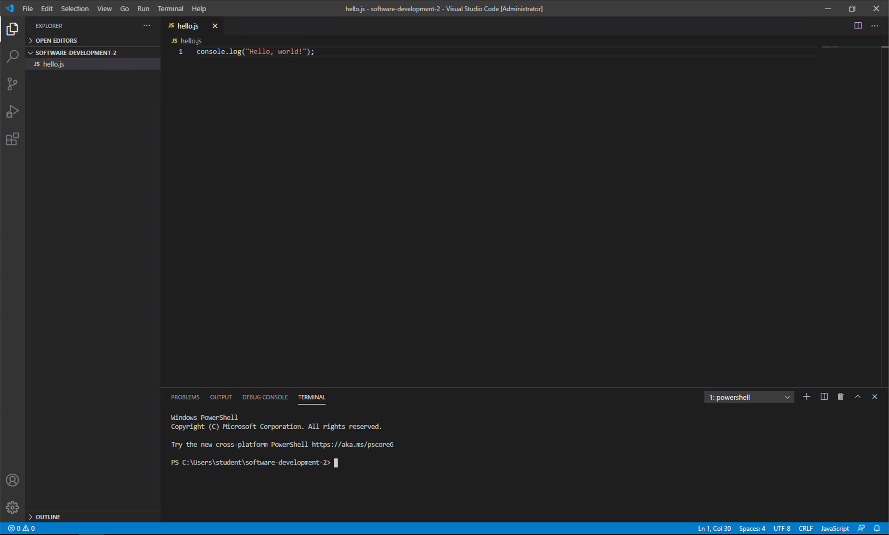

#  Backend programming with Node.js
## Serving web pages with Node.js

### Pre-lab work: Installing and Testing Node

> Node.js is a popular server-side runtime that can run JavaScript code outside a browser. Node.js is available from https://nodejs.org/en/.

> 1. **Download Node.js for your operating system.**
> 2. **Install Node.js onto your system. Make sure you have Node.js added to the PATH in Windows.** 
> 3. **Follow the rest of this lab.**

> Once Node.js is installed, you can open the command prompt and type 
> ```
> node
> ```

> to test it. You will be presented with the following:

> ```shell
> ~ node
> Welcome to Node.js v14.7.0.
> Type ".help" for more information.
>```

> This is a command prompt, much like Python's interactive console, so you can enter JavaScript commands dirctly here:

> ```shell
> console.log("Hello, world!");
> Hello, world!
> undefined
> ```

> Type `.exit` into the command prompt to exit Node.js.  (don't forget the dot - its not a typo!)

### Lab: Your First Node.js Application

Let us recreate the *Hello World* JavaScript example in a file and ask Node to run it for us. 

**Create a new file called `hello.js` and use the following code:**

```javascript
console.log("Hello, world!");
```

**In Visual Studio Code, select View then Terminal from the main menu. This will open a terminal at the bottom of the Visual Studio window.**



This is just a normal command-line terminal. It is just embedded into Visual Studio Code to make our life easier.

**To run your program, enter the command `node hello.js` in the terminal. `Hello, world!` will be printed to the terminal.**

TROUBLESHOOT: If you get an error, read it carefully! Got a 'cannot find module' error? Perhaps your hello.js file isn't in the same directory as the terminals current working directory?  Use cd to get into the correct directory then try again.  Remember - error messages are ther to help you!


**Exercise**

Update the application to print `Hello, <name>` where `<name>` is your name.

### A Node.js Server on your local computer

JavaScript is a language aimed at how the web and Internet work and is used to create server-side applications. 

In order to respond to web 'requests', a specialised software application is required to receive those requests, forward them to the correct part of the backend code, and then send out the 'response' to the client.  This application is a webserver. Well known webserver applications used in production sites include Nginx and Apache. 

For small-scale and local development, we can use the inbuilt simple webserver provided by node.js.   

Think back to this diagram from our first session - we are now going to run every part of the system - backend and frontend - on just one computer (we will be adding the database in a bit later on).

> 

#### Running the node.js simple server

Copy this code to a file called server.js:

```javascript
// Load the http module from Node's standard library
const http = require("http");

// The hostname we will run the server on.
// 127.0.0.1 is the localhost
const hostname = "127.0.0.1";
// The port the server will listen on.
const port = 3000;

// Create the server.
// The server requires a function with parameters req, res
// that will run when requests are received from a web browser.
// req - the incoming request from the web browser.
// res - the outgoing response we will send from the browser.
const server = http.createServer(function(req, res) {
    // Respond with OK message.
    res.statusCode = 200;
    // The type of content we are returning. Just plain text.
    res.setHeader("Content-Type", "text/plain");
    // The plain text we are returning.
    res.end("Hello, world!");
});

// Start the server listening on the port of the hostname.
// A function is required to execute on successful server start.
// Notice these are backticks ` and not single quotes '.
server.listen(port, hostname, function() {
    console.log(`Server running at http://${hostname}:${port}/`);
});
```

**Run this file in the Visual Studio Code terminal by executing `node server.js`.** This will set your webserver running ready to catch and process your requests. To try it out **go to `http://127.0.0.1:3000` using your web browser.** You should see `Hello, world!` in the browser.


**To stop the HTTP server, use `CTRL-C` in the terminal.**

#### Now you try

1. First simply change the server to respond with `Hello, <name>` where `<name>` is your name.  Note you will need to start and stop the server for your change to run in the browser.
2. Now Modify the line `res.end("Hello, world!");` to `res.end("Hello, " + req.url);` and then go to the URL `127.0.0.1:3000/<name>` where `<name>` is your name. Try a different name.  Can you read the server code to explain what has happened?

### Serving Static Web Pages

This server isn't very useful as we need to reload it with each amendment. But it did get us started.  Lets move on by creating a more useful webserver that can keep running and 'serve' any file in its directory.  Again we'll use a library or 'package' that is part of node.js to do this.


 **First, run the following in the Visual Studio Code terminal.**

```shell
npm install node-static
```

`npm` is the *Node Package Manager*. We are asking it to install the `node-static` library. This allows us to enter the following program, `static.js` (below). **Make sure this file is created and ran from the same location as your HTML files**:

```javascript
// Import the node-static library
const static = require("node-static");
// Import the http server library
const http = require("http");

// This creates a static file server for on the directory __dirname
// __dirname is the directory the Node application is working in.
// Similar to cwd (Current Working Directory)
var file = new(static.Server)(__dirname);

// The hostname and port the server will listen on.
var hostname = "127.0.0.1";
var port = 3000;

// Create the HTTP server with the function used to service requests.
const server = http.createServer(function(req, res) {
    // Delegate request to the static file server.
    file.serve(req, res);
});

// Start the server.
server.listen(port, hostname, function() {
    console.log(`Server running at http://${hostname}:${port}/`);
});
```

**Run the `static.js` file from the Visual Studio Code terminal:**

```shell
node static.js
```

Now you access your previous HTML files from this module by using, for example, the following URL `127.0.0.1:3000/first.html`.

You will need to ensure that the html files you want to serve are in the same directory as your static.js file.

#### Now you try

Without restarting the Node.js server we just started, create a new file -- `test.html` -- and add some HTML content to it. You should be able to immediately access this file in your web browser using `127.0.0.1:3000/test.html`.

#### So you want to know more

The main Node.js documentation is available at https://nodejs.org/en/docs/. TutorialsPoint also provides a [Node.js tutorial](https://www.tutorialspoint.com/nodejs/index.htm). We will cover many of these ideas in the module, but additional resources are always useful.

## More Exercises

1. Update the Node.js server so it prints to the console the URL requested.
2. Update the Node.js server so that if the URL `/roehampton` is requested, the server returns `Hello from Roehampton!`. **HINT** -- use an `if` statement to test the value of URL. Remember to add `res.end();` to complete the response.
3. Update the Node.js server so that if the URL `/roehampton` is requested, the server will redirect the browser to Roehampton's website. **HINT** -- the status code for a redirect is 302, and you will need to set the `Location` using `res.setHeader`.

# Dynamic routes: Express.js

We can now create web pages and make them interactive with javascript and HTML forms. We can also run a webserver to receive requests, route them to the correct file and return an appropriate response.

To take this to the next stage, we will use another Node.js library -- Express.js. This will enable use to create more sophisticated 'routes' ie. paths to files or functions, with more sophisticated functionality that can process dynamic input and produce output accordingly.

You can install it by running the following in the terminal in the root folder of your repository:

```shell
npm install express
```

So what is Express.js? It is an industry standard framework for building web applications.  It can receive requests, forward it to the correct logic and send back a response.  It can be used with a templating engine to provide a full stack web application, or can be used to build REST APIs.

## RESTful Interfaces

REST stands for [Representational State Transfer](https://en.wikipedia.org/wiki/Representational_state_transfer). This is a software architecture for web services that is driven by structured  URLs. 
We interact with our web service by accessing a URL with a particular HTTP message type:

- `GET` will return data from the web service. This is the standard HTTP message used when we get a webpage.
- `POST` sends data to the web service. This is the HTTP message used when you send data from a webpage, such as in a form.
- `DELETE` allows deletion of data in the web service.

The approach Express takes is to provide a framework in which we define URLs or 'routes'.  These call a function when our server receives a request.  Most importantly, parts of the URL can by dynamic ie. can send a variable in to the function.

 Let us build a first Express.js application. 
 
 **Enter this code as `express_server.js`:**

```javascript
// Import express.js
const express = require("express");

// Create express app
var app = express();

// Create a get for root - /
app.get("/", function(req, res) {
    res.send("Hello world!");
});

// Start server on port 3000
app.listen(3000,function(){
    console.log(`Server running at http://127.0.0.1:3000/`);
});
```

Here we have defined the `/` (root folder) to respond with `Hello world!`. **Now run this programme with the following:**

```shell
node express_server.js
```


**Open your browser, and go to `127.0.0.1:3000`**. You should see `Hello world!` displayed.

To build up an application we will get Express to listen on some other URLS, in other words, we will create 'routes' for our requests and give back different responses according to the requested route.

**Shutdown the server with CTRL-C and update `express-server.js` to the following:**

```javascript
// Import express.js
const express = require("express");

// Create express app
var app = express();

// Create a get for root - /
app.get("/", function(req, res) {
    res.send("Hello world!");
});

// Create a route for /goodbye
// Responds to a 'GET' request
app.get("/goodbye", function(req, res) {
    res.send("Goodbye world!");
});

// Create a dynamic route for /hello/<name>, where name is any value provided by user
// At the end of the URL
// Responds to a 'GET' request
app.get("/hello/:name", function(req, res) {
    // req.params contains any parameters in the request
    // We can examine it in the console for debugging purposes
    console.log(req.params);
    //  Retrieve the 'name' parameter and use it in a dynamically generated page
    res.send("Hello " + req.params.name);
});

// Start server on port 3000
app.listen(3000,function(){
    console.log(`Server running at http://127.0.0.1:3000/`);
});
```

There are now three URLs you can visit:

- `127.0.0.1:3000` will display `Hello world!`.
- `127.0.0.1:3000/goodbye` will display `Goodbye world!`.
- `127.0.0.1:3000/hello/<name>` will display `Hello <name>` for any value of `<name>`. Try your own name.

### Dynamic values in routes

Note that the parts of the URL prefaced with a ':' are dynamic, ie. the name you provide is just a label - think of it as a variable name - for a dynamic value.  These parameters are the available via the req.params variable.

Try running the above code but put a colon before the 'hello' in the route.  Examine the console output and explain what has now happened.

### Improving your development environment

Reloading the node server each time you change your file isn't going to be a good development experience.  There are npm packages that can automatically watch for changed files and reload for you in the background.  The 'nodemon' package seems to work well for Linux and mac. Try 'supervisor' windows 10.

For windows, install the package:

```bash
npm install supervisor -g
```

Now start your script with

```bash
supervisor express-server.js
```

For other platforms

install the package:

```bash
npm install nodemon -g
```

Now start your script with

```bash
nodemon express-server.js
```


### Now you try

Add the following end point URLs to the application:

- `/test` will display `Welcome to the test page!`
- `/student/:id/:name` should display a table with the submitted student ID and name. **HINT** -- you will have to construct the string in the response to be HTML.

## Coming next...

Later, we will connect a database to our express application and use the dynamic routes to create, retrieve, update and delete information in the database.  We will also look at how the presentation (ie. HTML generation) can be improved but kept seperate from business logic by using a templating system and MVC (Model View Controller) architecture.

ie. we will have everything we need to create a simple 'CRUD' web application using some best pratices in software design.