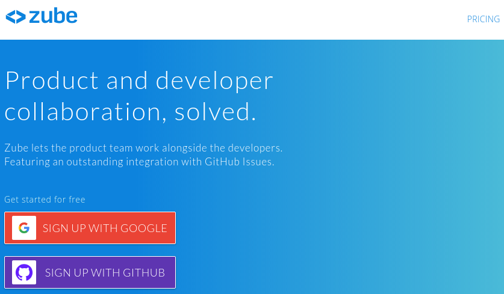
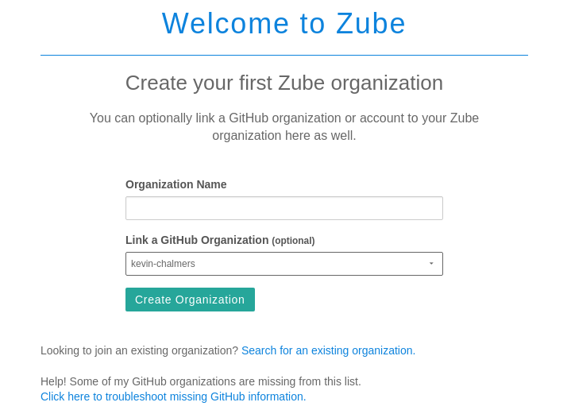
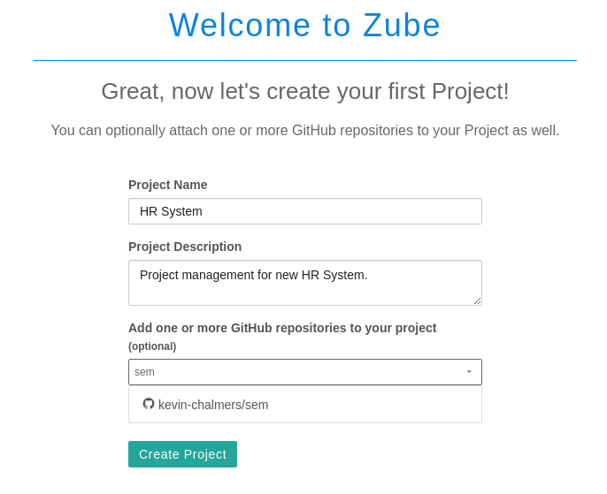
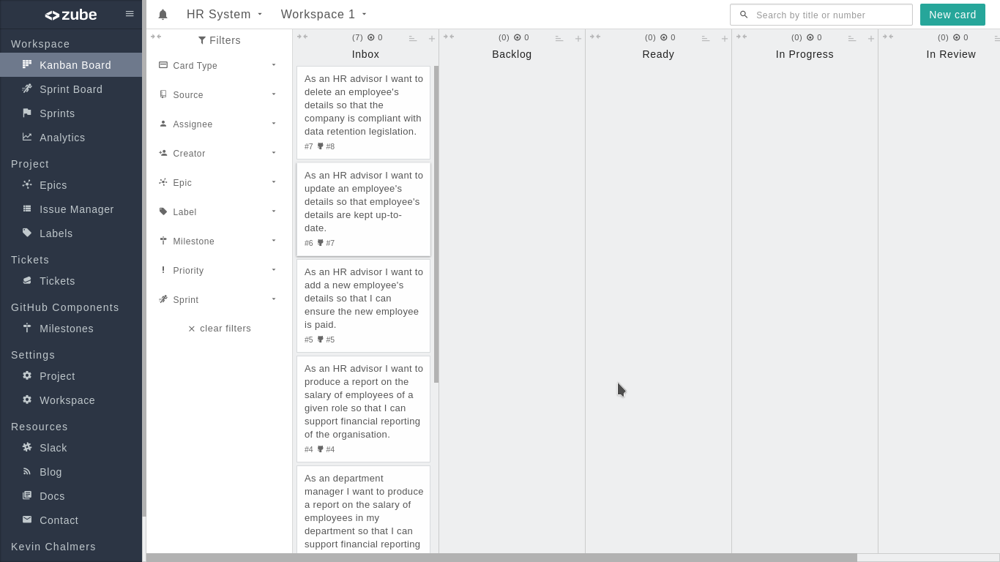
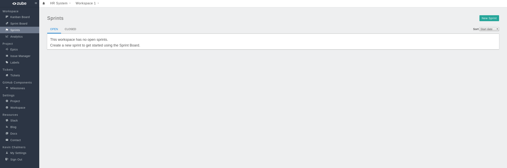
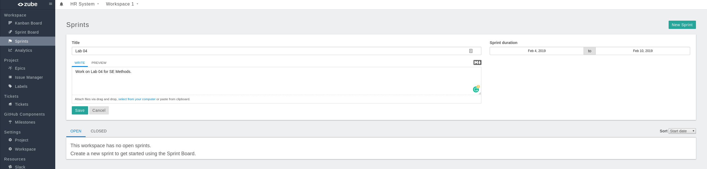
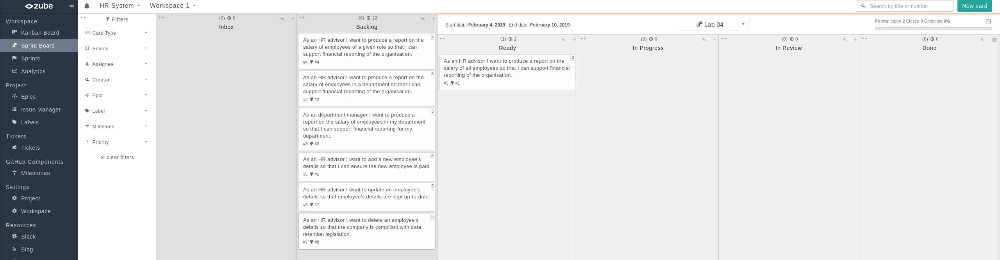
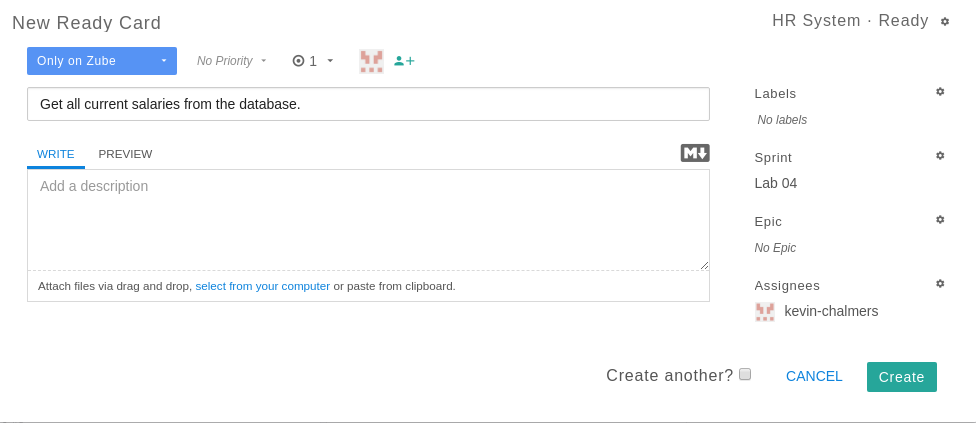

# Lab 04b: Task Management and Kanban

Our next step is to extend our task management system beyond simple GitHub issues.  We will use a task board approach that comes from [Kanban](https://en.wikipedia.org/wiki/Kanban_(development)).
## Behavioural Objectives

- [ ] **Create** a *Kanban Board on Zube.*
- [ ] **Create** a *Sprint Board on Zube.*
- [ ] **Run** a *Sprint*.

## Setting up Zube.io

GitHub does support task boards - see the **Projects** tab in your repository for details.  We are going to use a different system provided by [Zube](https://zube.io/).  This is because Zube:

- Integrates with GitHub tasks.
- Provides more functionality, such as story points.

Connecting your GitHub repository is simple.  Just go to https://zube.io/ and click the **Signup with GitHub** button.

Follow the instructions to connect your account.  Once you get to the main screen you are ready to start setting up your project.

### Creating an Organisation

Next we need to create a new organisation in Zube.  An organisation is a way of managing projects.  You should see a button with **Create a new organization**.  Click this button to open the new organisation window.

Use **Roehampton** as the organisation name, and **ensure you link to your GitHub account name as an organisation** and click **Create Organization**.  This will open the new project window.

### Creating a Project

Next we need to create a project:

**Ensure you link the repository you are using for the labs.**  Use the same details as above and click **Create Project**.

## Organising Your Task Board

You should now see your project task board:

We are now going to go through two processes:

1. Assigning story points to our current tasks.
2. Prioritising tasks.

### Assigning Story Points

It is all about estimating the size of a task against other tasks.  Zube lets us assign story points to tasks.  To do so, **Click** on a **task card** on the Kanban board.  This will open the task details window:

As you can see, there is a drop-down menu where you can set the points for a task.  To close the details of a task **click** the **cross** at the top-right of the details window.

#### Exercise

Assign points to our current tasks.  It is up-to-you to decide the scores based on your own estimate.

### Prioritising Tasks

Next we will prioritise tasks.  This is done by moving task cards up and down in the task board.  It is that simple.  Ordering tasks is the job of the **Product Owner**.  At present, the order of tasks needs to be:

- #1 Produce a report of all salaries.
- #4 Produce a report of salaries by role.
- #2 Produce a report of salaries by department (HR advisor).
- #3 Produce a report of salaries by department (department manager).
- #5 Add new employee.
- #7 Update employee details.
- #8 Delete employee details.

This is the current order tasks will be completed for the project, but it is subject to change.  Remember, we have planned, but we will keep planning.

## Setting up a Sprint Board

Now it is time to set up a *Sprint*.  Remember from your previous lecture(s) that a Sprint is a fixed-time where we attempt to do work.  A Sprint can have different durations, but for the labs we are going to work in a single week (as that is the amount of time to do a lab).  We define the work we are going to do and then we work on it - **not adding any new work to the sprint.**

Zube features **Sprint Boards**.  To use these, first we need to set-up a Sprint.  To do this, click on the **Sprints** menu option on the left.  This will open up the following view:

Now we need to create a new Sprint.  **Click the New Sprint button** on the top-right to open the New Sprint view:

Enter the details as shown in the image above:

- Title: Lab 04
- Description: Work on Lab 04 for SE
- Dates: As appropriate for the week you are doing this.  In 2022, that was Feb 04 (Monday) until Feb 10 (Sunday).

**Click Save** and the Sprint will be created.  Now click on **Sprint Board** on the left-hand menu to open the Sprint Board view:

Notice that the columns to the right (Ready, In Progress, In Review, and Done) are now in the Sprint section of the Sprint Board.  This is to indicate that these columns are related to the Sprint we are going to do.  We will use these columns to manage our work during this Sprint.

## Next Feature: Salary Report

Now we are ready to start our next feature: the *Salary Report*.  To do this, we first need to create a new **Feature Branch** in our Git repository, called `feature/salary-report`.  **Do this now.**  Remember to switch to the new branch in IntelliJ.

### Starting a Sprint

Next we need to setup our Sprint Board.  The task we are going to work on (1. As an *HR advisor* I want *to produce a report on the salary of all employees* so that *I can support financial reporting of the organisation.*) must be placed in the **Ready** column of the Sprint Board.  All other tasks should be put into the **Backlog**.  Below is how your Sprint Board should look:

### Adding New Tasks

Our user story has a few tasks:

1. Get all current salaries from the database.
2. Print list of salaries.

We can add these tasks as new **Cards** on Zube.  This is to avoid them appearing as issues on GitHub.  To do this, **click the New Card Button** at the top-right of the Sprint Board.  This will open the **New Card Dialogue Window**:

We now need to add the details for each of the tasks above.  Enter the details for task 1 as shown:

- Only on Zube.
- 1 story point.
- Assign to yourself.
- Title: Get all current salaries from the database.
- Sprint: Lab 04.

The details for task 2 are the same but with a different title.  After both cards are added, reorder your **Ready Column** on the Sprint Board to look as follows:

We are now ready to get to work.

