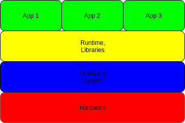
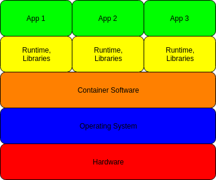

# Modern Software Architecture

In this lecture we will examine the history of software architecture and delivery, ending with current modern software approaches.  Understanding these concepts are important to working in a modern development environment, and considering the relationship now formed between *developers* and *operations* (DevOps).

## Behavioural Objectives

- [ ] **Define** the *hardware eras for software deployment.*
- [ ] **Describe** the *software platforms for software deployment.*
- [ ] **Describe** the *execution environments for running software.*

## Hardware Eras

Software runs on hardware.  We can broadly divide hardware developments into three eras:

1. Mainframe.
2. PC.
3. Mobile.

A lot has happened within these eras, and we could divide further into the Internet era, simple mobile, etc.  However, these three broad eras allow us to discuss the core issues of software development.

### Mainframes

In the beginning, computers were single machines with jobs processed in order.  Jobs were either added from a single terminal, or from a collection of dumb terminals connected via a primitive connection.

All software and data resided on the mainframe.  A list of tasks were scheduled and executed in batches.  The real problem with software during the mainframe era was the general difficulty in programming from the lack of good tools.

### PCs

In the mid-to-late 1970s the PC era emerged with affordable small computers being available for home and business use.  This changed how software was delivered to users.  In particular, desktop applications became big business, leading to the rise of companies like Microsoft with operating systems and office software, and Adobe with creative tools such as Photoshop.

The PC era saw the transition from disconnected computers with physical install media to the Internet.  Client-server architectures delivering applications to the home became big business, as did the software to connect to the Internet - the web browser.

### Mobile

Today we live in a mobile era.  Most software is delivered via interfaces on mobile devices.  Physical media is all but dead, and most applications exist on the web or have cloud-based interfaces.

Having such dynamic software delivered on-demand changes expectations on the management of software platforms.  The rise of agile to manage this complexity, and more recently the rise of DevOps to manage operational scalability, are signs of where the software industry is heading.

## Software Platforms

As hardware has changed, so has the software platforms and architecture to support them.  As software has moved online, the methods to design, implement, and deploy software have changed to suit the new demands placed on software.

Below we will cover some broad types of software which have emerged over the decades.  These architectures are still in use today, although they have evolved with technology.

### Desktop Applications

Many of these development approaches have impacted desktop software development.  During the 1980s structured programming was key, although the late 1980s and 1990s saw the rise of object-orientation.

The advantage (and disadvantage) of desktop software originally was that once it was sold to the consumer no updates and maintenance was required.  People bought a physical copy of the software and that was it - bugs and all.  This meant software had to be of high-quality on release: no day-one patches!  Software was simpler though.

If the software was developed for a commercial client, then updates and maintenance were required as part of a contract.  Software could still be deployed to a server somewhere, data was often centralised.  We will cover this in the client-server section below.

### Client-server

Client-server is a core method of designing distributed software.  A server acts as the main host for part or all of the software, and the client resides on the user's machine.  The client interacts with the server, updating system state accordingly.

Client-server is essentially the mainframe model we discussed earlier.  However, client machines are full computers in their own right.  The software residing on the server is normally either expensive or requires centralisation due to shared data or similar.

Client-server is still a common architecture today.  Although concepts such as service-orientation and microservices have moved from the single-server model, the Internet still works on the concept of a client machine requesting communication from a server machine.

### Multitiered Architecture and the Three-tier Architecture

As applications developed, common patterns emerged for designing applications.  Multitiered architectures divides software into different communication levels.  The aims were to:

- divide an application into separate levels of logic to promote reuse.
- simplify communication by having levels only communicate to one sub-layer.

Tiered thinking is applied to a number of domains in computing, including:

- operating system design.
- hardware and infrastructure design.
- network communication design.
- client-server software design.

The common pattern in software engineering is known as the three-tier model:

The three tiers are:

- **presentation/UI layer** - is responsible to presenting information to the user and processing user events.
- **logic layer (e.g., business, application)** - controls application functionality.  Takes user events to determine the data to get from the data layer.
- **data layer** - manages the data in the system.  Is not the database itself, but provides access to the database.

Splitting the application into these layers allows us to separate concerns.  Interfaces are exposed that allow communication to be simplified at the appropriate level.  The three-tiered architecture is still fundamental in modern software architecture.

### Internet

As the Internet grew and the requirements for software to be delivered over the Internet also grew.  The three-tiered model was dominant.  Applications were bundled together on servers that clients interacted with.  This led to the **monolith** architecture:

The problem with the monolith architecture was it had low-tolerance.  It was a single point-of-failure.  It was a single bottleneck.  It was a single application.  It became harder for software engineers to update without bringing down other systems.  It also became difficult to update.  So, a solution for the Internet age was needed.

### Service Oriented Architectures

To mitigate monolithic issues, **Service Oriented Architectures** (SOA) emerged.  With SOA, application logic is further divided into different services or APIs which can communicate with different or shared databases:

The different services can communicate with each other, and the UI logic calls relevant services accordingly.

Consider something like Facebook.  It actually provides a number of services:

- messaging.
- images.
- searching.
- posting.

Each of these are provided by a different API or service to the user.  These divisions make changes easier internally, as long as interfaces remain the same.

### Cloud Computing

The Internet and service-based computing led to cloud based approaches.  Cloud computing relies on providing computing-as-a-service - much like other utilities such as electricity and broadband.

One key benefit of cloud computing is that an organisation no longer has to manage its own computer hardware.  Servers are maintained by another organisation, providing infrastructure that can be used as required.  For example, a service can be scaled up or down to meet demand.  There is no need to buy or sell servers based on need.

Cloud computing provides a number of different services:

- **Infrastructure-as-a-Service (IaaS)** - provides computer resources to the user normally via virtualised infrastructure such as a machine, network, and data storage.
- **Platform-as-a-Service (PaaS)** - provides a computing platform to the user.  This differs from IaaS in that fuller resources are typically scaled to suit application needs.  Typically, cloud providers such as Amazon, Google, and Microsoft fit into this category foremost with the other services supporting PaaS.
- **Software-as-a-Service (SaaS)** - provides applications to the user.  For example, a university providing email from Microsoft is a SaaS mail application from Microsoft.
- **Serverless Computing or Function-as-a-Service (FaaS)** - provides infrastructure based on service requests.  Resource is scaled up or down as required.  For example, a sales transaction service would scale up and down as required based on number of sales at a given time.

### Microservices

Today, the combination of cloud computing and SOA has led to a new architecture: **microservices**.

Our application is divided into a number of small services.  These services are scaled up and down to meet demand.  A gateway is used to call the necessary microservice.  As everything is contained in a small instance, bringing up and down more servers becomes easy.  Also, updates become easy as the software engineer can push a change that only affects a small part of the application.  Modern software architecture is now microservice based.

## Execution Environments

Our final consideration is where our applications execute.

### Traditional Applications

The overall system architecture for a traditional application looks as follows:

- **Hardware** was originally a single-core machine, potentially with a hard drive although possibly just a floppy drive.  Today machines are more powerful, but the overall architecture is the same.
- **Operating System** takes care of the hardware and provides and interface to the runtime and libraries to use said hardware.  Operating systems are complex in their own right and have more layers than shown here.
- **Runtime, Libraries** are provided with the operating system or other frameworks (e.g., Java).  These allow user-land applications to be executed.
- **Apps** run on the computer.  Multiple apps can be installed and execute in the system.

There are a number of problems with this architecture:

- We need the right operating system to run on the hardware.
- We need the right operating system for our runtime and libraries.
- We need the right runtime and libraries for our apps.

It was (and still is) common for runtime and libraries to be in conflict for different apps.  This comes from the dependency built in by some programmers between their app and where the app runs.

### Virtual Machines

To overcome the limitations of the traditional execution model, virtualisation was introduced.  This led to a new architecture:

This has resolved some of our problems:

- The hardware is virtualised, so we no longer need to worry about the right operating system for our hardware - hardware will adapt.
- The operating system can be changed to suit the necessary runtime and libraries.
- Each application can have its own runtime and libraries.

Problem solved?  Well, the issue is that a virtualised operating system is very resource intensive - prohibitively so if each application has its own virtual OS.  Therefore, something lighter-weight was required.

### Containers

Containers are a solution to the virtualisation problem.  A container allows an application to run within its own environment which contains its own runtime and libraries.  However, the container is not a full virtualised OS - it calls the main operating system for service:

A container can run anywhere, and can contain all the features we need.  If we need to run a Linux-based container on a Windows machine (or vice-versa), a virtual OS is required - but only one.  Containers only require storage space.

## Docker: A Quick Overview

Docker is a container based software environment.  It provides the following components:

- **Docker daemon** which manages Docker images and containers.
- **Docker containers** are an environment to run an application.
- **Docker images** defines a Docker container.
- **Docker registry** stores Docker images.

So, Docker is a service on your computer that can run images as containers.  Images can be defined locally, or retrieved from a repository.

Docker allows us to meet modern software architecture requirements:

- they run within cloud computing systems.
- they provide a microservice architecture.
- they overcome the *it runs on my machine* problem by standardising the runtime environment.

Docker itself is only part of the solution.  Typically, Kubernetes is used to manage scalability.

### Some Light Additional Reading

Google have produced [a small comic](https://cloud.google.com/kubernetes-engine/kubernetes-comic/) on how Kubernetes can support modern software.

## Summary

In this lecture we have covered:

- The *hardware eras for software deployment* - namely mainframe, PC, and mobile.
- The *software platforms for software deployment* - namely desktop, distributed, and service-orientated.
- The *execution environments for running software* - namely traditional, virtualised, and containers.