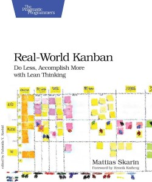
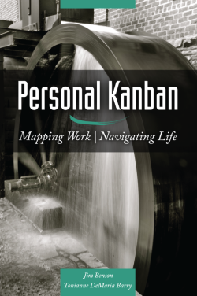

# Lecture 04a: Kanban

In this lecture we will examine Kanban.  Kanban is more than just a board on the wall, although that is a good starting point.  We will examine the origins of Kanban in lean manufacturing, and then move onto how Kanban is used in software development.

## Behavioural Objectives

- [ ] **Describe** the *origins of Kanban in lean manufacturing*.
- [ ] **Define** the *principles of Kanban*.
- [ ] **Describe** *Scrumban*.

## Kanban

Kanban is a Japanese word (看板) meaning signboard or billboard.  This doesn't tell us much on its own.  Boards we will discuss later, but they are only part of the Kanban idea.

Kanban is often referred to as a *supermarket method*.  It works in a similar manner to how a supermarket sells goods to a customer.

- Customer buys goods from a shelf.
- Supermarket notices shelf becoming empty, restocks shelf from local storage.
- Local storage starts to become empty, initiating a delivery from regional storage (or similar).
- Regional storage starts to become empty, initiating a purchase from a supplier.
- Supplier runs low on product, and produces more to meet demand.

At no point is the supermarket purchasing or storing more than necessary to meet customer demand.  The supplier is also not producing more product than demand dictates.  The inventory in the system meets demand.  Goods are pulled through the system based on the purchasing of a customer.

This technique is used in a number of industries around the world, and is often referred to as **Just in Time (JiT) manufacturing**.  There are a number of reasons to work like this, some of the big ones being:

- organisations do not store inventory, which costs money to store.
- organisations do not store levels of inventory which are no longer saleable.
- organisations produce goods quickly to meet demand from customers.

Toyota are seen as the key developers of Kanban-like systems.  You can read Toyota's view [here](https://www.toyota-global.com/company/vision_philosophy/toyota_production_system/just-in-time.html).  These methods revolutionised the manufacturing industry in the 1980s, changing from slow storage-based methods to lean, Just-in-Time manufacturing processes.  The following image (taken from [Wikipedia](https://en.wikipedia.org/wiki/Kanban)) illustrates how Kanban can be viewed from a manufacturing point of view:

 By <a href="//commons.wikimedia.org/wiki/File:Kanban_principles.jpg" title="File:Kanban principles.jpg">Kanban_principles.jpg</a>: Jean-Baptiste Waldner
derivative work: <a href="//commons.wikimedia.org/wiki/User:Jbarta" title="User:Jbarta">Jbarta</a> - This file was derived from:&nbsp;<a href="//commons.wikimedia.org/wiki/File:Kanban_principles.jpg" title="File:Kanban principles.jpg">Kanban principles.jpg</a>:&nbsp;, <a href="https://creativecommons.org/licenses/by-sa/2.5" title="Creative Commons Attribution-Share Alike 2.5">CC BY-SA 2.5</a>, <a href="https://commons.wikimedia.org/w/index.php?curid=24883253">Link</a>

Toyota's Six Rules for Kanban are:

1. Each process issues requests (kanban) to its suppliers as it consumes its supplies.
2. Each process produces according to the quantity and sequence of incoming requests.
3. No items are made or transported without a request.
4. The request associated with an item is always attached to it.
5. Processes must not send out defective items, to ensure that finished products will be defect-free.
6. Limiting the number of pending requests makes the process more sensitive and reveals inefficiencies.

### The Kanban Card

Kanban is well known for using cards.  In a manufacturing environment, a card is a message that informs that a certain material or product needs replaced.  When a material or product is consumed from its location, the card from that location is placed upstream (for example, to a table or board).  At a certain point, when the upstream location is full, new materials or products are sourced and the cards returned downstream.  It seems simple - and it is - but this basic concept revolutionised the manufacturing process to being more on-demand based.

### Pull-based Systems

Kanban is also sometimes called a pull-based system.  The reason is that products are pulled through the system based on demand rather than pushed into the system based on capacity.  In affect, it is like there is a string attached to the end of the value stream.  As a customer buys a product, the string is pulled thus releasing production work on the product.

### Limiting Work-in-Progress (WiP)

Work-in-Progress is a key concept in Kandban.  Let us consider some of the ideas we have covered already:

- *Scrum* requires team members to commit to the project and work.  You cannot commit if you are doing multiple things.
- *Lean Software Development* emphasised reducing waste.  One such area of waste was task switching.
- *DevOps* emphasises the need to reduce work in progress to enable commitment to the task at hand.

Kanban is popular in software development as it allows us to limit WiP.  In manufacturing, we only produce inventory as items are required.  We stop doing work just to do work.

### Just-in-Time (JiT) Manufacturing

Finally, Kanban allows us to be responsive to market/customer demands.  No longer are we building lots of inventory and hoping to sell it.  We produce enough product to meet demand.  This is the essences of JiT.  You will see this term talked about in trade as well, where JiT product delivery of products is seen as providing the most value.

## Kanban in Software Development

The lean movement in software development has taken inspiration from the numerous lean manufacturing principles in general.  Kanban is perhaps the most well known as it provides a visual tool.  This is a key principle of DevOps where we want to **make work visible**.

Kanban in software development appears to have evolved from Microsoft in the 2000s.  There have been several books on Kanban in software development, but the principles have been applied to other sectors such as human resources, marketing, and general service management.  The key concept that always appears is the Kanban board, which has been used in various forms.

### Kanban Board

In simple terms, a Kanban board is a set of columns that have Kanban cards in them.  Below is a simple Kanban board.

 By <a href="//commons.wikimedia.org/w/index.php?title=User:Jeff.lasovski&amp;action=edit&amp;redlink=1" class="new" title="User:Jeff.lasovski (page does not exist)">Jeff.lasovski</a> - Own work, <a href="https://creativecommons.org/licenses/by-sa/3.0" title="Creative Commons Attribution-Share Alike 3.0">CC BY-SA 3.0</a>, <a href="https://commons.wikimedia.org/w/index.php?curid=19121595">Link</a>

This is the simplest form of Kanban board, and is used in many places.  We have three columns:

- a **To Do** column which contains cards that need to be worked on.
- a **Doing** column which contains cards currently being worked on.
- a **Done** column which contains cards where the work is completed.

These three columns are a simple **value stream**.  An example value stream is below:

 By <a href="//commons.wikimedia.org/w/index.php?title=User:DanielPenfield&amp;action=edit&amp;redlink=1" class="new" title="User:DanielPenfield (page does not exist)">DanielPenfield</a> - Own work, <a href="https://creativecommons.org/licenses/by-sa/3.0" title="Creative Commons Attribution-Share Alike 3.0">CC BY-SA 3.0</a>, <a href="https://commons.wikimedia.org/w/index.php?curid=28553995">Link</a>

Here, our columns would be *Process A*, *Process B*, *Process C*, and *Shipping*.  Remember the roots of Kanban from manufacturing.  The cards will be pulled through the system based on capacity and need.  The aim with a Kanban board is to simulate a value stream.  Below is a more detailed Kanban board.

 By <a href="//commons.wikimedia.org/w/index.php?title=User:Dr_ian_mitchell&amp;action=edit&amp;redlink=1" class="new" title="User:Dr ian mitchell (page does not exist)">Dr ian mitchell</a> - Own work, <a href="https://creativecommons.org/licenses/by-sa/2.5" title="Creative Commons Attribution-Share Alike 2.5">CC BY-SA 2.5</a>, <a href="https://commons.wikimedia.org/w/index.php?curid=20245783">Link</a>

This board tries to model a software production value stream:

- **backlog** is our product or Spring backlog.
- **in progress** is the work currently being done.
- **peer review** is tasks requiring a review from another member of the team.
- **in test** is tasks that need tested.
- **done** is the completed tasks.
- **blocked** is tasks that are blocked for some reason.

Also notice the numbers in column titles.  This is our card limit for that column, or the WiP limit.  The column should not have more cards than this number.

Kanban boards can be more detailed still.  Below is a final example:

 By <a href="//commons.wikimedia.org/w/index.php?title=User:Andycarmichaeluk&amp;action=edit&amp;redlink=1" class="new" title="User:Andycarmichaeluk (page does not exist)">Andy Carmichael</a> - Own work, <a href="https://creativecommons.org/licenses/by-sa/4.0" title="Creative Commons Attribution-Share Alike 4.0">CC BY-SA 4.0</a>, <a href="https://commons.wikimedia.org/w/index.php?curid=55448101">Link</a>

We don't cover **epics** in the module, but these are just bigger stories really.  Zube also supports epics, card limits, and point limits in columns.

- [ ] Examine Zube's support for better Kanban practice.  Your team might want to use these features to improve their working practice.

### Scrumban

Scrumban (the conjoining of Scrum and Kanban) was originally used as a method to transition from Scrum to Kanban.  However, it is now used as a method in its own right.

Scrumban differs from Scrum in the principles and practices it emphasises (taken from [Wikipedia](https://en.wikipedia.org/wiki/Scrumban)):

- recognizing the important role of organizational management (self-organization remains an objective but within the context of specific boundaries).
- allowing for specialized teams and functions.
- applying explicit policies around ways of working.
- applying the laws of flow and queuing theory.
- deliberate economic prioritization.

Scrumban also differs from Kanban as it:

- prescribes an underlying software development process framework (Scrum) as its core.
- is organized around teams.
- recognizes the value of time-boxed iterations when appropriate.
- formalizes continuous improvement techniques within specific ceremonies.

Scrumban also allows long-term planning using buckets.  The following image illustrates:

 By <a href="//commons.wikimedia.org/w/index.php?title=User:Garbanea&amp;action=edit&amp;redlink=1" class="new" title="User:Garbanea (page does not exist)">Garbanea</a> - Own work, <a href="https://creativecommons.org/licenses/by-sa/4.0" title="Creative Commons Attribution-Share Alike 4.0">CC BY-SA 4.0</a>, <a href="https://commons.wikimedia.org/w/index.php?curid=37433093">Link</a>

The method is to bring forward ideas into actual work in the Kanban board over time.  This allows the organisation to think about long-term plans over just ideas.

The following video goes into more detail on the Scrumban process:

- [ ] Watch the video on Scrumban and consider some of the ideas in your teams delivery process.

## Personal Kanban

Kanban has become popular enough that a *Personal Kanban* movement has sprung up.  The idea is to use the features of Kanban (task board, limiting WiP, etc.) to manage your personal tasks and life.  Personal Kanban also takes ideas such as priority lists to feed through to doing, and long-term task viewing.

You can find out more about Personal Kanban from:

- The [Personal Kanban wiki](http://personalkanban.com/pk/).
- The [Lifehacker Page on Personal Kanban](https://lifehacker.com/productivity-101-how-to-use-personal-kanban-to-visuali-1687948640).
- The book *Personal Kanban: Mapping Work/Navigating Life* by Jim Benson and Tonianne DeMaria Barry (see recommended reading).

## Tools

Kanban has seen the rise of a number of tools.  Really, most of these tools just provide task boards which are in themselves not enough for Kanban.  Scrum for example defines task boards.  However, we've put these under the Kanban tool banner as this is how people generally view them.

- **GitHub Projects** provides a view of your issues in a task board style.  There is also automation of issue status based on the column a card is placed.
- **Jira** provides a fairly substantial Kanban solution (see [here](https://www.atlassian.com/agile/tutorials/how-to-do-kanban-with-jira-software) for a tutorial).  Jira is a large issue tracking piece of software, so works in a manner similar to GitHub under the hood.
- **Trello** is perhaps the most well known task board solution.  Via extensions it is possible to implement stronger Kanban features, but Trello itself is designed for easy entry for list management.
- **Zube** is what we are using.  Zube also provides mechanisms to limit WiP and automate card status.  It is not as fully featured as Jira, but does well for free software.

## Summary

In this lecture, we have:

- Described the origins of Kanban in lean manufacturing, examining Toyota's Six Rules and Just-in-Time manufacturing.
- Defined the principles of Kanban, namely Kanban boards, pull-based systems, limiting Work-in-Progress, and Just-in-Time working.
- Described Scrumban as the coming together of Scrum and Kanban ideals.

## Recommended Reading

There are many Kanban books available.  The basic premise of Kanban is easy, but making it work takes practice and effort.  These books can help reinforce the ideas.

*Real World Kanban: Do Less, Accomplish More with Lean Thinking* by Mattias Skarin is considered a good text for teams developing Kanban principles.

*Personal Kanban: Mapping Work/Navigating Life* by Jim Benson and Tonianne DeMaria Barry is popular with individuals applying Kanban to their own lives.

