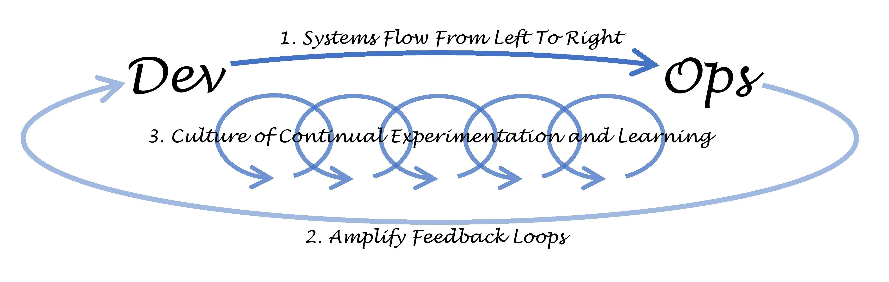

# Lecture 04b: The Three Ways - Underpinning Principles of DevOps

In this lecture we will explore the key principles of DevOps and how these are mapped to the work in the rest of the module.  DevOps, and the culture surrounding it, has become a desirable trend for graduates.  In this module we skate over the principles with a software engineering lens.  The principles you will find are similar to ones already discussed in the module.

## Behavioural Objectives

- [ ] **Define** *DevOps*.
- [ ] **Describe** the *Three Ways of DevOps.*

## Overview of DevOps

DevOps tries to address the boundary between the developers (the creators of software) and operations (the management of software).  DevOps is a set of principles and techniques that enable improved working between these two groups, driven by a number of the ideas we have already presented in this module:

- The Lean Movement
- The Agile Manifesto
- Agile Infrastructure and Velocity Movement
- The Continuous Delivery Movement
- The Toyota Kata - which is about continuous improvement.

The following table summarises how these trends have affected business practices.

|       | **1970s-1980s** | **1990s** | **2000s-Present** |
|-------|-----------------|-----------|-------------------|
| **Era** | Mainframes | Client/server | Cloud |
| **Technology** | COBOL, DB2 | C++, Oracle | Java, MySQL, etc. |
| **Cycle time** | 1-5 years | 3-12 months | 2-12 weeks |
| **Cost** | $1M-$100M | $100k-$10M | $10k-$1M |
| **At risk** | The whole company | Product line or division | Product feature |
| **Cost of failure** | Bankruptcy | Revenue miss | Negligible |

This is taken from Adrian Cockcroft's talk *Velocity and Volume (or Speed Wins)* which you can watch below.  Adrian was Cloud Architect at Netflix at the time, and is now Vice President for Cloud Architecture Strategy at Amazon Web Services.

These forces has led to two conflicting goals in IT organisations:

- Respond to the rapidly changing competitive landscape.
- Provide stable, reliable, and secure service to the customer.

### An Example

Why is this a problem?  Let us consider an abstract scenario in an IT business (adapted from *The DevOps Manual*).

First, our applications and infrastructure can become fragile over time.  This is due to system complexity, poor documentation, and work arounds being used.  **Technical debt** (where quick and easy solutions lead to long-term problems) means that systems get into a mess.  Operations promise to fix the problems, but the costs is prohibitive.  Any change is also considered dangerous as it may break the system.

Then someone tries to compensate for broken promises of delivery times.  This may manifest itself as a bigger promise for a feature or launch that will solve the problems.  This just adds to the work of the development and IT team with new issues to solve and new work arounds needed.  Release dates are missed, revenue and company value reduce, and technical debt increases.

Finally, everything just keeps getting harder and harder.  Every little bit of work takes longer to complete, delivery time increases, and dependencies increase.  The team works slower and slower until failure occurs.

### What is DevOps?

DevOps is not a technology or group of technologies.  It is a methodology.  From [Wikipedia](https://en.wikipedia.org/wiki/DevOps) (emphasis mine):

> DevOps (a clipped compound of "development" and "operations") is a **software development methodology** that combines software development (Dev) with information technology operations (Ops). The **goal of DevOps is to shorten the systems development life cycle** while delivering features, fixes, and updates frequently in close alignment with business objectives.

DevOps is a software development methodology that aims to shorten the systems development life cycle.  DevOps builds on previous software development movements but includes IT operations in the process.

DevOps defines *The Three Ways* - principles and practices that support the DevOps method and culture.  The following image (produced by Gene Kim) illustrates these:

The Three Ways of DevOps are:

1. Flow
2. Feedback
3. Continual Experimentation and Learning

These have direct links to Agile and Lean practices that we previously presented.

## The First Way of DevOps: The Principles of Flow

Flow is about work flowing from left to right: from the Development Team, to the Operations Team, and finally the customer.  The aim is to maximise this flow to provide more value to the customer in a shorter time.

### Make Work Visible

Work in IT is not easily seen.  Consider what is visible when you are working on a new piece of code.  Does anyone actually see what you are working on?  How do they see it?  Compare this to the work undertaken building a car on an assembly line.  It is perfectly visible when work is queuing up at a particular point (say attaching the doors) as the cars are physically there.  We can see where a problem is in the work queue by looking.

To make work visible in a IT organisation we have to use other methods.  Kanban is such a process (see task board below).

 By <a href="//commons.wikimedia.org/w/index.php?title=User:Andycarmichaeluk&amp;action=edit&amp;redlink=1" class="new" title="User:Andycarmichaeluk (page does not exist)">Andy Carmichael</a> - Own work, <a href="https://creativecommons.org/licenses/by-sa/4.0" title="Creative Commons Attribution-Share Alike 4.0">CC BY-SA 4.0</a>, <a href="https://commons.wikimedia.org/w/index.php?curid=55448101">Link</a>

### Limit Work in Progress (WiP)

Another feature of Kanban is the idea of *limiting the work in progress*.  Consider what can happen in IT.  Different faults can come in which require urgent attention.  Developments are also ongoing.  All of these require someone to work on them.

**No one can multitask.** It is not possible.  Whatever you are doing, there is a cost to switch task - a **context switch time.**  You may have a short context switch time, which gives you an illusion of multitasking, but the cost is still there.

As context switch time is a given, any change of task will have a cost.  For example, consider that you have two tasks to complete, each taking 8 hours.  You work 8 hours per day, and need to complete the tasks as soon as possible.  You have a context switch time of 5 minutes, and you decide to switch between tasks every hour - just so you can get them both complete on time.  What happens?

- Work on task 1 (1 hour).
- Switch task (5 minutes).
- Work on task 2 (1 hour).
- Switch task (5 minutes).
- etc.

Instead of taking 16 hours to complete two tasks, you take about 18.5 hours, an increase of approximately 15%.

If everyone works on just one task - if everyone limits their work in progress - tasks will be completed faster.  That adds value to the customer.

### Reduce Batch Sizes

To support limiting WiP we need to reduce the size of our work.  If only one task is to be worked on at once, it will block other work until it is completed.  The image below illustrates this idea:

  Taken from *Single Piece Flow* by Stefan Luyten: https://medium.com/@stefanluyten/single-piece-flow-5d2c2bec845b.

So two practices to manage your work:

- Limit the WiP.
- Reduced the size of the work.

Consider what we are doing with our Git commits.  We are doing small pieces of work, committing them, and moving to the next task.  This allows tasks to be completed quickly, progress to be made, and the product iterated towards completion while testing it works.

### Reduce the Number of Handoffs

When work is handed off from one team or person to another problems can arise.  The receiver of work does not know everything the sender knows.  This introduces two problems:

- the receiver loses sight of the point of the task.
- the communication between sender and receiver introduces a delay as the sender tries to explain the task to the receiver.

Reducing handoffs involves either reorganising teams (integrating Development and Operations for example), or automating the process.  Flow increases through the system as a result.

### Continually Identify and Elevate Our Constraints

The [Theory of Constraints](https://en.wikipedia.org/wiki/Theory_of_constraints) comes from the work of *Eliyahu Goldratt* and was fundamental in transforming manufacturing to lean practices.  In summary, the Theory of Constraints has five focusing steps:

1. Identify the system's constraint.
2. Decide how to exploit the system's constraint.
3. Subordinate everything else to the above decision.
4. Elevate the system's constraints.
5. If the previous steps brake the constraint (i.e., it is no longer a problem), return to step 1.  Do not allow inertia to cause system constraints.

To summarise, find out what is slowing down the work.  Once found, fix it until it is not a problem.  Then find the new problem slowing down the work.

### Eliminate Waste and Hardship in the Value Stream

*The DevOps Manual* cites *Implementing Lean Software Development* (also by Poppendieck and Poppendieck) for the following categories:

- **Partially done work** - can become obsolete or lose value over time.
- **Extra processes** - anything that does not add value to the customer.
- **Extra features** - add complexity and effort for no reason.
- **Task switching** - context switch time affects everyone.
- **Waiting** - increase time for delivery and prevent people from doing work.
- **Motion** - moving people or work takes time.
- **Defects** - takes effort to fix.
- **Nonstandard or manual work** - automate as much as possible.
- **Heroics** - if people have to perform unreasonable tasks (e.g., working late every night, one person fixing everything) then they become less productive over time.

## The Second Way of DevOps: The Principles of Feedback

Receiving fast and constant feedback from customer to Operations and Development (right to left) improves the service to the customer.  Either we stop problems recurring, or we detect problems faster.  This improves system safety - the system is less likely to fail.

### Working Safely with Complex Systems

If a system is complex, it means it is too big for any one person to see the whole and understand how the parts work together.  Components are strongly coupled leading to system behaviour not easily explained via component behaviour.

A complex system will not always behave the same way under the same conditions.  Therefore, using static means of monitoring a system is not sufficient.  As failure will occur, we need conditions to work safer with complex systems.  These are:

- Manage complex work so that problems are revealed.
- When a problem arises they are *swarmed and solved*, leading to new learning.
- New knowledge is exploited throughout the organisation.
- Leaders create other leaders who grow these capabilities.

### See Problems as They Occur

It is one thing to test your software.  It is another to ensure the results of those tests are visible to the team.  The more automated our processes become, the more information we can gather and present to the team to visualise the problem.  This is a feedback loop.  Quick and informative feedback will allow the team to solve problems quickly before they become a bigger issue.

### Swarm and Solve Problems to Build New Knowledge

Essentially, stop waiting to fix a problem: **fix the problem now.**  Waiting to schedule a fix is not beneficial, as the context of the problem degrades over time.  Fix the problem now, and gain the new knowledge from performing that fix.

Swarming is when everyone on the team gets behind fixing the problem.  It is necessary as:

- It prevents a problem progressing downstream where it becomes more expensive to fix.
- It prevents the team starting new work which may introduce further errors.
- If the problem is not fixed, it could become recurrent at the next operation, leading to further errors to fix.

### Keep Pushing Quality Closer to the Source

Surprisingly, in complex systems, more checks and approvals increases the chance of future failure.  This is because these checks and approvals happen further away from the team who undertook the work.  This means the checkers and approvers have less knowledge about what they are looking at.

By the production team being responsible for testing and quality (via automation), everyone sees quality as their responsibility.  This will improve overall quality as a team will ensure quality is baked in.  They will not expect someone else to do the checking for them.

### Enable Optimising for Downstream Work Centres

This is really about seeing where your work goes next.  Working with customers is very important, but if you forget the next step after development (e.g., operation or QA), then you make work harder for them.  Focus on where the work goes next to optimise for this area.

## The Third Way of DevOps: The Principles of Continual Learning and Experimentation

The Third Way is about building a high-trust culture that supports a scientific approach to experimentation and learning from those experiments.  People test ideas to see what can improve the delivery of value, and this new knowledge is shared across the organisation.

A culture of fear and low trust emerges where mistakes are punished.  If people who make suggestions or point out problems are seen as troublemakers then improvements will not occur.  How we deal with these issues is important in any cultural environment.

### Enabling Organisational Learning and a Safety Culture

We want to create an organisation that learns and trusts the people within it.  

| Pathological | Bureaucratic | Generative |
|--------------|--------------|------------|
| Information is hidden | Information may be ignored | Information is actively sought |
| Messengers are "shot" | Messengers are tolerated | Messengers are trained |
| Responsibilities are shirked | Responsibilities are compartmented | Responsibilities are shared |
| Bridging between teams is discouraged | Bridging between teams is allowed but discouraged | Bridging between teams is rewarded |
| Failure is covered up | Organisation is just and merciful | Failure causes inquiry |
| New ideas are crushed | New ideas create problems | New ideas are welcomed |
Taken from *A Typology of Organisation Cultures* by *R. Westrum*.  http://dx.doi.org/10.1136/qshc.2003.009522

We want to be a *generative organisation*.  This allows information and learning to be shared in a culture of support and safety.

- [ ] Reflect on your own experiences working in an organisation.  Can you relate to the different aspects from your previous experience?  What about your experience of the University?

### Institutionalise the Improvement of Daily Work

Basically, schedule time to fix defects and improve the code base.  Do not leave this as a task to do later.  Explicitly schedule - routinely - the time to pay off technical debt.  This will make the system safer.

### Transform Local Discoveries into Global Improvements

The simple answer is to create mechanisms to share knowledge within the organisation.  This can be done through documenting processes and automating work.  Shared code and repositories really helps here.

### Inject Resilience Patterns into Our Daily Work

Experiment with how work is conducted.  This can be done in several ways, including:

- running scripts that randomly fail some servers to see how the system responds.
- adding faults into code intentionally to check the response.
- challenging the team to increase the number of deploys per day to see what happens.

### Leaders Reinforce a Learning Culture

A leader's role should be to create a great team environment to allow the team to do their best work.  This means the leader and team are dependent on each other.  A leader should reinforce the learning and encourage the experimentation that leads to a more successful team overall.

## Summary

To summarise, we have covered the following:

- Defined what we mean by DevOps - a software development methodology built on agile and lean, integrating bot development and operation of software.
- Described the Three Ways of DevOps: flow, feedback, and continual experimentation and learning.

## Further Reading

The goto book on DevOps if *The DevOps Handbook: How to Create World-class Agility, Reliability & Security in Technology Organisations* by Gene Kim, Jez Humble, Patrick Debois, and John Willis.

If you like reading novels and would like a story introduction to DevOps and the culture, then *The Pheonix Project* by Gene Kim, Kevin Bahr, and George Spafford might be a good starting place.

