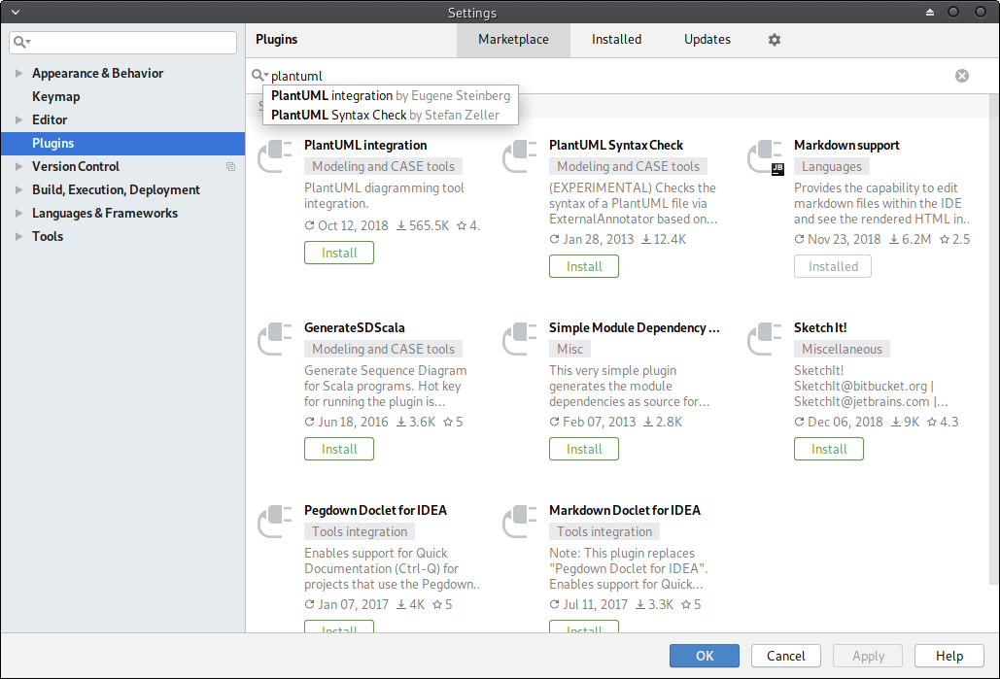
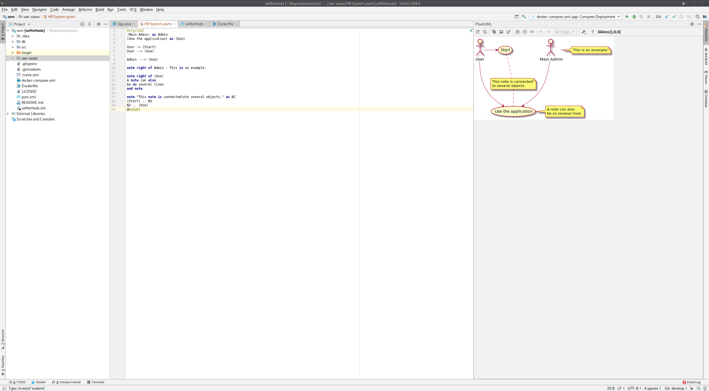

## Using PlantUML in IntelliJ

There are quite a few UML diagramming tools out there.  However, we want to store our diagrams in our GitHub repository.  As Git repositories don't like binary files, we will use a textual representation via [PlantUML](http://plantuml.com/).  This is a common textual standard to describe UML diagrams and can be used to generate images.  We will do this via an IntelliJ plugin.

### Install GraphViz

To use the PlantUML plugin in IntelliJ you will first need to install GraphViz on your machine.  GraphViz is a [graph drawing tool](https://en.wikipedia.org/wiki/Graph_drawing) that several tools use to layout diagrams.  Download instructions for GraphViz are available from [here](https://www.graphviz.org/download/).  For Windows users, install the **stable release**.

### Install PlantUML Plugin

Next we need to install the PlantUML plugin for IntelliJ.  Go to **File**, **Settings** then **Plugins** to open the **Plugins Window**.  Search for **PlantUML**.  The plugin you want is **PlantUML integration** as shown below:



Click **Install**, then **Accept** and finally **Restart IDE**.  Once IntelliJ has restarted, PlantUML should be available.

### Creating a Use Case Diagram

To see the PlantUML is set up correctly we need to create a diagram.  **Right click** on the **use-cases folder**, select **New**, and the **UML Use Case**.  Give it the name **HR System** and click **OK**.  This should provide you with the following window:



**If you don't see screen as above a couple of things to check**:

- did you install GraphViz?
- if so, open the settings for PlantUML (click the small spanner above where the diagram should be), and browse for the **dot** executable which will be where you installed GraphViz.

### PlantUML Syntax

A more comprehensive guide is available [here](http://plantuml.com/PlantUML_Language_Reference_Guide.pdf).  We will examine the basics.

A PlantUML file starts and ends with the following:

```
@startuml

@enduml
```

We define a use case as follows:

```
usecase "Use Case"
```

We can also provide a name for the use case.  This makes it easier to connect them later:

```
usecase UC1 as "Use Case 1"
usecase UC2 as "Use Case 2"
```

Actors are defined as follows:

```
actor "Actor"
```

And they can likewise be named:

```
actor A1 as "Actor 1"
actor A2 as "Actor 2"
```

There are numerous methods to lay out arrows - [see the tutorial](http://plantuml.com/PlantUML_Language_Reference_Guide.pdf).  For example:

```
actor A1 as "Actor 1"
usecase UC1 as "Use Case 1"

A1 --> UC1
```

Systems can be defined using rectangles:

```
rectangle Database

rectangle System {
    usecase UC1 as "Use Case 1"
    UC1 --> Database
}
```

Anything defined within the rectangle curly braces are part of the `System`.

