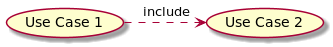
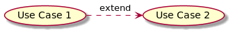
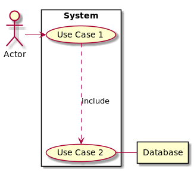

# Lab 05B: Use Cases and Use Case Diagrams

In this lab We will look at **Use Case Diagrams** to visually define our use cases and their relationship.

## Behavioural Objectives

- [ ] **Define use cases** using *Cockburn's Use Case Template*.
- [ ] **Define use case diagrams** using *PlantUML*.

## What is a Use Case?

From [Wikipedia](https://en.wikipedia.org/wiki/Use_case):

> In software and systems engineering, a use case is a **list of actions or event steps** typically **defining the interactions between a role (known in the Unified Modeling Language (UML) as an actor) and a system to achieve a goal**. 

To simplify, a use case is:

1. a list of actions/events;
2. by an actor;
3. interacting with a system;
4. to achieve a goal.

Our user stories are a form of use case, sometimes referred to as a *casual* use case.  The user stories we have defined two elements directly and one indirectly of a use case.  

A fuller use case will allow us to address these two issues.  The list of actions we are normally defining as we build a feature.  Let us put some thought into the actions beforehand, but remember that **details can change!**  We are planning but not putting our plan in stone until we have finished a feature.

## Defining Use Cases for Our System

Here, we are going to cover the application of these ideas.  We are going to use a version of [Cockburn's Use Case Template](https://cis.bentley.edu/lwaguespack/CS360_Site/Downloads_files/Use%20Case%20Template%20%28Cockburn%29.pdf).
Cockburn's template contains the following sections of note:

- **Goal in Context** - we will use our user story.
- **Scope** - is discussed more in the lecture.  Scoping is an important consideration in any work you do.
- **Level** - what level is the use case targeted at.  This is discussed further in the lecture.
- **Preconditions** - what do we **expect** is true before the use case is executed.
- **Success Condition** - what will happen on completion of the goal.
- **Failed Condition** - what will happen on failure of the goal.
- **Primary Actor** - the main actor of the use case.
- **Trigger** - how is the use case started.
- **Main Success Scenario** - what are the steps leading to success.
- **Extensions** - what might happen at a given step to stop the use case.
- **Sub-variations** - any other branches that a step can take?
- **Schedule** - when does the use case need to be delivered.

## What is a Use Case Diagram?

Use cases can also be visually represented using a **Use Case Diagram**.  Typically seen as part of the **Unified Modelling Language** (UML), use case diagrams allow us to see how use cases interact simply.  However, they do lack the detail required to fully implement and understand features, and therefore should be seen as a support tool for software development.  In particular, they can communicate with stakeholders quickly about how the engineers see the system working.

### Use Case Diagram Symbols

Use case diagrams are quite simple, requiring only stick men, arrows, and ellipsoids at the most basic level.  We will cover the common use case symbols from UML below.

#### Use Case

To illustrate a use case we use an ellipsoid with text as below:

#### Actor

Actors are represented by stick figures:

#### Use Case Relationships

Use cases can also relate to each other, typically in **include** and **extend** cases.  Below is the diagram:

An *include* relationship is one where a use case includes (i.e. *uses*) another use case to perform its functionality. An *extend* relationship is one where a use case extends (e.g. supports an edge-case) from another use case.  It provides a special version.  These should have been identified in the **Extensions** section of the use case.

#### System

A use case typically exists within a system, or communicates with another system.  For example, see below:

*Use Case 1* and *Use Case 2* both exist within the *System*.  *Use Case 2* also communicates with an external system - *Database*.

