# Lab 08b: Deployment

This lab is very involved and will take time, patience, and practice to complete and understand.  We are going to deploy our built software.  We will look at two methods:

- via GitHub releases.
- via Google Cloud Engine.

GitHub releases is the simplest method but only adds our built JAR to our GitHub release.  Google Cloud Engine will involve a few different delivery stages leading to our HR system being presented as a web application.

## Deploying to GitHub Releases

A GitHub release is a form of deployment where we provide files to a user.  We will automate our releases (as [Continuous Delivery](../../lectures/lecture16) describes) and produce a JAR file as part of the process.

### Creating a Personal Access Token

Travis can push releases to GitHub, but it needs access to your GitHub account.  We do this by producing a **Personal Access Token** and storing it on Travis.

To produce a personal access token, login to GitHub and open the **user** drop down menu:

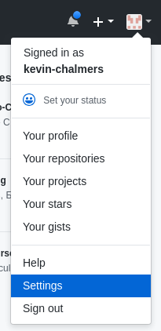

Select **Settings** as shown to open the **GitHub Settings Menu**:

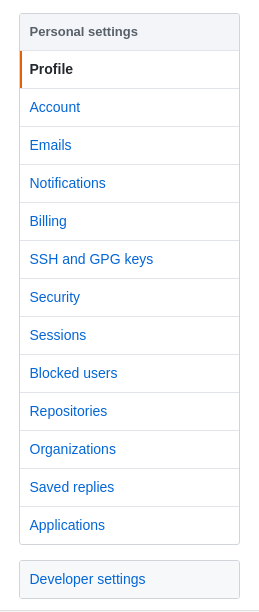

Select **Developer Settings** at the bottom to open the **Developer Settings Menu**:

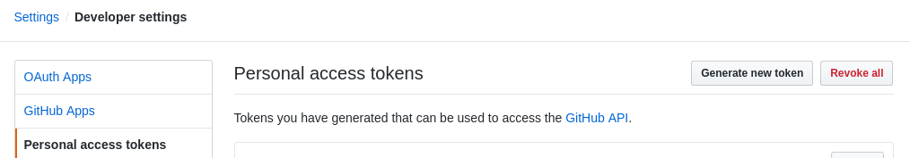

Select **Personal access tokens** and then select **Generate new token.**  This will open the **New Access Token** window:

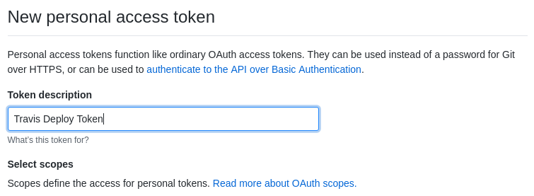

Give the token a name (this is only used on GitHub) - I've used *Travis Deploy Token* as a name.  Below this you will see a number of tick boxes to select the scope (access level) of the token.  **Make sure you tick the repo scope.**  Then select **Generate token** at the bottom of the page to produce the token:

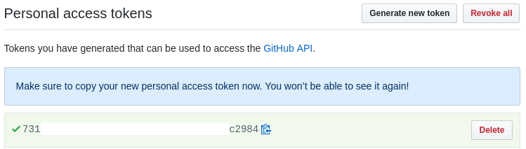

**Pay attention to the message**.  This is the only time you will have access to the token.  **Copy it so we can use it in Travis.**

### Adding the Personal Access Token to Travis

Now we need to add this token to Travis.  In Travis, go to the project you are using for the module (e.g., mine is kevin-chalmers/sem) on the right select **More options** then **Settings**:

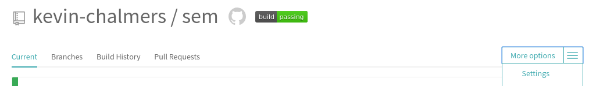

Scroll down to **Environment Variables** and add **GITHUB_OAUTH_TOKEN** with the GitHub token as the value.  **Make sure the value is not displayed during building** (this is the default), and select **Add**:

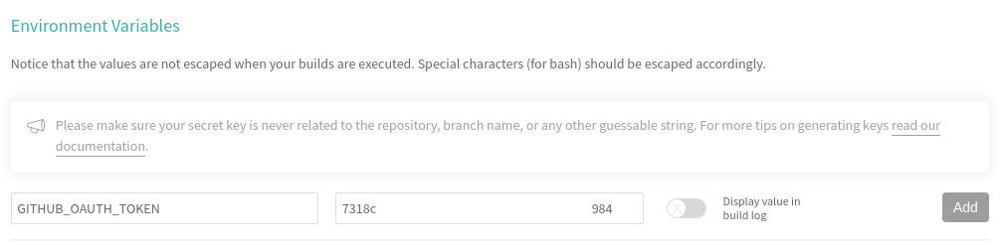

We can now use the GitHub token (via the name GITHUB_OAUTH_TOKEN) in our Travis scripts.

### Updating the Deploy Script

We are going to modify our existing *Deploy* stage in our Travis script so it pushes the built JAR file to GitHub.  The new stage is:

```yml
    - stage: GitHub Release
      # We don't want to install
      install: skip
      # We will build the JAR
      jdk: oraclejdk11
      script:
      - echo "Deploying to GitHub Releases"
      # Package (build) the JAR
      - mvn package -DskipTests=true -Dmaven.javadoc.skip=true
      before_deploy:
        # Set up git user name and tag this commit
        - git config --local user.name "Kevin Chalmers"
        - git config --local user.email "k.chalmers@napier.ac.uk"
        # Create temporary tag from date and Git log.
        - export TRAVIS_TAG=${TRAVIS_TAG:-$(date +'%Y-%m-%d')-$(git log --format=%h -1)}
        # Set tag
        - git tag $TRAVIS_TAG
      deploy:
        provider: releases
        # This is the token we set before
        api_key: $GITHUB_OAUTH_TOKEN
        # Copy built JAR file to release.  JAR built in $TRAVIS_BUILD_DIR/target
        file: $TRAVIS_BUILD_DIR/target/seMethods.jar
        skip_cleanup: true
```

Let us consider the steps Travis will go through:

1. It will pull the repo as normal.
2. It will run the `script` section, which will package the JAR file.  Remember that this is called `seMethods`.
3. The `before_deploy` section is run.  This will perform the following tasks:
    1. Set the username and email for committing the GitHub release.
    2. Tag the GitHub commit.  Remember, a release must be tagged.  We create a tag from the date (Year-month-day) and the current hashcode from the commit.  This code is reusable so don't worry too much about it.
4. The `deploy` stage is then executed.  We tell Travis the `provider` (releases means GitHub releases), provide the `api_key` (our access token from before), and the file(s) to add.  `seMethods.jar` has been created in the `$TRAVIS_BUILD_DIR/target/` folder.

For reference, the complete `.travis.yml` file is below:

```yml
language: java

sudo: false

addons:
  hosts:
    - db

services:
  - docker

install:
  - docker build -t database db/.
  - docker run --rm -d -e MYSQL_ROOT_PASSWORD=example -p 33060:3306 database
  - mvn install -DskipTests=true -Dmaven.javadoc.skip=true -B -V

before_script:
  - mvn clean

jobs:
  include:
    - stage: unit tests
      install: skip
      jdk: oraclejdk11
      script: mvn test -Dtest=com.napier.sem.AppTest
    - stage: integration tests
      jdk: oraclejdk11
      script: mvn test -Dtest=com.napier.sem.AppIntegrationTest
    - stage: GitHub Release
      install: skip
      jdk: oraclejdk11
      script:
      - echo "Deploying to GitHub Releases"
      - mvn package -DskipTests=true -Dmaven.javadoc.skip=true
      before_deploy:
        # Set up git user name and tag this commit
        - git config --local user.name "Kevin Chalmers"
        - git config --local user.email "k.chalmers@napier.ac.uk"
        # Create temporary tag from date and Git log.
        - export TRAVIS_TAG=${TRAVIS_TAG:-$(date +'%Y-%m-%d')-$(git log --format=%h -1)}
        # Set tag
        - git tag $TRAVIS_TAG
      deploy:
        provider: releases
        api_key: $GITHUB_OAUTH_TOKEN
        # Copy built JAR file.  JAR built in $TRAVIS_BUILD_DIR/
        file: $TRAVIS_BUILD_DIR/target/seMethods.jar
        skip_cleanup: true

stages:
  - unit tests
  - integration tests
  - name: GitHub Release
    if: branch = master

after_success:
  - bash <(curl -s https://codecov.io/bash)
```

If you go back to GitHub and look up your Releases you will see the new release there.  Note that `seMethods.jar` has been added.

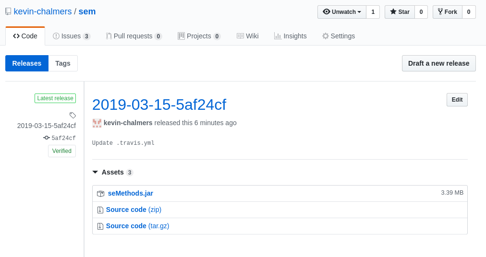

## Deploying to Google Cloud Engine

This tutorial is adapted from [Google's documentation](https://cloud.google.com/solutions/continuous-delivery-with-travis-ci).  **First, you will need to create Google Cloud Account.  You should have received an email telling you how to sign-up for a free Google Cloud Account associated with your University email.**  Once you have registered continue on.

**Warning** - there is a lot of set-up for our Google Cloud Application.  **Take your time and make sure you do everything correctly.**  Do not rush through these stages and understand what we are doing.

### Creating a Project on Google Cloud Engine

First we need to create a project with Google Cloud Engine.  We do this via the [Google Cloud Resource Manager](https://console.cloud.google.com/cloud-resource-manager).

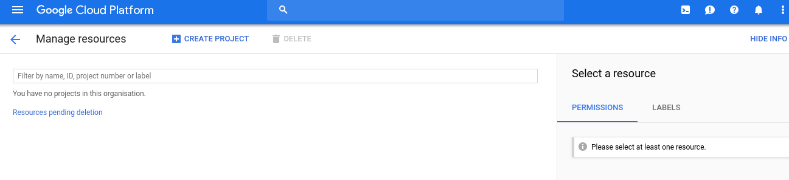

**Select Create Project** at the top of the page to open the **New Project Dialogue**:

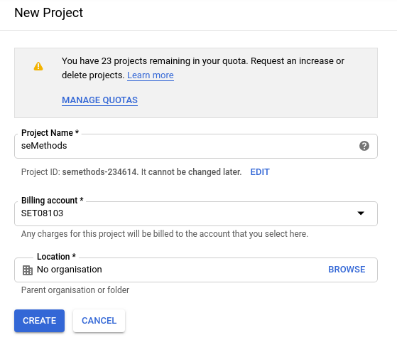

Call the project a sensible name (e.g., seMethods).  **Ensure billing is set up.**  You should have created an account as part of your Google Cloud Account set-up.

**Make sure you note the Project ID.  We will use this later.**

**Click on Create.**  It takes a minute-or-two for a project to be created.  You might have to refresh the page to see the project.

We also need to enable some APIs and Services for our Google Cloud Project.  [Click this link](https://console.cloud.google.com/flows/enableapi?apiid=compute,appengine,container) to do so (normally you would have to do so via a menu).

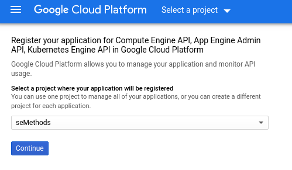

**Select your project in the drop down menu and click Continue.**  Your project is now ready for deployment.

### Setting Up for Cloud Deployment

Our next step is to setup our GitHub repository so we can deploy to Google Cloud via Travis.  First, go to [Google Cloud Shell](https://console.cloud.google.com/cloudshell).  This is a command prompt for working with our Google Cloud Project:

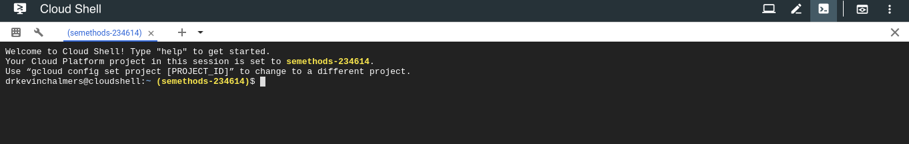

It may take a minute or two for this to start.  When it does, you may need to select the Google Cloud Project to work on.  To do so, enter the following into Google Cloud Shell:

```shell
gcloud config set project <project_id>
```

Where `<project_id>` is replaced by the Project ID you noted earlier.  If you didn't write it down, go back to the [Google Cloud Resource Manager](https://console.cloud.google.com/cloud-resource-manager).

We will also select where our application will run.  **Enter the following into Google Cloud Shell**:

```shell
gcloud app create --region=europe-west2
```

This is London.  See https://cloud.google.com/compute/docs/regions-zones/ for other zones.

```shell
You are creating an app for project [semethods-234614].
WARNING: Creating an App Engine application for a project is irreversible and the region
cannot be changed. More information about regions is at
<https://cloud.google.com/appengine/docs/locations>.
Creating App Engine application in project [semethods-234614] and region [europe-west2]....done.
Success! The app is now created. Please use `gcloud app deploy` to deploy your first app.
```

Next, we need to set ourselves up for working with our GitHub repository.  **Enter the following into the Google Cloud Shell (replacing the email and name accordingly)**:

```shell
git config --global user.email "you@example.com"
git config --global user.name "Your Name"
```

And then clone your repository into Google:

```shell
git clone <your repo>.git
```

Replacing `<your_repo>` with your repository address.  If you want to work on a particular branch, remember to `checkout` the branch accordingly.

#### Credential Creation

Now we need to create some credentials that will allow Travis to deploy to our Google Cloud Application.  Go to the [IAM Service Accounts Page](https://console.cloud.google.com/iam-admin/serviceaccounts).  You should see the following window:

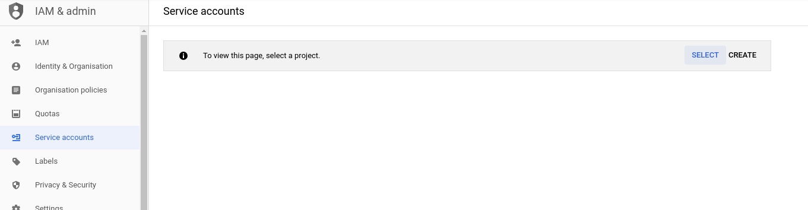

**Click Select and select your project**.  This will open the **Service Accounts Window**:

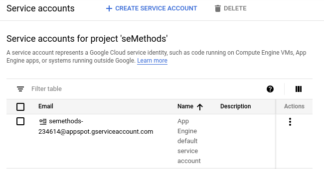

**Click Create Service Account** at the top of the page to create an account that will be able to control our Google Cloud Project.  This will open the following window:

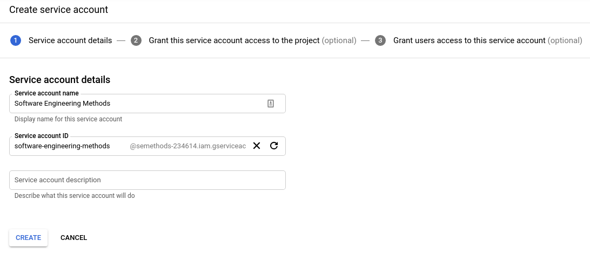

**Give the service account an appropriate name and click Create**.  You will now be in the roles view:

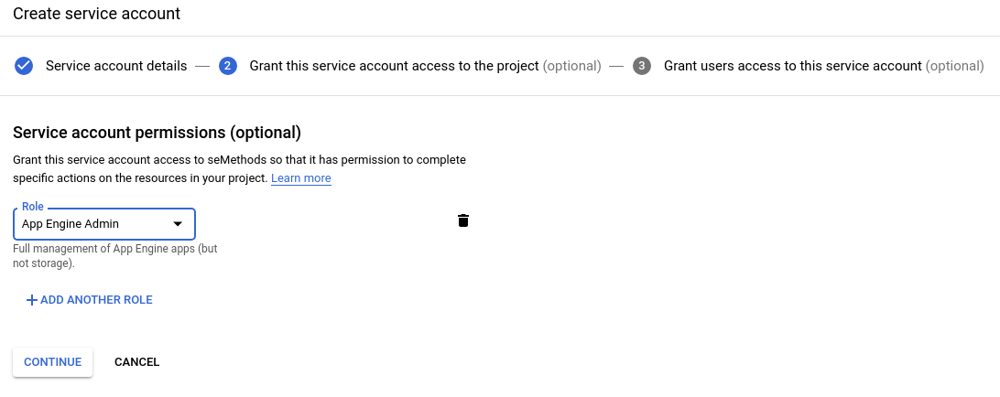

Roles are the permissions that we are giving to control our project.  First, from the drop down select **Project -> Owner**.  Then **click Add Another Role** and continue until you have the following permissions added:

- App Engine -> App Engine Admin.
- Storage -> Storage Admin.
- Kubernetes Engine -> Kubernetes Engine Admin.
- Storage -> Storage Admin.

**Click Continue.** Then, on the next page (below) **click Create Key.**:

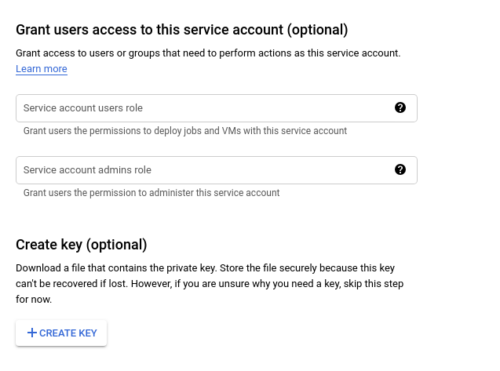

In the new side-window, **ensure JSON is selected** and **click Create**:

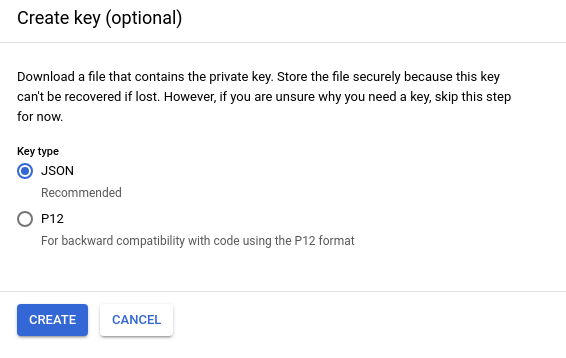

A file (ending `.json`) will be downloaded.  This is the credentials for allowing us to talk to our Google Cloud project with the given role permissions we defined.  **Warning** - this key is important, but also a vulnerability.  If someone else has your key they can control certain aspects of your account.  The key is also only usable for the project you created.  For each project, you will need a different key.

We need to add this key to our GitHub repository.  We will do this via Google Cloud Shell so we can encrypt it before committing.  Go back to [Cloud Shell](https://console.cloud.google.com/cloudshell).  Then, in the menu on the right, **select Upload File** and choose the JSON file you just downloaded.

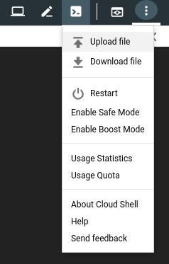

Now move the file into your repository folder.  In Google Cloud Shell enter:

```shell
mv ~/<your_credentials_filename>.json ~/<your repo>/client-secret.json
```

Where <your_repo> is the directory your repo was cloned to (e.g., `sem`, `semethods`).  Entering the name of the credentials file and your repository as needed.

#### Encrypting Credentials

**Do not commit the JSON file as is.** This is a security risk.  We are going to encrypt the file via Travis.  

First, change directory on Google Cloud Shell:

```shell
cd ~/<your_repo>
```

Now we need to install the **Travis Command Line tool**.  We do this by entering the following into Google Cloud Shell:

```shell
sudo gem install travis
```

Then we need to login to Travis:

```shell
travis login
```

The username and password are the ones you use for GitHub.

We are now ready to encrypt the file.  Some things to note:

- The encryption is linked to your repository on Travis.  **You cannot reuse the encrypted credentials in another repository.**
- You won't be able to decrypt the key again - although you can re-download from your Google Cloud Account.

To encrypt the file, enter the following into your Google Cloud Shell:

```shell
travis encrypt-file client-secret.json --add
```

This will automatically also add a new line to your `.travis.yml` file to decrypt the key.  You can view it on GitHub after you push.

First, let us pay attention to the first warning we were given - delete the credentials file that wasn't encrypted:

```shell
rm client-secret.json
```

And now we can commit the updates to our GitHub repository:

```shell
git add .travis.yml
git add client-secret.json.enc
git commit -m "Added Google Cloud credentials"
git push
```

You will have to enter your GitHub username and password again.  But now we are ready to deploy some applications to Google Cloud.

## Database Deployment

Our first deployment step will be deploying our database.  This is the easiest step as we can just point our HR application at the new database location.

### Updating Travis Build File

All the work we have to do is in our `.travis.yml` file for our project.  The changes we have to make are to allow us to deploy to Google Cloud.  First, we have to ask Travis to install the Google Cloud SDK.  Add the following near the top of the `.travis.yml` file:

```yml
env:
  global:
  - CLOUDSDK_CORE_DISABLE_PROMPTS=1
```

Installation of the SDK requires user prompts, but we need to turn these off.  The above lines do so.

We will define a new stage (Google Cloud Deploy), and tell Travis how to install and set-up the SDK.  The following stage should be added to the `jobs` section of your `.travis.yml` file.

```yml
  - stage: Google Cloud Deploy
    install: skip
    jdk: oraclejdk11
    before_script:
      # Check if Google Cloud SDK is installed.
      - if [ ! -d ${HOME}/google-cloud-sdk ]; then curl https://sdk.cloud.google.com | bash
        > /dev/null; fi
      - source $HOME/google-cloud-sdk/path.bash.inc
      # Install Kubernetes control to manage containers
      - gcloud components install kubectl
      - gcloud version
      # Login to our Google Cloud Account using credentials file
      - gcloud auth activate-service-account --key-file client-secret.json
```

The `script` section of the stage performs the deployment of the database.  **Replace `<project_id>` with the ID for your Google Cloud Project.  The steps are:

1. Select the project on Google Cloud Platform.
2. Select the zone to work in.
3. Authenticate against Google's Docker repository.
4. Build Docker image(s).
5. Push Docker image(s) to Google's Docker repository.
6. Create a container cluster on Google Cloud Platform to run our image(s).
7. Run image(s).
8. Expose service(s).

```yml
    script:
    # Set the project we will work in.
    - gcloud config set project <project_id>
    # Set the zone to work in.
    - gcloud config set compute/zone europe-west2-b
    # Assign project ID to a variable to make life easier
    - export PROJECT_ID="$(gcloud config get-value project -q)"
    # Authenticate against Google's Docker image manager.
    - gcloud auth configure-docker
    # Build the database image.
    - docker build -t gcr.io/${PROJECT_ID}/db db/.
    # Push the database image.
    - docker push gcr.io/${PROJECT_ID}/db
    # Create a container cluster.  We only need one node.
    - gcloud container clusters create hr-cluster --num-nodes=1
    # Tell kubernetes to run the built database image, opening port 3306
    - kubectl run hr --image=gcr.io/${PROJECT_ID}/db --port 3306
    # Expose the cluster to the Internet, mapping external port 3306 to internal port 3306.
    - kubectl expose deployment hr --port=3306 --target-port=3306 --type=LoadBalancer
```

Then we need to update the stages.  These are below:

```yml
stages:
- unit tests
- integration tests
- name: GitHub Release
  if: branch = master
- name: Google Cloud Deploy
  if: branch = master
```

For reference, your complete `.travis.yml` file should look something like this:

```yml
language: java

sudo: false

addons:
  hosts:
  - db

env:
  global:
    # Ensure Google Cloud SDK doesn't prompt for installing.
    - CLOUDSDK_CORE_DISABLE_PROMPTS=1

services:
- docker

install:
# Build database image.
- docker build -t database db/.
# Run the database image.
- docker run --rm -d -e MYSQL_ROOT_PASSWORD=example -p 33060:3306 database
# Build and install the application.
- mvn install -DskipTests=true -Dmaven.javadoc.skip=true -B -V

before_script:
# Clean any files.
- mvn clean

# Job stages
jobs:
  include:
  # Unit test stage.
  - stage: unit tests
    install: skip
    jdk: oraclejdk11
    # Tell Maven to run the unit tests.
    script: mvn test -Dtest=com.napier.sem.AppTest
  # Integration test stage.
  - stage: integration tests
    jdk: oraclejdk11
    # Tell Maven to run the integration tests.
    script: mvn test -Dtest=com.napier.sem.AppIntegrationTest
  # GitHub release stage.
  - stage: GitHub Release
    install: skip
    jdk: oraclejdk11
    script:
    - echo "Deploying to GitHub Releases"
    # Package the Application.
    - mvn package -DskipTests=true -Dmaven.javadoc.skip=true
    before_deploy:
    # Set our Git user name and email.
    - git config --local user.name "Kevin Chalmers"
    - git config --local user.email "k.chalmers@napier.ac.uk"
    # Create unique tag for the commit.
    - export TRAVIS_TAG=${TRAVIS_TAG:-$(date +'%Y-%m-%d')-$(git log --format=%h -1)}
    # Tag the commit.
    - git tag $TRAVIS_TAG
    deploy:
      provider: releases
      # Token saved on Travis.
      api_key: "$GITHUB_OAUTH_TOKEN"
      # File to add to the release.
      file: "$TRAVIS_BUILD_DIR/target/seMethods.jar"
      skip_cleanup: true
  - stage: Google Cloud Deploy
    install: skip
    jdk: oraclejdk11
    before_script:
      # Check if Google Cloud SDK is installed.
      - if [ ! -d ${HOME}/google-cloud-sdk ]; then curl https://sdk.cloud.google.com | bash
        > /dev/null; fi
      - source $HOME/google-cloud-sdk/path.bash.inc
      # Install Kubernetes control to manage containers
      - gcloud components install kubectl
      - gcloud version
      # Login to our Google Cloud Account using credentials file
      - gcloud auth activate-service-account --key-file client-secret.json
    script:
      # Set the project we will work in.
      - gcloud config set project semethods-234809
      # Set the zone to work in.
      - gcloud config set compute/zone europe-west2-b
      # Assign project ID to a variable to make life easier
      - export PROJECT_ID="$(gcloud config get-value project -q)"
      # Authenticate against Google's Docker image manager.
      - gcloud auth configure-docker
      # Build the database image.
      - docker build -t gcr.io/${PROJECT_ID}/db db/.
      # Push the database image.
      - docker push gcr.io/${PROJECT_ID}/db
      # Create a container cluster.  We only need one node.
      - gcloud container clusters create hr-cluster --num-nodes=1
      # Tell kubernetes to run the built database image, opening port 3306
      - kubectl run hr --image=gcr.io/${PROJECT_ID}/db --port 3306
      # Expose the cluster to the Internet, mapping external port 3306 to internal port 3306.
      - kubectl expose deployment hr --port=3306 --target-port=3306 --type=LoadBalancer

stages:
- unit tests
- integration tests
- name: GitHub Release
  if: branch = master
- name: Google Cloud Deploy
  if: branch = master

after_success:
# Push code coverage data to codecov.
- bash <(curl -s https://codecov.io/bash)

before_install:
# Decrypts the credentials file.
# The keyname will be different for your project.
- openssl aes-256-cbc -K $encrypted_b295e594d102_key -iv $encrypted_b295e594d102_iv
  -in client-secret.json.enc -out client-secret.json -d
```

**Commit and push your changes to GitHub.**  Go to Travis, and make sure each stages works correctly.  This will take some time as cluster set-up takes time.  Once completed, go to [Google Cloud Cluster Information](https://console.cloud.google.com/kubernetes/list) and you should be able to see your cluster:

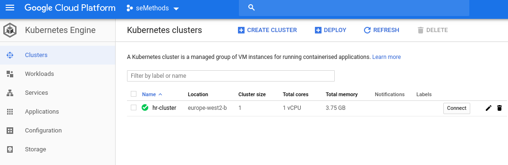

The area we are actually interested in is the [Google Cloud Kubernetes Services View](https://console.cloud.google.com/kubernetes/discovery).  Go there, and note the **Endpoint** information.  This is the location where you can access the database:

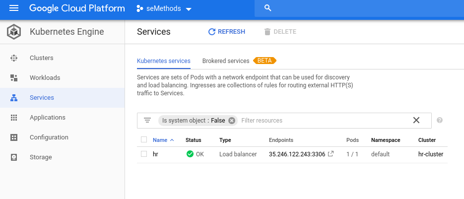

Now, **run your HR application using the endpoint location as your database location**.  You should be able to access the database as before.

Now go back to the [Google Cloud Cluster Information](https://console.cloud.google.com/kubernetes/list) and **delete the cluster** by **clicking the bin icon.**  This will destroy the cluster and allow us to recreate it when we rebuild later.  **You should always destroy your cluster after use otherwise you will run out of the free credit you have been given on Google Cloud.**

## Converting to a Web App

Having our database deployed is one form of deployment, but let us go further by having our application deployed.  To do this we will create a REST service.  REST is just a form of application where we access resources via a URL.  For example, to get my information on GitHub we use the GitHub URL plus my username: https://github.com/kevin-chalmers/.

REST behaviour can be added to our Java application via Spring.  This just requires a few modifications to our Maven `pom.xml` file.

### Adding Spring

First, we need Maven to treat our project as a child of a standard Spring project.  **Add the following** after the existing `<groupID>` section:

```xml
# Existing code
<groupId>com.napier.sem</groupId>
<artifactId>seMethods</artifactId>
<version>0.1.0.8</version>

# New code
<parent>
    <groupId>org.springframework.boot</groupId>
    <artifactId>spring-boot-starter-parent</artifactId>
    <version>2.0.5.RELEASE</version>
</parent>
```

Now add the following to our `<dependencies>` section:

```xml
<dependency>
    <groupId>org.springframework.boot</groupId>
    <artifactId>spring-boot-starter-web</artifactId>
</dependency>
```

We also need to change how Maven packages our application.  Change the `<artifactId>maven-assembly-plugin</artifactId>` section in the `<plugins>` section to:

```xml
<plugin>
  <groupId>org.springframework.boot</groupId>
  <artifactId>spring-boot-maven-plugin</artifactId>
  <configuration>
      <finalName>seMethods</finalName>
      <mainClass>com.napier.sem.App</mainClass>
  </configuration>
  <executions>
      <execution>
          <id>make-assembly</id>
          <phase>package</phase>
          <goals>
              <goal>repackage</goal>
          </goals>
      </execution>
  </executions>
</plugin>
```

For reference, your `<build>` section of `pom.xml` should be:

```xml
<build>
  <plugins>
      <plugin>
          <groupId>org.springframework.boot</groupId>
          <artifactId>spring-boot-maven-plugin</artifactId>
          <configuration>
              <finalName>seMethods</finalName>
              <mainClass>com.napier.sem.App</mainClass>
          </configuration>
          <executions>
              <execution>
                  <id>make-assembly</id>
                  <phase>package</phase>
                  <goals>
                      <goal>repackage</goal>
                  </goals>
              </execution>
          </executions>
      </plugin>

      <plugin>
          <groupId>org.jacoco</groupId>
          <artifactId>jacoco-maven-plugin</artifactId>
          <version>0.8.2</version>
          <executions>
              <execution>
                  <goals>
                      <goal>prepare-agent</goal>
                  </goals>
              </execution>
              <execution>
                  <id>report</id>
                  <phase>test</phase>
                  <goals>
                      <goal>report</goal>
                  </goals>
              </execution>
          </executions>
      </plugin>

      <plugin>
          <groupId>org.apache.maven.plugins</groupId>
          <artifactId>maven-surefire-plugin</artifactId>
          <version>2.19.1</version>
          <dependencies>
              <dependency>
                  <groupId>org.junit.platform</groupId>
                  <artifactId>junit-platform-surefire-provider</artifactId>
                  <version>1.1.0</version>
              </dependency>
              <dependency>
                  <groupId>org.junit.jupiter</groupId>
                  <artifactId>junit-jupiter-engine</artifactId>
                  <version>5.1.0</version>
              </dependency>
          </dependencies>
      </plugin>
  </plugins>
</build>
```

And that is Spring setup.  Now we will test the setup.

### Testing RESTful Service

**Create a new package called `hello`**.  We need three files - `Greeting.java`:

```java
package hello;

public class Greeting
{

    private final long id;
    private final String content;

    public Greeting(long id, String content)
    {
        this.id = id;
        this.content = content;
    }

    public long getId() {
        return id;
    }

    public String getContent() {
        return content;
    }
}
```

`GreetingController.java`:

```java
package hello;

import org.springframework.web.bind.annotation.RequestMapping;
import org.springframework.web.bind.annotation.RequestParam;
import org.springframework.web.bind.annotation.RestController;

@RestController
public class GreetingController
{
    private long counter = 0;
    private static final String template = "Hello, %s!";

    @RequestMapping("/greeting")
    public Greeting greeting(@RequestParam(value="name", defaultValue="World") String name)
    {
        return new Greeting(counter++, String.format(template, name));
    }
}
```

This file specifies how our REST application will listen for requests.  In the `greeting` part of the URL (e.g., http://www.napier.ac.uk/greeting) a Greeting message will be returned with the message *Hello, <something>*.  If a `name` parameter is passed via the URL (e.g., /greeting?name=Kevin) the *<something>* will be that name.  Otherwise, *World* will be used.

Finally, `Application.java`:

```java
package hello;

import org.springframework.boot.SpringApplication;
import org.springframework.boot.autoconfigure.SpringBootApplication;

@SpringBootApplication
public class Application
{
    public static void main(String[] args)
    {
        SpringApplication.run(Application.class, args);
    }
}
```

**Run the Application** and then go to the following URL: http://localhost:8080/greeting.  You will be returned the following JSON code:

```json
{"id":0,"content":"Hello, World!"}
```

Going to http://localhost:8080/greeting?name=Kevin will return the following:

```json
{"id":1,"content":"Hello, Kevin!"}
```

**Stop the application** otherwise it will continue running in the background servicing the requests.

### Converting the HR System to a RESTful App

Now that we have Spring setup we can convert our existing HR System to be restful.  This is quite an involved process, requiring you to update much across our existing code.

It might be useful to start up a database container to connect to now.  This is so we can test our application.

#### Updating `App`

First, we need to modify the declaration of `App` to include the necessary imports and to state that the application is a Spring one.  Modify the start of `App.java` to the following:

```java
package com.napier.sem;

import org.springframework.boot.SpringApplication;
import org.springframework.boot.autoconfigure.SpringBootApplication;
import org.springframework.web.bind.annotation.RequestMapping;
import org.springframework.web.bind.annotation.RequestParam;
import org.springframework.web.bind.annotation.RestController;

import java.sql.*;
import java.util.ArrayList;

@SpringBootApplication
@RestController
public class App
```

We also have to change the declarations managing our connection to be `static`:

```java
    /**
     * Connection to MySQL database.
     */
    private static Connection con = null;

    /**
     * Connect to the MySQL database.
     */
    public static void connect(String location)
    {
        // Code as before.
    }

    /**
     * Disconnect from the MySQL database.
     */
    public static void disconnect()
    {
        // Code as before.
    }
```

These need to be `static` as we will no longer create an `App` object.  Next we update `main` to initialise the Spring application:

```java
    public static void main(String[] args)
    {
        // Connect to database
        if (args.length < 1)
        {
            connect("localhost:33060");
        }
        else
        {
            connect(args[0]);
        }

        SpringApplication.run(App.class, args);
    }
```

Notice we no longer call any methods.  This will be done via the URLs.

#### Updating Methods

Each method has to be updated to support a URL entry point.  For example, `getEmployee` we will convert to this:

```java
    /**
     * Get a single employee record.
     * @param ID emp_no of the employee record to get.
     * @return The record of the employee with emp_no or null if no employee exists.
     */
    @RequestMapping("employee")
    public Employee getEmployee(@RequestParam(value = "id") String ID)
```

We set the URL to `/employee`.  We set the name of the parameter to `id`.  We also change the type of the parameter to `String` as a URL only provides string data.  **You will need to modify any integration test that calls `getEmployee` to use a String also**.  You should be able to run the App and go to the following URL: http://localhost:8080/employee?id=10002.  This will return the following:

```json
{"emp_no":10002,"first_name":"Bezalel","last_name":"Simmel","title":null,"salary":0,"dept":null,"manager":null}
```

##### Exercise

Your task is to update all the methods to support REST interaction.  For information, you will need:

- `getAllSalaries` mapped to `salaries`.
- `getSalariesByTitle` mapped to `salaries_title` with `title` parameter.
- `getDepartment` mapped to `department` with `dept` parameter.
- `getSalariesByDepartment` mapped to `salaries_department` with `dept` parameter.

**Remember all parameters have to be `String`.** You will have to decide how to manage this.  My advice is to test each one as you implement them.

### Deploying to Google Cloud

Now we need to update our `.travis.yml` file to allow Google Cloud Deployment.  The updated `script` section for the deployment is below:

```yml
    script:
      # Set the project we will work in.
      - gcloud config set project semethods-234809
      # Set the zone to work in.
      - gcloud config set compute/zone europe-west2-b
      # Assign project ID to a variable to make life easier
      - export PROJECT_ID="$(gcloud config get-value project -q)"
      # Authenticate against Google's Docker image manager.
      - gcloud auth configure-docker
      # Build the database image.
      - docker build -t gcr.io/${PROJECT_ID}/db db/.
      # Push the database image.
      - docker push gcr.io/${PROJECT_ID}/db
      # Build the application
      - mvn package -DskipTests=true -Dmaven.javadoc.skip=true
      # Build the application image
      - docker build -t gcr.io/${PROJECT_ID}/app .
      # Push the application image.
      - docker push gcr.io/${PROJECT_ID}/app
      # Create a container cluster.  We only need one node.
      - gcloud container clusters create hr-cluster --num-nodes=1
      # Tell kubernetes to run the built database image, opening port 3306
      - kubectl run db --image=gcr.io/${PROJECT_ID}/db --port 3306
      # Expose database service to the rest of the cluster with name db.
      - kubectl expose deployment db --name=db
      # Tell kubernetes to run the build application image, opening port 8080
      - kubectl run app --image=gcr.io/${PROJECT_ID}/app --port 8080
      # Expose the app to the Internet, mapping external port 80 to internal port 8080.
      - kubectl expose deployment app --port=80 --target-port=8080 --type=LoadBalancer
```

Our steps are now:

1. Set the project to work on.
2. Set the geographic zone to work in.
3. Authenticate to Google's Docker Registry.
4. Build database image.
5. Push database image to Google's Docker Registry.
6. Package application.
7. Build application image.
8. Push the application image to Google's Docker Registry.
9. Create a container cluster.
10. Tell Kubernetes to run an instance of the database image opening port 3306.
11. Expose the database as a service, giving it the name `db`.  This allows the application instance to find the database via name `db`.
12. Tell Kubernetes to run an instance of the app image opening port 8080.
13. Expose the application as a service externally, forwarding port 80 traffic to port 8080 of the Spring application.

**Commit and push your changes.**  Then go to the [Google Cloud Kubernetes Services View](https://console.cloud.google.com/kubernetes/discovery) and check the external IP address.  You should be able to use this, plus the additional URL information for the RESTful part, to access your application.  **Ensure that you give the application enough time to start up.**

Then, **delete your cluster as you did last time**.  Always remember to delete your cluster after you have tested your deployment.

## Putting in a Web Front-end

Exposing our application to the entire Internet is not a good idea.  A better strategy is to put a web server in front of our application which will redirect calls.  We will do this via an Nginx web server (this was our first Docker container remember).  We will do this in two steps:

1. Simply forwarding on requests to our application.
2. Using some JavaScript to generate a table from our generated JSON.

### Nginx Web Server Set-up

First, **create a new folder/directory in your IntelliJ project called `web`**.  Then add the following `Dockerfile` to the `web` folder:

```dockerfile
FROM nginx
COPY content /usr/share/nginx/html
COPY nginx.conf /etc/nginx/nginx.conf
```

Now **add a new file to the folder called `nginx.conf`**:

```conf
events {
}

http {
    root /usr/share/nginx/html;
    server {
        listen 80;
        location /app/ {
            proxy_pass http://app:8080/;
        }
    }
}
```

This configuration tells Nginx the following:

- Our main website files will be in the folder `/usr/share/nginx/html`.  Note this is the same folder we will copy to in the Dockerfile.
- Nginx will listen on port 80 (the standard HTTP port).
- Any request coming into `/app/` (e.g., http://www.napier.ac.uk/app) will be forwarded to the address `http://app:8080`.  This will be the internal address of our application which will not be visible outside Google Cloud.

Now **add a new directory called `content` to the `web` directory, and add the following `index.html` file to it:

```html
<!DOCTYPE html>
<html lang="en">
<head>
    <meta charset="UTF-8">

    <title>Title</title>

    <script src="https://code.jquery.com/jquery-3.2.1.min.js"></script>

</head>
<body>
<div class="mypanel"></div>
</body>

<script>
    $.getJSON('http://time.jsontest.com', function(data) {

        var text = `Date: ${data.date}<br>
                    Time: ${data.time}<br>
                    Unix time: ${data.milliseconds_since_epoch}`


        $(".mypanel").html(text);
    });
</script>

</html>
```

Don't worry about the HTML.  We will add to it later, but you don't need to understand it.

Now we just need to update our `script` to deploy to Google Cloud:

```yml
      script:
      # Set the project we will work in.
      - gcloud config set project semethods-234809
      # Set the zone to work in.
      - gcloud config set compute/zone europe-west2-b
      # Assign project ID to a variable to make life easier
      - export PROJECT_ID="$(gcloud config get-value project -q)"
      # Authenticate against Google's Docker image manager.
      - gcloud auth configure-docker
      # Build the database image.
      - docker build -t gcr.io/${PROJECT_ID}/db db/.
      # Push the database image.
      - docker push gcr.io/${PROJECT_ID}/db
      # Build the application
      - mvn package -DskipTests=true -Dmaven.javadoc.skip=true
      # Build the application image
      - docker build -t gcr.io/${PROJECT_ID}/app .
      # Push the application image.
      - docker push gcr.io/${PROJECT_ID}/app
      # Build the web image.
      - docker build -t gcr.io/${PROJECT_ID}/web web/.
      # Push the web image.
      - docker push gcr.io/${PROJECT_ID}/web
      # Create a container cluster.  We only need one node.
      - gcloud container clusters create hr-cluster --num-nodes=1
      # Tell kubernetes to run the built database image, opening port 3306
      - kubectl run db --image=gcr.io/${PROJECT_ID}/db --port 3306
      # Expose database service to the rest of the cluster with name db.
      - kubectl expose deployment db --name=db
      # Tell kubernetes to run the build application image, opening port 8080
      - kubectl run app --image=gcr.io/${PROJECT_ID}/app --port 8080
      # Expose the app service
      - kubectl expose deployment app --name=app
      # Tell kubernetes to run the built web image, opening port 80
      - kubectl run web --image=gcr.io/${PROJECT_ID}/web --port 80
      # Expose the web interface, mapping external port 80 to internal port 80
      - kubectl expose deployment web --port=80 --target-port=80 --type=LoadBalancer
```

Now we are doing the following:

- Building the web image: `docker build -t gcr.io/${PROJECT_ID}/web web/.`
- Pushing the image to Google Docker Repository: `docker push gcr.io/${PROJECT_ID}/web`
- Exposing the app internally only.
- Running the web image on port 80.
- Exposing the web image on port 80 to the Internet.

**Commit and push your changes.**  Then go to the [Google Cloud Kubernetes Services View](https://console.cloud.google.com/kubernetes/discovery) and check the external IP address.  You should be able to go to the following addresses:

- `http://<external_ip>` which will just display the time (generated from the `index.html` file).
- `http://<external_ip>/app/employee?id=10002` (or other application end points) to see the JSON generated.

As before, it will take some time for your application to appear.  Once you are done, **delete the cluster as before.**

### Some *Magic* JavaScript

The code here only works for arrays of JSON data (e.g., methods that return an `ArrayList`).  It will not work on a single element like an `Employee`.  You will have to write different code for that.

Now it is time for the last piece of the puzzle - turning the raw JSON data into a table.  To do this, create a new file `salaries_title.html` in the `content` folder for our web image.  The file contents are below:

```html
<!DOCTYPE html>
<html lang="en">
<head>
    <meta charset="UTF-8">
    <title>Salaries by Title</title>

    <script src="https://code.jquery.com/jquery-3.2.1.min.js"></script>

    <style>
        th, td, p, input
        {
            font:14px Verdana;
        }
        table, th, td
        {
            border: solid 1px #DDD;
            border-collapse: collapse;
            padding: 2px 3px;
            text-align: center;
        }
        th
        {
            font-weight: bold;
        }
    </style>
</head>
<body>
<div class="showData">Waiting</div>
</body>
<script>
    var urlParams = new URLSearchParams(window.location.search);
    var title = urlParams.get('title');

    var URL = "http://" + window.location.hostname + "/app/salaries_title?title=" + title;

    $.getJSON(URL, function(data) {
        // EXTRACT VALUE FOR HTML HEADER.
        var col = [];
        for (var i = 0; i < data.length; i++) {
            for (var key in data[i]) {
                if (col.indexOf(key) === -1) {
                    col.push(key);
                }
            }
        }

        // CREATE DYNAMIC TABLE.
        var table = document.createElement("table");

        // CREATE HTML TABLE HEADER ROW USING THE EXTRACTED HEADERS ABOVE.
        var tr = table.insertRow(-1);                   // TABLE ROW.
        for (var i = 0; i < col.length; i++) {
            var th = document.createElement("th");      // TABLE HEADER.
            th.innerHTML = col[i];
            tr.appendChild(th);
        }

        // ADD JSON DATA TO THE TABLE AS ROWS.
        for (var i = 0; i < data.length; i++) {
            tr = table.insertRow(-1);
            for (var j = 0; j < col.length; j++) {
                var tabCell = tr.insertCell(-1);
                tabCell.innerHTML = data[i][col[j]];
            }
        }

        // FINALLY ADD THE NEWLY CREATED TABLE WITH JSON DATA TO A CONTAINER.
        $(".showData").html(table);
    });
</script>
</html>
```

The key part is the `<script>` tag at the bottom:

- `var urlParams = new URLSearchParams(window.location.search);` gets any parameters (parts after the question mark) in the URL.  For example, `www.napier.ac.uk/salaries_title.html?title=Engineer&name=Kevin` would provide the `title=Engineer&name=Kevin` part.
- `var title = urlParams.get('title');` gets the `title` parameter from the URL.  In the example above, this is `Engineer`.
- `var URL = "http://" + window.location.hostname + "/app/salaries_title?title=" + title;` builds a URL from the current location `window.location.hostname` (i.e., in our application the IP address given by Google Cloud).  It then adds `/app/salaries_title?title=<title>` to the URL.  Because we are going to the `/app` we will get the JSON data.
- `$.getJSON(URL, ...` gets the JSON data from the URL we specified.  The rest of the code is the function called on completion of this call, which just builds a table.

**Commit and push the updates.**  Wait for everything to get deployed, and you should be able to access the following URL: `http://<external_ip>/salaries_title.html?title=Engineer`.  It will produce a web page as follows:

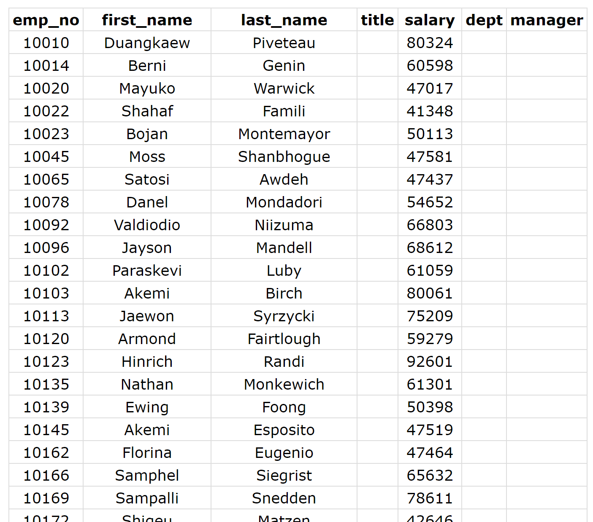

And with that we are done.  It has been a long road, but we have now successfully deployed our application to the cloud, and can redeploy whenever we want.

## Cleanup

**Remember to shutdown your Google Cloud Cluster.**  The account you have been given has limited credit and leaving the cluster running will eventually run out your credit.
