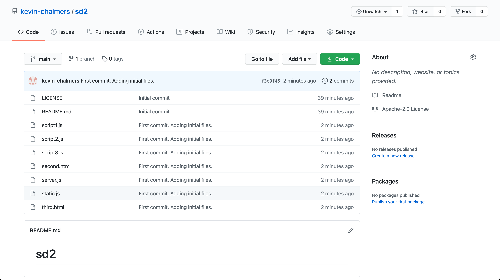

# Software Development 2 Lab 1 -- Version Control and developer tools

>## Pre-class task: Creating a GitHub Account and a new repository

> Version control software (CVS, Mercurial and SVN are other examples) maintain your code somewhere backed-up and shareable with your team.  Crucially, they give you ways to work independently on code and then 'merge' and 'resolve conflicts' with other team members' code.  Nothing is ever forgotten by the repository!

>We will use *GitHub* as an online repository for this module.  First, you will need to create an account on GitHub if you haven't already.  Go to [GitHub](https://github.com/) and **Sign Up**.  Two things to note:

> 1. You do not need a paid for account.
> 2. If you are a student, GitHub will give you [unlimited private repositories](https://education.github.com/pack).

> Once you have an account, you need to create a repository.  In GitHub, you will see a **+** near the top of the page, which you can select **New repository** from:

> 

> This will open a new window.  You need to enter the name for the repository (for example, `sd2`), make sure the repository is **Public** and then select the **Apache 2.0** license type.  **Ensure that a README is added**.  The details are illustrated below:

> 

> Click on **Create repository** and you will be presented with the following: 

> ## Installing Git -- Mainly for Windows

> You need to have the git software on your local computer. Git is normally installed on MacOS and Linux by default. For Windows do the following:

> 1.  Go to Git home page https://git-scm.com/**.
> 2.  Download Git**.
> 3.  Install Git. During install make sure you select to use Visual Studio Code as the default editor.**
> 4.  All other settings can remain as default.**
> 5.  Once installed continue with the rest of the lab.**

>## Set up git with your identity


> Git commits have a collection of information attached to them, including who > created the commit -- their name and email address. We must set this information up when we start using Git. Enter the two following lines into your terminal:

```shell
git config --global user.email "you@example.com"
git config --global user.name "Your Name"
```

> Replacing `you@example.com` with the email you used for your GitHub account, and `Your Name` with your name.


## Revise the main concepts of version control

1. **Origin**  : The centralised repository holding everything, probably 'remote' ie. on a server or service somewhere eg. github
1. **Clone**  : PUll down an entire copy of the repository
1. **Branch** : Independent opies of the main codebase that you can alter and work on
1. **Stage**:  Get files ready to commit
1. **Commit**: Saving a batch of your new work onto your branch with a comment
1. **Pull or fetch** : Bringing down others changes to your local repository
1. **Push** : Pushing your changes back into the origin repository
1. **Merge**: The process of merging your code (probably a branch) with others code

## Other useful terms

1. **Working copy**: The files you are working on right now, probably your branch
1. **Master branch**: (or Main branch) Usually the name of the branch everything merges into in the end
1. **Fork** : a copy of the master branch that has divergent, unmerged code.
1. **Hooks** : we won't be using hooks for a while but its good to know they exist. These are actions such as triggering a build on your server that you can program in response to an action in git for example a push to the master branch.  This is the core of 'continuous integration'.


## Lab

## Introduction and getting ready

1. You will this lab in PAIRS.  Please swap frequently between the 'driver' and 'navigator'. (see https://en.wikipedia.org/wiki/Pair_programming)
1. __You need ONE repository for this lab Choose the repo of ONE of the members of your pair to to on today__. Follow the instructions at the start of this lab to create a repository if you have not already done so.

You will also have to add your partner/group as collaborators to allow them to push. For this

  * Go to your repository in github
  * Click 'settings' in the top menu
  * Click 'collaborators' in the left menu
  * Add the usernames of your collaborators.
  * Your collaborators will have to 'accept' the invitation via email or through github

## Cloning a Project in Visual Studio Code

_All members of your group should clone the same project._

Now we need to clone the chosen GitHub project in Visual Studio Code. 

1. **Open Visual Studio Code.**
2. **Make sure no folder is currently open. We can do this by using File then Close Folder from the main menu.**
3. **Click on the Source Control button on the left-hand side of the Visual Studio Code window.**
4. **Your window should now look like this.**


We need the the location of our repository.  Find it by going the the github page for the repository, click the down arrow on the green 'code' button, and copy the https:// format URL to your clipboard, as below...


**Click the Clone Repository button and Visual Studio Code will ask for the repository URL at the top of the window**.  Paste in the URL you obtained from Github as above.


1. **Press return, and Visual Studio Code will ask you where you want to save the repository. A new directory within your documents directory is a good idea.  Make sure NOT to save onto a ounted onedrive directory.

2. **Visual Studio Code will ask you if you want to open the repository. Choose to do so.**

You now have your GitHub repository cloned to the local machine and opened in Visual Studio Code. Let us add some files to the repository.

1. **Create a new file called <yourname>.txt**  (where yourname is your own name. Put any content in that you want to)

2. **Open the Source Control panel in Visual Studio Code using the button on the left-hand side.**
3. **You will now see a list of changes. We will just add all of them just now. Click the three dots at the top of the Source Control panel and select Changes then Stage All Changes as shown below.**

As an alternative, do the same thing in a terminal window.  From the top menu, 'terminal', click 'new terminal'. This will open a terminal in VS code.

Use the following command to check if there are new files that need to be 'staged' (ie. made ready for the next commit)

```bash

git status
```

NB: The git status command is your go-to command to figure out the relationship of files you have in your local 'working' diretory, and the current state of your repository.

You should at this point see the new 'unstaged' files, or be told if there are 'modified' files in your working tree.

To add the files...

```bash
git add <name of file>
```


You have now added your existing files to the *Staging Area* of the local Git repository. Next we need to create a commit from these changes. **Click the three dots again and select Commit then Commit. Visual Studio will ask you for a commit message. Enter `First commit, adding initial files.`**

To do the same thing via the terminal:

Check that your file has been staged
```bash
git status
```

```bash
git commit -m 'My meaningful message as this will persist forever!'
```

HINT: A good commit message will help others understand what you did and why. 
ANOTHER HINT: if you forget the -m, a text editor will open where you can type a longer message, but this can get complicated if you are not familiar with CLI text editors, so better to ctr C and start again remembering the -m and putting the message inline.


We have now created a checkpoint in our code that we can **always** return to.  This is the power of version control.  We are check-pointing our code so we can rewind to previous versions.  As long as you commit often, you can always revert back to a previous version.

Now we need to push these changes to GitHub. **Click the three dots again, and select Push**. You will be asked to log into GitHub. Do so and follow the instructions given. This will keep you authenticated with Github when you use visual studio code.

To do the same thing via the terminal:

Check that your file has been staged
```bash
git push
```

NOTE: if you do this via VS code terminal or UI, VS code will helpfully authenticate you.  Make sure to find any pop-up windows that open to help you athenticate and follow the instructions.

Refresh the GitHub page.  You should see your files there:



We have now defined our core workflow with Git using Visual Studio Code. To summarise the command you have learned:

1. Add the files to the commit -- **Changes then Stage All Changes.**
2. Commit the changes -- **Commit then Commit.**
3. Push the changes -- **Push**.
4. When everyone has pushed, each team member should be able to copy all the new files to their own machine with:

```
git pull
```

. **HINT** -- if someone has already committed a change before you, you will need to pull the changes first before you can push yours.
3. Once everyone on the team has created their files, make sure everyone pulls the current version of the repository so they are up to date.

**Get used to this process - it will save your code from disaster!**.  We have created a checkpoint where we know our code is working and doing what we expect.  Whenever you do a change -- and make your changes small -- and tested the build works, commit and push.  


Now you should continue with the lab, in pairs, commiting each time you complete a task.  Remember to swap driver and navigator frequently.


## HTML introduction


### Setting out your development environment

<hr>

 **NOTE**: When writing HTML by hand, you will need to open the file you have created directly in your web browser, which is different from how you usually access a web page which is via its 'url'.  
 
__To open a file__ click into the browser window and press crtl o .  You will see the path to your file in the browser address bar similar to: file:///home/lisah/lessons/github/module-content/msc-software-development-2/week-01/seminar/Slide6.jpg.  

Use the refresh button to show new changes you save to your html file as you develop your pages.
<hr>


### HTML exercises

__Use our [cheatsheet](html-cheatsheet.md) to help plus [W3 schools HTML reference](https://www.w3schools.com/tags/) to find out about the available attributes and correct useage for tags.__

### Basic Page Structure

Create a simple webpage with a title and a heading.

```html

<!DOCTYPE html>
<html lang="en">
<head>
    <meta charset="UTF-8">
    <title>My First Webpage</title>
</head>
<body>
    <h1>Welcome to My Webpage</h1>
</body>
</html>
```


Save this code and refresh your browser. Check that you can view it in the browser, and that the HTML code can be seen in developer tools.

Make some changes in the code and check that your changes are coming through.

### Headings and Paragraphs

Expand the previous example with multiple headings and paragraphs.
Notice that various heading levels to emphasize the importance of hierarchy.


```html

<!DOCTYPE html>
<html lang="en">
<head>
    <meta charset="UTF-8">
    <title>Heading Levels</title>
</head>
<body>
    <h1>Main Heading (Level 1)</h1>
    <p>This is the main content of the page.</p>
    <h2>Subheading (Level 2)</h2>
    <p>Additional text for the subheading.</p>
    <h3>Sub-subheading (Level 3)</h3>
    <p>More text for the sub-subheading.</p>
</body>
</html>
```


### Hyperlinks

Create hyperlinks to navigate between pages. NOTE that you will first need to create `page1.html` and `page2.html`.  These will need to be in the same directory as your `index.html` file.

```html
<!DOCTYPE html>
<html lang="en">
<head>
    <meta charset="UTF-8">
    <title>Hyperlinks</title>
</head>
<body>
    <h1>Visit Other Pages</h1>
    <ul>
        <li><a href="page1.html">Page 1</a></li>
        <li><a href="page2.html">Page 2</a></li>
    </ul>
</body>
</html>
```

### Tables

Create a table with some data.  Note how the tags here need to be 'nested' correctly

```html

<!DOCTYPE html>
<html lang="en">
<head>
    <meta charset="UTF-8">
    <title>Table Example</title>
</head>
<body>
    <h1>Student Information</h1>
    <table border="1">
        <tr>
            <th>Name</th>
            <th>Age</th>
            <th>Grade</th>
        </tr>
        <tr>
            <td>John</td>
            <td>20</td>
            <td>A</td>
        </tr>
        <tr>
            <td>Maria</td>
            <td>22</td>
            <td>B</td>
        </tr>
    </table>
</body>
</html>
```


## Developer tools

Using the browser developer tools (found in all browsers, but chrome is most commonly used) to debug and refine your front-end code is an essential skill.

__Try it now:__

In your browser window, right click in the page and choose 'inspect'.  A set of windows will appear, probably at the bottom or perhaps to the right of your screen.  Here you will be able to examine the source code of your own page and ensure that it is as you expect. You can even find you can edit the markup, content and styles.


Note that you can do this for any web page!!.  Your changes will only be visible on your own browser and will disappear after you refresh the page.


Reference:
https://developer.chrome.com/docs/devtools/overview/

__practice__


Click on the inspector tool which you will find in the toolbar as shown above - its the square with the arrow pointing into it - and then onto the heading of your page. You will see the relevant part of the code highlighted in the main 'elements' part of developer tools, and below in the 'styles' window, you will see the CSS rules that have been applied.


See if you can visit this newspaper site which is famous for mis-spellings and change the menu item 'sport' to 'sporty' https://www.theguardian.com/uk

Play with your own pages, so you are full familiar with the relationship between the code editor, browser and developer tools.

## Setting out your development environment

Your enjoyment writing code, and your productivity will be enhanced by gaining fluency in the fundamental tools of web development and its processes.


Your desktop should look like the image above where:

   * Your code is visible in Visual Studio Code and you can edit it
   * You also have a browser window open.  __You can see your changes by refreshing the browser without having to reopen the browser window__
   * You can use developer tools to check what the browser is rendering.  You can also use the tools there to check CSS and Javascript as well as other information related to the browser.  You will find out more about this further in this lab sheet.
   * You can use the VS code file explorer to check your file structure

You may also have a terminal window open where you can use git and other command line tools which you will learn next week.


** You are now ready to continue on with the rest of the lab.